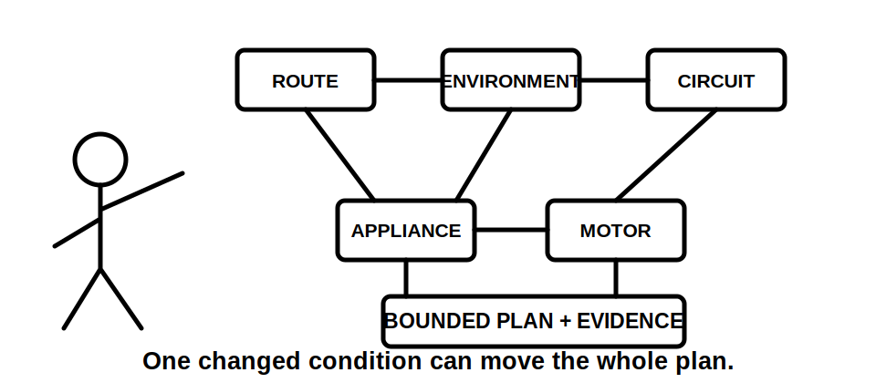
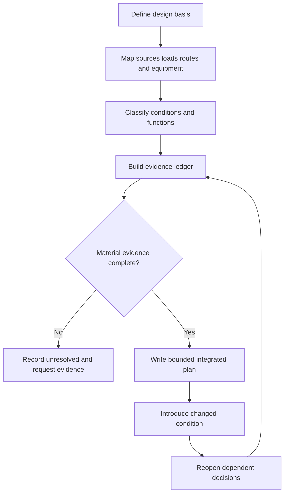

# Day 49 — Week 7 Installation Planning Exercise

> **Scope boundary:** This is a paper-based integration exercise. Exact design, installation, isolation, protection, routing, segregation, support, motor and verification requirements require current authorised sources and qualified review.

## 1. Outcome and entry check

By the end, the learner can integrate route, environment, circuit, appliance and motor-system reasoning into one evidence-led installation plan, expose dependencies and revise the plan after a changed condition.

### Entry check

From memory, list the Week 7 workflows and one claim each workflow prevents you from making too early.

## 2. Why it matters

Installation decisions interact. A route change can affect environmental exposure, support, protection, access and voltage performance. A new control source can alter isolation reasoning. An integrated plan must therefore show dependencies rather than isolated device choices.

## 3. Core concepts and terminology

- **Design basis:** the documented assumptions, loads, sources, conditions and requirements used to develop the plan.
- **Dependency:** a conclusion that changes when another condition or decision changes.
- **Evidence ledger:** a table linking each claim to observed, documented, manufacturer-verified, assumed or missing evidence.
- **Reopening trigger:** a changed source, route, load, environment, device or operating state that invalidates an earlier conclusion.
- **Bounded plan:** a proposal limited to the evidence and authority available; it is not field approval or certification.

## 4. Rule-finding workflow

Use **P-L-A-N-I-T**:

1. **P — Place** sources, loads, routes, equipment and task boundaries.
2. **L — List** environmental, mechanical, operational and maintenance conditions.
3. **A — Apply** R-O-U-T-E, S-E-P-A-R-E, T-R-A-C-E, A-P-P-L-Y and M-O-T-O-R-S where relevant.
4. **N — Note** dependencies, missing evidence and authorised references.
5. **I — Integrate** the claims into one bounded plan.
6. **T — Test** the plan against a changed condition and reopen affected decisions.

The diagram makes revision part of planning rather than a final afterthought.

## 5. Visual model or worked example

A fictional workshop extension includes a submain, outdoor cable route, fixed heater and exhaust-fan motor. The first plan uses a short indoor route. A later site drawing reveals an exposed external section and a remote motor control supply. The learner reopens route classification, environmental protection, segregation, support, isolation and control conclusions instead of editing only the cable description.

### Worked-example fading

The complete example supplies the design basis and first evidence ledger. The learner must independently identify dependencies, write the bounded plan and revise it after a changed source or route condition.

## 6. Practical application

Produce a paper plan for a fictional small workshop upgrade containing one submain, two final subcircuits, a fixed appliance and a motor load:

1. state design assumptions and authority boundary;
2. draw source-to-load and control paths;
3. segment routes and classify conditions;
4. identify segregation, support, protection, access and isolation questions;
5. build an evidence ledger;
6. write described, supported and unresolved claims;
7. identify at least six dependencies;
8. revise the plan when an alternate source or wet external route is disclosed.

### Assessment rubric

Score 0–2 for design basis, mapping, workflow integration, evidence discipline, dependency reasoning and revision quality. **10/12** with no critical error indicates readiness for Week 8. This is an educational threshold only.

## 7. Common errors and safety checkpoint

Common errors include selecting equipment before defining conditions, treating assumptions as facts, ignoring control or alternate supplies, reviewing each circuit in isolation and failing to reopen dependent conclusions.

Critical errors include inventing official values, claiming compliance or approval from incomplete paper evidence, proposing unauthorised practical work, or omitting a disclosed source or hazardous condition.

This module authorises no installation, switching, isolation, testing, alteration, energisation, commissioning, certification or verification.

## 8. Retrieval and next links

1. Expand **P-L-A-N-I-T**.
2. Define design basis, dependency and reopening trigger.
3. Name the five Week 7 workflows integrated here.
4. Why must a changed condition reopen multiple conclusions?
5. State three critical errors.

- **Plan:** [Twelve-Week Capstone Learning Plan](../MASTER_PLAN.md)
- **Knowledge note:** [[12-Week Day 49 - Week 7 Installation Planning Exercise]]
- **Previous:** [Day 48 — Motors, Associated Protection and Control Boundaries](day-48-motors-associated-protection-and-control-boundaries.md)
- **Next:** [Day 50 — Special-Location Method: Classify, Map Zones and Verify Sources](day-50-special-location-method-classify-map-zones-and-verify-sources.md)

This module remains `review-required`, `reference_check_required` and not `technically-reviewed`.