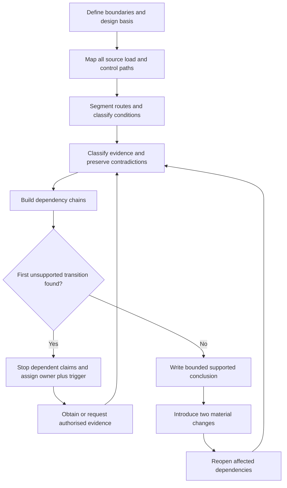
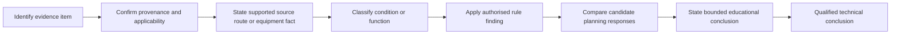

# Day 49 — Week 7 Installation Planning Exercise

> **Scope boundary:** This is a paper-based integration and reasoning exercise. It does not approve a design or authorise field work. Exact design, installation, isolation, protection, routing, segregation, support, motor, verification and assessment requirements require current authorised sources and qualified review.

## 1. Outcome and entry check

By the end, the learner can:

1. define the installation, task, energy-source, evidence, authority and decision boundaries for a fictional workshop upgrade;
2. build a source-to-load and control-path map without treating an incomplete drawing as the installation itself;
3. classify each planning claim as a stated fact, derived fact, supported inference, assumption, contradiction or evidence gap;
4. identify the first unsupported transition in each dependency chain and stop dependent suitability or acceptance claims there;
5. assign an evidence owner and recheck trigger to every unresolved blocker; and
6. revise the plan after at least two material changes, explaining both reopened and unaffected conclusions.

### Entry check

Without notes, expand **R-O-U-T-E**, **S-E-P-A-R-E**, **T-R-A-C-E**, **A-P-P-L-Y** and **M-O-T-O-R-S**. For each workflow, state one claim it prevents you from making too early. Record confidence as guessing, unsure, reasonably confident or certain before checking. A confident error is a remediation priority, not evidence of readiness.

## 2. Why it matters

Installation decisions form a dependency network. A route change can alter environmental exposure, mechanical protection, support, segregation, accessibility and voltage reasoning. A newly discovered control or alternate supply can reopen isolation and safe-state claims. A planning response that lists equipment but hides these dependencies may look complete while resting on unsupported transitions.

*Instructional caption: connect each decision to its evidence and dependencies; one changed condition may require several earlier conclusions to reopen.*

## 3. Core concepts and terminology

- **Installation boundary:** the parts of the fictional installation included in the exercise.
- **Task boundary:** the specific planning question being answered; it prevents unrelated conclusions from being implied.
- **Energy-source boundary:** every credible normal, alternate, control, stored or mechanically significant energy source relevant to the task.
- **Evidence boundary:** the documents, observations and authorised references available for the exercise.
- **Authority boundary:** what the learner may analyse on paper versus what requires a qualified person, approved procedure or authorised source.
- **Decision boundary:** the strongest conclusion justified by the current evidence and authority.
- **Design basis:** the recorded sources, loads, operating states, route conditions, assumptions and requirements on which the plan depends.
- **Dependency:** a conclusion that may change when an upstream fact, assumption or decision changes.
- **Claim ladder:** an ordered chain from evidence identity to a bounded conclusion.
- **First unsupported transition:** the earliest step where a claim goes beyond its evidence. Dependent claims must not pass this point.
- **Evidence owner:** the authorised document, person or reviewer responsible for resolving a gap.
- **Recheck trigger:** the evidence or changed condition that requires a conclusion to be reconsidered.
- **Material change:** a change capable of altering a source, route, operating state, environmental condition, protective function, isolation boundary or planning conclusion.
- **Bounded plan:** an educational proposal limited to available evidence and authority; it is not technical approval, certification or permission to proceed.

Classify evidence separately from confidence:

| Evidence state | Meaning |
|---|---|
| Stated fact | Directly recorded in an identified source. |
| Derived fact | Produced transparently from supported inputs. |
| Supported inference | Reasonable interpretation with stated evidence and limits. |
| Assumption | Unverified proposition used temporarily and visibly. |
| Contradiction | Credible sources disagree or cannot both describe the same state. |
| Evidence gap | Information required for a conclusion is unavailable. |

## 4. Rule-finding workflow

Use **P-L-A-N-I-T**:

1. **P — Place boundaries and paths.** Define the installation, task, source, evidence, authority and decision boundaries. Map normal, alternate and control paths from source to load.
2. **L — List conditions and evidence states.** Segment routes; record environmental, mechanical, operational, maintenance and access conditions; identify provenance and confidence.
3. **A — Apply prerequisite workflows.** Use R-O-U-T-E, S-E-P-A-R-E, T-R-A-C-E, A-P-P-L-Y and M-O-T-O-R-S only where relevant. Do not copy their conclusions without rechecking current inputs.
4. **N — Name dependencies and unsupported transitions.** Link each conclusion to its upstream evidence, preserve competing interpretations and stop at the first unsupported transition.
5. **I — Integrate a bounded plan.** Separate supported, provisional and unresolved claims. Assign evidence owners and recheck triggers to blockers.
6. **T — Transfer under change.** Introduce at least two material changes, reopen affected dependencies and justify why any conclusion remains unaffected.

The diagram shows that planning is controlled by evidence quality, not by how many boxes have been filled. A missing upstream fact stops downstream claims until the identified evidence owner resolves it.

## 5. Visual model or worked example

### Fictional workshop dossier

A workshop extension appears to include:

- one submain feeding a new distribution board;
- two final subcircuits;
- a fixed heater;
- an exhaust-fan motor with local controls;
- a short indoor cable route on the earliest drawing.

The evidence pack also contains:

- a later site sketch showing an external section exposed to weather and vehicle movement;
- an undated photograph showing a route support arrangement not visible on either drawing;
- a maintenance note describing remote fan restart after power restoration;
- a control schematic with a separate control source, but no revision status;
- a schedule that identifies the heater differently from the plan; and
- no current evidence resolving whether a generator inlet remains connected.

These records create competing interpretations. The learner must not choose the most convenient version. Each conflict remains visible until provenance, revision status or authorised evidence resolves it.

### Claim ladder

Automation may support the chain only through the bounded educational conclusion. The final transition requires current authorised sources, complete installation evidence and qualified review. If any earlier transition is unsupported, every dependent conclusion remains provisional or unresolved.

### Worked-example fading

The supplied example gives the initial boundaries, evidence inventory and one completed dependency chain. The learner independently:

1. builds the remaining chains;
2. marks the first unsupported transition in each;
3. writes the bounded plan;
4. assigns owners and triggers; and
5. repeats the reasoning after two material changes.

## 6. Practical application

Prepare a paper-only plan for the fictional workshop upgrade.

### Required evidence products

1. a boundary statement covering installation, task, energy sources, evidence, authority and decision limits;
2. a source-to-load and control-path diagram;
3. a route-segment and condition map;
4. an evidence ledger containing provenance, evidence state, confidence, contradiction status, owner and recheck trigger;
5. at least six dependency chains spanning route, environment, distribution, appliance, motor and isolation reasoning;
6. the first unsupported transition for each incomplete chain;
7. a bounded plan separating supported, provisional and unresolved claims; and
8. two transfer revisions, each identifying reopened and unaffected conclusions with reasons.

### Criterion-level readiness states

Assess each criterion independently:

- **Secure:** supported evidence, explicit boundaries, visible dependencies and correct reopening under both material changes.
- **Developing:** the method is present but one or more links, evidence states, owners, triggers or change effects need correction.
- **Unsupported:** the conclusion exceeds evidence, hides a contradiction, omits a credible source or cannot explain dependency effects.
- **`stop-required`:** a blocking safety, authority or evidence condition makes further dependent planning inappropriate.

Do not total these states into an aggregate score. They are educational planning states, not official grades, competency decisions, defect classifications, technical approvals or legal conclusions.

### Material-change transfer

Use at least two changes, such as:

- the external route becomes a wet, mechanically exposed route;
- the generator inlet is confirmed as connected;
- the control circuit has an independent source;
- the motor can restart remotely;
- the heater model or operating condition changes; or
- the route passes through a different environment.

For each change, identify the earliest affected evidence or assumption, reopen every dependent claim and explain why apparently unaffected claims remain valid.

## 7. Common errors and safety checkpoint

Common errors include:

- selecting equipment before defining conditions and boundaries;
- treating a drawing, label or schedule as complete proof of current installation state;
- confusing confidence with evidence quality;
- resolving contradictions by convenience;
- reviewing each circuit in isolation;
- treating normal stopping or local control as proof of isolation;
- changing only the final wording after an upstream condition changes; and
- assigning no owner or trigger to an unresolved blocker.

### Blocking conditions

Readiness is blocked by any of the following, regardless of stronger performance elsewhere:

- omission of a credible normal, alternate, control, stored or mechanical energy source;
- invented clauses, values, equipment capabilities, installation conditions or test results;
- a compliance, approval, safe-state or acceptance claim beyond the first unsupported transition;
- hidden contradictions or assumptions presented as facts;
- failure to reopen affected dependencies after either material change;
- fewer than two genuine transfer changes;
- missing evidence owners or recheck triggers for blockers;
- unauthorised practical work; or
- fatigue or time pressure that prevents careful source and dependency checking.

This module authorises no approach, switching, isolation, opening, proving de-energised, testing, measurement, installation, alteration, repair, energisation, commissioning, certification, design approval or field verification.

Exact circuit classification, wiring-system selection, environmental treatment, segregation, support, protection, isolation, motor, appliance, alternate-source and assessment requirements must be checked against current authorised standards, applicable manufacturer information, regulator, network and RTO requirements, and qualified review.

## 8. Retrieval and next links

1. Expand **P-L-A-N-I-T** and explain why each stage occurs in that order.
2. Distinguish design basis, dependency, first unsupported transition and recheck trigger.
3. Name the six evidence states and explain why confidence is recorded separately.
4. Why can a route change reopen isolation, protection or equipment conclusions?
5. Give two examples of competing interpretations that must remain visible.
6. State three blocking conditions that cannot be offset by stronger work elsewhere.
7. Explain why an unaffected conclusion still requires justification after a material change.

- **Plan:** [Twelve-Week Capstone Learning Plan](../MASTER_PLAN.md)
- **Knowledge note:** [[12-Week Day 49 - Week 7 Installation Planning Exercise]]
- **Previous:** [Day 48 — Motors, Associated Protection and Control Boundaries](day-48-motors-associated-protection-and-control-boundaries.md)
- **Next:** [Day 50 — Special-Location Method: Classify, Map Zones and Verify Sources](day-50-special-location-method-classify-map-zones-and-verify-sources.md)

This module remains `review-required`, `reference_check_required`, safety-critical and not `technically-reviewed`.
