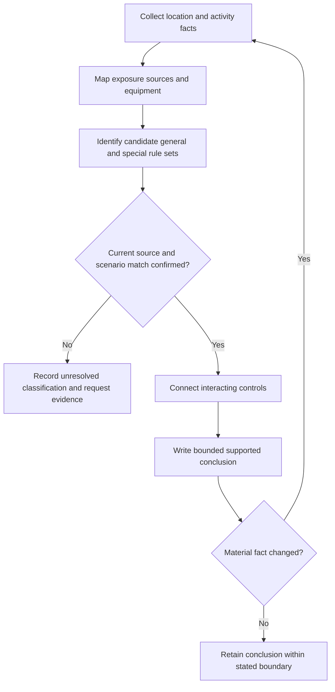

# Day 50 — Special-Location Method: Classify, Map Zones and Verify Sources

> **Scope boundary:** This original paper-based module teaches an applicability method. It does not reproduce official zone dimensions, equipment limits, protection values or installation procedures. Exact requirements must be verified from current authorised sources and qualified guidance.

## 1. Outcome and entry check

By the end, the learner can classify a location from supplied facts, map learner-created exposure zones without inventing official dimensions, identify the general and location-specific rule sets that may interact, grade evidence quality and stop when applicability is unresolved.

### Entry check

1. Why is a room name alone insufficient to select special-location requirements?
2. What facts could change the boundary of a wet, corrosive, restricted or externally influenced area?
3. Why must general installation requirements still be considered after a special-location rule is identified?
4. What is the difference between a learner-created exposure map and an official standards zone?

Grade each answer as **guess**, **unsure**, **reasonably confident** or **certain**.

## 2. Why it matters

Special-location errors often begin before equipment is selected. A learner may classify from a label such as “bathroom”, ignore the actual water source or activity, use an outdated diagram, or apply one special rule while overlooking supply, isolation, environmental and manufacturer constraints.

The governing model is:

**facts → classification → exposure map → applicable sources → interacting controls → bounded conclusion**

## 3. Core concepts and terminology

- **Special location:** a place or installation condition for which additional or modified controls may apply because ordinary assumptions are insufficient.
- **Classification fact:** an observed or documented feature that determines which rule set is relevant, such as the activity, source of water, conductive surroundings, public access or supply arrangement.
- **Exposure source:** the origin of the condition being controlled, such as water, heat, corrosion, impact, conductive material or another energy source.
- **Learner-created exposure map:** an original sketch showing sources, reach, likely contact paths, equipment positions and access boundaries. It is not an official zone diagram.
- **Applicability:** whether a source, clause family, manufacturer instruction or regulator requirement governs the stated scenario and version.
- **Interaction control:** a requirement whose purpose overlaps another domain, including additional protection, equipment suitability, placement, isolation, identification, segregation or restricted access.
- **Unresolved classification:** a state in which a material fact or current source is missing, so the learner cannot safely advance the claim.

Use evidence grades: **observed**, **documented**, **manufacturer-verified**, **assumed** and **missing**. Use claim grades: **described**, **supported**, **verified** and **unresolved**.

## 4. Rule-finding workflow

Use **Z-O-N-E-S**:

1. **Z — Zero in on facts:** identify the activity, exposure sources, users, boundaries, equipment and operating states.
2. **O — Outline exposure:** draw an original map of sources, likely reach/contact paths, equipment and access boundaries.
3. **N — Name candidate rule sets:** identify general installation, special-location, manufacturer, regulator and supply requirements that may apply.
4. **E — Establish applicability:** verify jurisdiction, edition, amendment status, definitions, scope, exceptions and scenario match.
5. **S — State a bounded conclusion:** distinguish described, supported, verified and unresolved claims; record missing evidence and reopening triggers.

The diagram prevents rule selection from preceding classification and makes changed facts reopen the analysis.

## 5. Visual model or worked example

A fictional room is labelled “wash area”. The dossier shows a fixed basin, a removable spray hose, a floor drain, a socket-outlet location, a metal bench and incomplete equipment instructions.

A weak response says: “It is a bathroom, so use the bathroom diagram.”

A stronger **Z-O-N-E-S** response:

- records the room label as documented but does not treat it as decisive;
- maps the basin, hose reach, drain, bench, equipment and user positions;
- identifies candidate wet-area, general protection, equipment-suitability and manufacturer sources;
- marks hose use and equipment instructions as material applicability facts;
- concludes that exposure is described but exact location controls remain unresolved pending current authorised verification.

### Worked-example fading

For a second fictional cleaning bay, the exposure map is supplied. The learner must independently identify candidate sources, list three applicability checks, grade each evidence item and write one supported and one unresolved claim.

## 6. Practical application

Given an original scenario involving a small wash space adjoining a plant room, produce:

1. a fact inventory and authority boundary;
2. an original exposure map;
3. a candidate-source list;
4. an applicability checklist covering jurisdiction, currency, definitions, scope and exceptions;
5. an interaction map linking location controls to protection, equipment suitability, isolation, access and identification;
6. an evidence ledger;
7. a bounded conclusion;
8. a revision after the removable hose is replaced by a fixed outlet in a different position.

### Assessment rubric

Score 0–2 for fact classification, exposure mapping, source selection, applicability checking, evidence discipline and changed-condition reopening. **10/12** with no critical error indicates readiness for Day 51. This is an educational threshold only.

## 7. Common errors and safety checkpoint

Common errors include classifying by room name, copying an official-looking zone from memory, using one rule in isolation, overlooking movable exposure sources, treating assumptions as dimensions, and failing to check source currency.

Critical errors include inventing official boundaries or values, claiming compliance from an unverified sketch, ignoring a disclosed energy or exposure source, or proposing unauthorised inspection, testing or installation work.

This module authorises no site classification, measurement, opening, switching, isolation, testing, installation, alteration, energisation, certification or verification.

## 8. Retrieval and next links

1. Expand **Z-O-N-E-S**.
2. Define classification fact, exposure source, applicability and unresolved classification.
3. Why is a learner-created exposure map not an official zone diagram?
4. Name five applicability checks.
5. What changed facts must reopen the analysis?

- **Plan:** [Twelve-Week Capstone Learning Plan](../MASTER_PLAN.md)
- **Knowledge note:** [[12-Week Day 50 - Special-Location Method - Classify, Map Zones and Verify Sources]]
- **Previous:** [Day 49 — Week 7 Installation Planning Exercise](day-49-week-7-installation-planning-exercise.md)
- **Next:** [Day 51 — Bathrooms, Showers and Other Wet-Area Reasoning](day-51-bathrooms-showers-and-other-wet-area-reasoning.md)

This module remains `review-required`, `reference_check_required` and not `technically-reviewed`.