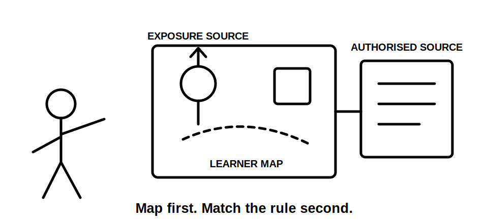
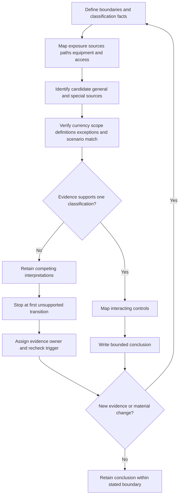
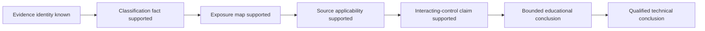

# Day 50 — Special-Location Method: Classify, Map Zones and Verify Sources

> **Scope boundary:** This original paper-based module teaches evidence-controlled classification and source navigation. It does not reproduce official zone dimensions, equipment limits, protection values, installation procedures or compliance decisions. Exact requirements require current authorised sources and qualified review.

## 1. Outcome and entry check

By the end, the learner can:

1. define the location, activity, exposure, evidence, authority and decision boundaries for a supplied scenario;
2. classify facts without treating a room label, photograph or remembered diagram as decisive;
3. construct an original exposure map that is visibly distinct from an official standards zone;
4. identify candidate general, special-location, manufacturer, regulator and supply sources and verify their applicability;
5. stop dependent claims at the first unsupported transition, assign an evidence owner and set a recheck trigger; and
6. revise the analysis after at least two material changes while explaining which conclusions reopen and which remain supported.

### Entry check

Without consulting notes:

1. Why is a room name insufficient to establish applicable special-location requirements?
2. What is the difference between an exposure source, an exposure path and an official zone?
3. Which source checks must occur before a clause family or diagram is applied?
4. What should happen when two current-looking records disagree?
5. Which downstream claims must reopen when a classification fact changes?

Record confidence as **guessing**, **unsure**, **reasonably confident** or **certain** before checking. Confidence is evidence about calibration, not evidence that the answer is correct.

## 2. Why it matters

Special-location errors often begin before equipment is selected. A learner may classify from a label such as “wash area”, copy a remembered boundary, overlook a movable source, rely on an undated drawing or apply one special rule without considering general protection, supply, isolation, environmental and manufacturer constraints.

The governing model is:

**bounded facts → evidence-controlled classification → original exposure map → applicable sources → interacting controls → bounded conclusion**

A fluent answer is not secure when its source identity, scenario match or factual premise is unresolved.

*Instructional caption: Map the actual source, activity, reach and access conditions before selecting any location-specific rule set.*

## 3. Core concepts and terminology

- **Location boundary:** the physical area included in the analysis.
- **Activity boundary:** the normal, abnormal and reasonably foreseeable activities included in the scenario.
- **Exposure source:** the origin of a relevant condition, such as water, heat, corrosion, impact, conductive surroundings or another energy source.
- **Exposure path:** the supported way the exposure may reach a person, equipment or installation part.
- **Classification fact:** an observed or documented fact that may determine which rule set applies.
- **Learner-created exposure map:** an original sketch showing supported sources, paths, equipment, users and access boundaries. It is not an official zone diagram and contains no invented official dimensions.
- **Applicability:** whether a source, definition, clause family, instruction or requirement governs the stated jurisdiction, edition, installation and operating condition.
- **Evidence provenance:** where an evidence item came from, who created it, its date or revision and what it actually supports.
- **Competing interpretations:** two or more plausible classifications retained while evidence is insufficient to choose between them.
- **First unsupported transition:** the earliest step where a conclusion goes beyond the available evidence.
- **Evidence owner:** the authorised source, person or reviewer responsible for resolving an evidence gap.
- **Recheck trigger:** the evidence or change that requires a conclusion to be reconsidered.
- **Material change:** a change capable of altering classification, exposure, applicability or an interacting control.
- **Bounded conclusion:** an educational conclusion limited to the stated facts, sources, authority and unresolved matters.

Use these evidence states:

- **stated fact:** directly supplied by the scenario;
- **derived fact:** follows directly from stated facts without adding an assumption;
- **supported inference:** a reasonable interpretation with identified evidence;
- **assumption:** an unverified proposition retained visibly;
- **contradiction:** evidence items that cannot both be relied upon as stated; and
- **evidence gap:** information required before a dependent claim can advance.

## 4. Rule-finding workflow

Use **Z-O-N-E-S**:

1. **Z — Zero in on boundaries and facts:** define location, activity, exposure, evidence, authority and decision boundaries; list sources, users, equipment, operating states and credible changes.
2. **O — Outline exposure:** draw an original map of supported sources, paths, reach, equipment and access. Mark unknown boundaries rather than estimating official dimensions.
3. **N — Name candidate sources:** identify general installation, special-location, manufacturer, regulator, network or supply requirements that may interact.
4. **E — Establish applicability and evidence strength:** verify jurisdiction, edition, amendment status, definitions, scope, exceptions, scenario match and provenance; retain competing interpretations where needed.
5. **S — Stop, state and schedule:** stop at the first unsupported transition, state supported and unresolved conclusions, assign evidence owners and recheck triggers, and reopen dependencies after material change.

The diagram prevents rule selection from preceding classification. It also shows that unresolved evidence is managed, not hidden.

### Claim ladder

Stop at the first unsupported arrow. A qualified technical conclusion is outside this automated module and requires current authorised sources, suitable field evidence and qualified review.

## 5. Visual model or worked example

A fictional room is labelled **wash area**. The dossier contains:

- a current-looking floor plan with no revision status;
- a fixed basin and floor drain;
- an undated photograph showing a removable spray hose;
- a maintenance note stating the hose was removed;
- a metal bench whose final position is not confirmed;
- a socket-outlet symbol on one drawing but not another; and
- incomplete manufacturer instructions for nearby equipment.

A weak response says: “It is a bathroom, so use the bathroom diagram.”

A stronger **Z-O-N-E-S** response:

1. records the room label as a stated fact but not a classification conclusion;
2. records the hose evidence as a contradiction rather than choosing the convenient record;
3. maps the basin, possible hose reach, drain, bench, equipment and user positions without inventing official boundaries;
4. retains two interpretations: **fixed-source-only** and **movable-source-present**;
5. identifies candidate general, wet-area, equipment-suitability, supply, isolation and manufacturer sources;
6. stops location-control and acceptance claims at the unresolved hose-status transition;
7. assigns the site record owner to confirm current configuration and the qualified reviewer to verify applicable current requirements; and
8. sets receipt of a dated current inspection record and authorised source confirmation as recheck triggers.

### Worked-example fading

For a second fictional cleaning bay, the source inventory and original exposure sketch are supplied. Independently:

- classify every evidence item;
- identify two competing interpretations;
- locate the first unsupported transition;
- assign an owner and trigger to each blocker; and
- write one supported, one provisional and one unresolved claim.

## 6. Practical application

Given an original scenario involving a small wash space adjoining a plant room, produce:

1. a six-boundary statement;
2. a fact and provenance ledger;
3. an original exposure map;
4. a candidate-source map;
5. an applicability checklist covering jurisdiction, currency, definitions, scope, exceptions and scenario match;
6. an interaction map linking location reasoning to protection, equipment suitability, supply, isolation, access and identification;
7. a claim ladder identifying the first unsupported transition;
8. an evidence-owner and recheck-trigger register;
9. a bounded conclusion; and
10. two transfer revisions:
   - the removable hose is replaced by a fixed outlet in a different position; and
   - the metal bench becomes movable and a secondary supply is disclosed.

For each change, identify conclusions that reopen and conclusions that remain supported, with reasons.

### Criterion-level readiness

Assess each criterion independently:

- **secure:** supported, traceable, internally consistent and transferred correctly;
- **developing:** substantially correct but incomplete or weakly justified;
- **unsupported:** exceeds evidence, hides a contradiction or lacks provenance; and
- **`stop-required`:** involves invented official boundaries or values, an omitted credible source, unauthorised practical action or a safety-critical claim beyond authority.

No aggregate score or unofficial pass threshold applies. A blocking condition cannot be offset by stronger work elsewhere.

## 7. Common errors and safety checkpoint

Common errors include:

- classifying by room name;
- treating an original exposure map as an official zone diagram;
- copying a remembered or official-looking boundary without verifying currency and applicability;
- overlooking movable or intermittent exposure sources;
- using one special rule in isolation;
- collapsing contradictions into an assumption;
- treating confidence as evidence;
- continuing beyond the first unsupported transition; and
- failing to reopen dependent conclusions after a material change.

Readiness is blocked by:

- invented official dimensions, limits or values;
- an omitted credible exposure or energy source;
- hidden contradictions or unknown provenance;
- unsupported compliance, suitability or acceptance claims;
- missing evidence owners or recheck triggers;
- incomplete change propagation;
- fewer than two material transfer changes; or
- proposed site measurement, opening, switching, isolation, testing, installation, alteration, energisation, certification or verification.

This module authorises no site classification, approach, measurement, opening, switching, isolation, proving de-energised, testing, installation, alteration, repair, energisation, commissioning, certification, design approval or field verification.

## 8. Retrieval and next links

1. Expand **Z-O-N-E-S**.
2. Define classification fact, exposure source, exposure path and applicability.
3. Why is a learner-created exposure map not an official zone diagram?
4. Name the six evidence states.
5. What is the first unsupported transition?
6. What must an evidence owner and recheck trigger contain?
7. Which claims reopen after a classification fact changes?
8. Why can a correct-looking answer remain unsupported?

- **Plan:** [Twelve-Week Capstone Learning Plan](../MASTER_PLAN.md)
- **Knowledge note:** [[12-Week Day 50 - Special-Location Method - Classify, Map Zones and Verify Sources]]
- **Previous:** [Day 49 — Week 7 Installation Planning Exercise](day-49-week-7-installation-planning-exercise.md)
- **Next:** [Day 51 — Bathrooms, Showers and Other Wet-Area Reasoning](day-51-bathrooms-showers-and-other-wet-area-reasoning.md)

This module remains `review-required`, `reference_check_required`, safety-critical and not `technically-reviewed`.
