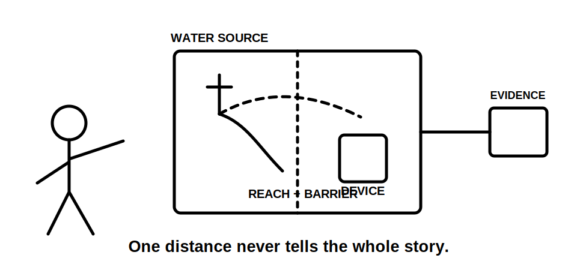
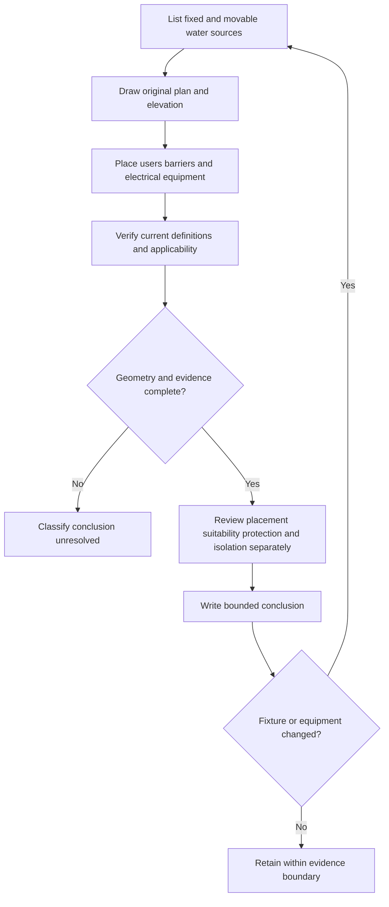

# Day 51 — Bathrooms, Showers and Other Wet-Area Reasoning

> **Scope boundary:** This original module teaches wet-area reasoning without reproducing official zone diagrams, dimensions, equipment-placement limits or protection values. Current authorised sources and qualified review are required for exact requirements.

## 1. Outcome and entry check

By the end, the learner can identify wet-area classification facts, construct an original source-and-reach map, distinguish fixed from movable water sources, connect equipment placement to protection and suitability evidence, and write bounded conclusions without recalling official dimensions from memory.

### Entry check

1. Expand **Z-O-N-E-S**.
2. Which wet-area facts can change when a hose, shower head, screen or fixture moves?
3. Why are equipment location, equipment suitability and additional protection separate questions?
4. What evidence is needed before a paper sketch can support a compliance claim?

## 2. Why it matters

Water can reduce body resistance, increase contact likelihood and extend exposure beyond the obvious fixture. Wet-area reasoning therefore depends on the actual water source, likely reach, barriers, user position, equipment type, supply and current authorised definitions—not simply the room name.

## 3. Core concepts and terminology

- **Fixed water source:** a source whose position and discharge arrangement are fixed by the supplied design evidence.
- **Movable water source:** a hose, handpiece or similar source whose possible reach may alter the exposure map.
- **Screen or barrier:** a physical feature that may affect exposure, access or classification only when its form, position and applicability are verified.
- **Equipment position:** the documented location and orientation of electrical equipment relative to the relevant exposure source and boundaries.
- **Equipment suitability:** evidence that equipment is appropriate for the actual environmental and use conditions; position alone does not establish suitability.
- **Additional protection:** a protection layer that supplements, rather than replaces, the complete set of applicable design and installation controls.
- **Location evidence pack:** the current plan, elevations, fixture details, manufacturer information, source definitions and other records needed to classify the scenario.

## 4. Rule-finding workflow

Use **W-A-T-E-R** after **Z-O-N-E-S**:

1. **W — Water sources:** identify every fixed and movable source and each relevant operating state.
2. **A — Area map:** draw an original plan/elevation showing sources, barriers, users and equipment without inserting remembered official dimensions.
3. **T — Test applicability:** check current definitions, scope, geometry assumptions, exceptions and jurisdiction.
4. **E — Equipment and protection:** examine placement, suitability, supply, additional protection, switching, isolation and manufacturer evidence as separate questions.
5. **R — Record and reopen:** grade claims, list missing evidence and reopen the map when any fixture, screen, hose, equipment or source condition changes.

The diagram shows that equipment acceptance is a bundle of evidence-led decisions, not a single distance check.

## 5. Visual model or worked example

A fictional ensuite dossier shows a fixed shower outlet, a removable handpiece, a partial-height screen, an exhaust fan, a luminaire and an outlet drawn only on the floor plan.

A complete reasoning response:

- maps both water-source operating states;
- requests an elevation because floor-plan position alone is incomplete;
- treats the screen effect as unresolved until its geometry and applicable definition are verified;
- separates equipment position, suitability, protection and isolation claims;
- records the current drawing version and all missing manufacturer evidence.

### Worked-example fading

For a fictional accessible washroom, the source inventory is supplied. The learner completes the elevation map, identifies four evidence gaps, writes two supported claims and explains how a longer hose reopens the analysis.

## 6. Practical application

Review an original wet-area scenario containing a shower, basin, movable handpiece, screen, luminaire, fan and fixed appliance:

1. apply **Z-O-N-E-S** and **W-A-T-E-R**;
2. produce plan and elevation sketches;
3. distinguish observed, documented, manufacturer-verified, assumed and missing evidence;
4. list separate placement, suitability, protection, switching and isolation questions;
5. identify current authorised sources to consult;
6. write described, supported and unresolved claims;
7. revise the work after the screen or hose configuration changes.

### Assessment rubric

Score 0–2 for source identification, spatial mapping, applicability checking, equipment/protection separation, evidence discipline and change propagation. **10/12** with no critical error indicates readiness for Day 52. This is an educational threshold only.

## 7. Common errors and safety checkpoint

Common errors include using only a floor plan, ignoring a movable source, treating a screen as automatically decisive, recalling dimensions from memory, treating additional protection as permission for unsuitable placement, and assuming all wet rooms use identical classifications.

Critical errors include inventing dimensions or official values, omitting a water source, claiming equipment acceptance without current evidence, or proposing unauthorised measurement, opening, isolation, testing or alteration.

This module authorises no site measurement, classification, switching, isolation, testing, installation, alteration, energisation, certification or verification.

## 8. Retrieval and next links

1. Expand **W-A-T-E-R**.
2. Why are plan and elevation views both useful?
3. Distinguish equipment position from equipment suitability.
4. How can a movable source reopen the analysis?
5. Name four evidence items in a location evidence pack.

- **Plan:** [Twelve-Week Capstone Learning Plan](../MASTER_PLAN.md)
- **Knowledge note:** [[12-Week Day 51 - Bathrooms, Showers and Other Wet-Area Reasoning]]
- **Previous:** [Day 50 — Special-Location Method: Classify, Map Zones and Verify Sources](day-50-special-location-method-classify-map-zones-and-verify-sources.md)
- **Next:** [Day 52 — Other Special Installations and Location-Specific Controls](day-52-other-special-installations-and-location-specific-controls.md)

This module remains `review-required`, `reference_check_required` and not `technically-reviewed`.