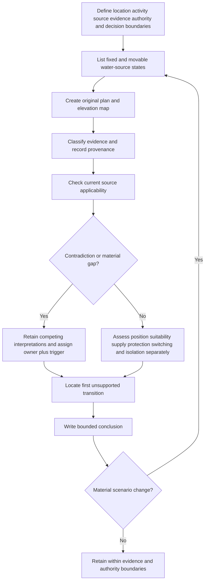
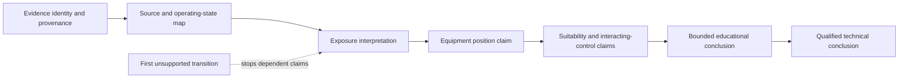

# Day 51 — Bathrooms, Showers and Other Wet-Area Reasoning

> **Scope boundary:** This original module teaches evidence-controlled wet-area reasoning. It does not reproduce official zone diagrams, dimensions, equipment-placement limits, protection values, clause structures or compliance procedures. Exact requirements require current authorised sources and qualified review.

## 1. Outcome and entry check

By the end, the learner can:

1. define the location, activity, water-source, exposure, equipment, evidence, authority and decision boundaries for a supplied wet-area scenario;
2. classify each material statement as a stated fact, derived fact, supported inference, assumption, contradiction or evidence gap;
3. construct an original plan-and-elevation source-and-reach map without inventing official dimensions or presenting it as an official zone diagram;
4. keep equipment position, equipment suitability, supply, additional protection, switching and isolation as separate evidence questions;
5. identify the first unsupported transition in a wet-area claim chain, assign an evidence owner and recheck trigger, and reopen dependent conclusions; and
6. transfer the method after at least two material scenario changes while explaining which conclusions change and which remain supported.

### Entry check

Before checking notes, answer and record confidence as **high**, **medium** or **low**:

1. Expand **Z-O-N-E-S** from Day 50.
2. Name three facts that may change exposure when a hose, handpiece, screen, fixture or equipment item moves.
3. Explain why room name, equipment position and equipment suitability are not interchangeable.
4. State why a correct-looking conclusion may remain unsupported.
5. Identify the boundary between an original learner map and an official standards zone diagram.

Confidence is calibration evidence only. High confidence does not convert an assumption into a supported conclusion, and a correct low-confidence answer still requires explanation before it is considered secure.

## 2. Why it matters

Water may reduce body resistance, increase the likelihood or duration of contact and extend exposure beyond the obvious fixture. Wet-area reasoning therefore depends on the supported source arrangement, possible reach, barriers, user activity, equipment location, supply and current authorised definitions—not simply the room label.

A plausible floor-plan answer can still fail because height, direction, mobility, operating state, screen geometry or drawing currency is unresolved. The learner must stop at the first unsupported transition rather than filling the gap with a remembered dimension, a familiar layout or an assumption that additional protection cures every other deficiency.

*Instructional caption: map every credible water-source state and its evidence before judging equipment position, suitability or protection.*

## 3. Core concepts and terminology

- **Location boundary:** the spaces and installation parts included in the scenario. It prevents an answer from silently expanding to an entire building or ignoring an adjacent relevant space.
- **Activity boundary:** the stated uses and operating states considered, including normal use, credible movable-source positions and documented cleaning or maintenance activities.
- **Water-source boundary:** every supported fixed or movable source that may contribute to exposure.
- **Exposure boundary:** the supported paths by which water or a person may reach an installation part. It is not an invented official distance.
- **Equipment boundary:** the electrical equipment and associated supply, control, switching, isolation and protection questions included in the decision.
- **Evidence boundary:** the drawings, elevations, photographs, schedules, manufacturer information, observations and authorised sources available for the decision.
- **Authority boundary:** what the learner may analyse on supplied records versus what requires an authorised person, field verification or qualified technical judgement.
- **Decision boundary:** the narrow question being answered, such as whether available evidence is sufficient to classify a position—not whether the entire installation complies.
- **Fixed water source:** a source whose position and discharge arrangement are fixed by the supported design evidence.
- **Movable water source:** a hose, handpiece or similar source whose credible positions or reach may alter the exposure map.
- **Screen or barrier:** a physical feature that may affect exposure, access or classification only when its geometry, permanence, operating state and applicability are supported.
- **Original source-and-reach map:** a learner-created plan and elevation showing supported sources, possible states, barriers, users and equipment. It is not an official zone diagram.
- **Equipment position:** the supported location and orientation of an equipment item relative to the scenario features.
- **Equipment suitability:** evidence that the item is appropriate for the actual environment and intended use. Position alone does not establish suitability.
- **Additional protection:** a supplementary protective layer. It does not replace all other applicable design, equipment, placement, switching or isolation requirements.
- **Provenance:** where evidence came from, its date or revision, and how it is linked to the scenario.
- **Competing interpretations:** two or more plausible readings retained because the evidence does not yet resolve them.
- **First unsupported transition:** the earliest point where a conclusion moves beyond its evidence. Every dependent claim is reopened from that point.
- **Evidence owner:** the authorised source, person or reviewer responsible for resolving a gap.
- **Recheck trigger:** the specific evidence or scenario change that requires a conclusion to be reconsidered.
- **Material change:** a change capable of altering source classification, exposure, equipment position, suitability, protection, switching, isolation or acceptance reasoning.

Use these evidence states consistently:

1. **Stated fact** — explicitly present in a supplied record.
2. **Derived fact** — follows directly from stated facts through a transparent step.
3. **Supported inference** — reasonable and bounded, but not directly stated.
4. **Assumption** — used provisionally without sufficient support.
5. **Contradiction** — credible records or observations conflict.
6. **Evidence gap** — information required for the claim is absent.

## 4. Rule-finding workflow

Use **W-A-T-E-R** after **Z-O-N-E-S**:

1. **W — Water sources and states:** define the boundaries; list every fixed and movable source, credible operating state, documented cleaning use and possible interaction with people or equipment.
2. **A — Area map and evidence:** draw original plan and elevation views; place sources, barriers, user positions and equipment; label each input with its evidence state, provenance and confidence.
3. **T — Test applicability:** identify candidate current authorised sources and check jurisdiction, edition, scope, definitions, geometry assumptions, exceptions, amendments and scenario match. Do not import remembered dimensions.
4. **E — Equipment and interacting controls:** assess position, suitability, supply, additional protection, switching, isolation and manufacturer evidence as separate claim chains. Retain competing interpretations where evidence conflicts.
5. **R — Record, restrict and reopen:** find the first unsupported transition, write only bounded conclusions, assign an evidence owner and recheck trigger, and reopen every dependent conclusion after material change.

The workflow prevents a room label or a single plan dimension from becoming a complete technical conclusion. Contradictions remain visible, and a missing upstream fact reopens every dependent equipment or protection claim.

This claim ladder separates the learner's bounded educational conclusion from a qualified technical conclusion. When the first unsupported transition occurs at exposure interpretation, later position, suitability, protection and acceptance claims cannot be treated as supported.

## 5. Visual model or worked example

### Fictional ensuite dossier

The supplied evidence contains:

- floor plan revision C showing a fixed shower outlet, removable handpiece, partial-height screen, luminaire, exhaust fan and one outlet;
- elevation revision B showing the outlet at a position inconsistent with the floor plan;
- an undated photograph in which the handpiece hose appears longer than the schedule description;
- a maintenance note stating that a removable hose is used during cleaning, without identifying whether it is the shower hose or separate equipment;
- a screen schedule that gives material and width but not verified installed height or final position;
- a luminaire product sheet with no confirmed link to the photographed item; and
- no current manufacturer information for the outlet enclosure.

A disciplined response does not select the most convenient document. It:

1. states the location, activity, water-source, equipment, evidence, authority and decision boundaries;
2. records the floor-plan/elevation conflict and retains both equipment-position interpretations;
3. treats the hose reach, cleaning source and screen effect as unresolved;
4. maps each credible source state on original plan and elevation sketches without official dimensions;
5. identifies the first unsupported transition for each claim chain;
6. separates outlet position, outlet suitability, additional protection, switching and isolation questions;
7. assigns the current as-built evidence to an authorised verifier, product identity to the equipment evidence owner, and screen geometry to the design-record owner; and
8. specifies the record or verification event that triggers re-analysis.

### Worked-example fading

For a fictional accessible washroom, the first source inventory and one plan view are supplied. The learner must:

- complete the elevation;
- classify ten evidence statements;
- identify one contradiction and four evidence gaps;
- retain at least two competing exposure interpretations;
- write two supported and three unresolved claims; and
- explain how both a longer movable hose and a relocated screen reopen the analysis.

No official dimension, zone boundary, equipment permission or compliance outcome is supplied or inferred.

## 6. Practical application

Review an original wet-area scenario containing a shower, basin, movable handpiece, screen, luminaire, fan, outlet and fixed appliance.

1. Apply **Z-O-N-E-S** and **W-A-T-E-R**.
2. State all eight boundaries before classifying equipment.
3. Produce original plan and elevation maps with provenance labels.
4. Classify each material statement using the six evidence states and record confidence separately.
5. Build separate claim chains for source state, exposure, equipment position, suitability, supply, additional protection, switching and isolation.
6. Record contradictions and competing interpretations without resolving them by preference.
7. Identify the first unsupported transition in each chain.
8. Assign an evidence owner and recheck trigger for every unresolved blocker.
9. Write supported, bounded and unresolved conclusions without official dimensions or compliance language.
10. Repeat the analysis after two material changes: a longer movable source and a changed screen or equipment position. Explain both reopened and unaffected conclusions.

### Criterion-level readiness states

Assess each criterion independently:

- **Secure:** the response is evidence-controlled, explains its reasoning, stays within authority and transfers correctly after both material changes.
- **Developing:** the method is substantially correct but contains a local omission or weak explanation that can be corrected without changing the central claim chain.
- **Unsupported:** a material conclusion lacks evidence, provenance, applicability checking or dependency control.
- **`stop-required`:** the response invents official requirements, hides a contradiction, exceeds authority, proposes unauthorised practical activity or treats unresolved safety-critical evidence as accepted.

Evaluate boundary completeness, source-state inventory, plan/elevation mapping, evidence classification, provenance, applicability, equipment/control separation, first-unsupported-transition handling, ownership, change propagation and transfer separately. Do not total these states into an aggregate score or treat them as an official assessment outcome.

### Blocking conditions

Readiness for Day 52 is blocked when any of the following remains:

- a credible fixed, movable or cleaning water source is omitted;
- an original learner map is presented as an official zone diagram;
- a remembered dimension, equipment permission or protection value is inserted without authorised verification;
- a floor-plan/elevation, product-identity or screen-geometry contradiction is hidden;
- equipment position is treated as proof of suitability or acceptance;
- additional protection is treated as permission to ignore another control;
- the first unsupported transition is not identified;
- an unresolved gap lacks an evidence owner or recheck trigger;
- dependent conclusions are not reopened after material change;
- transfer is attempted with fewer than two material changes; or
- the response proposes unauthorised site measurement, approach, opening, switching, isolation, testing, alteration or energisation.

A stronger result elsewhere cannot offset a blocking condition.

## 7. Common errors and safety checkpoint

Common errors include using only a floor plan, ignoring height or direction, omitting a movable or cleaning source, treating a screen as automatically decisive, selecting the newest-looking record without provenance, recalling dimensions from memory, treating additional protection as permission for unsuitable equipment, and assuming all wet rooms share one classification.

Safety-critical errors include inventing official values, suppressing contradictory evidence, claiming equipment acceptance without current authorised support, or proposing field actions outside the learner's authority.

**Stop condition:** stop the educational analysis at the first unsupported transition. Record what is known, what remains unresolved, who owns the evidence and what triggers re-analysis. Do not approach, measure, open, switch, isolate, prove de-energised, test, install, alter, repair, energise, commission, certify or verify an installation under this module.

Exact zone definitions, dimensions, equipment restrictions, protection requirements, source treatment, installation methods, manufacturer requirements and official assessment expectations remain `reference_check_required` and require current authorised sources and qualified review.

## 8. Retrieval and next links

Without notes:

1. Expand **W-A-T-E-R**.
2. Name the eight boundaries used in this module.
3. List the six evidence states.
4. Explain why plan and elevation views answer different questions.
5. Distinguish equipment position, suitability and additional protection.
6. Define the first unsupported transition.
7. State what an evidence owner and recheck trigger must contain.
8. Explain which claims reopen after a hose, screen or equipment position changes.
9. Explain why a correct-looking answer may remain unsupported.
10. Describe the difference between an original source-and-reach map and an official zone diagram.

- **Plan:** [Twelve-Week Capstone Learning Plan](../MASTER_PLAN.md)
- **Knowledge note:** [[12-Week Day 51 - Bathrooms, Showers and Other Wet-Area Reasoning]]
- **Previous:** [Day 50 — Special-Location Method: Classify, Map Zones and Verify Sources](day-50-special-location-method-classify-map-zones-and-verify-sources.md)
- **Next:** [Day 52 — Other Special Installations and Location-Specific Controls](day-52-other-special-installations-and-location-specific-controls.md)

This module remains `review-required`, `reference_check_required`, safety-critical and not `technically-reviewed`.
