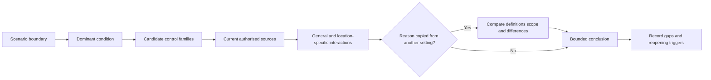

# Day 52 — Other Special Installations and Location-Specific Controls

> **Scope boundary:** This original module compares reasoning patterns across special installations. It does not reproduce official classifications, dimensions, limits, tables, figures or installation procedures. Exact requirements require current authorised sources and qualified review.

## 1. Outcome and entry check

By the end, the learner can compare multiple special-installation scenarios, identify the condition that makes each special, select candidate control families, distinguish shared controls from location-specific controls, and avoid transferring a rule from one setting into another without evidence.

### Entry check

1. Why can two locations with water present require different classification reasoning?
2. Which controls commonly interact across special locations?
3. What evidence prevents a rule from being transferred by superficial similarity?
4. When must a scenario remain unresolved?

## 2. Why it matters

The label “special location” does not describe one universal hazard or one universal control set. A construction site, medical setting, agricultural area, transportable structure, marina, pool environment or similar installation can differ in users, exposure, supply, movement, conductive surroundings, supervision, environmental stress and consequences. The learner must identify the dominant condition and verify the specific source rather than memorise one generic checklist.

## 3. Core concepts and terminology

- **Dominant condition:** the feature that principally changes the ordinary installation assumptions, such as movement, conductive surroundings, public access, environmental exposure or specialised use.
- **Control family:** a category of response such as supply arrangement, additional protection, equipment suitability, segregation, restricted access, isolation, identification, mechanical protection or inspection frequency.
- **Shared control:** a control concept that can appear in more than one special installation, while its exact application remains location-specific.
- **Location-specific control:** a requirement triggered by the verified classification, use, geometry, supply or operating condition of the particular installation.
- **False transfer:** applying a control from one location to another because the settings look similar, without verifying definitions, scope and exceptions.
- **Scenario boundary:** the stated users, activity, supply, equipment, environment and authority included in the paper exercise.

## 4. Rule-finding workflow

Use **S-P-E-C-I-A-L**:

1. **S — State the scenario boundary:** users, activity, supply, equipment, environment and operating states.
2. **P — Pinpoint the dominant conditions:** identify what changes ordinary assumptions and why.
3. **E — Enumerate candidate controls:** list relevant control families without asserting exact requirements.
4. **C — Consult current sources:** verify definitions, scope, jurisdiction, amendments, manufacturer information and exceptions.
5. **I — Identify interactions:** connect location controls with general protection, isolation, wiring-system, access, identification and verification requirements.
6. **A — Avoid false transfer:** compare similarities and differences before reusing reasoning from another location.
7. **L — Limit the conclusion:** grade evidence and claims, record gaps and state reopening triggers.

The diagram makes comparison a verification step, not permission to reuse a memorised rule.

## 5. Visual model or worked example

Three fictional dossiers are provided:

- a temporary work area with changing equipment and public separation concerns;
- an agricultural shed with moisture, dust, animals and mechanical exposure;
- a transportable unit with movement, connection and supply-boundary questions.

The learner creates a comparison matrix with these original headings: dominant condition, users, supply, environmental stress, candidate control families, missing evidence and claims that must remain unresolved. The matrix does not contain official values or requirements.

### Worked-example fading

The first dossier is fully modelled. For the second, only dominant conditions are supplied. For the third, the learner independently defines the boundary, selects sources, identifies interactions and writes a bounded conclusion.

## 6. Practical application

Compare two original special-installation scenarios chosen from different condition families:

1. define each scenario boundary;
2. apply **Z-O-N-E-S** and **S-P-E-C-I-A-L**;
3. identify the dominant condition and at least five candidate control families;
4. list current authorised sources needed;
5. distinguish shared from location-specific controls;
6. identify three false-transfer risks;
7. create an evidence ledger;
8. revise one scenario after the users, supply or environmental condition changes.

### Assessment rubric

Score 0–2 for boundary definition, condition classification, control-family reasoning, source applicability, comparison discipline and bounded conclusions. **10/12** with no critical error indicates readiness for Day 53. This is an educational threshold only.

## 7. Common errors and safety checkpoint

Common errors include treating all special locations alike, relying on the site name, listing controls without explaining the triggering condition, importing wet-area reasoning unchanged, overlooking supply and user differences, and failing to verify exceptions.

Critical errors include inventing official requirements, applying a rule from another setting without source verification, ignoring a disclosed high-consequence condition, claiming compliance from an incomplete dossier, or proposing unauthorised practical work.

This module authorises no classification, design approval, site access, switching, isolation, testing, installation, alteration, energisation, commissioning, certification or verification.

## 8. Retrieval and next links

1. Expand **S-P-E-C-I-A-L**.
2. Define dominant condition, control family and false transfer.
3. Why can a shared control still require location-specific verification?
4. Name five scenario-boundary facts.
5. What changes should reopen the analysis?

- **Plan:** [Twelve-Week Capstone Learning Plan](../MASTER_PLAN.md)
- **Knowledge note:** [[12-Week Day 52 - Other Special Installations and Location-Specific Controls]]
- **Previous:** [Day 51 — Bathrooms, Showers and Other Wet-Area Reasoning](day-51-bathrooms-showers-and-other-wet-area-reasoning.md)
- **Next:** [Day 53 — Alternative, Multiple and Embedded Supply Awareness](day-53-alternative-multiple-and-embedded-supply-awareness.md)

This module remains `review-required`, `reference_check_required` and not `technically-reviewed`.