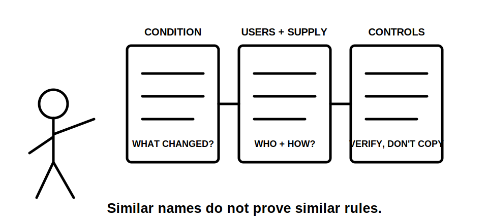
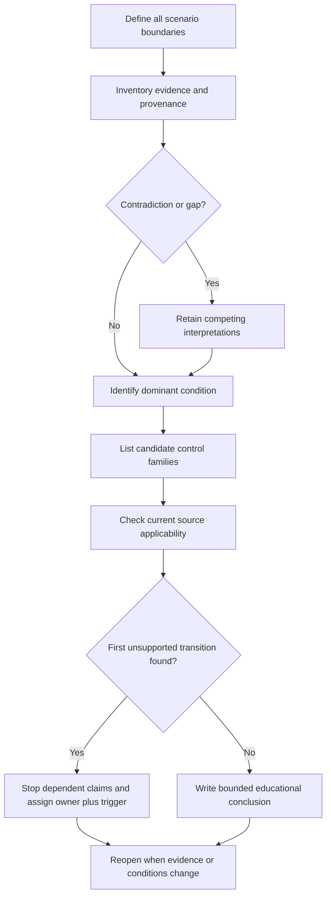
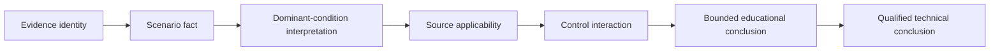

# Day 52 — Other Special Installations and Location-Specific Controls

> **Scope boundary:** This original educational module compares evidence-controlled reasoning across special installations. It does not reproduce official classifications, dimensions, limits, tables, figures, procedures or systematic clause wording. Exact requirements require current authorised sources and qualified review.

## 1. Outcome and entry check

By the end, the learner can:

1. define the installation, activity, users, supply, environment, evidence, authority and decision boundaries for three fictional scenarios;
2. classify each supplied item as a stated fact, derived fact, supported inference, assumption, contradiction or evidence gap, while recording confidence separately;
3. identify the dominant condition and explain why it changes ordinary assumptions without treating the location name as proof;
4. distinguish shared control families from location-specific requirements and stop at the first unsupported transition;
5. assign an evidence owner and recheck trigger to every unresolved claim, then reopen dependent conclusions when evidence changes; and
6. transfer the method after at least two material scenario changes without importing an unverified rule from another setting.

### Entry check

1. Why can two installations that both contain water require different classification reasoning?
2. What is the difference between a shared control family and a verified location-specific requirement?
3. Why is confidence recorded separately from evidence quality?
4. What is the first unsupported transition?
5. When must an earlier conclusion be reopened?

Record each response as **secure**, **developing**, **unsupported** or `stop-required`. These are educational planning states, not official grades or competency decisions.

## 2. Why it matters

“Special installation” is not one hazard category and does not imply one reusable checklist. A temporary work area, agricultural shed, transportable unit, marina, pool environment, medical setting or other specialised installation can differ in users, movement, supply arrangement, conductive surroundings, environmental stress, supervision and consequence. A familiar label can therefore create false confidence.

The reliable response is to define the actual scenario, establish evidence provenance, identify the condition that changes ordinary assumptions and verify the applicable current source. Similar features can suggest questions; they do not prove answers.

*Instructional caption: Compare the evidence chain for each setting; a similar name or visible feature does not authorise rule transfer.*

## 3. Core concepts and terminology

- **Installation boundary:** the equipment, wiring, supply interfaces and physical area included in the paper scenario.
- **Activity boundary:** the use, maintenance, cleaning, movement or temporary activity included in the analysis.
- **User boundary:** the people reasonably represented, including their access, supervision and foreseeable interaction.
- **Supply boundary:** every stated or credible normal, alternative, temporary, embedded or connection source relevant to the scenario.
- **Environment boundary:** the moisture, dust, corrosion, movement, impact, temperature, conductive surroundings or other stresses included in the evidence.
- **Evidence boundary:** the documents, images, statements and records available for the exercise, including their dates and revisions.
- **Authority boundary:** what the learner may analyse on paper and what remains for an authorised source or qualified person.
- **Decision boundary:** the conclusions the available evidence can support; it excludes technical approval, compliance certification and field authority.
- **Dominant condition:** the supported feature that principally changes ordinary installation assumptions.
- **Control family:** a category of response such as supply arrangement, additional protection, equipment suitability, segregation, restricted access, isolation, identification, mechanical protection or verification.
- **Shared control:** a control concept that can appear in more than one setting while its exact application remains scenario-specific.
- **Location-specific control:** a requirement triggered by the verified classification, use, geometry, supply or operating condition of the particular installation.
- **False transfer:** applying a control from one setting to another because they look similar without verifying definitions, scope, exceptions and scenario match.
- **Provenance:** the source, date or revision and scenario linkage of evidence.
- **Competing interpretations:** two or more plausible readings retained until evidence resolves them.
- **First unsupported transition:** the earliest step where a claim exceeds the evidence supporting it.
- **Evidence owner:** the authorised source, person or reviewer responsible for resolving a gap.
- **Recheck trigger:** the evidence or material change that requires the analysis to be reconsidered.
- **Material change:** a change capable of altering classification, source applicability, control interaction or the bounded conclusion.

### Evidence and confidence

Classify evidence as:

1. **stated fact** — directly provided by an identified source;
2. **derived fact** — obtained transparently from stated facts;
3. **supported inference** — a reasoned interpretation with explicit support;
4. **assumption** — used temporarily and clearly labelled;
5. **contradiction** — evidence sources conflict; or
6. **evidence gap** — required information is absent.

Record confidence separately as high, medium or low. High confidence does not upgrade weak evidence, and a correct guess is not secure performance.

## 4. Rule-finding workflow

Use **S-P-E-C-I-A-L**:

1. **S — State every boundary:** installation, activity, users, supply, environment, evidence, authority and decision.
2. **P — Pinpoint dominant conditions:** identify what changes ordinary assumptions, cite the evidence and retain competing interpretations.
3. **E — Enumerate candidate control families:** list relevant categories without asserting exact requirements.
4. **C — Consult current authorised sources:** verify jurisdiction, currency, definitions, scope, exceptions, manufacturer information and scenario applicability.
5. **I — Identify interactions:** connect location-specific questions with general protection, isolation, wiring-system, access, identification and verification concepts.
6. **A — Avoid false transfer:** compare both similarities and material differences before reusing reasoning.
7. **L — Limit and log the conclusion:** stop at the first unsupported transition, assign owners and triggers, and reopen dependent claims after change.

The workflow separates identifying questions from proving requirements. A control family may be relevant before its exact application is known; that uncertainty must remain visible.

Each arrow is a claim transition. Stop at the first arrow that lacks support. A learner may reach a bounded educational conclusion; only authorised sources and qualified review can support a technical conclusion.

## 5. Visual model or worked example

Use three fictional dossiers.

### Dossier A — temporary work area

- Plan revision B shows a fenced work area and temporary distribution point.
- An undated photograph shows public access closer to equipment than the plan suggests.
- A supervisor note says equipment changes frequently.
- The connection arrangement and current inspection record are not supplied.

### Dossier B — agricultural shed

- A site sketch shows washdown activity near animal areas.
- A maintenance note reports dust accumulation and occasional impact damage.
- Two records disagree about whether equipment is fixed or moved seasonally.
- Product identity and environmental suitability evidence are incomplete.

### Dossier C — transportable unit

- A connection diagram and equipment schedule have different revisions.
- A photograph shows an inlet, but its identity and current role are uncertain.
- The unit is moved between sites with different supply arrangements.
- No current source-applicability record is supplied.

Create a comparison matrix with these original headings:

| Dossier | Boundaries | Evidence state | Dominant condition | Candidate control families | First unsupported transition | Owner and trigger |
|---|---|---|---|---|---|---|
| A | learner completes | learner completes | learner completes | learner completes | learner completes | learner completes |
| B | learner completes | learner completes | learner completes | learner completes | learner completes | learner completes |
| C | learner completes | learner completes | learner completes | learner completes | learner completes | learner completes |

The first dossier is modelled with prompts. The second supplies only evidence classification prompts. The third removes scaffolding. This is worked-example fading: support reduces as the learner demonstrates control of the method.

## 6. Practical application

Complete one evidence-controlled comparison using Dossiers A, B and C.

1. Define all eight boundaries for each dossier.
2. Build a provenance ledger and classify every evidence item.
3. Record confidence separately before checking the model.
4. State at least two plausible interpretations where evidence conflicts.
5. Identify the dominant condition and explain why it is supported.
6. List at least five candidate control families without inventing exact requirements.
7. Identify the current authorised sources needed and explain applicability checks.
8. Mark the first unsupported transition for each dossier.
9. Assign an evidence owner and recheck trigger to each unresolved claim.
10. Apply two material changes:
   - Dossier A gains a supervised access boundary but loses its current equipment register.
   - Dossier C changes from one documented connection arrangement to an unresolved alternate-source possibility.
11. Reopen affected conclusions and justify which conclusions remain unchanged.

### Criterion-level readiness

Assess each criterion independently:

- **Secure:** supported, traceable, bounded and transferable after both changes.
- **Developing:** mostly supported but incomplete, weakly linked or not yet transferable.
- **Unsupported:** asserted beyond evidence or missing a necessary dependency.
- **`stop-required`:** the response creates a safety, authority or integrity boundary breach.

There is no aggregate score. Strong work in one criterion cannot offset a blocking condition elsewhere.

## 7. Common errors and safety checkpoint

Common errors include:

- using the location name as the classification;
- treating one visible hazard as the complete scenario;
- hiding contradictions by choosing the convenient record;
- confusing a candidate control family with a verified requirement;
- importing wet-area reasoning unchanged into another setting;
- assuming an unchanged-looking arrangement has unchanged source applicability;
- treating confidence as evidence; and
- failing to reopen downstream claims after a material change.

### Blocking conditions

Readiness is blocked if the learner:

- invents an official classification, dimension, value, equipment permission or procedure;
- transfers a requirement without checking scope and differences;
- omits a credible supply, user, activity or environmental condition;
- suppresses a contradiction or presents an assumption as fact;
- continues beyond the first unsupported transition;
- omits an evidence owner or recheck trigger for a material gap;
- fails to reopen dependent claims after either transfer change; or
- proposes unauthorised site access, switching, isolation, testing, installation or verification.

This module authorises no site classification, approach, measurement, opening, switching, isolation, proving de-energised, testing, installation, alteration, repair, energisation, commissioning, certification, design approval or field verification.

Exact classifications, dimensions, equipment limitations, protection requirements, source treatment, installation methods, exceptions and official assessment expectations require current authorised sources and qualified review.

## 8. Retrieval and next links

1. Expand **S-P-E-C-I-A-L**.
2. Define dominant condition, shared control, location-specific control and false transfer.
3. List the six evidence states.
4. Why is confidence separate from evidence quality?
5. What is the first unsupported transition?
6. Why can a shared control still require location-specific verification?
7. Name the eight scenario boundaries.
8. What is an evidence owner?
9. What is a recheck trigger?
10. Which changes require downstream claims to reopen?

- **Plan:** [Twelve-Week Capstone Learning Plan](../MASTER_PLAN.md)
- **Knowledge note:** [[12-Week Day 52 - Other Special Installations and Location-Specific Controls]]
- **Previous:** [Day 51 — Bathrooms, Showers and Other Wet-Area Reasoning](day-51-bathrooms-showers-and-other-wet-area-reasoning.md)
- **Next:** [Day 53 — Alternative, Multiple and Embedded Supply Awareness](day-53-alternative-multiple-and-embedded-supply-awareness.md)

This module remains `review-required`, `reference_check_required`, safety-critical and not `technically-reviewed`.