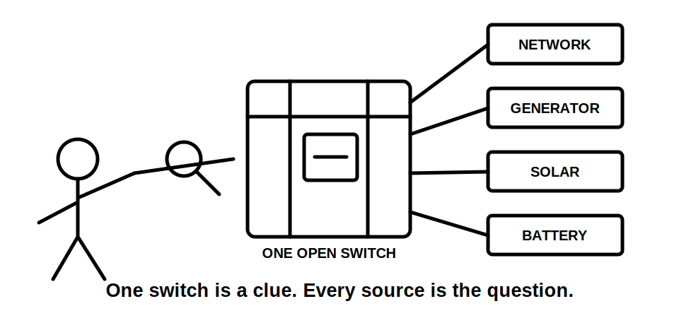
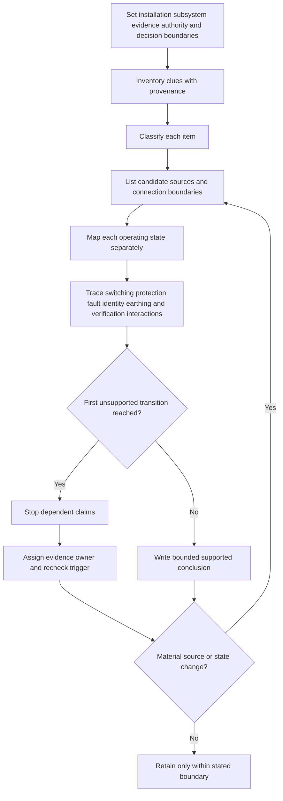
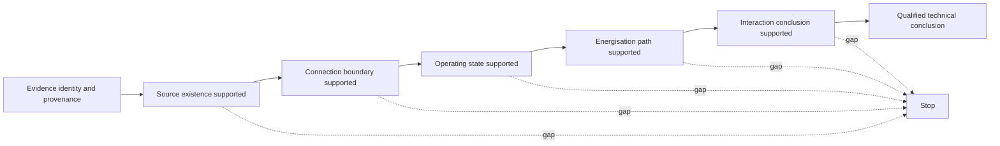

# Day 53 — Alternative, Multiple and Embedded Supply Awareness

> **Scope boundary:** This original paper-based module develops source-discovery, evidence-control and operating-state reasoning. It provides no switching, isolation, proving de-energised, testing, commissioning, installation or field-verification procedure. It reproduces no official source-arrangement diagram, prescribed label, value or clause sequence. Exact requirements require current authorised sources and qualified review.

## 1. Outcome and entry check

By the end of this block, the learner can:

1. state the installation, subsystem, operating-state, evidence, authority and decision boundaries before analysing a multi-source dossier;
2. classify each source clue as a stated fact, derived fact, supported inference, assumption, contradiction or evidence gap, with provenance;
3. build separate source, connection-boundary and operating-state maps without inventing hidden wiring;
4. distinguish source identification from demonstrated switching, isolation, safe-state and verification claims;
5. stop dependent conclusions at the first unsupported transition and assign an evidence owner and recheck trigger;
6. reopen affected switching, protection, fault-condition, identification, neutral, earthing and verification reasoning after two material source changes.

### Entry check

Without notes:

1. List five different source classes that may energise an installation or subsystem.
2. Explain why an open main switch is only one item of evidence.
3. Name three operating states that may produce different energisation paths.
4. Explain what must happen to downstream conclusions when a new source is disclosed.

Record confidence separately as **guess**, **unsure**, **reasonably confident** or **certain**. High confidence with a single-source assumption is not secure performance.

## 2. Why it matters

An installation may receive energy from a network connection, generator, photovoltaic system, battery, uninterruptible power supply, vehicle interface, another board section or a separate control supply. Different sources may appear only in backup, islanded, maintenance, fault or automatic-control states.

A source clue does not prove its present connection, operating logic or isolation boundary. Conversely, absence from one drawing does not prove absence from the installation. Reliable reasoning therefore separates what the dossier states from what must still be verified.

The core sequence is:

**set boundaries → inventory source clues → classify evidence → map connection possibilities → model operating states → trace interactions → stop at the first unsupported transition → assign and recheck**

*Instructional caption: One open switch answers one narrow question; the source inventory and operating-state map determine which questions remain.*

## 3. Core concepts and terminology

- **Supply source:** an origin of electrical energy connected or capable of being connected to the installation.
- **Alternative source:** a source intended to supply some or all loads when another source is unavailable or intentionally disconnected.
- **Embedded source:** generation or storage connected within the installation rather than only at the normal incoming boundary.
- **Stored-energy source:** equipment capable of maintaining or restoring energisation from stored energy, such as a battery or UPS arrangement.
- **Control supply:** a supply serving control, monitoring, signalling or actuation functions; it may remain energised when a power circuit is not.
- **Connection boundary:** the interface at which a source, board section, subsystem or external installation connects to the analysed scenario.
- **Operating state:** a defined combination of source availability, switching positions, control conditions and load connections.
- **Backfeed possibility:** a plausible energisation path from another source or subsystem toward a point assumed to be de-energised. It is a question for evidence, not a confirmed field condition.
- **Source interaction:** a consequence created by two or more sources or modes, including changed switching duties, protection behaviour, fault conditions, identification needs or verification boundaries.
- **Provenance:** the source, date or revision and scenario linkage of an evidence item.
- **Competing interpretations:** two or more plausible readings retained until better evidence resolves them.
- **First unsupported transition:** the earliest step in a claim chain that is not supported by the available evidence.
- **Evidence owner:** the authorised source, person or qualified reviewer responsible for resolving a gap.
- **Recheck trigger:** the new evidence or material change that requires a conclusion to be reconsidered.
- **Material change:** a change capable of altering a source path, operating state, boundary or dependent conclusion.

### Evidence states

Classify every material item as one of:

1. **Stated fact** — explicitly present in the supplied scenario or current identified record.
2. **Derived fact** — follows directly from stated facts without a disputed assumption.
3. **Supported inference** — the best current explanation, but still conditional.
4. **Assumption** — plausible but unsupported.
5. **Contradiction** — two credible items cannot both describe the same condition as currently framed.
6. **Evidence gap** — information needed for the intended conclusion is absent.

Confidence is recorded separately. A correct guess remains unsupported until its evidence chain is shown.

## 4. Rule-finding workflow

Use **S-O-U-R-C-E-S**:

1. **S — Set boundaries:** name the installation, included subsystems, operating states, evidence set, learner authority and permitted decision.
2. **O — Observe and provenance source clues:** inspect current diagrams, schedules, labels, equipment lists, operating descriptions and manufacturer information; record source, date and revision.
3. **U — Uncover candidate energy paths:** list normal, alternative, embedded, stored-energy and control sources without assuming exclusivity or inventing connections.
4. **R — Represent operating states:** map normal, backup, islanded, maintenance, automatic-restart and supplied fault-related states separately.
5. **C — Connect interactions:** examine switching, isolation, protection, fault conditions, identification, neutral and earthing questions, and verification boundaries.
6. **E — Examine authorised evidence:** check currency, applicability, manufacturer compatibility, connection arrangements and documented operating logic; retain contradictions.
7. **S — State, stop and schedule recheck:** stop at the first unsupported transition, write a bounded conclusion, assign each gap and define its recheck trigger.

The workflow is cyclic. A new generator inlet, changed battery operating mode or separately supplied control system can invalidate earlier assumptions and reopen every dependent claim.

### Claim ladder

The learner may only climb as high as the evidence supports. A label may support source existence but not connection state, operating logic, isolation or whole-installation safe-state.

## 5. Visual model or worked example

### Fictional community-facility dossier

The supplied dossier contains:

- a current network incomer schedule;
- a generator connection shown on a superseded single-line diagram;
- rooftop inverter equipment visible in a dated photograph;
- a battery cabinet listed in an asset register but absent from the current diagram;
- a fire-system control panel described as supplied from another board;
- an automatic-transfer narrative with no revision identifier; and
- a maintenance note stating that one board section remained live during earlier work.

A learner writes: “The main switch is open, so the facility is isolated.”

Apply **S-O-U-R-C-E-S**:

| Step | Evidence-controlled response |
|---|---|
| Set | Include the main board, connected distribution sections, embedded equipment, control panel, supplied operating states and paper-only authority. |
| Observe | Record each clue's source and date. The generator and transfer documents may be stale; the battery record conflicts with the current diagram. |
| Uncover | Network, generator, inverter, battery and separate control supply are candidate sources. Their current connection states are not all supported. |
| Represent | Map normal, generator-supported, stored-energy, automatic-restart and maintenance states separately. |
| Connect | Reopen switching, isolation, protection, fault-condition, identification, neutral, earthing and verification reasoning for each supported or unresolved path. |
| Examine | Request current single-line information, source connection records, operating logic, applicable manufacturer information and qualified confirmation. |
| State | **The supplied evidence describes one open switch. Whole-facility isolation and safe-state are unsupported.** |

Competing interpretations are retained:

- the battery may be disconnected and the asset register stale; or
- the current single-line diagram may be incomplete.

Neither interpretation may be silently selected.

### Worked-example fading

For a second fictional site with a network supply, UPS label and incomplete downstream diagram, produce only:

1. boundary statement;
2. provenance ledger;
3. six-state evidence classification;
4. source and connection-boundary inventory;
5. three operating-state maps;
6. first unsupported transition;
7. owner and recheck trigger; and
8. one bounded conclusion.

## 6. Practical application

A fictional commercial site contains a network supply, photovoltaic inverter, battery system and tenant equipment connected through an internal distribution arrangement. Later evidence discloses a mobile generator inlet and then a separately supplied control system.

Produce:

1. all six boundaries;
2. a source inventory with provenance, evidence state and confidence;
3. a connection-boundary map that marks supported, inferred and unresolved links differently;
4. an operating-state table for normal, backup, islanded, maintenance and automatic-restart possibilities supplied by the dossier;
5. an interaction review covering switching, isolation, protection, fault conditions, identification, neutral and earthing questions, and verification;
6. the first unsupported transition for each major conclusion;
7. evidence owners and recheck triggers;
8. a bounded conclusion before either disclosure;
9. a reopened analysis after the generator inlet; and
10. a second reopened analysis after the separate control supply, identifying both affected and unaffected conclusions.

### Criterion-level readiness

Assess each criterion independently:

| Criterion | Secure | Developing | Unsupported |
|---|---|---|---|
| Boundaries | All six are explicit and consistently applied | One boundary is incomplete but claims remain bounded | Boundaries are missing, invented or exceeded |
| Evidence discipline | Provenance, state and confidence are separate and contradictions retained | Minor inconsistency without changing the conclusion | Assumption or stale record is presented as verified fact |
| Source discovery | Every disclosed source class and credible clue is considered | One low-impact clue needs prompting | A disclosed or credible source is omitted |
| Operating states | Material states are mapped separately with changed paths | States are named but one interaction is incomplete | One normal-state map is treated as universal |
| Claim control | First unsupported transitions, owners and triggers are explicit | One dependency needs clearer ownership | Isolation, safe-state or acceptance is claimed beyond evidence |
| Change propagation | Both material changes reopen all affected conclusions and preserve justified unaffected ones | Reopening is mostly complete | New sources are added without rebuilding dependent reasoning |

`stop-required` applies whenever a disclosed source is omitted, a hidden path is invented, a contradiction is concealed, isolation or safe-state is claimed from paper evidence, a claim continues beyond the first unsupported transition, or unauthorised practical action is proposed.

These are educational planning states, not official grades, competency decisions, defect classifications, compliance conclusions or technical approvals. A strong result in one criterion cannot offset a blocking condition elsewhere.

## 7. Common errors and safety checkpoint

### Common errors

- assuming the normal incoming supply is the only source;
- treating a label or asset register as a complete connection model;
- using a superseded diagram without marking its status;
- mapping only the normal operating state;
- forgetting stored energy, automatic restart or control supplies;
- treating source existence as proof of present connection;
- assuming one open switch proves whole-installation isolation;
- hiding contradictions by choosing the convenient document;
- failing to assign unresolved evidence; and
- adding a new source to the inventory without reopening dependent reasoning.

### Blocking conditions

Stop and remediate if the learner:

- omits a disclosed or credible source clue;
- invents a hidden connection or switching state;
- claims isolation, de-energisation, safe-state, compliance or acceptance from incomplete paper evidence;
- continues a dependent conclusion past the first unsupported transition;
- fails to retain a material contradiction;
- leaves a safety-relevant gap without an evidence owner and recheck trigger;
- performs incomplete change propagation after either material change; or
- proposes access, opening, switching, isolation, proving de-energised, testing, alteration or energisation outside authority.

This module authorises no site access, opening, switching, isolation, proving de-energised, testing, measurement, installation, alteration, repair, energisation, commissioning, certification, design approval or field verification.

## 8. Retrieval and next links

### Closed-note retrieval

1. Expand **S-O-U-R-C-E-S**.
2. Define alternative, embedded, stored-energy and control sources.
3. Distinguish source existence, connection boundary, operating state and energisation path.
4. Name the six evidence states.
5. Explain the first unsupported transition.
6. Why is one open switch insufficient evidence for whole-installation safe-state?
7. Which downstream conclusions may reopen after a source change?
8. Define evidence owner, recheck trigger and material change.

### Changed-scenario transfer

Reattempt the practical application after two changes:

1. remove the network supply while retaining the battery and incomplete generator records; then
2. disclose a separately supplied control system capable of automatic restart.

Rebuild the source inventory and operating-state maps after each change. Identify which conclusions reopen, which remain supported and why.

- **Plan:** [Twelve-Week Capstone Learning Plan](../MASTER_PLAN.md)
- **Knowledge note:** [[12-Week Day 53 - Alternative, Multiple and Embedded Supply Awareness]]
- **Previous:** [Day 52 — Other Special Installations and Location-Specific Controls](day-52-other-special-installations-and-location-specific-controls.md)
- **Next:** [Day 54 — Rest, Retrieval and Applicability-Check Repair](day-54-rest-retrieval-and-applicability-check-repair.md)

This module remains `review-required`, `reference_check_required`, safety-critical and not `technically-reviewed`.
