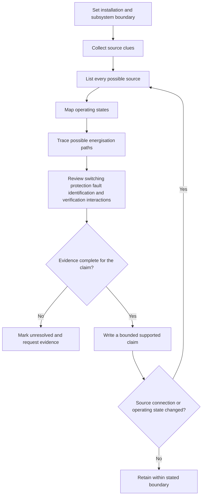

# Day 53 — Alternative, Multiple and Embedded Supply Awareness

> **Scope boundary:** This original paper-based module develops source-discovery and operating-state reasoning. It does not provide switching, isolation, testing, commissioning or installation procedures, and it does not reproduce official source-arrangement diagrams, labels, values or clause sequences. Exact requirements require current authorised sources and qualified review.

## 1. Outcome and entry check

By the end of this block, the learner can:

1. identify when a dossier may contain more than one source of electrical energy;
2. distinguish a supply source, alternate source, embedded source, stored-energy source and control supply at concept level;
3. construct a source-and-operating-state map from supplied evidence;
4. explain why one open switch or one de-energised source does not prove the whole installation is de-energised;
5. identify source interactions affecting isolation, protection, fault conditions, identification and verification;
6. apply the **S-O-U-R-C-E-S** workflow without inventing hidden arrangements;
7. grade conclusions as described, supported, verified or unresolved; and
8. reopen dependent conclusions when a source, operating mode or connection boundary changes.

### Entry check

Without notes, answer:

1. What evidence could reveal an alternate or embedded source?
2. Why must normal, backup, islanded and maintenance states be considered separately?
3. Which earlier conclusions can change when a battery or generator is added?
4. What is the difference between identifying a source and proving isolation from it?

Rate each answer **guess**, **unsure**, **reasonably confident** or **certain**. A confident claim that relies on a single-source assumption is a priority misconception.

## 2. Why it matters

An installation can receive energy from a network connection, generator, photovoltaic system, battery system, uninterruptible power supply, vehicle interface, another board section or a separate control circuit. Some sources are obvious only in particular operating states. If the learner starts with the assumption that one incoming supply defines the whole installation, later reasoning about switching, protection, fault current, labels, testing and safe work can be unsound.

The central model is:

**discover sources → define connection boundaries → map operating states → trace energisation paths → identify interactions → verify evidence → limit the claim**

## 3. Core concepts and terminology

- **Supply source:** an origin of electrical energy connected or capable of being connected to the installation.
- **Alternative source:** a source intended to supply some or all loads when another source is unavailable or intentionally disconnected.
- **Embedded source:** generation or storage connected within the installation rather than only at the normal incoming boundary.
- **Stored-energy source:** equipment capable of continuing or restoring energisation from stored energy, such as a battery or UPS arrangement.
- **Control supply:** a supply serving control, monitoring, signalling or actuation functions; it may remain energised when a power circuit is not.
- **Connection boundary:** the point or interface at which a source, board section, subsystem or external installation connects to the scenario being analysed.
- **Operating state:** a defined combination of source availability, switching positions, control conditions and load connections.
- **Backfeed possibility:** a plausible energisation path from a source or connected subsystem toward a point assumed to be de-energised. This term identifies a reasoning question, not a confirmed field condition.
- **Source interaction:** a consequence created by two or more sources or operating modes, including changed fault conditions, switching duties, protection behaviour, identification needs or verification boundaries.
- **Single-source assumption:** an unsupported belief that the normal incoming supply is the only possible energy source.

### Evidence grades

Use five evidence grades:

1. **Observed** — visible in the supplied image, diagram, schedule or scenario.
2. **Documented** — stated in a current authorised record.
3. **Manufacturer-verified** — supported by applicable equipment information.
4. **Assumed** — plausible but not demonstrated.
5. **Missing** — required for the conclusion but unavailable.

## 4. Rule-finding workflow

Use **S-O-U-R-C-E-S**:

1. **S — Set the boundary:** define the installation, board sections, subsystems and external interfaces included.
2. **O — Observe source clues:** inspect diagrams, schedules, labels, equipment lists, operating descriptions and manufacturer information.
3. **U — Uncover every energy path:** list normal, alternative, embedded, stored-energy and control sources without assuming exclusivity.
4. **R — Represent operating states:** map which sources and paths may be active in normal, backup, islanded, maintenance and fault-related states supplied by the scenario.
5. **C — Connect interactions:** review isolation boundaries, switching duties, protection, fault conditions, neutral and earthing questions, identification and verification consequences.
6. **E — Examine authorised evidence:** verify definitions, scope, currency, manufacturer compatibility, connection arrangements and documented operating logic.
7. **S — State and stress-test the claim:** grade the conclusion, record missing evidence and reopen it when a source or operating state changes.

The diagram prevents source discovery from becoming a one-time checklist. A changed source or mode sends the learner back to the source map because dependent conclusions may no longer hold.

## 5. Visual model or worked example

### Complete worked example

A fictional community facility dossier shows a network incomer, a labelled generator connection, rooftop inverter equipment, a battery cabinet and a fire-system control panel supplied from another board. The single-line diagram is incomplete and the operating description is dated.

A learner states: “The main switch is open, so the facility is isolated.”

Apply **S-O-U-R-C-E-S**:

| Step | Evidence-led response |
|---|---|
| Set | Include the main board, connected distribution sections, embedded equipment and separately supplied control panel. |
| Observe | The dossier contains four source clues, but not a complete current connection diagram. |
| Uncover | Network, generator, inverter, battery and separate control supply must be considered. |
| Represent | Normal, generator-supported, stored-energy and maintenance states require separate maps. |
| Connect | Isolation, identification, fault conditions, switching duties, protection and verification boundaries may differ by state. |
| Examine | Current single-line information, operating logic, source labels, manufacturer information and qualified confirmation are required. |
| State | **One switch position described; whole-facility isolation unresolved.** |

### Worked-example fading

A second fictional site shows a network supply and a UPS label but no downstream connection diagram. Complete only:

1. the scenario boundary;
2. a source-clue ledger;
3. three operating states;
4. four interactions that remain unresolved;
5. one bounded claim; and
6. one change that forces the analysis to reopen.

## 6. Practical application

A fictional small commercial site contains a network supply, photovoltaic inverter, battery system and tenant equipment supplied through an internal distribution arrangement. A later revision reveals a mobile generator inlet.

Produce:

1. a boundary statement;
2. a source inventory using the evidence grades;
3. an operating-state table;
4. a source-to-load concept map without inventing hidden wiring;
5. an interaction review covering switching, isolation, protection, fault conditions, identification, neutral and earthing questions, and verification;
6. an authorised-evidence request list;
7. a bounded conclusion before the generator disclosure; and
8. a change-propagation note after the generator disclosure.

### Assessment rubric

Score each category from **0 to 2**:

| Category | 0 | 1 | 2 |
|---|---|---|---|
| Boundary | Missing or invented | Partial | Complete paper boundary and interfaces |
| Source discovery | Assumes one source | Some clues listed | All supplied source classes considered |
| Operating states | One state only | Several states named | States mapped with changed paths |
| Interaction reasoning | Isolated device focus | Some interactions | Switching, protection, fault, identity and verification connected |
| Evidence discipline | Assumption presented as fact | Mixed grading | Evidence and claims consistently bounded |
| Change propagation | New source ignored | Some reopening | Every dependent conclusion explicitly reopened |

A score of **10/12 or higher** with no critical error indicates readiness for Day 54. This is an educational threshold, not an official assessment rule.

## 7. Common errors and safety checkpoint

### Common errors

- assuming the normal supply is the only source;
- treating an equipment label as a complete connection diagram;
- mapping only the normal operating state;
- forgetting stored energy or control supplies;
- assuming one open switch proves whole-installation isolation;
- ignoring how additional sources can alter protection and fault reasoning;
- treating an old single-line diagram as current without checking; and
- failing to reopen prior conclusions after a source change.

### Critical errors and stop conditions

Stop and remediate if the learner:

- claims isolation from incomplete paper evidence;
- omits a disclosed source;
- invents a hidden connection path;
- proposes switching, proving de-energised, testing or alteration outside authority;
- claims compliance without current authorised evidence; or
- treats source identification as practical verification.

This module authorises no switching, isolation, access, opening, testing, measurement, installation, alteration, energisation, commissioning, certification or verification.

## 8. Retrieval and next links

### Closed-note retrieval

1. Expand **S-O-U-R-C-E-S**.
2. Define alternative, embedded, stored-energy and control sources.
3. Why must operating states be mapped separately?
4. Name five source interactions.
5. Why does one open switch not prove whole-installation isolation?
6. What evidence gaps make a source conclusion unresolved?
7. What changes require the analysis to reopen?

### Changed-scenario transfer

Re-attempt the practical application after removing the network supply and adding a separately supplied control system. Rebuild the source inventory and operating states rather than editing the earlier conclusion in place.

- **Plan:** [Twelve-Week Capstone Learning Plan](../MASTER_PLAN.md)
- **Knowledge note:** [[12-Week Day 53 - Alternative, Multiple and Embedded Supply Awareness]]
- **Previous:** [Day 52 — Other Special Installations and Location-Specific Controls](day-52-other-special-installations-and-location-specific-controls.md)
- **Next:** [Day 54 — Rest, Retrieval and Applicability-Check Repair](day-54-rest-retrieval-and-applicability-check-repair.md)

This module remains `review-required`, `reference_check_required`, safety-critical and not `technically-reviewed`.