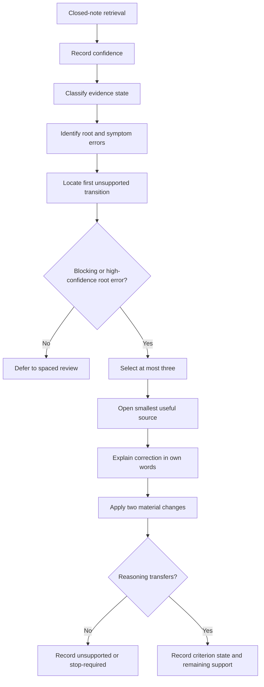
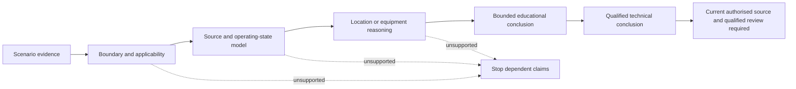

# Day 54 — Rest, Retrieval and Applicability-Check Repair

> **Recovery boundary:** This block adds no new electrical theory. It uses short retrieval, causal error repair and readiness triage. Stop at the time limit or earlier if fatigue reduces careful reasoning. Exact technical requirements remain subject to current authorised sources and qualified review.

## 1. Outcome and entry check

By the end, the learner can:

1. retrieve the Week 8 reasoning workflows without notes and record confidence separately from correctness;
2. classify each response as a knowledge gap, applicability failure, boundary error, source omission, evidence-grade error or fatigue-related decline;
3. locate the first unsupported transition in a claim and stop dependent reasoning there;
4. repair no more than three root errors using the smallest useful source review;
5. demonstrate transfer after two material scenario changes; and
6. make a criterion-level readiness decision for Day 55, including evidence owners and recheck triggers for unresolved blockers.

### Entry check

Before opening notes, write from memory:

- the purpose of **Z-O-N-E-S**, **W-A-T-E-R**, **S-P-E-C-I-A-L** and **S-O-U-R-C-E-S**;
- three reasons a rule may not apply to a superficially similar scenario;
- four clues that a scenario may contain more than one source; and
- three stop conditions from Week 8.

For each answer, record confidence as **guessing**, **unsure**, **reasonably confident** or **certain**. Correctness and confidence are separate: a correct guess is not secure learning, while a confident error is a priority misconception.

## 2. Why it matters

Special-location and multiple-supply errors often come from applying remembered wording before checking classification, scope, geometry, users, supply conditions, evidence provenance or source currency. More reading is not automatically the remedy. The learner needs enough recovery to identify the exact broken reasoning step, repair the root cause and show that the correction survives changed conditions.

A **root error** is the earliest misconception that causes later mistakes. A **symptom error** is a later incorrect conclusion produced by that root error. Repairing symptoms without repairing the root creates false confidence.

The recovery sequence is:

**pause → retrieve → classify evidence and error → find the first unsupported transition → repair one root cause → vary context twice → decide readiness**

*Repair three root gaps rather than rereading thirty pages: recovery protects attention while preserving evidence quality.*

## 3. Core concepts and terminology

- **Applicability check:** confirming that a source, definition, classification and requirement fit the actual scenario boundary.
- **False transfer error:** reusing reasoning from another setting because of superficial similarity.
- **Source-omission error:** failing to identify a disclosed or plausible energy source that materially affects the analysis.
- **Boundary error:** including, excluding or inventing parts of the scenario incorrectly.
- **Evidence-grade error:** presenting assumed, contradictory or missing information as documented or verified.
- **High-confidence error:** an incorrect response marked reasonably confident or certain; it receives priority because it may persist unnoticed.
- **Root error:** earliest misconception that produces one or more downstream mistakes.
- **Symptom error:** later incorrect conclusion caused by a root error.
- **First unsupported transition:** earliest step in a claim chain that lacks adequate evidence; dependent claims stop there.
- **Provenance:** where evidence came from, its date or revision and how it relates to the scenario.
- **Competing interpretations:** two or more plausible readings retained until evidence resolves them.
- **Evidence owner:** authorised source, person or reviewer responsible for resolving a stated gap.
- **Recheck trigger:** new evidence or material change that requires the reasoning to be reopened.
- **Material change:** scenario change capable of altering classification, source applicability, protection, isolation or acceptance reasoning.
- **Transfer check:** fresh scenario testing whether repaired reasoning generalises rather than merely being memorised.

Classify evidence independently of confidence:

1. **stated fact** — directly supplied by the fictional dossier;
2. **derived fact** — follows transparently from stated facts;
3. **supported inference** — plausible and evidence-backed but not directly stated;
4. **assumption** — used provisionally and labelled;
5. **contradiction** — evidence sources conflict; and
6. **evidence gap** — required information is absent.

## 4. Rule-finding workflow

Use **R-E-S-T-O-R-E**:

1. **R — Reduce load:** set a 20–30 minute maximum and remove nonessential tasks.
2. **E — Elicit from memory:** complete closed-note retrieval and record confidence before reviewing material.
3. **S — Sort evidence and errors:** classify evidence state, then classify each miss by root cause rather than topic alone.
4. **T — Trace the claim:** locate the first unsupported transition and stop all dependent conclusions.
5. **O — Open the smallest source:** review only the minimum module section, knowledge note or authorised reference needed.
6. **R — Re-attempt with two variations:** change at least two material conditions and rebuild affected reasoning.
7. **E — Evaluate by criterion:** record secure, developing, unsupported or `stop-required`, then assign owners and recheck triggers.

The diagram prevents recovery from becoming indiscriminate rereading. Evidence is classified before error repair, and a claim cannot continue beyond its first unsupported transition.

This claim ladder separates a learner’s bounded educational reasoning from technical approval. The first unsupported transition limits every later claim, and automated content never supplies the final qualified conclusion.

## 5. Visual model or worked example

A learner writes with high confidence: “If two sites both contain water, the same zone logic applies.” They also forget a battery source in a multiple-supply scenario and treat an undated drawing as current.

Do not reread all four Week 8 modules.

1. Classify the water statement as a **false-transfer/applicability root error**.
2. Classify the missing battery as a **source-omission root error**.
3. Classify the drawing claim as an **evidence-grade error** involving provenance.
4. Stop downstream placement, isolation and acceptance claims at the first unsupported transition.
5. Review only the comparison discipline in Day 52, source discovery in Day 53 and evidence currency guidance.
6. Explain each repair in one sentence without copying source wording.
7. Apply change one: the wet location becomes an agricultural wash area with different users and activities.
8. Apply change two: a separately supplied automatic-restart control circuit is disclosed.
9. Reopen all dependent reasoning rather than patching only the final answer.

### Worked-example fading

For a fourth error—“a current label proves the whole connection arrangement”—the learner independently classifies the evidence, identifies the root error, finds the first unsupported transition, chooses the smallest source and creates two changed-condition checks.

## 6. Practical application

Complete one recovery sheet:

1. 8-minute closed-note retrieval covering Days 50–53;
2. confidence marking for every response;
3. evidence-state classification where a scenario claim is used;
4. root-versus-symptom classification of every error;
5. selection of no more than three blocking or high-confidence root errors;
6. one-sentence corrected model for each;
7. two material changes applied to each repaired model;
8. evidence owner and recheck trigger for every unresolved blocker;
9. fatigue checks at 15 and 25 minutes; and
10. one criterion-level readiness record.

### Readiness criteria

Judge each criterion independently:

- **Retrieval and confidence calibration** — recalls the workflow and distinguishes confidence from correctness.
- **Evidence discipline** — classifies evidence, retains contradictions and does not promote assumptions.
- **Causal repair** — identifies root errors rather than repairing symptoms only.
- **Unsupported-transition control** — stops dependent claims at the earliest unsupported step.
- **Transfer** — rebuilds reasoning after two material changes without copying the original repair.
- **Recovery discipline** — respects time, fatigue and stop conditions.

Use these educational planning states:

- **secure** — independent, accurate and appropriately bounded;
- **developing** — mostly sound but one stated support remains necessary;
- **unsupported** — evidence or reasoning is insufficient for progression; or
- **`stop-required`** — a safety, authority, fatigue or evidence boundary requires stopping.

These are not official grades, competency decisions, defect classifications, compliance outcomes or technical approvals. Strong performance in one criterion cannot offset a blocking condition in another.

### Blocking conditions

Day 55 readiness is blocked by any of the following:

- an omitted disclosed source or material location condition;
- an assumption presented as fact;
- a contradiction hidden or silently resolved;
- reasoning beyond the first unsupported transition;
- a safety-critical claim made from memory;
- transfer attempted with only cosmetic changes;
- no owner or recheck trigger for an unresolved blocker;
- unauthorised practical verification; or
- study continued after fatigue prevents careful reasoning.

## 7. Common errors and safety checkpoint

Common errors include rereading everything, repairing symptoms before root causes, copying source wording instead of explaining the idea, reusing the same scenario, ignoring confidence, treating a correct guess as mastery, hiding contradictory evidence, exceeding the time limit and treating fatigue as lack of ability.

Critical errors include claiming a safety-critical rule from memory, repeating a single-source assumption, inventing an official classification, proposing practical verification, continuing dependent claims after an unsupported transition or continuing while concentration is visibly deteriorating.

Stop when the time limit is reached, when two consecutive transfer attempts deteriorate, when frustration prevents careful reading, when a blocking contradiction cannot be resolved, or when the needed correction depends on unavailable authorised material or qualified supervision.

This module authorises no site access, classification approval, opening, switching, isolation, proving de-energised, testing, measurement, installation, alteration, repair, energisation, commissioning, certification, design approval or field verification.

## 8. Retrieval and next links

### Exit retrieval

1. Expand **R-E-S-T-O-R-E**.
2. Distinguish a root error from a symptom error.
3. Name the six evidence states.
4. Why are high-confidence errors prioritised?
5. What is the first unsupported transition?
6. What proves that a repair transferred?
7. Why can strong performance in one criterion not offset a blocker?
8. Name four stop conditions.

### Deferred review

Move nonblocking errors into spaced review rather than extending this session. Record exactly one support permitted for Day 55, plus an owner and recheck trigger for each unresolved blocker.

- **Plan:** [Twelve-Week Capstone Learning Plan](../MASTER_PLAN.md)
- **Knowledge note:** [[12-Week Day 54 - Rest, Retrieval and Applicability-Check Repair]]
- **Previous:** [Day 53 — Alternative, Multiple and Embedded Supply Awareness](day-53-alternative-multiple-and-embedded-supply-awareness.md)
- **Next:** [Day 55 — Mixed Special-Location Scenario Workshop](day-55-mixed-special-location-scenario-workshop.md)

This module remains `review-required`, `reference_check_required`, safety-critical and not `technically-reviewed`.