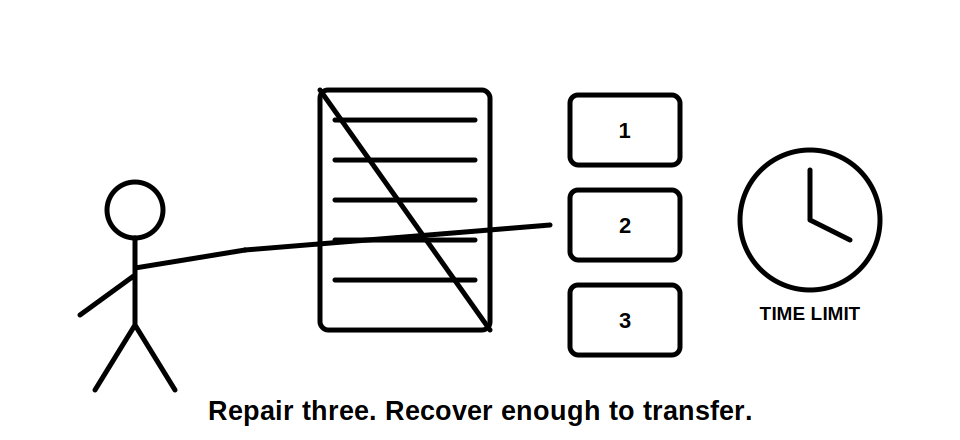
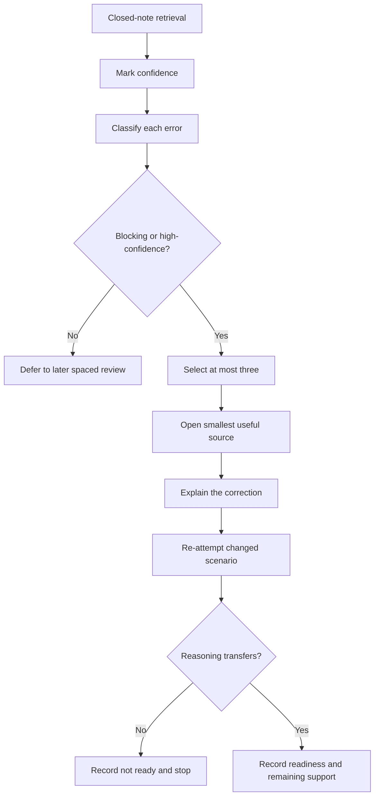

# Day 54 — Rest, Retrieval and Applicability-Check Repair

> **Recovery boundary:** This block adds no new electrical theory. It uses short retrieval, error-log correction and readiness triage. Stop at the time limit or earlier if fatigue reduces careful reasoning. Exact technical requirements remain subject to current authorised sources and qualified review.

## 1. Outcome and entry check

By the end, the learner can:

1. retrieve the Week 8 reasoning workflows without notes;
2. distinguish a knowledge gap from an applicability-check failure;
3. identify high-confidence errors that require immediate repair;
4. correct no more than three blocking errors using the smallest useful source review;
5. repeat each repair in a changed scenario; and
6. make a bounded readiness decision for Day 55.

### Entry check

Before opening notes, write from memory:

- the purpose of **Z-O-N-E-S**, **W-A-T-E-R**, **S-P-E-C-I-A-L** and **S-O-U-R-C-E-S**;
- three reasons a rule may not apply to a superficially similar scenario;
- four clues that a scenario may contain more than one source; and
- three stop conditions from Week 8.

Mark confidence beside every answer. Do not score by quantity alone: one certain but unsupported answer is more important than several uncertain omissions.

## 2. Why it matters

Special-location and multiple-supply errors often come from applying a remembered rule before checking classification, scope, geometry, users, supply conditions or source currency. More reading is not automatically the remedy. The learner needs enough recovery to identify the exact broken reasoning step, repair it and demonstrate transfer.

The recovery sequence is:

**pause → retrieve → classify error → repair one cause → vary context → decide readiness**

## 3. Core concepts and terminology

- **Applicability check:** the process of confirming that a source, definition, classification and requirement fit the actual scenario boundary.
- **False transfer error:** reusing reasoning from another setting because of superficial similarity.
- **Source-omission error:** failing to identify a disclosed or plausible energy source that materially affects the analysis.
- **Boundary error:** including, excluding or inventing parts of the scenario incorrectly.
- **Evidence-grade error:** presenting assumed or missing information as documented or verified.
- **High-confidence error:** an incorrect response marked reasonably confident or certain; it receives priority because it may persist unnoticed.
- **Blocking error:** a misconception that makes Day 55 unsafe or unproductive unless repaired first.
- **Transfer check:** a fresh scenario that tests whether the repaired reasoning generalises rather than merely being memorised.
- **Readiness decision:** **ready**, **ready with one support**, or **not ready—repair first**.

## 4. Rule-finding workflow

Use **R-E-S-T-O-R-E**:

1. **R — Reduce load:** set a 20–30 minute maximum and remove nonessential tasks.
2. **E — Elicit from memory:** complete the closed-note retrieval before reviewing material.
3. **S — Sort errors:** classify each miss as boundary, applicability, source omission, evidence grade, terminology or fatigue-related.
4. **T — Target three or fewer:** select only blocking or high-confidence errors.
5. **O — Open the smallest source:** review the minimum module section, note or authorised reference needed.
6. **R — Re-attempt in variation:** answer a changed-context question without copying the repair.
7. **E — Evaluate readiness:** record confidence, remaining support and the next safe study action.

The diagram protects recovery time from turning into another full study session. Errors are triaged, not all attacked at once.

## 5. Visual model or worked example

A learner writes with high confidence: “If two sites both contain water, the same zone logic applies.” They also forget a battery source in a multiple-supply scenario.

The correct repair is not to reread all four Week 8 modules.

1. Classify the first as a **false transfer/applicability error**.
2. Classify the second as a **source-omission error**.
3. Review only the comparison discipline in Day 52 and source discovery in Day 53.
4. Explain each correction in one sentence.
5. Re-attempt with a changed agricultural scenario and a UPS-backed commercial scenario.
6. Mark readiness only if the reasoning transfers without prompts.

### Worked-example fading

For a third error—“a current label proves the whole connection arrangement”—the learner independently classifies the error, chooses the smallest source, writes a correction and creates a changed-context check.

## 6. Practical application

Complete one recovery sheet:

1. 8-minute closed-note retrieval covering Days 50–53;
2. confidence marking;
3. causal classification of every error;
4. selection of no more than three repairs;
5. one-sentence corrected model for each;
6. one varied transfer question per repair;
7. a fatigue check at 20 minutes; and
8. one readiness decision.

### Readiness rubric

Score 0–2 for retrieval accuracy, confidence calibration, causal classification, repair precision, transfer and fatigue discipline. **10/12** with no critical error supports progression. This is an educational threshold only.

## 7. Common errors and safety checkpoint

Common errors include rereading everything, repairing low-value omissions before dangerous misconceptions, copying the source wording instead of explaining the idea, reusing the same scenario, ignoring confidence, exceeding the time limit and treating fatigue as lack of ability.

Critical errors include claiming a safety-critical rule from memory, repeating a single-source assumption, inventing an official classification, proposing practical verification, or continuing while concentration is visibly deteriorating.

Stop when the time limit is reached, when two consecutive transfer attempts deteriorate, when frustration prevents careful reading, or when the needed correction depends on unavailable authorised material or qualified supervision.

This module authorises no site work, classification approval, switching, isolation, testing, installation, alteration, energisation, commissioning, certification or verification.

## 8. Retrieval and next links

### Exit retrieval

1. Expand **R-E-S-T-O-R-E**.
2. Distinguish applicability, boundary, source-omission and evidence-grade errors.
3. Why are high-confidence errors prioritised?
4. Why is repair limited to three items?
5. What proves that a repair transferred?
6. Name four stop conditions.

### Deferred review

Move nonblocking errors into spaced review rather than extending this session. Record exactly one support permitted for Day 55, if needed.

- **Plan:** [Twelve-Week Capstone Learning Plan](../MASTER_PLAN.md)
- **Knowledge note:** [[12-Week Day 54 - Rest, Retrieval and Applicability-Check Repair]]
- **Previous:** [Day 53 — Alternative, Multiple and Embedded Supply Awareness](day-53-alternative-multiple-and-embedded-supply-awareness.md)
- **Next:** [Day 55 — Mixed Special-Location Scenario Workshop](day-55-mixed-special-location-scenario-workshop.md)

This module remains `review-required`, `reference_check_required`, safety-critical and not `technically-reviewed`.