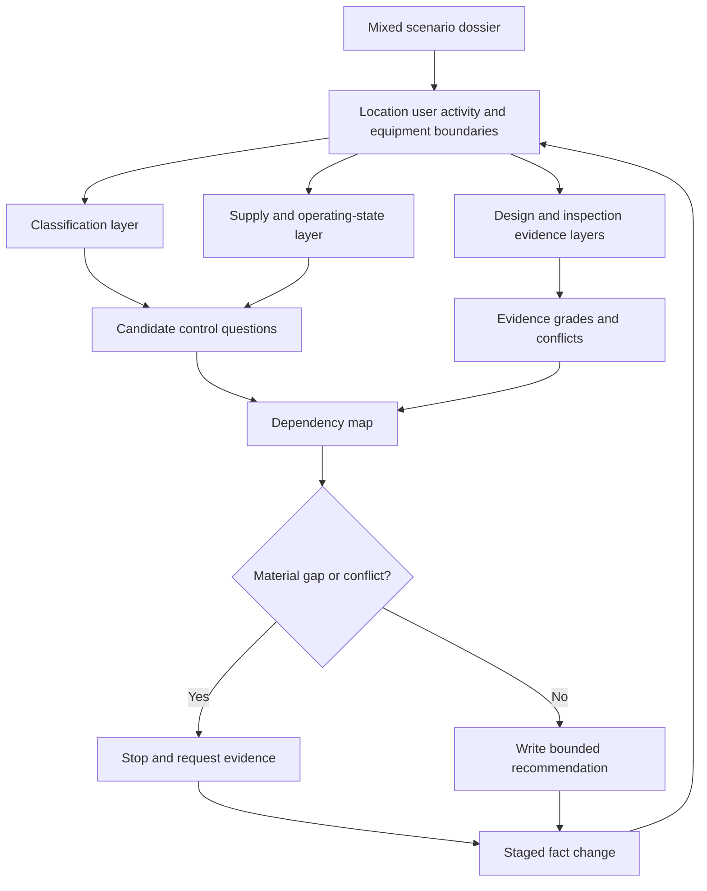

# Day 55 — Mixed Special-Location Scenario Workshop

> **Scope boundary:** This original workshop integrates classification, source, design and inspection reasoning using fictional dossiers. It does not reproduce official classifications, zones, dimensions, values, diagrams, procedures or assessment material. Exact requirements require current authorised sources and qualified review.

## 1. Outcome and entry check

By the end, the learner can:

1. decompose a mixed scenario into distinct location, supply, user and operating boundaries;
2. identify overlapping general and location-specific control questions;
3. integrate **Z-O-N-E-S**, **S-P-E-C-I-A-L** and **S-O-U-R-C-E-S** without collapsing them into one checklist;
4. distinguish design evidence from visual-inspection evidence;
5. create a dependency map showing which conclusions rely on which facts and sources;
6. prioritise material evidence gaps and stop conditions;
7. revise the analysis after a staged change; and
8. present a bounded design-and-inspection recommendation without claiming compliance.

### Entry check

Without notes:

1. What must be classified before selecting a location-specific source?
2. What is the difference between a shared control and a location-specific control?
3. Which source questions must be answered before relying on one isolation boundary?
4. What evidence can a drawing provide that a photograph cannot, and vice versa?
5. Which Week 8 error would be most dangerous if carried into an integrated scenario?

Mark confidence and identify one permitted support from Day 54, if recorded.

## 2. Why it matters

Real assessment scenarios rarely present one clean topic at a time. A location may combine water exposure, public access, environmental stress, alternate supplies, movable equipment, restricted access and incomplete documentation. The learner must preserve each reasoning boundary while connecting consequences across design and inspection tasks.

The integrated model is:

**decompose → classify → map sources and states → identify control questions → separate evidence types → trace dependencies → resolve or stop → revise after change**

## 3. Core concepts and terminology

- **Mixed scenario:** a dossier containing more than one material location, user, environmental, supply or operating condition.
- **Reasoning layer:** one analytical view of the scenario, such as classification, supply state, control family, design evidence or inspection evidence.
- **Overlap:** a point where two or more conditions affect the same equipment, route, control or conclusion.
- **Design evidence:** information used to justify a proposed arrangement, such as a current drawing, schedule, specification, calculation record or manufacturer data.
- **Inspection evidence:** information obtained from the supplied visual or documentary inspection record about what appears to be installed, identified, accessible or damaged.
- **Dependency:** a fact, source or earlier conclusion that another conclusion relies on.
- **Material gap:** missing evidence capable of changing the safety, applicability or acceptability of a conclusion.
- **Conflict:** two supplied sources or observations that cannot both be treated as current and correct without resolution.
- **Bounded recommendation:** a proposed next decision or evidence request limited to the supplied scenario and learner authority.
- **Change propagation:** the process of reopening every dependent conclusion after a material fact changes.

## 4. Rule-finding workflow

Use **L-A-Y-E-R-S**:

1. **L — Locate boundaries:** separate areas, users, activities, equipment, supplies and operating states.
2. **A — Apply classification methods:** use **Z-O-N-E-S** and **S-P-E-C-I-A-L** to identify condition families and applicable source questions.
3. **Y — Yield a source map:** use **S-O-U-R-C-E-S** to identify energy paths and operating states.
4. **E — Examine evidence by type:** separate design, inspection, manufacturer and assumed information.
5. **R — Relate dependencies and conflicts:** show which claims depend on which facts and where evidence disagrees.
6. **S — State, stop and stress-test:** write bounded claims, stop on material gaps and reopen the model after a staged change.

The parallel branches prevent a strong result in one layer from hiding a gap in another. A plausible design concept does not prove the inspected installation matches it, and a photograph does not establish the complete design basis.

## 5. Visual model or worked example

### Complete worked example

A fictional aquatic therapy facility includes a wet treatment room, an outdoor plant area, public circulation space, a battery-backed control system and a generator connection. The dossier contains a proposed drawing, two photographs, an old equipment schedule and a current manufacturer data sheet.

A learner immediately applies wet-area reasoning to the whole site and assumes the generator affects every circuit.

Apply **L-A-Y-E-R-S**:

| Layer | Evidence-led response |
|---|---|
| Locate | Separate treatment room, plant area, public area, control subsystem and generator interface. |
| Apply | Classify each area by actual condition and use; do not transfer one location model across the whole facility. |
| Yield | Map network, generator and battery-backed control states; generator coverage remains unresolved. |
| Examine | Drawing supports proposed design; photographs support limited observations; old schedule has uncertain currency. |
| Relate | Equipment suitability, isolation, identification and verification conclusions depend on area classification and actual source coverage. |
| State | Several condition and source questions are supported, but whole-site compliance and isolation remain unresolved. |

### Worked-example fading

A second scenario combines an agricultural wash area, public access, a transportable unit and photovoltaic generation. The learner receives only the boundary and evidence inventory, then independently creates the classification, source and dependency layers.

## 6. Practical application

Complete an original mixed scenario involving at least:

- two distinct location-condition families;
- one alternate or embedded source;
- one design document;
- one inspection image or observation record;
- one outdated or conflicting source; and
- one staged change.

Produce:

1. a scenario-boundary map;
2. a condition-classification table;
3. a source-and-operating-state map;
4. separate design and inspection evidence ledgers;
5. a list of candidate control questions;
6. a dependency-and-conflict map;
7. three bounded claims and three unresolved claims;
8. a prioritised evidence request list;
9. a change-propagation response; and
10. a two-minute oral summary that states scope, major risk, evidence gap and next safe action.

### Assessment rubric

Score each category from **0 to 2**:

| Category | 0 | 1 | 2 |
|---|---|---|---|
| Decomposition | Treats scenario as one condition | Some boundaries | All material boundaries separated |
| Classification | Labels only or false transfer | Partial method | Conditions and applicability reasoned clearly |
| Source mapping | Single-source assumption | Some sources/states | All supplied sources and states mapped |
| Evidence separation | Evidence types merged | Some distinction | Design, inspection, manufacturer and assumptions separated |
| Dependencies | Conclusions isolated | Some links | Material dependencies and conflicts explicit |
| Safety communication | Compliance or authority implied | General caution | Bounded claims, stop conditions and evidence requests clear |

A score of **10/12 or higher** with no critical error indicates readiness for Day 56. This is an educational threshold only.

## 7. Common errors and safety checkpoint

### Common errors

- applying one location classification to the whole scenario;
- merging design intent with inspection observation;
- assuming all alternate sources supply all loads;
- treating an old schedule as current because it is detailed;
- listing controls without explaining their trigger;
- resolving conflicts by choosing the convenient source;
- failing to rank material evidence gaps; and
- changing one fact without reopening dependent conclusions.

### Critical errors and stop conditions

Any of the following requires remediation:

- inventing official zones, values or requirements;
- claiming compliance from incomplete or conflicting evidence;
- omitting a disclosed source or operating state;
- treating a photograph as proof of hidden construction;
- treating a proposed drawing as proof of installed condition;
- crossing into practical switching, isolation, testing or access instructions; or
- continuing after a material gap prevents safe reasoning.

This module authorises no site classification, design approval, access, switching, isolation, testing, installation, alteration, energisation, commissioning, certification or verification.

## 8. Retrieval and next links

### Closed-note retrieval

1. Expand **L-A-Y-E-R-S**.
2. Define reasoning layer, material gap, dependency and conflict.
3. Why must design and inspection evidence remain separate?
4. How can one location contain several applicability boundaries?
5. What happens when a source-coverage assumption changes?
6. Name four critical errors.

### Changed-scenario transfer

Re-attempt after the battery is revealed to supply only controls and a movable partition changes the use boundary of one area. Rebuild affected layers and dependencies rather than editing only the final recommendation.

- **Plan:** [Twelve-Week Capstone Learning Plan](../MASTER_PLAN.md)
- **Knowledge note:** [[12-Week Day 55 - Mixed Special-Location Scenario Workshop]]
- **Previous:** [Day 54 — Rest, Retrieval and Applicability-Check Repair](day-54-rest-retrieval-and-applicability-check-repair.md)
- **Next:** Day 56 — Week 8 Cumulative Design and Inspection Checkpoint

This module remains `review-required`, `reference_check_required`, safety-critical and not `technically-reviewed`.