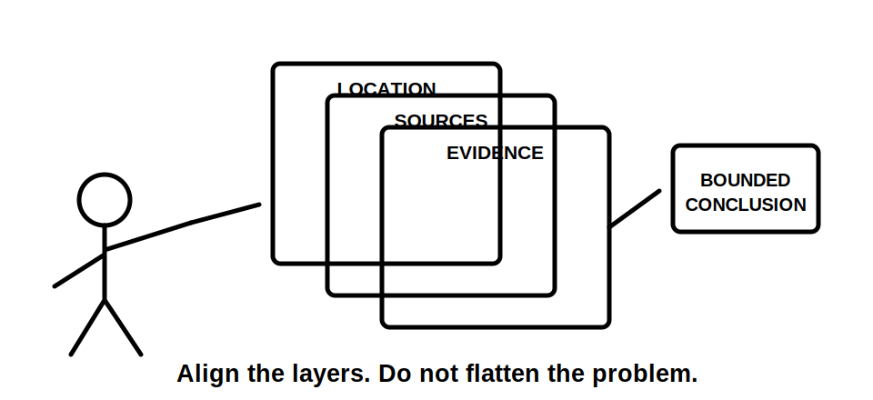
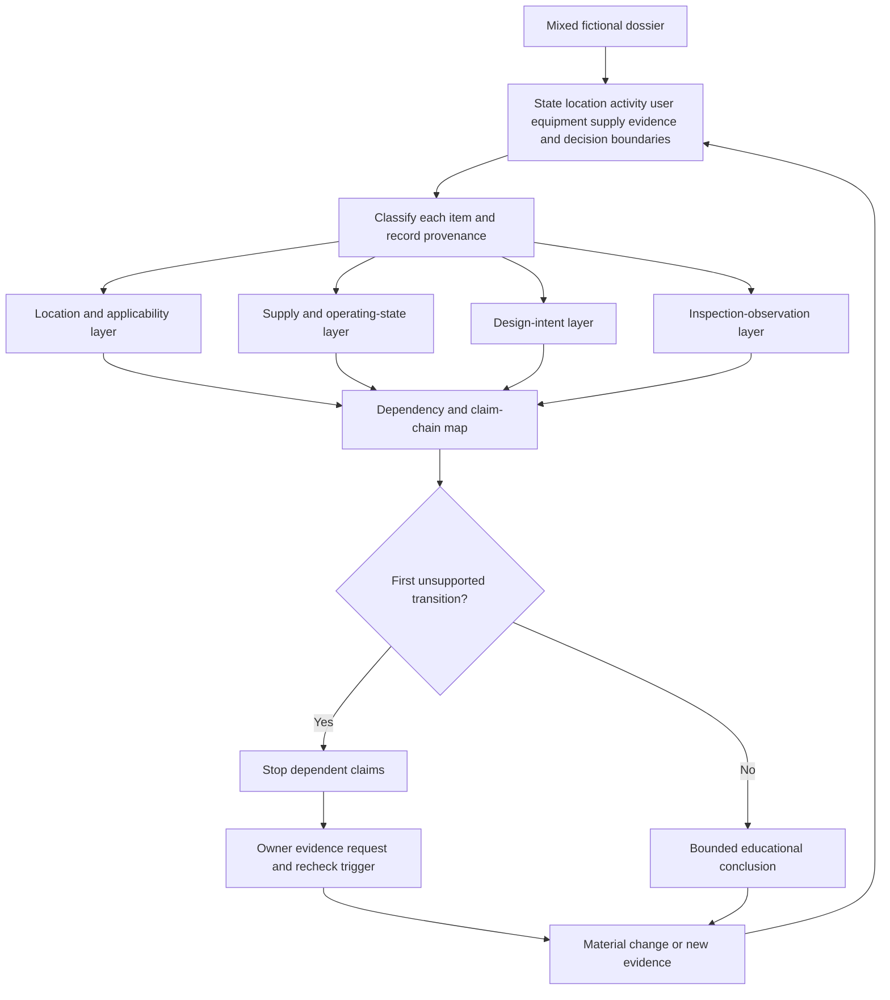
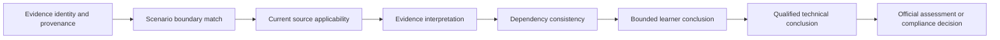

# Day 55 — Mixed Special-Location Scenario Workshop

> **Scope boundary:** This original workshop integrates classification, supply-state, design and inspection reasoning using fictional dossiers. It does not reproduce official classifications, zones, dimensions, values, diagrams, procedures or assessment material. Exact requirements require current authorised sources and qualified review.

## 1. Outcome and entry check

By the end, the learner can:

1. define the location, activity, user, equipment, supply, operating-state, evidence, authority and decision boundaries of a mixed scenario;
2. classify each supplied statement as a **stated fact**, **derived fact**, **supported inference**, **assumption**, **contradiction** or **evidence gap**;
3. keep location applicability, source-state, design-intent and inspection-observation layers separate while showing their dependencies;
4. identify the **first unsupported transition** in each material claim chain and stop dependent conclusions there;
5. compare competing interpretations without resolving them by convenience;
6. assign an evidence owner and recheck trigger to every unresolved blocker;
7. rebuild affected reasoning after two material scenario changes; and
8. communicate criterion-level readiness without claiming compliance, competency or technical approval.

### Entry check

Without notes:

1. What must be classified before selecting a location-specific source?
2. What is the difference between a shared control question and a location-specific control question?
3. Which source questions must be answered before relying on one isolation boundary?
4. What evidence can a drawing provide that a photograph cannot, and vice versa?
5. What is the first unsupported transition in a claim chain?
6. Why is confidence recorded separately from correctness?

For each answer, mark confidence as **guessing**, **unsure**, **reasonably confident** or **certain**. A high-confidence error is a priority misconception, not evidence of readiness.

## 2. Why it matters

Integrated scenarios fail when a learner compresses several distinct questions into one plausible narrative. A wet location can also contain public access, outdoor equipment, a battery-backed control supply, a generator interface, old documents and visual evidence that does not show concealed construction. Strength in one layer cannot compensate for a material gap in another.

The disciplined sequence is:

**bound the scenario → classify evidence → build separate reasoning layers → trace dependencies → stop at the first unsupported transition → request evidence → stress-test after change**

*The learner aligns location, source and evidence layers before forming a conclusion; no single layer is treated as proof of the others.*

## 3. Core concepts and terminology

- **Mixed scenario:** a dossier containing more than one material location, user, environmental, supply or operating condition.
- **Boundary:** the explicit limit of what is included in a reasoning task. Relevant boundaries include location, activity, user, equipment, supply, operating state, evidence, authority and decision.
- **Reasoning layer:** one analytical view of the scenario, such as location applicability, supply state, design intent or inspection observation.
- **Overlap:** a point where two or more conditions affect the same equipment, route, control question or conclusion.
- **Design intent:** what a current approved design document proposes. It is not proof of installed condition.
- **Inspection observation:** what supplied visual or documentary inspection evidence appears to show. It is not proof of hidden construction or complete compliance.
- **Provenance:** the source, date or revision, author or issuer and scenario connection of evidence.
- **Stated fact:** information explicitly supplied by the dossier.
- **Derived fact:** information obtained directly from supplied facts through a transparent, non-controversial step.
- **Supported inference:** a conclusion reasonably supported by evidence but not directly stated.
- **Assumption:** an unverified proposition used temporarily and labelled as such.
- **Contradiction:** two sources or observations that cannot both be treated as current and correct without resolution.
- **Evidence gap:** missing information needed to support a material transition.
- **Dependency:** a fact, source or earlier conclusion that another conclusion relies on.
- **Claim chain:** an ordered sequence from evidence identity through applicability and interpretation to a bounded conclusion.
- **First unsupported transition:** the earliest step in a claim chain that lacks adequate evidence. All dependent conclusions remain unsupported.
- **Competing interpretations:** two or more plausible readings retained until evidence resolves them.
- **Material gap:** missing evidence capable of changing safety, applicability, source treatment or acceptability reasoning.
- **Evidence owner:** the authorised source, person or qualified reviewer responsible for resolving a gap.
- **Recheck trigger:** new evidence or a scenario change that requires a conclusion and its dependencies to be reopened.
- **Material change:** a change capable of altering classification, source coverage, control questions, equipment suitability, isolation reasoning or acceptance.
- **Bounded recommendation:** a proposed next decision or evidence request limited to the supplied scenario and learner authority.

## 4. Rule-finding workflow

Use **L-A-Y-E-R-S**:

1. **L — Locate and state boundaries:** separate areas, activities, users, equipment, supplies, operating states, evidence scope, learner authority and the decision being attempted.
2. **A — Audit evidence and applicability:** classify every item, record provenance, identify contradictions and confirm which current authorised source family must be consulted.
3. **Y — Yield separate maps:** build distinct location/applicability, source/state, design-intent and inspection-observation layers.
4. **E — Expose dependencies:** connect each claim to its evidence and identify the first unsupported transition.
5. **R — Retain alternatives and resolve responsibly:** preserve competing interpretations, rank material gaps and assign evidence owners and recheck triggers.
6. **S — State bounded outcomes and stress-test:** use criterion-level states, stop on blockers and rebuild affected layers after two material changes.

The four layers are deliberately parallel. A plausible design cannot prove what is installed, and a photograph cannot establish source coverage, concealed construction or full applicability.

### Claim ladder

The learner may proceed only as far as the evidence supports. The final two transitions require qualified review or official authority and are outside this module.

## 5. Visual model or worked example

### Fictional dossier

An aquatic therapy facility contains:

- a wet treatment room with a movable privacy screen;
- an outdoor plant area exposed to wash-down and weather;
- a public circulation area beside movable treatment equipment;
- a battery-backed control panel;
- a generator inlet and automatic-transfer label;
- a proposed drawing revised six months ago;
- an older equipment schedule marked “for review”;
- two undated photographs;
- a current manufacturer data sheet for one item; and
- a maintenance note reporting that one control remained active during a previous supply interruption.

The records conflict about generator coverage. One photograph appears to show equipment in a different position from the proposed drawing. The privacy screen dimensions and mobility are not established. The control panel’s source boundary is not shown completely.

### Evidence-led application of L-A-Y-E-R-S

| Stage | Evidence-led response |
|---|---|
| Locate | Separate treatment room, plant area, circulation area, movable equipment, control subsystem and generator interface. State that the task is documentary reasoning only. |
| Audit | Treat the current data sheet as product evidence for the identified item only; mark the old schedule’s currency unresolved; record photograph dates as gaps; retain the generator records as contradictory. |
| Yield | Build four separate layers. Do not transfer wet-area reasoning across the whole facility or assume all loads share one source state. |
| Expose | Equipment-placement claims depend on actual position and location classification. Isolation claims depend on complete source and control coverage. Inspection claims do not prove concealed construction. |
| Retain | Keep at least two generator-coverage interpretations open. Assign the current approved single-line diagram to the design owner and source-state confirmation to a qualified reviewer. |
| State | Location and source questions can be prioritised, but whole-site suitability, isolation and acceptance remain unsupported. |

### First unsupported transitions

| Claim | Supported path | First unsupported transition | Required action |
|---|---|---|---|
| “The generator supplies the treatment-room equipment.” | Generator inlet and transfer label are stated facts. | Label existence → actual circuit coverage. | Obtain current approved source-distribution evidence. |
| “The photographed equipment is in the intended location.” | Photograph and proposed drawing exist. | Apparent visual match → current installed position and design approval. | Establish photograph date, equipment identity and current approved drawing. |
| “One isolation action makes the controls safe.” | A control panel and battery support are disclosed. | Main supply state → all control-energy paths absent. | Map every control source and operating state through qualified evidence. |

### Worked-example fading

For a second fictional dossier combining an agricultural wash area, public access, a transportable unit and photovoltaic generation, only the boundary inventory and evidence list are supplied. The learner independently creates all four layers, claim chains, evidence requests and criterion-level states.

## 6. Practical application

Complete one original mixed dossier containing:

- at least two distinct location-condition families;
- one alternate or embedded source;
- one design document;
- one inspection image or observation record;
- one outdated or conflicting source;
- one hidden or separately supplied control path;
- one ambiguous equipment identity or position; and
- two staged material changes.

Produce:

1. a boundary statement;
2. an evidence ledger with provenance, evidence state and confidence;
3. separate location/applicability, source/state, design-intent and inspection-observation maps;
4. a candidate control-question list linked to current authorised source families;
5. a dependency map with at least five claim chains;
6. the first unsupported transition for every unresolved material claim;
7. competing interpretations for each contradiction;
8. a prioritised evidence request list with owner and recheck trigger;
9. three bounded supported claims and three explicitly unsupported claims;
10. two change-propagation responses; and
11. a two-minute oral summary stating scope, material risk, first blocker and next safe evidence action.

### Two-change transfer

Apply both changes in order:

1. the battery is confirmed to supply controls only, while generator coverage remains contradictory; and
2. the movable privacy screen is removed and the photographed equipment is confirmed to have been relocated after the proposed drawing.

After each change, reopen every dependent boundary, classification, source-state, equipment-position, isolation and acceptance claim. Editing only the final recommendation is not transfer.

### Criterion-level readiness

Assess each criterion independently:

| Criterion | Secure | Developing | Unsupported or `stop-required` |
|---|---|---|---|
| Boundary control | All material boundaries explicit and maintained | Minor boundary omissions do not alter current reasoning | A material area, source, user, activity, equipment or authority boundary is omitted |
| Evidence discipline | Evidence states, provenance and confidence are separate and consistent | Some provenance or confidence records need correction | Assumption is presented as fact, contradiction hidden or evidence type collapsed |
| Layer separation | Four layers remain distinct and linked | One layer needs clearer separation | Design intent is treated as installed proof or inspection evidence as complete design proof |
| Dependency control | Claim chains and first unsupported transitions are explicit | Some dependencies need clearer links | Reasoning continues beyond a material unsupported transition |
| Resolution planning | Owners, evidence requests and recheck triggers are specific | Requests are relevant but insufficiently owned or triggered | A blocker has no owner, request or recheck condition |
| Change transfer | Both material changes reopen all affected dependencies | One affected dependency is missed and corrected | Changes are handled cosmetically or only at the final conclusion |
| Safety communication | Conclusions are bounded and authority limits explicit | Wording needs tightening | Compliance, competency, practical authority or technical approval is implied |

These are educational planning states only. They are not official grades, competency decisions, defect classifications, compliance decisions or technical approvals.

## 7. Common errors and safety checkpoint

### Common errors

- applying one location classification to the whole scenario;
- merging design intent with inspection observation;
- assuming all alternate sources supply all loads;
- treating an old detailed schedule as current;
- omitting a separately supplied or battery-backed control path;
- listing controls without explaining their trigger and evidence basis;
- resolving conflicts by choosing the convenient source;
- recording certainty without evidence quality;
- failing to identify the first unsupported transition;
- leaving evidence gaps without owners or recheck triggers; and
- changing one fact without reopening dependent conclusions.

### Blocking conditions

Any one of the following blocks progression regardless of stronger work elsewhere:

- inventing official zones, dimensions, values, requirements or assessment criteria;
- claiming compliance or safe isolation from incomplete or conflicting evidence;
- omitting a disclosed source, operating state or material location condition;
- treating a photograph as proof of hidden construction;
- treating a proposed drawing as proof of installed condition;
- presenting an assumption or supported inference as a stated fact;
- continuing beyond the first unsupported transition;
- suppressing a plausible competing interpretation without evidence;
- failing to assign ownership for an unresolved safety-critical gap;
- using a staged change only to edit wording rather than reopen dependencies; or
- crossing into practical access, switching, isolation, testing or installation instruction.

### Safety checkpoint

This module authorises no site classification, design approval, access, opening, switching, isolation, proving de-energised, testing, measurement, installation, alteration, repair, energisation, commissioning, certification or field verification.

Exact classifications, zone definitions, dimensions, source arrangements, switching and isolation requirements, equipment restrictions, protection requirements and official assessment expectations require current authorised sources and qualified review.

## 8. Retrieval and next links

### Closed-note retrieval

1. Expand **L-A-Y-E-R-S**.
2. Name the nine boundaries used in this module.
3. Define the six evidence states.
4. What is the first unsupported transition?
5. Why must design intent and inspection observation remain separate?
6. What is an evidence owner?
7. What is a recheck trigger?
8. Name four blocking conditions.

### Delayed retrieval

After 24–48 hours, redraw the four-layer workflow and one claim ladder from memory. Then explain how each of the two material changes reopens different dependencies.

- **Plan:** [Twelve-Week Capstone Learning Plan](../MASTER_PLAN.md)
- **Knowledge note:** [[12-Week Day 55 - Mixed Special-Location Scenario Workshop]]
- **Previous:** [Day 54 — Rest, Retrieval and Applicability-Check Repair](day-54-rest-retrieval-and-applicability-check-repair.md)
- **Next:** [Day 56 — Week 8 Cumulative Design and Inspection Checkpoint](day-56-week-8-cumulative-design-and-inspection-checkpoint.md)

This module remains `review-required`, `reference_check_required`, safety-critical and not `technically-reviewed`.
