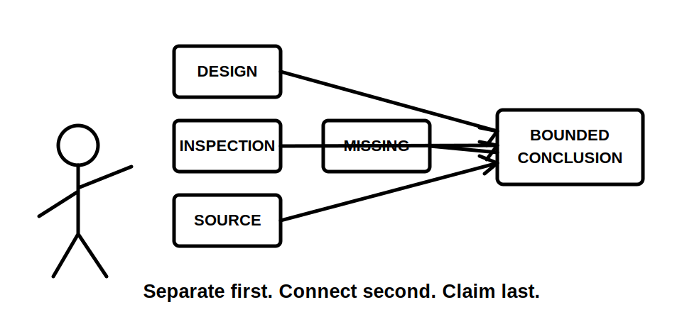
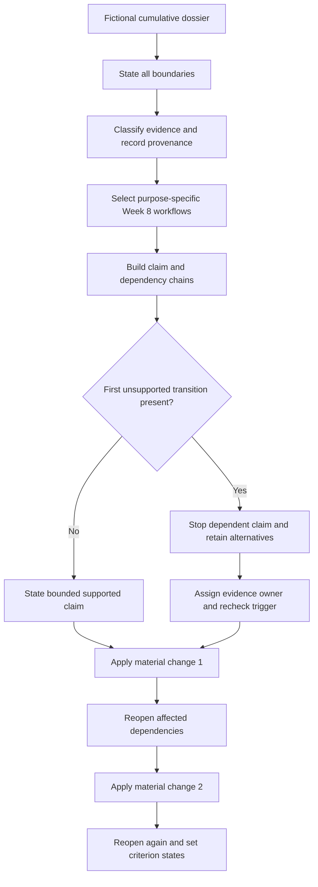
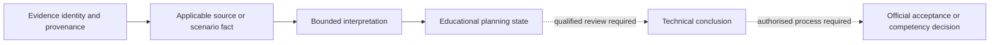

# Day 56 — Week 8 Cumulative Design and Inspection Checkpoint

> **Scope boundary:** This original checkpoint assesses evidence-controlled reasoning from fictional documents only. It does not reproduce official zones, dimensions, values, procedures or assessment material. Exact requirements require current authorised sources and qualified review.

## 1. Outcome and entry check

By the end, the learner can:

1. state the location, activity, user, equipment, supply, operating-state, evidence, authority and decision boundaries for a cumulative dossier;
2. classify each material item as a stated fact, derived fact, supported inference, assumption, contradiction or evidence gap;
3. apply **Z-O-N-E-S**, **S-P-E-C-I-A-L**, **S-O-U-R-C-E-S** and **L-A-Y-E-R-S** only to the questions they are designed to answer;
4. separate proposed-design evidence from observed-installation evidence and record provenance for both;
5. trace each material conclusion to its first unsupported transition and stop dependent reasoning there;
6. retain competing interpretations where evidence conflicts, then assign an evidence owner and recheck trigger;
7. reopen affected dependencies after two sequential material changes; and
8. communicate criterion-level readiness without implying compliance, competency, technical approval or practical authority.

### Entry check

Without notes, expand the four Week 8 workflows and state one misuse each prevents. For every answer, record confidence as **guessing**, **unsure**, **reasonably confident** or **certain** before checking prior work. Confidence is not evidence quality and is not a readiness grade.

## 2. Why it matters

Integrated tasks fail when a learner produces one polished conclusion from mixed evidence. A detailed drawing may be obsolete, a photograph may not reveal hidden construction, an equipment schedule may describe a proposal rather than the installed condition, and an alternate supply may cover only part of the installation.

The checkpoint therefore assesses whether the learner can keep evidence, reasoning layers and authority limits visible while several topics interact. The objective is not to reach an answer at any cost. It is to know which conclusions are supported, which remain open and where reasoning must stop.

*Instructional caption: separate evidence by type and provenance before connecting only the claims that share adequate support.*

## 3. Core concepts and terminology

- **Cumulative dossier:** a fictional evidence set requiring several earlier methods to be coordinated.
- **Boundary:** an explicit limit on location, activity, user group, equipment, supply, operating state, evidence set, authority or decision scope.
- **Provenance:** the source, issuer, date or revision and scenario connection of an evidence item.
- **Stated fact:** information explicitly supplied by the fictional dossier.
- **Derived fact:** information obtained transparently from stated facts without adding an unverified premise.
- **Supported inference:** a bounded interpretation supported by identified evidence but not directly stated.
- **Assumption:** an unverified proposition introduced to continue reasoning.
- **Contradiction:** two evidence items or claims that cannot both be accepted as current and correct without resolution.
- **Evidence gap:** missing information required before a material claim can be supported.
- **Dependency chain:** the ordered evidence and reasoning steps supporting a later conclusion.
- **First unsupported transition:** the earliest step in a dependency chain that lacks adequate evidence or source applicability.
- **Competing interpretations:** plausible alternatives kept visible until better evidence resolves them.
- **Evidence owner:** the authorised document, person, manufacturer, network party, regulator, RTO or qualified reviewer responsible for resolving a gap.
- **Recheck trigger:** new evidence or a changed condition requiring dependent reasoning to be reopened.
- **Blocking condition:** an error serious enough to prevent progression regardless of stronger performance elsewhere.
- **Criterion-level state:** an educational planning label applied independently to one capability: **secure**, **developing**, **unsupported** or `stop-required`.

These states are not official grades, competency decisions, defect categories, compliance findings or technical approvals.

## 4. Rule-finding workflow

Use **C-H-E-C-K-S**:

1. **C — Construct boundaries:** state all material locations, activities, users, equipment, supplies, operating states, evidence limits, authority limits and requested decisions.
2. **H — Hold evidence apart:** classify evidence state, record provenance and keep design intent, inspection observation, manufacturer information, official sources and assumptions distinct.
3. **E — Engage the right workflow:** use each Week 8 method only for its purpose and record which question it answers.
4. **C — Connect dependencies:** build claim chains and mark the first unsupported transition in each material chain.
5. **K — Keep alternatives and ownership visible:** retain competing interpretations, identify evidence owners and define recheck triggers.
6. **S — Stress-test, state and remediate:** apply two sequential changes, reopen affected dependencies, state bounded outcomes and nominate one precise remediation action.

The diagram shows that change handling occurs after evidence control, not by editing only the final sentence. An unresolved transition remains unresolved until the identified evidence action is completed.

The second diagram separates what this checkpoint can assess from decisions that belong to qualified reviewers or authorised assessment and acceptance processes.

## 5. Visual model or worked example

### Fictional checkpoint dossier

A community facility contains a wet treatment room, an outdoor equipment area and a public corridor. The supplied material includes:

- a proposed drawing showing network supply, photovoltaic generation and battery support;
- a later drawing omitting the battery boundary;
- an undated photograph of a labelled enclosure;
- an appliance schedule whose identifier differs from the photograph label;
- a movable partition whose recorded position conflicts with a room sketch;
- a manufacturer extract for one product family, but no confirmed model identity; and
- a maintenance note indicating a control circuit can remain supplied when the associated power circuit is unavailable.

A disciplined response uses an evidence ledger before drawing conclusions:

| Evidence item | State and provenance question | Bounded treatment |
|---|---|---|
| Proposed supply drawing | Is the revision current and does it describe installed work? | Design intent only until currency and installation correspondence are supported. |
| Undated enclosure photograph | When and where was it taken, and what can be seen directly? | Supports visible features only; it does not prove hidden connections or current condition. |
| Conflicting appliance identifiers | Can the schedule and photographed item refer to the same equipment? | Retain competing identities and request authoritative identification. |
| Movable partition records | Which position applies to the requested operating state? | Reopen location and equipment reasoning for each supported position. |
| Control-circuit maintenance note | What source and boundary does the note actually cover? | Add a separate candidate supply path; do not infer complete source coverage. |

### First unsupported transition examples

1. **Photograph → label visible → equipment model confirmed → suitability accepted.** The transition from visible label to confirmed model is unsupported when the label is incomplete or mismatched. Stop model-dependent suitability claims.
2. **Drawing shows battery → battery supplies facility → main isolation removes every source.** The transition from a drawn battery to complete coverage and isolation behaviour is unsupported. Map operating states and request current source documentation.
3. **Partition shown closed → room boundary fixed → location controls resolved.** The transition from one sketch position to a fixed boundary is unsupported when the partition is movable. Evaluate each supported position separately.

### Worked-example fading

For a second fictional dossier, only the evidence list and requested decisions are supplied. Independently produce the boundary map, evidence classifications, workflow selection, dependency chains, first unsupported transitions, evidence owners and two-change response. Compare reasoning structure, not wording.

## 6. Practical application

Complete a bounded 75-minute checkpoint response containing:

1. a boundary register;
2. an evidence ledger with provenance and confidence recorded separately;
3. purpose-specific workflow selection with reasons;
4. separate location, source-state, design-intent and inspection-observation maps;
5. at least three material dependency chains;
6. the first unsupported transition for every incomplete chain;
7. supported claims, unresolved claims and prohibited claims kept separate;
8. competing interpretations, evidence owners and recheck triggers;
9. responses to two sequential material changes; and
10. one precise remediation action for the weakest criterion.

### Criterion-level readiness record

Assess each criterion independently:

| Criterion | Secure | Developing | Unsupported | `stop-required` |
|---|---|---|---|---|
| Boundary control | All material boundaries are explicit and used consistently. | Minor boundary detail needs clarification without changing the reasoning structure. | A material boundary lacks evidence or is not carried through. | A disclosed source, operating state, user or authority boundary is omitted. |
| Evidence discipline | States and provenance are recorded; intent, observation and assumption remain distinct. | Classification is mostly sound but one non-blocking item needs repair. | A material item lacks provenance or is treated more strongly than evidence permits. | Design intent is presented as installed fact, hidden construction is inferred from appearance, or contradiction is concealed. |
| Workflow selection | Each method answers a defined question and methods remain purpose-specific. | Selection is broadly correct but one purpose boundary is blurred. | A method is applied without supported applicability. | Official requirements, values or procedures are invented. |
| Dependency control | Claim chains identify all material transitions and stop at the first unsupported step. | Chains are present but one downstream reopening is incomplete. | A material dependency is missing or weakly traced. | Reasoning continues beyond a known material gap. |
| Resolution planning | Competing interpretations, owners and recheck triggers are precise. | Resolution action is plausible but ownership or trigger needs refinement. | A blocker is listed without a workable evidence action. | An unresolved blocker is ignored or replaced by an assumption. |
| Two-change transfer | Each change reopens all affected chains and updates bounded claims. | Most affected chains reopen; one non-critical dependency is missed. | Changes lead mainly to answer editing rather than structural reconsideration. | A material change is ignored or the original conclusion is preserved without re-analysis. |
| Safety and authority communication | Educational, qualified technical and official decisions remain distinct. | Caution is present but one statement is too broad. | Authority or acceptance wording is ambiguous. | Compliance, competency, certification, safe-operation or practical authority is claimed. |

Progression to Week 9 is appropriate only when no criterion is `stop-required`, all blocking conditions are resolved or explicitly transferred to an evidence owner, and the learner has a specific remediation plan for every unsupported criterion. This is curriculum guidance, not an official assessment threshold.

## 7. Common errors and safety checkpoint

### Common errors

- using every workflow on every question;
- treating document detail as proof of currency or applicability;
- merging proposed design with observed installation;
- recording confidence as though it were evidence strength;
- selecting one interpretation and hiding a contradiction;
- changing only the final conclusion after new evidence;
- assigning a vague owner such as “someone on site”; and
- choosing remediation based on comfort rather than demonstrated error.

### Blocking conditions and stop rules

Stop and remediate when the response:

- invents official classifications, dimensions, values, procedures or pass criteria;
- claims compliance, certification, competency, safe operation or design acceptance;
- omits a disclosed source, operating state, material boundary or contradiction;
- treats photographs as proof of hidden construction;
- treats design documents as proof of installed condition;
- continues beyond the first unsupported transition;
- leaves a material blocker without an evidence owner and recheck trigger;
- handles staged changes cosmetically rather than reopening dependencies; or
- crosses into practical access, opening, switching, isolation, proving de-energised, testing, measurement or installation instructions.

Strong work in another criterion cannot offset a blocking condition.

This module authorises no site classification, design approval, access, opening, switching, isolation, proving de-energised, testing, measurement, installation, alteration, repair, energisation, commissioning, certification or field verification.

## 8. Retrieval and next links

### Closed-note retrieval

1. Expand **C-H-E-C-K-S**.
2. Define provenance, first unsupported transition, competing interpretations and recheck trigger.
3. Name the six evidence states.
4. Explain why confidence is recorded separately from evidence quality.
5. Give one example of a claim chain that must stop.
6. State three blocking conditions.
7. Explain what two-change transfer must demonstrate.
8. Distinguish an educational planning state from a qualified technical or official decision.

### Delayed retrieval

After 24–48 hours, redraw both diagrams and reconstruct one dependency chain from a new fictional scenario without reopening the module.

- **Plan:** [Twelve-Week Capstone Learning Plan](../MASTER_PLAN.md)
- **Knowledge note:** [[12-Week Day 56 - Week 8 Cumulative Design and Inspection Checkpoint]]
- **Previous:** [Day 55 — Mixed Special-Location Scenario Workshop](day-55-mixed-special-location-scenario-workshop.md)
- **Next:** [Day 57 — Verification Purpose, Evidence Types and Responsibility Boundaries](day-57-verification-purpose-evidence-types-and-responsibility-boundaries.md)

This module remains `review-required`, `reference_check_required`, safety-critical and not `technically-reviewed`.
