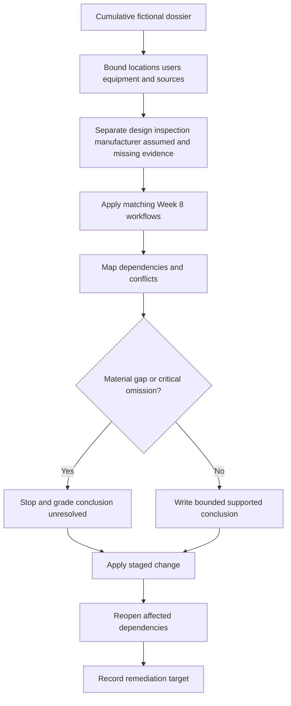

# Day 56 — Week 8 Cumulative Design and Inspection Checkpoint

> **Scope boundary:** This original checkpoint assesses reasoning from fictional documents only. It does not reproduce official zones, dimensions, values, procedures or assessment material. Exact requirements require current authorised sources and qualified review.

## 1. Outcome and entry check

By the end, the learner can:

1. decompose a cumulative scenario into location, source, equipment, user and operating-state boundaries;
2. select and apply the relevant Week 8 workflows without merging their purposes;
3. separate proposed-design evidence from observed-installation evidence;
4. trace dependencies between classification, source coverage, equipment suitability, protection, isolation and inspection conclusions;
5. rank evidence gaps by consequence and decision impact;
6. revise conclusions after two staged changes;
7. communicate supported, unresolved and prohibited claims clearly; and
8. identify the remediation needed before beginning verification study.

### Entry check

Without notes, explain the purpose of **Z-O-N-E-S**, **S-P-E-C-I-A-L**, **S-O-U-R-C-E-S** and **L-A-Y-E-R-S**. For each, state one error it prevents. Mark confidence before checking prior work.

## 2. Why it matters

Capstone performance depends on maintaining boundaries when several technical topics appear together. A learner may know each topic separately yet fail by applying the wrong model, assuming source coverage, treating design intent as installed fact or continuing after a material evidence gap.

The checkpoint model is:

**frame → separate → apply → connect → grade → decide → change → repair**

## 3. Core concepts and terminology

- **Cumulative scenario:** a task requiring concepts from several earlier modules to be coordinated.
- **Decision boundary:** the point beyond which available evidence no longer supports a conclusion.
- **Evidence conflict:** two sources or observations that cannot both be accepted as current and correct without resolution.
- **Dependency chain:** the sequence of facts and conclusions on which a later decision relies.
- **Critical omission:** a missing source, condition or operating state capable of invalidating the analysis.
- **Claim grade:** a label showing whether a statement is observed, documented, supported, unresolved or prohibited.
- **Prohibited claim:** a conclusion outside the evidence or learner authority, including compliance, certification or safe-to-operate declarations.
- **Remediation target:** a specific knowledge, process or evidence-handling weakness requiring correction.

## 4. Rule-finding workflow

Use **C-H-E-C-K-S**:

1. **C — Construct boundaries:** identify locations, users, equipment, supplies and operating states.
2. **H — Hold evidence apart:** separate design documents, inspection observations, manufacturer information, assumptions and missing evidence.
3. **E — Engage the right workflow:** apply the Week 8 method that matches each question.
4. **C — Connect dependencies:** map which conclusions rely on classification, source coverage and evidence currency.
5. **K — Keep claim grades visible:** label every conclusion and stop where evidence is material but missing.
6. **S — Stress-test and set remediation:** apply staged changes, reopen dependencies and identify the next repair.

The decision gate prevents a polished answer from concealing an unsupported assumption. The staged change tests whether the learner understands the reasoning structure rather than memorising the first result.

## 5. Visual model or worked example

### Checkpoint dossier

A fictional community facility contains a wet treatment room, an outdoor equipment area and a public corridor. Network supply, photovoltaic generation and battery-backed controls are shown across an incomplete drawing set. A proposed appliance schedule conflicts with a photograph label, and one partition is movable.

A strong response:

| Checkpoint task | Required evidence-led action |
|---|---|
| Boundaries | Separate each area, user group, equipment set, source and operating state. |
| Evidence | Keep proposed drawings, photographs, schedules and manufacturer data distinct. |
| Workflows | Apply classification, special-condition, source-state and layered-integration methods only where relevant. |
| Dependencies | Link suitability, protection, isolation and inspection claims to their required facts. |
| Claim grades | State what is supported and what remains unresolved. |
| Change 1 | Reopen affected conclusions when the battery is revealed to supply only controls. |
| Change 2 | Reopen area and equipment conclusions when the partition position changes. |

### Worked-example fading

A second dossier identifies the areas and sources but does not provide the evidence ledger, workflow selection or dependency map. Complete those independently, then compare the reasoning sequence rather than wording.

## 6. Practical application

Produce a timed 75-minute response containing:

1. a boundary map;
2. an evidence ledger;
3. workflow selection with reasons;
4. a source-and-operating-state map;
5. a dependency diagram;
6. three supported and three unresolved claims;
7. prioritised evidence requests;
8. responses to two staged changes; and
9. a remediation statement for the weakest domain.

### Assessment rubric

Score each category from **0 to 2**:

| Category | 0 | 1 | 2 |
|---|---|---|---|
| Boundary control | Material boundaries omitted | Partial separation | All material boundaries explicit |
| Workflow selection | Wrong or merged methods | Mostly appropriate | Each method matched and justified |
| Evidence discipline | Intent and observation merged | Some grading | Evidence types and conflicts controlled |
| Dependency reasoning | Conclusions isolated | Some dependencies | Material chains and reopening explicit |
| Change response | Final answer merely edited | Partial reopening | Every affected dependency reconsidered |
| Safety communication | Compliance or authority implied | General caution | Bounded claims, stops and requests precise |

A score of **10/12 or higher** with no critical error indicates readiness for Week 9. This is an educational threshold, not an official assessment rule.

## 7. Common errors and safety checkpoint

### Common errors

- using every workflow on every question;
- treating a detailed document as current without evidence;
- overlooking one source or operating state;
- merging proposed design with observed installation;
- writing controls without identifying their trigger;
- changing only the final sentence after a staged change; and
- selecting remediation based on comfort rather than demonstrated error.

### Critical errors and stop conditions

Stop and remediate if the response:

- invents official classifications, dimensions, values or procedures;
- claims compliance, certification or safe operation;
- omits a disclosed source or material condition;
- treats photographs as proof of hidden construction;
- treats design documents as proof of installed condition;
- crosses into practical access, switching, isolation or testing instructions; or
- continues beyond a material evidence gap.

This module authorises no site classification, design approval, access, switching, isolation, testing, installation, alteration, energisation, commissioning, certification or verification.

## 8. Retrieval and next links

### Closed-note retrieval

1. Expand **C-H-E-C-K-S**.
2. Define decision boundary, dependency chain and prohibited claim.
3. Why must workflows remain purpose-specific?
4. What requires a conclusion to be reopened?
5. Name four critical errors.
6. What evidence demonstrates readiness for Week 9?

### Delayed retrieval

After 24–48 hours, redraw the workflow and explain one staged-change response without reopening the module.

- **Plan:** [Twelve-Week Capstone Learning Plan](../MASTER_PLAN.md)
- **Knowledge note:** [[12-Week Day 56 - Week 8 Cumulative Design and Inspection Checkpoint]]
- **Previous:** [Day 55 — Mixed Special-Location Scenario Workshop](day-55-mixed-special-location-scenario-workshop.md)
- **Next:** Day 57 — Verification Purpose, Evidence Types and Responsibility Boundaries

This module remains `review-required`, `reference_check_required`, safety-critical and not `technically-reviewed`.