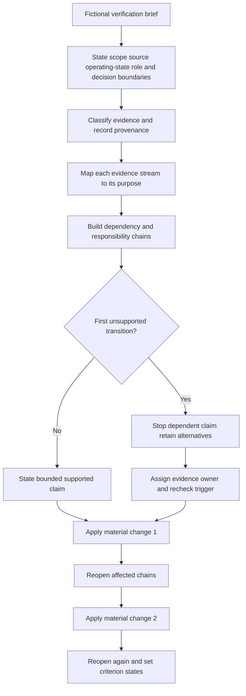
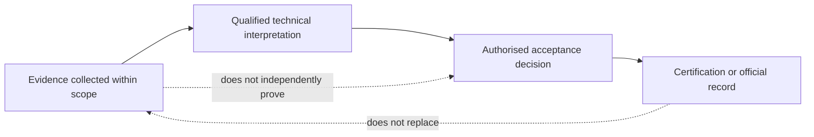

# Day 57 — Verification Purpose, Evidence Types and Responsibility Boundaries

> **Scope boundary:** This original module teaches evidence-controlled verification planning from fictional documents. It provides no test procedure, acceptance value, compliance conclusion or authority to perform electrical work. Exact requirements require current authorised sources and qualified supervision.

## 1. Outcome and entry check

By the end, the learner can:

1. state the work, installation, source, operating-state, evidence, role, authority and decision boundaries for a fictional verification brief;
2. distinguish design review, visual inspection, testing, documentation and certification by purpose, provenance and limitation;
3. classify material statements as stated facts, derived facts, supported inferences, assumptions, contradictions or evidence gaps;
4. separate evidence collection, technical interpretation, formal acceptance and certification responsibilities;
5. build dependency chains and stop each chain at its first unsupported transition;
6. retain competing interpretations, assign an evidence owner and define a recheck trigger;
7. reopen affected reasoning after two sequential material changes; and
8. communicate criterion-level readiness without implying compliance, competency, safe condition, technical approval or practical authority.

### Entry check

Without notes, explain why a correct-looking installation, one plausible test result and a completed form cannot independently establish whole-scope acceptance. Record confidence for each answer as **guessing**, **unsure**, **reasonably confident** or **certain** before checking prior modules. Confidence is not evidence quality.

## 2. Why it matters

Verification can fail before any instrument is used. An unclear scope, obsolete drawing, unidentified source, missing inspection record, unsuitable authority or result without provenance can make a later conclusion unsupported even when the result itself appears plausible.

Verification is therefore not “do tests and fill in a form.” It is a controlled relationship between boundaries, prerequisite evidence, purpose-specific evidence streams, dependencies, qualified interpretation, authorised decisions and traceable records.

*Instructional caption: one evidence item may support one claim, but it cannot replace missing scope, provenance, prerequisites or authority.*

## 3. Core concepts and terminology

- **Verification:** a structured process for gathering and evaluating applicable evidence about defined work against authorised requirements.
- **Verification scope:** the installation, alteration, repair or portion being considered, including explicit inclusions, exclusions and interfaces.
- **Evidence stream:** a category of evidence serving a distinct purpose, such as design, visual-inspection, test or documentary evidence.
- **Design evidence:** drawings, calculations, schedules, specifications and source decisions describing intended arrangement.
- **Visual-inspection evidence:** observations about accessible identity, condition, selection and apparent installation features.
- **Test evidence:** a result produced through an authorised test using suitable equipment, a controlled method and recorded conditions.
- **Documentary evidence:** records identifying provenance, scope, revisions, instruments, limitations, changes and responsible parties.
- **Certification evidence:** an authorised record of a formal decision; it does not replace the evidence required to support that decision.
- **Provenance:** the source, issuer, date or revision, scope and scenario connection of an evidence item.
- **Stated fact:** information explicitly supplied by the fictional dossier.
- **Derived fact:** information obtained transparently from stated facts without adding an unverified premise.
- **Supported inference:** a bounded interpretation supported by identified evidence but not directly stated.
- **Assumption:** an unverified proposition introduced to continue reasoning.
- **Contradiction:** evidence items or claims that cannot both be treated as current and correct without resolution.
- **Evidence gap:** missing information required before a material claim can be supported.
- **Dependency chain:** ordered evidence and reasoning steps supporting a later conclusion.
- **First unsupported transition:** the earliest step in a dependency chain lacking adequate evidence or applicability.
- **Competing interpretations:** plausible alternatives retained until stronger evidence resolves them.
- **Evidence owner:** the authorised document, person, manufacturer, network party, regulator, RTO or qualified reviewer responsible for resolving a gap.
- **Recheck trigger:** new evidence or a changed condition requiring dependent reasoning to be reopened.
- **Responsibility boundary:** the limit of a person's assigned role, competence, authority and supervision.
- **Acceptance decision:** a formal conclusion made only by a person with the required authority and complete applicable evidence.
- **Criterion-level state:** an educational planning label applied independently to one capability: **secure**, **developing**, **unsupported** or `stop-required`.

These states are not official grades, competency decisions, defect classifications, compliance findings or technical approvals.

## 4. Rule-finding workflow

Use **V-E-R-I-F-Y**:

1. **V — Verify boundaries:** state the work, installation, interfaces, sources, operating states, evidence set, roles, authority limits and requested decisions.
2. **E — Establish evidence identity:** classify each item, record provenance and keep design intent, observation, result, interpretation and certification distinct.
3. **R — Review prerequisites and responsibility:** identify what must exist first and who may collect, interpret, accept, certify or escalate each part.
4. **I — Inventory purpose-specific streams:** map design, visual-inspection, test and documentary evidence to the claims each can and cannot support.
5. **F — Follow dependencies:** build claim chains, retain contradictions and stop at every first unsupported transition.
6. **Y — Yield bounded status:** state supported findings, unresolved alternatives, evidence owners, recheck triggers and prohibited claims without exceeding authority.

The diagram is conceptual, not a field test sequence. It shows that evidence control and responsibility mapping occur before a conclusion, and that a changed condition reopens dependent reasoning rather than merely changing the final sentence.

The second diagram separates collection, interpretation, acceptance and recording. A completed record cannot retroactively supply missing evidence, and a learner planning exercise cannot perform any of these authorised acts.

## 5. Visual model or worked example

### Fictional alteration dossier

A small workshop alteration dossier contains:

- a proposed drawing showing the altered final subcircuit;
- a later circuit schedule with a different circuit identifier;
- exterior photographs showing labels but not concealed connections;
- a test-result sheet without a recorded instrument identifier;
- an unsigned completion form;
- a maintenance note stating that a control circuit may remain supplied from another board; and
- no clear record of who inspected, tested, interpreted or may accept the work.

Apply **V-E-R-I-F-Y** through an evidence ledger:

| Item | Evidence state and provenance question | Bounded treatment |
|---|---|---|
| Proposed drawing | Is it current, approved and representative of installed work? | Design intent only until currency and installation correspondence are supported. |
| Conflicting circuit schedule | Which identifier applies to the requested scope? | Retain both identities as a contradiction and request authoritative resolution. |
| Exterior photographs | When and where were they taken, and what is directly visible? | Support visible features only; do not infer concealed connections or current condition. |
| Result sheet | What scope, method, instrument, conditions and responsible person produced it? | Treat as incomplete test evidence until provenance and prerequisites are established. |
| Completion form | Who had authority, and what evidence supports the form? | Documentary evidence only; it cannot independently establish acceptance. |
| Alternate control-supply note | What equipment and operating states does it cover? | Add a candidate source path and reopen source, isolation and scope reasoning. |

### First unsupported transition examples

1. **Result recorded → result plausible → method and prerequisites valid → installation accepted.** The transition from plausible result to valid method and prerequisites is unsupported. Stop acceptance reasoning.
2. **Photograph shows label → labelled circuit identified → concealed connections correspond → scope complete.** The transition from visible label to concealed correspondence is unsupported. Stop whole-scope claims.
3. **Form completed → responsible person identified → authority and evidence complete → certification valid.** The transition from form completion to supported responsibility is unsupported. Request role and authority evidence.

### Worked-example fading

For a second fictional repair, only the evidence list and requested decision are supplied. Independently produce the boundary register, evidence classifications, responsibility map, evidence-stream matrix, dependency chains, first unsupported transitions, competing interpretations, evidence owners and bounded status statement.

## 6. Practical application

Complete a bounded 60-minute verification-planning brief containing:

1. a scope and boundary register;
2. an evidence ledger with provenance and confidence recorded separately;
3. a responsibility-and-authority map;
4. a four-stream evidence inventory;
5. at least three dependency chains;
6. the first unsupported transition for every incomplete chain;
7. supported, unresolved and prohibited claims kept separate;
8. competing interpretations, evidence owners and recheck triggers;
9. responses to two sequential material changes; and
10. one precise remediation action for the weakest criterion.

### Criterion-level readiness record

Assess each criterion independently:

| Criterion | Secure | Developing | Unsupported | `stop-required` |
|---|---|---|---|---|
| Boundary control | All material work, source, operating-state, evidence, role and decision boundaries are explicit. | One non-material clarification is needed. | A material boundary is incomplete or not carried through. | A disclosed source, scope interface or authority boundary is omitted. |
| Evidence discipline | Evidence states and provenance are recorded and evidence streams remain distinct. | One non-blocking classification needs repair. | A material item lacks provenance or is overstated. | Observation, result, interpretation or certification is presented as interchangeable proof. |
| Responsibility control | Collection, interpretation, acceptance, certification and escalation roles are separated and supported. | Most roles are clear but one handoff needs refinement. | A material responsibility lacks evidence. | Authority is invented from a title, form or assumption. |
| Dependency control | Claim chains stop at the first unsupported transition. | Chains are present but one downstream reopening is incomplete. | A material dependency is weakly traced. | Reasoning continues beyond a known material gap. |
| Resolution planning | Contradictions, alternatives, owners and triggers are precise. | The resolution action is plausible but ownership or trigger needs refinement. | A blocker lacks a workable evidence action. | A contradiction is hidden or replaced by an assumption. |
| Two-change transfer | Both changes reopen every affected chain and update bounded claims. | One non-critical dependency is missed. | Changes mainly produce answer editing. | A material change is ignored or the original conclusion is preserved without re-analysis. |
| Safety and authority communication | Educational planning, qualified technical interpretation and official decisions remain distinct. | One statement is too broad but repairable. | Acceptance or authority wording is ambiguous. | Compliance, competency, safe condition, certification or practical authority is claimed. |

Progression to Day 58 is appropriate only when no criterion is `stop-required`, every blocking condition is resolved or explicitly transferred to an evidence owner, and each unsupported criterion has a specific remediation action. This is curriculum guidance, not an official assessment threshold.

## 7. Common errors and safety checkpoint

### Common errors

- treating verification as testing alone;
- treating a detailed document as proof of currency or installed condition;
- treating a plausible result as proof of method, prerequisites or whole-scope acceptance;
- mixing evidence collection with interpretation or certification;
- using confidence as evidence strength;
- hiding contradictions by selecting a preferred document;
- assigning acceptance authority from job title or form appearance;
- changing only the conclusion after new evidence; and
- naming a vague evidence owner such as “someone on site.”

### Blocking conditions and stop rules

Stop and remediate when the response:

- invents official procedures, values, acceptance criteria or role permissions;
- claims compliance, certification, competency, safe condition or technical acceptance;
- omits a disclosed source, operating state, scope interface or authority boundary;
- treats photographs as proof of concealed construction;
- treats a drawing or form as proof of installed condition or complete verification;
- continues beyond the first unsupported transition;
- leaves a material contradiction without an evidence owner and recheck trigger;
- handles staged changes cosmetically rather than reopening dependencies; or
- crosses into practical access, opening, switching, isolation, proving de-energised, testing, measurement or instrument-use instructions.

Strong performance in another criterion cannot offset a blocking condition.

This module authorises no access, opening, switching, isolation, proving de-energised, testing, instrument use, measurement, alteration, repair, energisation, commissioning, acceptance, certification or field verification.

## 8. Retrieval and next links

### Closed-note retrieval

1. Expand **V-E-R-I-F-Y**.
2. Define provenance, first unsupported transition, responsibility boundary and recheck trigger.
3. Name the six evidence states and four evidence streams.
4. Explain why confidence is recorded separately from evidence quality.
5. Distinguish collection, interpretation, acceptance and certification.
6. Give one dependency chain that must stop.
7. State three blocking conditions.
8. Explain what two-change transfer must demonstrate.

### Delayed retrieval

After 24–48 hours, redraw both diagrams and construct one new fictional dependency chain without reopening the module.

- **Plan:** [Twelve-Week Capstone Learning Plan](../MASTER_PLAN.md)
- **Knowledge note:** [[12-Week Day 57 - Verification Purpose, Evidence Types and Responsibility Boundaries]]
- **Previous:** [Day 56 — Week 8 Cumulative Design and Inspection Checkpoint](day-56-week-8-cumulative-design-and-inspection-checkpoint.md)
- **Next:** [Day 58 — Visual Inspection Categories and Defect Recording](day-58-visual-inspection-categories-and-defect-recording.md)

This module remains `review-required`, `reference_check_required`, safety-critical and not `technically-reviewed`.
