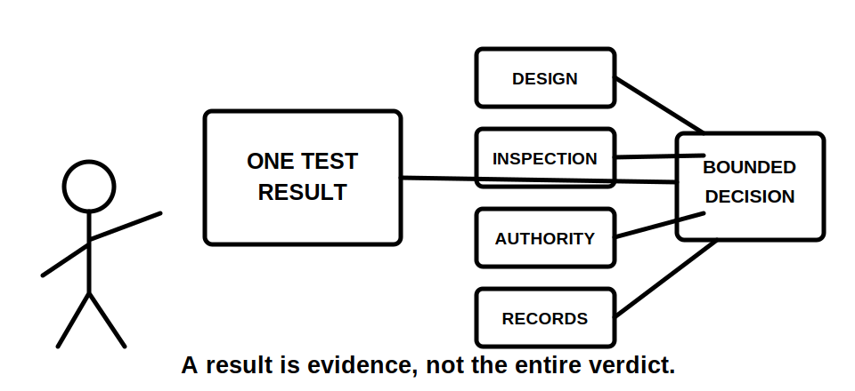
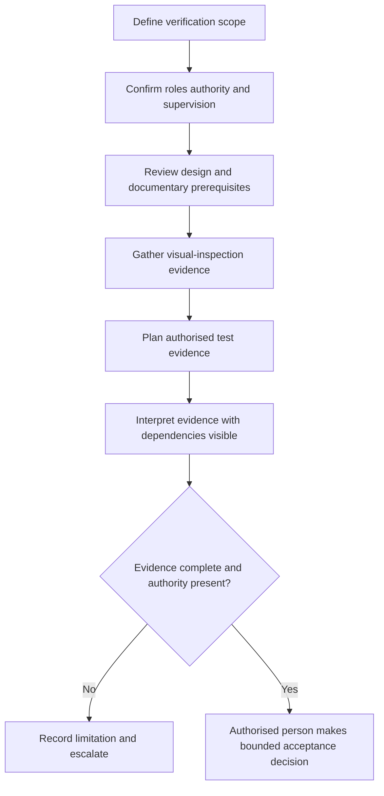

# Day 57 — Verification Purpose, Evidence Types and Responsibility Boundaries

> **Scope boundary:** This original module explains verification reasoning at concept level. It provides no testing procedure, acceptance value or authority to perform electrical work. Exact requirements require current authorised sources and qualified supervision.

## 1. Outcome and entry check

By the end, the learner can:

1. explain verification as an evidence-based decision process rather than a final test event;
2. distinguish design review, visual inspection, testing, documentation and certification evidence;
3. identify the limitations of each evidence type;
4. map responsibility, authority and escalation boundaries in a supplied scenario;
5. distinguish evidence collection from interpretation and formal acceptance;
6. identify when missing prerequisites invalidate later evidence;
7. write bounded verification-planning statements; and
8. stop before procedural or authority claims.

### Entry check

Explain why a correct-looking installation, one satisfactory result or a completed form cannot independently prove the whole installation is acceptable. List the evidence categories you expect a complete verification process to coordinate.

## 2. Why it matters

Verification failures often begin before an instrument is used. The wrong scope, incomplete documents, unresolved design assumptions, unsuitable authority or missing inspection evidence can make later results misleading. Verification therefore coordinates several evidence streams under defined responsibility.

The mental model is:

**scope → prerequisites → evidence streams → dependencies → interpretation → bounded decision → record**

## 3. Core concepts and terminology

- **Verification:** the structured process of gathering and evaluating applicable evidence about an installation against authorised requirements.
- **Verification scope:** the installation, alteration, repair or portion being considered, including relevant boundaries and exclusions.
- **Design evidence:** calculations, drawings, schedules, specifications and source decisions supporting intended arrangement.
- **Visual-inspection evidence:** observations about accessible condition, identity, selection and apparent installation features.
- **Test evidence:** results produced by an authorised test using suitable equipment and method.
- **Documentary evidence:** records showing provenance, scope, instrument information, changes, limitations and responsible parties.
- **Acceptance decision:** a formal conclusion made only by a person with the required authority and complete applicable evidence.
- **Dependency:** an earlier condition or evidence item required before a later result can be interpreted.
- **Responsibility boundary:** the limit of a person's assigned role, competence, authority and supervision.
- **Escalation:** transferring an unresolved or out-of-authority matter to an appropriately authorised person.

## 4. Rule-finding workflow

Use **V-E-R-I-F-Y**:

1. **V — Verify the scope:** define what work and boundaries are included.
2. **E — Establish responsibility:** identify who may inspect, test, interpret, accept and certify.
3. **R — Review prerequisites:** check design information, source conditions, documentation and safe-work authority.
4. **I — Inventory evidence streams:** separate design, inspection, test and documentary evidence.
5. **F — Follow dependencies:** identify which evidence must exist before another result can be meaningful.
6. **Y — Yield a bounded decision:** state supported findings, gaps, escalation and required records without claiming authority.

The diagram is conceptual, not a field sequence. It shows that later evidence does not erase missing scope, authority or prerequisite information.

## 5. Visual model or worked example

A fictional alteration dossier contains a drawing, circuit schedule, exterior photographs, one test-result sheet and an unsigned completion form. The learner says the result sheet proves verification is complete.

Apply **V-E-R-I-F-Y**:

| Step | Evidence-led response |
|---|---|
| Scope | The altered circuit is identified, but effects on upstream and connected equipment remain unclear. |
| Responsibility | The person who inspected, tested, interpreted and may accept the work is not evidenced. |
| Prerequisites | Drawing currency and source conditions require confirmation. |
| Inventory | Design, inspection, test and documentary evidence are incomplete and must remain distinct. |
| Follow | The isolated result cannot be interpreted as whole-scope acceptance. |
| Yield | Verification completion is unresolved; request missing evidence and authorised review. |

### Worked-example fading

For a second fictional repair, identify scope, roles and evidence streams from a partial dossier. The dependency map and bounded conclusion are left for independent completion.

## 6. Practical application

Create a verification-planning brief for a fictional alteration containing:

1. scope and exclusions;
2. role and authority map;
3. prerequisite evidence list;
4. four-column evidence inventory;
5. dependency map;
6. missing-evidence priorities;
7. escalation triggers; and
8. a bounded status statement.

### Assessment rubric

Score each category from **0 to 2**: scope, responsibility, evidence separation, dependency reasoning, bounded decision and safety communication. A score of **10/12 or higher** with no critical error indicates readiness for Day 58; this is an educational threshold only.

## 7. Common errors and safety checkpoint

### Common errors

- treating verification as testing alone;
- assuming a form proves the underlying work;
- mixing observation with interpretation;
- accepting a result without scope or provenance;
- ignoring design and source prerequisites;
- assigning acceptance authority from job title alone; and
- allowing later evidence to hide an earlier gap.

### Critical errors and stop conditions

Stop and remediate if the response invents procedures or values, claims safe isolation or acceptance, assigns authority without evidence, treats one result as whole-scope proof, omits a material source or directs practical testing outside supervision.

This module authorises no access, switching, isolation, proving de-energised, testing, instrument use, alteration, energisation, commissioning, certification or verification.

## 8. Retrieval and next links

1. Expand **V-E-R-I-F-Y**.
2. Define verification scope, dependency and acceptance decision.
3. Name four evidence streams and one limitation of each.
4. Why can a valid result still be insufficient?
5. What belongs in a responsibility map?
6. State three escalation triggers.

- **Plan:** [Twelve-Week Capstone Learning Plan](../MASTER_PLAN.md)
- **Knowledge note:** [[12-Week Day 57 - Verification Purpose, Evidence Types and Responsibility Boundaries]]
- **Previous:** [Day 56 — Week 8 Cumulative Design and Inspection Checkpoint](day-56-week-8-cumulative-design-and-inspection-checkpoint.md)
- **Next:** Day 58 — Visual Inspection Categories and Defect Recording

This module remains `review-required`, `reference_check_required`, safety-critical and not `technically-reviewed`.