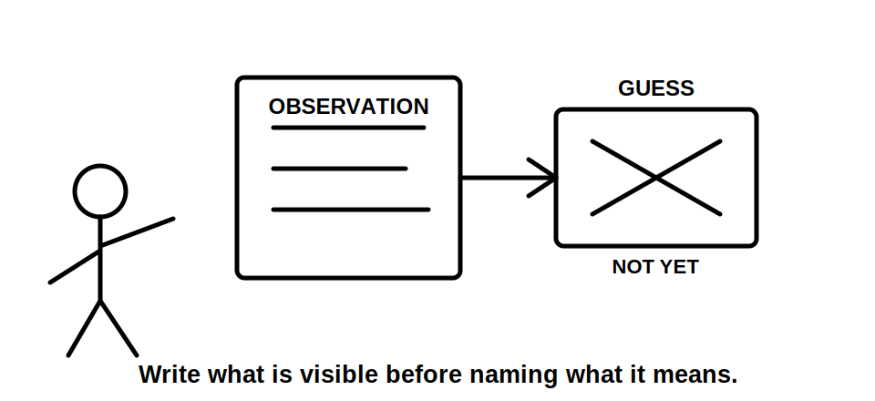
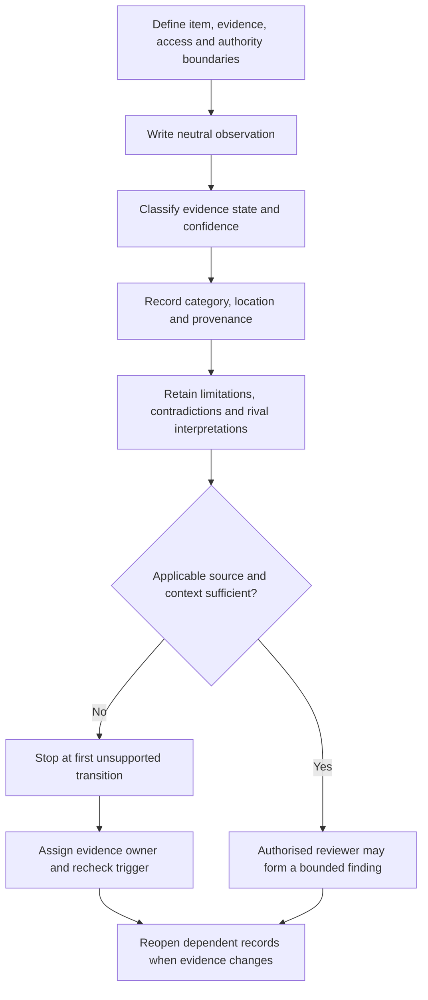
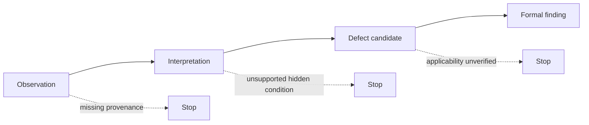

# Day 58 — Visual Inspection Categories and Defect Recording

> **Scope boundary:** This original module develops paper-based visual-inspection reasoning from supplied images and documents. It does not authorise site access, opening, dismantling, switching, isolation, testing, repair or formal acceptance. Exact requirements require current authorised sources and qualified supervision.

## 1. Outcome and entry check

By the end, the learner can:

1. define item, location, image-set, access, evidence, authority and decision boundaries;
2. classify each statement as a stated fact, derived fact, supported inference, assumption, contradiction or evidence gap;
3. separate observation, interpretation, defect candidate and formal finding;
4. create neutral, traceable records using location, provenance, category and limitation fields;
5. identify the first unsupported transition in an inspection claim chain and stop dependent conclusions;
6. retain competing interpretations rather than resolving uncertainty by preference;
7. assign an evidence owner and recheck trigger to every unresolved blocker; and
8. reopen affected records after two sequential material changes.

### Entry check

For each statement, label both the **claim type** and your **confidence** as guessing, unsure, reasonably confident or certain:

- “The label is not readable in image 3.”
- “The circuit is incorrectly identified.”
- “The enclosure is unsafe.”
- “A conductor enters through the upper-left opening.”

Then identify the earliest evidence gap that prevents any stronger conclusion.

## 2. Why it matters

Visual evidence can support identity, condition, accessibility and apparent-arrangement observations, but it cannot reveal hidden construction or prove compliance by appearance alone. Weak records collapse seeing, interpreting and deciding into one sentence. Strong records preserve the chain from visible evidence to a bounded status.

The inspection model is:

**boundary → evidence state → category → observation → provenance → limitation → applicability question → bounded escalation**

*Caption: Keep direct observations separate from interpretations so later evidence can change the interpretation without rewriting what was actually visible.*

## 3. Core concepts and terminology

- **Visual inspection:** examination of accessible supplied visual and documentary evidence without relying on test results.
- **Inspection category:** a consistent grouping such as identity, condition, accessibility, support, protection, selection or documentation.
- **Observation:** a neutral statement of what the supplied evidence directly shows.
- **Interpretation:** a reasoned possible meaning assigned to an observation.
- **Defect candidate:** an observed condition that may conflict with an applicable requirement but still needs source and scope confirmation.
- **Formal finding:** a conclusion issued by an appropriately authorised person using sufficient applicable evidence.
- **Provenance:** source, date, revision, creator and scenario connection of an image or record.
- **Evidence limitation:** a reason the supplied material cannot support a stronger claim.
- **First unsupported transition:** the earliest step where a claim moves beyond adequate evidence or applicability.
- **Evidence owner:** the authorised source or qualified person responsible for resolving a gap.
- **Recheck trigger:** new evidence or a changed condition that requires dependent records to be reopened.
- **Competing interpretation:** a plausible alternative explanation retained until evidence distinguishes it.
- **Material change:** a change capable of altering categorisation, priority or the bounded conclusion.

Evidence states:

1. **Stated fact** — directly supplied.
2. **Derived fact** — obtained transparently from stated facts.
3. **Supported inference** — plausible and evidence-backed but not directly shown.
4. **Assumption** — used temporarily without adequate support.
5. **Contradiction** — two sources cannot both be accepted as currently accurate.
6. **Evidence gap** — required information is absent or unusable.

Confidence is recorded separately from evidence quality. High confidence does not convert an assumption into evidence.

## 4. Rule-finding workflow

Use **O-B-S-E-R-V-E**:

1. **O — Outline boundaries:** define item, location, evidence set, access boundary, authority and prohibited decisions.
2. **B — Bucket evidence:** assign one or more inspection categories without forcing a single label.
3. **S — State and classify:** write neutral observations and label each claim’s evidence state.
4. **E — Evidence location and provenance:** record image, drawing, item, position, date and revision references.
5. **R — Record limits and rivals:** state hidden, obscured, outdated or conflicting information and retain competing interpretations.
6. **V — Verify applicability and dependencies:** identify the authorised source required and stop at the first unsupported transition.
7. **E — Escalate, own and edit:** assign owners and recheck triggers, then reopen records after material change.

The diagram prevents a visual observation from becoming a compliance conclusion merely because the observation appears persuasive.

Each arrow is a separate evidential transition. A later step is unavailable when an earlier transition is unsupported.

## 5. Visual model or worked example

A fictional switchboard dossier contains:

- image 3 showing a partly unreadable handwritten label;
- image 4 showing an unused-looking opening, but only from an oblique angle;
- a schedule with no visible revision date;
- a drawing labelling the board DB-2;
- a maintenance note calling the same board “Workshop Distribution”; and
- a later image showing a transparent internal cover not visible in image 4.

| Field | Disciplined entry |
|---|---|
| Observation | Handwritten text on the exterior label is partly unreadable in image 3. |
| Evidence state | Stated fact. |
| Confidence | Certain about unreadability in the supplied image; unsure about actual circuit identity. |
| Location | Board labelled DB-2 on drawing A; upper-right exterior label position. |
| Provenance | Image 3; photographer and date not supplied. |
| Category | Identification and documentation. |
| Competing interpretations | Label is degraded; image resolution is inadequate; label belongs to adjacent equipment. |
| First unsupported transition | “Unreadable in image” → “circuit incorrectly identified.” |
| Owner and trigger | Current schedule owner; clearer dated image or authorised inspection record. |
| Bounded status | Identification adequacy unresolved. |

Do not infer internal barriers, termination quality, conductor damage, cause, repair need or compliance from the closed cover.

### Worked-example fading

For a second dossier, categories and image references are supplied. Produce the evidence-state labels, neutral observations, limitations, competing interpretations, first unsupported transition, owner and trigger without a model answer.

## 6. Practical application

Using a fictional set of six images and two conflicting documents, produce:

1. an inspection-boundary statement;
2. a multi-category matrix;
3. ten neutral observations with provenance and location references;
4. evidence-state and confidence labels;
5. five defect candidates that stop before formal findings;
6. three competing-interpretation pairs;
7. a prioritised evidence-request register with owners and triggers;
8. one design-versus-inspection contradiction record; and
9. revised records after two sequential changes: first a clearer image, then a newer schedule.

### Criterion-level readiness

Evaluate each criterion independently:

- **Secure:** accurate, traceable, evidence-bound and transferable after both changes.
- **Developing:** partly controlled but contains a correctable omission or weak dependency link.
- **Unsupported:** relies on an assumption, hidden condition or unresolved contradiction.
- **`stop-required`:** crosses a safety, authority, copyright or formal-finding boundary.

Criteria:

1. boundary control;
2. observation and evidence-state discipline;
3. provenance and location traceability;
4. limitation and competing-interpretation control;
5. first-unsupported-transition handling;
6. ownership, recheck triggers and two-change transfer;
7. bounded prioritisation and communication.

Progression requires no `stop-required` criterion and no unresolved blocker in criteria 1, 2, 4 or 5. Strong performance elsewhere cannot offset a blocking error.

## 7. Common errors and safety checkpoint

### Common errors

- writing “non-compliant” instead of recording what is visible;
- inferring hidden construction from an exterior image;
- treating confidence as evidence quality;
- omitting image, date, revision or location references;
- selecting one interpretation while concealing an equally plausible alternative;
- treating an old schedule as current;
- recommending repair before applicability is established;
- continuing reasoning beyond the first unsupported transition; and
- failing to reopen dependent records after changed evidence.

### Critical errors and stop conditions

Stop and remediate if the response invents hidden conditions, official requirements, causes or repairs; claims compliance, safe operation or formal acceptance; directs cover removal, access, switching, isolation or testing; presents a defect candidate as a formal finding; conceals a contradiction; or leaves a material blocker without an owner and recheck trigger.

This module authorises no site access, opening, dismantling, switching, isolation, testing, instrument use, alteration, repair, energisation, commissioning, certification, acceptance or field verification.

## 8. Retrieval and next links

1. Expand **O-B-S-E-R-V-E**.
2. Distinguish observation, interpretation, defect candidate and formal finding.
3. Name the six evidence states.
4. Why is confidence recorded separately?
5. Define the first unsupported transition.
6. What must every unresolved blocker receive?
7. Why must competing interpretations be retained?
8. What must two-change transfer demonstrate?

### Delayed retrieval

After 24–48 hours, create one new fictional observation chain and mark the first unsupported transition without reopening this module.

- **Plan:** [Twelve-Week Capstone Learning Plan](../MASTER_PLAN.md)
- **Knowledge note:** [[12-Week Day 58 - Visual Inspection Categories and Defect Recording]]
- **Previous:** [Day 57 — Verification Purpose, Evidence Types and Responsibility Boundaries](day-57-verification-purpose-evidence-types-and-responsibility-boundaries.md)
- **Next:** [Day 59 — Test Purposes, Dependencies and Safe Sequencing Concepts](day-59-test-purposes-dependencies-and-safe-sequencing-concepts.md)

This module remains `review-required`, `reference_check_required`, safety-critical and not `technically-reviewed`.
