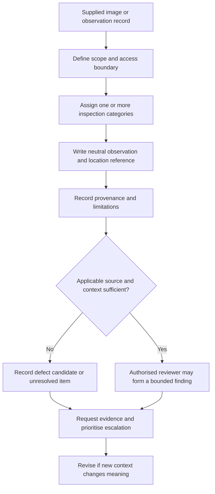

# Day 58 — Visual Inspection Categories and Defect Recording

> **Scope boundary:** This original module develops paper-based visual-inspection reasoning. It does not authorise access, opening, dismantling or field inspection and does not reproduce official checklists or acceptance criteria. Exact requirements require current authorised sources and qualified supervision.

## 1. Outcome and entry check

By the end, the learner can:

1. organise supplied visual evidence into consistent inspection categories;
2. distinguish an observation from an interpretation, defect candidate and formal finding;
3. record location, item, condition, evidence source and limitation precisely;
4. identify when a hidden condition cannot be inferred from an image;
5. relate observations to design documents without merging the evidence types;
6. prioritise items requiring escalation or further evidence;
7. revise a record when new context changes its meaning; and
8. avoid compliance, cause and repair claims unsupported by visual evidence.

### Entry check

For each statement, label it **observation**, **interpretation** or **unsupported claim**:

- “The label is not readable in the supplied photograph.”
- “The circuit is incorrectly identified.”
- “The enclosure is unsafe.”
- “A conductor enters through the upper-left opening.”

Explain what additional evidence would be needed to strengthen each interpretation.

## 2. Why it matters

Visual inspection can reveal condition, identity, accessibility and apparent arrangement, but its value depends on disciplined recording. Vague notes such as “bad wiring” hide location, evidence and uncertainty. Overconfident notes can also convert a limited observation into an unsupported compliance or causation claim.

The inspection model is:

**scope → category → observe → locate → describe → limit → relate → escalate**

## 3. Core concepts and terminology

- **Visual inspection:** examination of accessible visual and documentary evidence without relying on test results.
- **Inspection category:** a consistent grouping used to organise observations, such as identity, condition, accessibility, selection, support, protection or documentation.
- **Observation:** a neutral statement of what the supplied evidence directly shows.
- **Interpretation:** a reasoned meaning assigned to an observation using applicable evidence.
- **Defect candidate:** an observed condition that may conflict with an applicable requirement but still requires source and scope confirmation.
- **Formal finding:** a conclusion issued by an authorised person using complete applicable evidence.
- **Evidence limitation:** a stated reason the supplied material cannot support a stronger conclusion.
- **Provenance:** information showing where, when and how an observation or image was obtained.
- **Location reference:** a precise identifier linking the record to an area, board, circuit, item or image.
- **Priority:** the order for escalation based on potential consequence, uncertainty and dependency impact, not appearance alone.

## 4. Rule-finding workflow

Use **O-B-S-E-R-V-E**:

1. **O — Outline scope:** identify the item, area, evidence set and access boundary.
2. **B — Bucket by category:** organise observations without forcing one item into a single category.
3. **S — State the observation:** use neutral, specific and measurable language where the image permits.
4. **E — Evidence the location:** record image, drawing, item and position references.
5. **R — Record limitations:** identify obscured, hidden, outdated or conflicting information.
6. **V — Verify applicability questions:** identify the authorised source needed before calling a defect.
7. **E — Escalate and edit after change:** prioritise evidence requests and revise the record when context changes.

The diagram separates seeing, interpreting and formally concluding. It also shows that an observation can belong to several categories without proving a defect.

## 5. Visual model or worked example

A fictional switchboard photograph shows a faded handwritten label, one unused opening, crowded conductors near the lower edge and a closed internal cover. The schedule supplied with the image has no visible revision date.

| Record field | Disciplined entry |
|---|---|
| Observation | Handwritten text on the label is partly unreadable in image 3. |
| Location | Board DB-2, exterior label area, upper-right position. |
| Category | Identification and documentation. |
| Limitation | Image resolution and schedule currency prevent confirmation of actual circuit identity. |
| Interpretation | Identification adequacy is unresolved. |
| Next evidence | Current schedule, clearer image and authorised inspection record. |

Do not infer internal barriers, termination quality, conductor damage or compliance from the closed cover.

### Worked-example fading

For a second image set, the categories and locations are supplied. Write only the neutral observations, limitations, applicability questions and priorities.

## 6. Practical application

Using a fictional set of six images and two conflicting documents, produce:

1. an inspection-scope statement;
2. a category matrix;
3. ten neutral observations with location references;
4. provenance and limitation entries;
5. five defect candidates without compliance claims;
6. a prioritised evidence request list;
7. one design-versus-inspection conflict record; and
8. a revised entry after a new image changes the context.

### Assessment rubric

Score each category from **0 to 2**:

| Category | 0 | 1 | 2 |
|---|---|---|---|
| Observation quality | Vague or inferential | Mostly specific | Neutral, precise and evidence-bound |
| Categorisation | Unstructured list | Some grouping | Consistent multi-category reasoning |
| Location and provenance | Missing | Partial references | Every item traceable |
| Limitations | Hidden conditions invented | Some limits | Material limits explicit |
| Priority and escalation | Appearance-based | Partly reasoned | Consequence, uncertainty and dependencies considered |
| Safety communication | Compliance or repair claimed | General caution | Candidate, finding and authority boundaries clear |

A score of **10/12 or higher** with no critical error indicates readiness for Day 59. This is an educational threshold only.

## 7. Common errors and safety checkpoint

### Common errors

- writing “non-compliant” instead of recording what is visible;
- inferring hidden construction from an exterior image;
- omitting image and location references;
- treating an old schedule as current;
- assuming cause from appearance;
- recommending repair before applicability is established;
- ranking cosmetic neatness above material uncertainty; and
- failing to revise a record after new evidence.

### Critical errors and stop conditions

Stop and remediate if the response invents hidden conditions, official requirements or causes; claims compliance or safe operation; directs cover removal, access, isolation or testing; presents a defect candidate as a formal finding; or omits a disclosed source or evidence conflict.

This module authorises no site access, opening, dismantling, switching, isolation, testing, alteration, repair, energisation, certification or verification.

## 8. Retrieval and next links

1. Expand **O-B-S-E-R-V-E**.
2. Distinguish observation, interpretation, defect candidate and formal finding.
3. Why are provenance and location references necessary?
4. Name five inspection categories.
5. What makes an evidence limitation material?
6. Why must records change when context changes?

### Changed-scenario transfer

Reclassify and rewrite two records after a clearer image shows that one apparent opening is behind a transparent cover and the handwritten label belongs to adjacent equipment.

- **Plan:** [Twelve-Week Capstone Learning Plan](../MASTER_PLAN.md)
- **Knowledge note:** [[12-Week Day 58 - Visual Inspection Categories and Defect Recording]]
- **Previous:** [Day 57 — Verification Purpose, Evidence Types and Responsibility Boundaries](day-57-verification-purpose-evidence-types-and-responsibility-boundaries.md)
- **Next:** Day 59 — Test Purposes, Dependencies and Safe Sequencing Concepts

This module remains `review-required`, `reference_check_required`, safety-critical and not `technically-reviewed`.