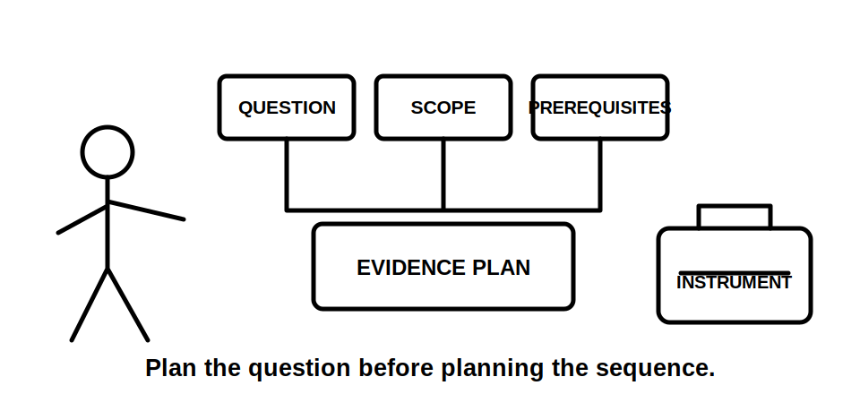
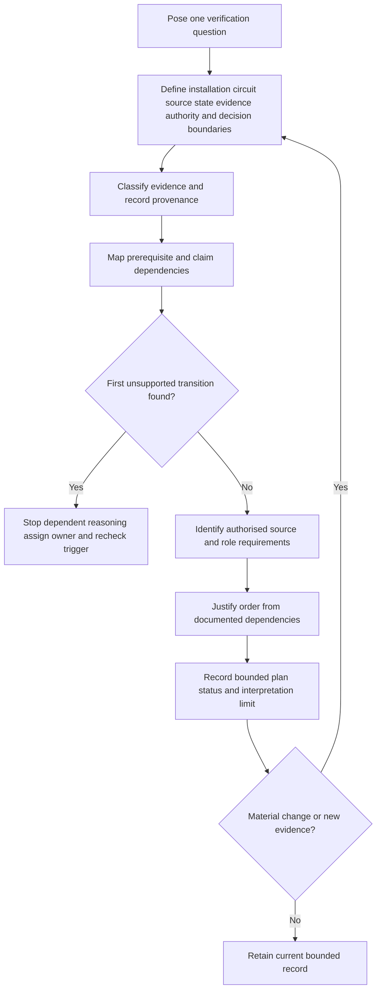
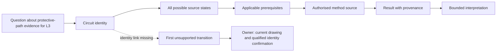

# Day 59 — Test Purposes, Dependencies and Safe Sequencing Concepts

> **Scope boundary:** This original module teaches paper-based verification planning from supplied fictional evidence. It does not prescribe a field test procedure, official sequence, instrument connection, switching action or acceptance value. Exact requirements require current authorised sources, approved procedures, manufacturer information, qualified supervision and role-specific authority.

## 1. Outcome and entry check

By the end, the learner can:

1. define the installation, circuit, source, operating-state, evidence, authority and decision boundaries for a proposed verification question;
2. distinguish test purpose, method, result, interpretation and authorised conclusion;
3. classify each planning statement as stated fact, derived fact, supported inference, assumption, contradiction or evidence gap;
4. map dependencies and identify the first unsupported transition in a proposed evidence chain;
5. justify an order only from documented dependencies rather than a memorised universal sequence;
6. record competing interpretations, evidence provenance, evidence owners and recheck triggers;
7. reopen dependent reasoning after two sequential material changes; and
8. communicate a bounded plan status without directing practical work or claiming compliance.

### Entry check

For each statement, label it **purpose**, **method**, **result**, **interpretation** or **authorised conclusion**, then state the evidence quality and your confidence:

- “Establish whether the protective path is represented by adequate evidence.”
- “Use the approved instrument configuration.”
- “The worksheet records a value against circuit L3.”
- “The value may relate to the modified circuit, but the identity link is incomplete.”
- “The installation satisfies the applicable requirement.”

Use confidence labels **guessing**, **unsure**, **reasonably confident** or **certain**. Confidence is not evidence quality and does not repair a missing dependency.

## 2. Why it matters

A test name is not a verification plan. Defensible planning connects a precise question to a bounded installation state, applicable evidence, authorised method sources, instrument requirements, dependency rationale, result provenance and a limited interpretation. A familiar sequence can appear orderly while hiding an unconfirmed source, wrong circuit identity, stale result or missing authority.

The disciplined chain is:

**question → boundaries → evidence states → prerequisites → authorised sources → dependencies → plan status → bounded interpretation → reopening triggers**

*Caption: Define the question, boundaries and prerequisites before considering any authorised method or instrument requirement.*

## 3. Core concepts and terminology

- **Test purpose:** the precise verification question that evidence is intended to address.
- **Test method:** an authorised process and configuration used by an appropriately authorised person to obtain evidence; no method is prescribed here.
- **Test result:** a recorded observation or value with identity, conditions, date, source and recorder information.
- **Interpretation:** reasoning about what a result may mean within stated boundaries and conditions.
- **Authorised conclusion:** a decision made within the relevant role, evidence and approval framework; it is not created by learner confidence.
- **Dependency:** a condition or evidence item on which a later claim relies.
- **Precondition:** a required safety, installation, source, authority, documentation or instrument state that must be established before dependent work or reasoning.
- **Operating state:** the relevant arrangement of sources, switching, controls, automatic operation and stored energy.
- **Provenance:** where evidence came from, who created it, when, for what scope and under what conditions.
- **Competing interpretation:** a plausible alternative explanation retained until evidence resolves it.
- **First unsupported transition:** the earliest step where a claim moves beyond available and applicable evidence. Dependent reasoning stops there.
- **Evidence owner:** the authorised source or qualified person responsible for resolving a gap.
- **Recheck trigger:** new evidence or a material change that requires dependent reasoning to be reopened.
- **Safe sequencing concept:** an installation-specific order justified by authorised requirements and dependencies, not a universal learner-generated procedure.

### Evidence states

Use exactly one state for each material statement:

1. **Stated fact** — directly present in supplied evidence.
2. **Derived fact** — obtained transparently from stated facts without adding an assumption.
3. **Supported inference** — plausible and supported, but not directly established.
4. **Assumption** — temporarily adopted without sufficient evidence.
5. **Contradiction** — credible sources disagree.
6. **Evidence gap** — required information is absent or unusable.

## 4. Rule-finding workflow

Use **P-U-R-P-O-S-E**:

1. **P — Pose the question:** write one evidence question, not merely a test label.
2. **U — Understand boundaries:** identify installation, circuit, source, operating-state, evidence, authority and decision limits.
3. **R — Register evidence:** classify facts, inferences, assumptions, contradictions and gaps; record provenance and confidence separately.
4. **P — Pinpoint dependencies:** draw each claim link and stop at the first unsupported transition.
5. **O — Obtain authorised sources:** identify the current standard, approved procedure, manufacturer information and qualified role needed; do not reconstruct the procedure.
6. **S — Sequence by rationale:** propose order only where a documented dependency supports it; retain competing interpretations.
7. **E — Express status and reopening:** state secure, developing, unsupported or `stop-required`; assign owners and triggers for every blocker.

The diagram is a reasoning-control loop, not a field sequence. It prevents a learner from moving from a familiar test name to practical action without verified boundaries and prerequisites.

## 5. Visual model or worked example

A fictional dossier concerns a modified final subcircuit. It contains:

- drawing revision C naming circuit L3;
- an undated worksheet naming circuit “Lighting West”;
- a visual record showing a new protective device but not its connected conductors;
- a note stating that a battery inverter “may support essential lighting”;
- a controls drawing showing a separately supplied contactor coil; and
- no approved verification procedure or evidence linking “Lighting West” to L3.

The missing identity link is the first unsupported transition. Therefore, old worksheet data cannot be treated as evidence for L3, and no dependent sequencing or conclusion is justified.

| Planning field | Evidence-controlled response |
|---|---|
| Purpose | Identify what evidence would address the protective-path question for the stated L3 boundary. |
| Contradiction | Revision C uses L3; the old worksheet uses an unlinked descriptive name. |
| Source gap | Battery support and the separate control supply are not fully mapped. |
| First unsupported transition | Treating “Lighting West” as L3 without identity evidence. |
| Competing interpretations | The old record may concern L3, another lighting circuit or a pre-modification arrangement. |
| Plan status | `stop-required` for dependent method selection or interpretation. |
| Evidence owner | Current source diagram and circuit identity: qualified designer or authorised verifier. |
| Recheck trigger | Confirmed circuit mapping, source-state evidence or a newer applicable record. |

### Worked-example fading

For a second fictional dossier, only the question and supplied documents are given. Produce the boundaries, evidence-state register, first unsupported transition, competing interpretations, owners and reopening triggers without naming or directing a practical method.

## 6. Practical application

Using a fictional verification dossier, produce:

1. four precise verification questions;
2. one boundary statement for each question;
3. a provenance and evidence-state register;
4. a dependency map identifying independent and dependent claims;
5. the first unsupported transition for each chain;
6. an authorised-source request without reconstructing a procedure;
7. competing interpretations, evidence owners and recheck triggers; and
8. a transfer revision after two sequential changes: an alternate source is confirmed, then the protective device is shown to have been replaced after the old worksheet date.

### Criterion-level assessment states

Assess each criterion independently:

| Criterion | Secure | Developing | Unsupported | `stop-required` |
|---|---|---|---|---|
| Purpose and boundaries | Precise question and all material boundaries explicit | Minor non-blocking omission | Material boundary unsupported | Practical action or conclusion attempted with an unresolved source, identity or authority boundary |
| Evidence classification | Material claims accurately classified with provenance | Mostly accurate with correctable ambiguity | Assumptions or contradictions concealed | Invented evidence or stale evidence presented as current |
| Dependency control | Every order link has a documented rationale | Some links need clarification | Memorised order substitutes for dependencies | Reasoning continues beyond the first unsupported transition |
| Source and authority control | Current source types and responsible roles identified | One non-blocking source request incomplete | Applicability or ownership unresolved | Learner-generated procedure, value or authority claim |
| Interpretation limits | Result, interpretation and conclusion remain distinct | Minor wording overreach | Conclusion exceeds evidence | Compliance, safety or certification claimed from incomplete evidence |
| Change transfer | Both changes reopen all affected dependencies | One affected link initially missed then corrected | Cosmetic edits only | Original conclusion retained despite invalidating changes |

There is no compensating total score. A strong response in one criterion cannot offset a blocking failure elsewhere. Progression requires no `stop-required` criterion and remediation of every unsupported material dependency.

### Blocking conditions

Progress is blocked by any of the following:

- directing field testing, instrument connection, switching, isolation or energisation;
- inventing an official sequence, method, value or acceptance criterion;
- omitting a disclosed or plausible supply path from the boundary;
- treating an old or ambiguously identified result as current evidence;
- continuing beyond the first unsupported transition;
- hiding a contradiction or competing interpretation;
- leaving a material blocker without an evidence owner and recheck trigger; or
- claiming compliance, competence, verification, certification or technical approval.

## 7. Common errors and safety checkpoint

### Common errors

- using a test name as the verification question;
- choosing an instrument before defining purpose and boundaries;
- presenting one remembered order as universally safe;
- merging result, interpretation and authorised conclusion;
- omitting alternate supplies, controls, automatic operation or stored energy;
- assuming old results describe the current installation;
- treating confidence as evidence quality;
- failing to preserve provenance or contradictions; and
- updating wording after a change without reopening dependencies.

### Safety checkpoint

Stop and escalate when source identity, circuit identity, operating state, authority, method source, instrument requirements or prerequisite evidence is unresolved. The educational output is a bounded paper record only.

This module authorises no site access, opening, switching, isolation, proving de-energised, testing, measurement, instrument use, alteration, repair, energisation, commissioning, acceptance, certification or field verification.

## 8. Retrieval and next links

1. Expand **P-U-R-P-O-S-E**.
2. Distinguish purpose, method, result, interpretation and authorised conclusion.
3. Name the six evidence states.
4. Define the first unsupported transition.
5. Explain why confidence cannot repair an evidence gap.
6. Give four dependency or plan reopening triggers.
7. Why is a safe sequence installation-specific and authority-dependent?
8. What must be assigned to every unresolved blocker?

### Changed-scenario transfer

Rebuild the complete dependency map after learning, in sequence, that:

1. a battery inverter can energise L3 in one operating state; and
2. the old worksheet predates replacement of the protective device.

Identify which earlier claims reopen after each change and whether the plan state becomes more or less supportable.

- **Plan:** [Twelve-Week Capstone Learning Plan](../MASTER_PLAN.md)
- **Knowledge note:** [[12-Week Day 59 - Test Purposes, Dependencies and Safe Sequencing Concepts]]
- **Previous:** [Day 58 — Visual Inspection Categories and Defect Recording](day-58-visual-inspection-categories-and-defect-recording.md)
- **Next:** [Day 60 — Instrument Suitability, Limitations and Pre-Use Evidence](day-60-instrument-suitability-limitations-and-pre-use-evidence.md)

This module remains `review-required`, `reference_check_required`, safety-critical and not `technically-reviewed`.