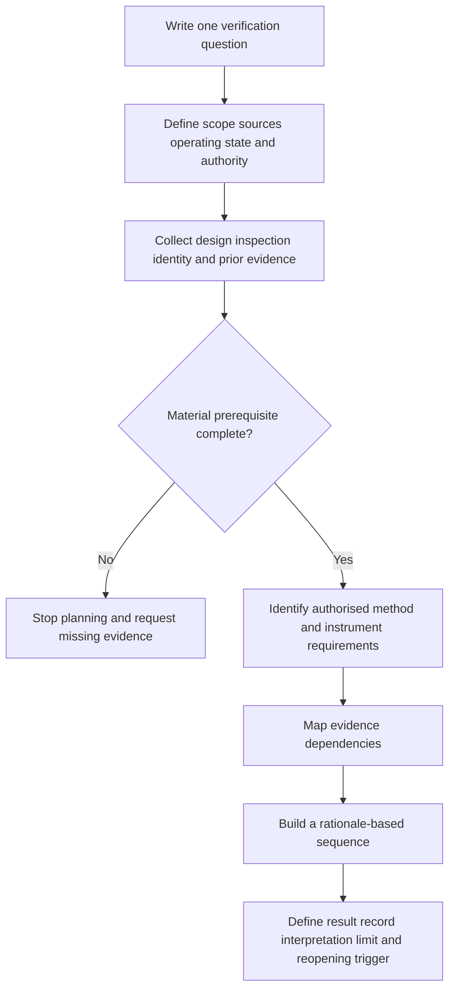

# Day 59 — Test Purposes, Dependencies and Safe Sequencing Concepts

> **Scope boundary:** This original module teaches paper-based verification planning only. It does not provide a field test procedure, prescribe an official sequence, authorise instrument use or state acceptance values. Exact requirements must be checked against current authorised sources, approved procedures, manufacturer information and qualified supervision.

## 1. Outcome and entry check

By the end, the learner can:

1. state the question a proposed test is intended to answer;
2. distinguish a test purpose from a test method, reading and conclusion;
3. identify documentary, inspection and prerequisite evidence needed before a test can be planned;
4. map dependencies between tests without presenting a memorised sequence as universally applicable;
5. explain why some later evidence depends on earlier conditions being established;
6. identify changes that invalidate an existing test plan;
7. record unresolved authority, condition or evidence gaps; and
8. produce a bounded verification-plan statement without directing practical work.

### Entry check

For each statement, label it **purpose**, **method**, **result** or **conclusion**:

- “Establish whether the protective path is represented by adequate evidence.”
- “Use the approved instrument configuration.”
- “The recorded value was entered on the worksheet.”
- “The installation satisfies the applicable requirement.”

Explain why confusing these categories can create unsafe reasoning.

## 2. Why it matters

A test name is not a plan. Verification reasoning must connect the question being asked, the condition of the installation, the evidence already available, the authorised method, the instrument, the expected evidence form and the limits of any conclusion. Starting with a familiar instrument or remembered sequence can hide missing prerequisites and unsafe assumptions.

The planning model is:

**verification question → scope and state → prerequisite evidence → authorised method source → dependency order → result record → bounded interpretation**

## 3. Core concepts and terminology

- **Test purpose:** the specific verification question the evidence is intended to address.
- **Test method:** the authorised process and configuration used to obtain evidence; this module does not prescribe one.
- **Test result:** the recorded observation or value produced by an authorised test.
- **Interpretation:** reasoning about what a result means within its stated scope and conditions.
- **Dependency:** a condition or evidence item that must be established before another conclusion can be attempted.
- **Precondition:** a required installation, safety, authority, documentation or instrument state that exists before work begins.
- **Operating state:** the source, switching, control and stored-energy condition relevant to the proposed evidence.
- **Sequence rationale:** the reason one evidence activity must precede, follow or remain separate from another.
- **Invalidation trigger:** a change that requires the plan or conclusion to be reopened.
- **Safe sequence:** an authorised sequence selected for the actual installation, task and procedure—not a universal list recalled without context.

## 4. Rule-finding workflow

Use **P-U-R-P-O-S-E**:

1. **P — Pose the question:** write one precise verification question.
2. **U — Understand scope and state:** identify the circuit, boundaries, sources, operating states and authority limits.
3. **R — Retrieve prerequisites:** gather design, inspection, identity, condition and previous-result evidence.
4. **P — Pinpoint dependencies:** show which evidence relies on another condition or result.
5. **O — Obtain the authorised method source:** identify the current procedure, standard reference and manufacturer information needed.
6. **S — Sequence by rationale:** arrange evidence activities only where a documented dependency justifies the order.
7. **E — Express limits and reopening triggers:** state what remains unresolved and what change invalidates the plan.

The diagram is a planning gate, not a field procedure. It prevents a learner from jumping from a test label directly to instrument action.

## 5. Visual model or worked example

A fictional dossier proposes three evidence activities for a modified final subcircuit. It includes a current drawing, a visual-inspection record, an old test sheet and a note that an alternate source may have been added.

| Planning field | Evidence-led response |
|---|---|
| Verification question | What evidence is required to support the protective-path conclusion for the stated circuit boundary? |
| Scope issue | The alternate-source connection and operating states are not confirmed. |
| Prerequisite evidence | Current source diagram, circuit identity, inspection record, authority and approved procedure. |
| Dependency | Any later interpretation depends on the actual source and circuit boundary being established first. |
| Plan status | Unresolved; do not select or sequence field methods yet. |
| Reopening trigger | Any change to source, conductor route, protective device, connection or circuit identity. |

### Worked-example fading

For a second fictional circuit, the verification question and scope are supplied. Complete only the prerequisite list, dependency map, authorised-source request, plan status and reopening triggers.

## 6. Practical application

Using a fictional verification dossier, produce:

1. four precise verification questions;
2. a scope and operating-state statement for each;
3. a prerequisite-evidence register;
4. a dependency diagram separating independent and dependent evidence;
5. an authorised-method source request without writing the procedure;
6. a rationale for any proposed order;
7. a result-record template separating observation from interpretation; and
8. three changes that reopen the plan.

### Assessment rubric

Score each category from **0 to 2**:

| Category | 0 | 1 | 2 |
|---|---|---|---|
| Purpose definition | Test name only | General question | Precise evidence question |
| Scope and state | Sources omitted | Partial boundary | Complete paper boundary and states |
| Prerequisites | Assumed complete | Some gaps named | Material evidence and authority gates explicit |
| Dependency reasoning | Memorised order | Some rationale | Every ordering link has a stated dependency |
| Interpretation limits | Compliance claimed | General caution | Result, interpretation and conclusion separated |
| Safety communication | Practical direction | Incomplete boundary | Clear stop conditions and no procedural authority |

A score of **10/12 or higher** with no critical error indicates readiness for Day 60. This is an educational threshold only.

## 7. Common errors and safety checkpoint

### Common errors

- treating a test name as a complete verification question;
- choosing an instrument before defining purpose and scope;
- presenting one remembered sequence as universal;
- omitting alternate supplies, controls or stored energy;
- assuming old results describe the current installation;
- allowing one result to prove unrelated requirements;
- interpreting a reading without its conditions and provenance; and
- failing to reopen the plan after modification.

### Critical errors and stop conditions

Stop and remediate if the response directs field testing, instrument connection, switching, isolation or energisation; invents an official sequence or acceptance value; omits a disclosed source; treats an old result as current without evidence; or claims compliance from incomplete evidence.

This module authorises no access, switching, isolation, proving de-energised, testing, measurement, instrument use, alteration, repair, energisation, commissioning, certification or verification.

## 8. Retrieval and next links

1. Expand **P-U-R-P-O-S-E**.
2. Distinguish test purpose, method, result, interpretation and conclusion.
3. What is a dependency?
4. Why is a safe sequence installation-specific?
5. Name four prerequisite-evidence categories.
6. Give three invalidation triggers.

### Changed-scenario transfer

Rebuild the dependency map after learning that a battery inverter can energise the circuit in one operating state and the old test sheet predates a protective-device replacement.

- **Plan:** [Twelve-Week Capstone Learning Plan](../MASTER_PLAN.md)
- **Knowledge note:** [[12-Week Day 59 - Test Purposes, Dependencies and Safe Sequencing Concepts]]
- **Previous:** [Day 58 — Visual Inspection Categories and Defect Recording](day-58-visual-inspection-categories-and-defect-recording.md)
- **Next:** Day 60 — Instrument Suitability, Limitations and Pre-Use Evidence

This module remains `review-required`, `reference_check_required`, safety-critical and not `technically-reviewed`.