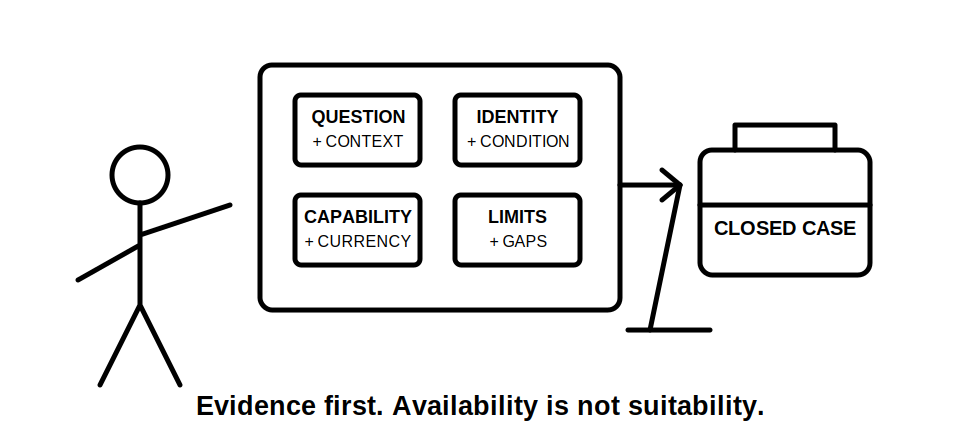
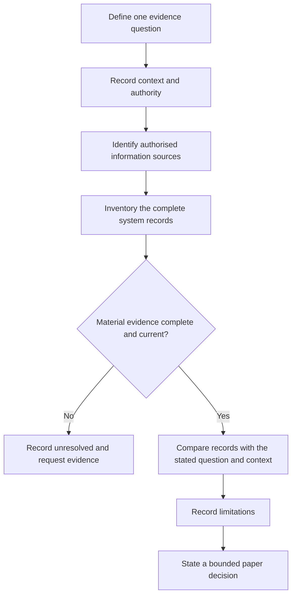

# Day 60 — Instrument Suitability, Limitations and Pre-Use Evidence

> **Scope boundary:** This original module is a paper-based document-review exercise. It does not teach instrument operation, practical checks, connections, settings, testing or acceptance decisions. Exact requirements require current authorised sources, approved procedures and qualified supervision.

## 1. Outcome and entry check

By the end, the learner can:

1. distinguish equipment availability from evidenced suitability;
2. define the evidence question before considering equipment records;
3. identify the records needed to describe a complete measurement system;
4. separate identity, condition, capability and currency evidence;
5. explain why a displayed level of detail does not by itself prove accuracy;
6. identify limitations that narrow a possible conclusion;
7. record missing evidence and stop conditions; and
8. write a bounded paper conclusion without directing practical work.

### Entry check

Classify each statement as **availability**, **suitability**, **condition** or **limitation** evidence:

- the equipment is present;
- current records address the stated question and conditions;
- one associated component has no condition record; and
- the evidence supports less certainty than the displayed detail suggests.

## 2. Why it matters

Equipment familiarity is not evidence. A defensible paper decision connects a defined question, known conditions, an authorised information source, the complete system record and the limits of interpretation. Missing evidence produces an unresolved decision, not permission to assume.

**question → context → authorised source → complete-system records → limitations → bounded decision**

## 3. Core concepts and terminology

- **Measurement system:** all equipment, associated components, configuration information and records relevant to the proposed evidence question.
- **Availability:** evidence that equipment can be accessed.
- **Suitability:** documented support that the complete system fits the stated question and conditions.
- **Identity evidence:** records showing exactly which equipment and associated components are being considered.
- **Condition evidence:** current records about observable condition and status.
- **Capability evidence:** authorised information describing what the system can support under stated conditions.
- **Currency evidence:** records showing whether information remains applicable at the relevant date and configuration.
- **Resolution:** the smallest reported increment; it does not independently establish accuracy.
- **Accuracy evidence:** documented support for the closeness of a result to an appropriate reference under stated conditions.
- **Limitation:** a factor that narrows the conclusion supported by the evidence.
- **False precision:** expressing more certainty than the evidence supports.
- **Reopening trigger:** a change requiring the paper decision to be reviewed again.

## 4. Rule-finding workflow

Use **M-E-T-E-R-S**:

1. **M — Map the question:** write the exact evidence question.
2. **E — Establish context:** record boundary, known conditions, authority and unresolved states.
3. **T — Trace authorised sources:** identify current procedures and manufacturer information to be consulted.
4. **E — Examine records:** separate identity, condition, capability and currency evidence for the complete system.
5. **R — Record limitations:** identify uncertainty, missing records and interpretation constraints.
6. **S — State the decision:** suitable, unsuitable or unresolved on paper, with stop conditions and reopening triggers.

This diagram is a document-review gate. It ends before any practical activity.

## 5. Visual model or worked example

A fictional file identifies the main equipment but not one associated component. A dated status record exists, while the configuration-specific manufacturer information and one condition record are missing.

| Field | Evidence-led response |
|---|---|
| Evidence question | Defined and limited to one verification-planning claim. |
| Complete system | Main equipment identified; associated component unresolved. |
| Context | One operating condition remains unconfirmed. |
| Records | Identity partly complete; capability and condition evidence incomplete. |
| Limitations | Currency and configuration applicability cannot be established. |
| Decision | Unresolved; availability and a status label do not prove suitability. |
| Reopening trigger | Change to question, conditions, component, configuration or source document. |

### Worked-example fading

For a second fictional file, complete only the system inventory, evidence classification, limitations, bounded decision and reopening triggers.

## 6. Practical application

Using fictional records, produce:

1. three precise evidence questions;
2. a complete-system inventory for each;
3. a context and authority statement;
4. an authorised-source request list;
5. an identity, condition, capability and currency evidence register;
6. a limitation and false-precision register;
7. a suitable, unsuitable or unresolved paper decision; and
8. three reopening triggers.

### Assessment rubric

Score each category from **0 to 2**:

| Category | 0 | 1 | 2 |
|---|---|---|---|
| Question | Equipment named only | General purpose | Precise bounded evidence question |
| System inventory | Main item only | Some components | Complete system and records identified |
| Context | Omitted | Partial | Conditions, authority and unknowns explicit |
| Evidence discipline | Labels accepted | Some records separated | Identity, condition, capability and currency separated |
| Limitations | Certainty assumed | General caution | Specific limits connected to the conclusion |
| Safety communication | Practical direction | Partial stop rule | Unresolved items and no practical authority explicit |

A score of **10/12 or higher** with no critical error indicates readiness for Day 61. This is an educational threshold only.

## 7. Common errors and safety checkpoint

### Common errors

- treating availability as suitability;
- recording only the main item and ignoring associated components;
- accepting a label without checking its meaning, scope or currency;
- confusing resolution with accuracy evidence;
- ignoring configuration and context changes;
- expressing false precision;
- extending one record beyond its stated scope; and
- failing to reopen the decision after a material change.

### Critical errors and stop conditions

Stop and remediate if the response gives practical operating instructions, invents an official requirement or value, overlooks a disclosed source or condition, accepts unidentified or unsupported equipment records, or claims compliance from incomplete evidence.

This module authorises no access, switching, isolation, testing, measurement, equipment operation, alteration, repair, energisation, commissioning, certification or verification.

## 8. Retrieval and next links

1. Expand **M-E-T-E-R-S**.
2. Why is availability not suitability?
3. What belongs in a complete-system record?
4. Distinguish identity, condition, capability and currency evidence.
5. Why does resolution not prove accuracy?
6. Give four reopening triggers.

### Changed-scenario transfer

Reassess the fictional decision after learning that an associated component changed, one operating condition differs and a key record applies to an earlier configuration.

- **Plan:** [Twelve-Week Capstone Learning Plan](../MASTER_PLAN.md)
- **Knowledge note:** [[12-Week Day 60 - Instrument Suitability, Limitations and Pre-Use Evidence]]
- **Previous:** [Day 59 — Test Purposes, Dependencies and Safe Sequencing Concepts](day-59-test-purposes-dependencies-and-safe-sequencing-concepts.md)
- **Next:** Day 61 — Rest, Retrieval and Sequence Reconstruction

This module remains `review-required`, `reference_check_required`, safety-critical and not `technically-reviewed`.