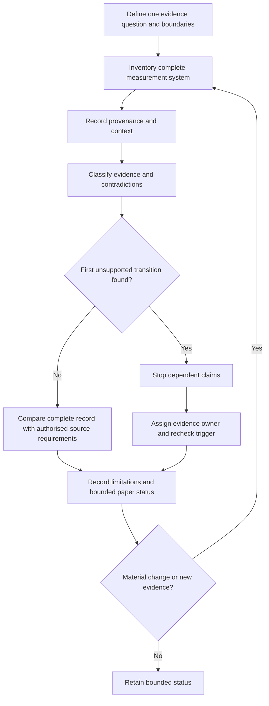
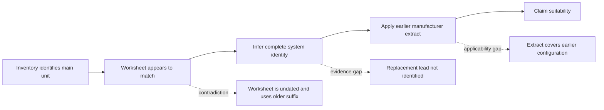

# Day 60 — Instrument Suitability, Limitations and Pre-Use Evidence

> **Scope boundary:** This original module is a paper-based evidence-review exercise. It does not teach instrument operation, practical checks, connections, settings, testing or acceptance decisions. Exact requirements require current authorised sources, approved procedures and qualified supervision.

## 1. Outcome and entry check

By the end, the learner can:

1. define the evidence question and the installation, circuit, source, operating-state, measurement-system, evidence, authority and decision boundaries;
2. distinguish availability, familiarity and displayed detail from evidenced suitability;
3. inventory the complete measurement system, including associated components, configuration information and applicable records;
4. classify each claim as a stated fact, derived fact, supported inference, assumption, contradiction or evidence gap;
5. separate identity, condition, capability, currency and limitation evidence without treating one category as a substitute for another;
6. locate the first unsupported transition in a suitability claim chain and stop dependent reasoning there;
7. assign an evidence owner and recheck trigger to every unresolved blocker; and
8. reopen the paper decision after two sequential material changes and communicate a bounded educational status.

### Entry check

For each statement, identify the evidence category and rate confidence as **low**, **medium** or **high**:

- the equipment case is present in the training-room photograph;
- the model identifier in an undated worksheet matches a current inventory record;
- one associated lead has no traceable identity or condition record;
- a display shows three decimal places; and
- the manufacturer document applies to an earlier configuration.

Then explain why confidence is not the same as correctness or evidence quality.

## 2. Why it matters

Equipment familiarity is not evidence. A defensible paper decision connects a precise question, known conditions, an authorised information source, the complete measurement-system record and the limits of interpretation. Missing or contradictory evidence produces an unresolved decision, not permission to assume.

**question → boundaries → complete system → provenance → applicability → limitations → bounded decision**

*Instructional caption: Decide from traceable records before treating any instrument or accessory as suitable; the closed case reinforces that this module authorises no practical use.*

## 3. Core concepts and terminology

- **Measurement system:** all equipment, associated components, configuration information and records relevant to one evidence question.
- **Associated component:** an item whose identity, condition or capability can materially affect what the complete system may support.
- **Availability:** evidence that an item can be accessed or is present.
- **Familiarity:** prior recognition or experience; it is not evidence of current suitability.
- **Suitability:** documented support that the complete system fits the stated question, conditions, configuration and authorised method source.
- **Identity evidence:** records showing exactly which equipment and associated components are being considered.
- **Condition evidence:** current, traceable records about observable condition and status.
- **Capability evidence:** authorised information describing what the complete system can support under stated conditions.
- **Currency evidence:** records showing whether information remains applicable at the relevant date and configuration.
- **Provenance:** where evidence came from, when it was created, who controlled it and which item or configuration it concerns.
- **Resolution:** the smallest reported increment; it does not independently establish accuracy.
- **Accuracy evidence:** documented support for the closeness of a result to an appropriate reference under stated conditions.
- **Limitation:** a factor that narrows the conclusion supported by the evidence.
- **False precision:** expressing more certainty or detail than the evidence supports.
- **Evidence states:** stated fact, derived fact, supported inference, assumption, contradiction and evidence gap.
- **First unsupported transition:** the earliest step from evidence to claim that lacks adequate applicable support.
- **Competing interpretation:** an alternative explanation retained until evidence resolves it.
- **Evidence owner:** the authorised source or qualified person responsible for resolving a blocker.
- **Recheck trigger:** new evidence or a material change that requires dependent reasoning to be reopened.
- **Educational status:** **secure**, **developing**, **unsupported** or `stop-required`; these are planning states, not official grades, verification outcomes or technical approvals.

## 4. Rule-finding workflow

Use **M-E-T-E-R-S**:

1. **M — Map the question and boundaries:** write one precise evidence question and define installation, circuit, source, operating-state, measurement-system, evidence, authority and decision boundaries.
2. **E — Establish provenance and context:** record item identities, dates, configurations, document owners, known conditions and unresolved states.
3. **T — Trace authorised sources:** identify current approved procedures and manufacturer information that a qualified reviewer would need to consult.
4. **E — Examine the complete-system record:** classify identity, condition, capability, currency and limitation evidence, while preserving contradictions and competing interpretations.
5. **R — Restrict at the first unsupported transition:** stop every dependent claim, assign an evidence owner and state a recheck trigger.
6. **S — State and reopen the bounded decision:** record suitable, unsuitable or unresolved **on paper only**, then reopen affected reasoning after each material change.

This diagram is a document-review and change-control loop. It does not prescribe any field check, connection, setting, test or acceptance action.

## 5. Visual model or worked example

A fictional dossier concerns a closed equipment case proposed for an unspecified verification-planning question. The dossier contains:

- inventory record `M-204`, naming the main unit;
- worksheet `W-17`, undated and using an older model suffix;
- photograph `P-08`, showing a case label but not the associated components;
- status record `S-11`, dated but not tied to a configuration;
- manufacturer extract `F-03`, applying to an earlier accessory combination;
- note `N-06`, stating that one lead was replaced; and
- no controlled record identifying the replacement lead.

The first unsupported transition is **“worksheet appears to match” → “complete system identity.”** Because the replacement lead is unidentified and the worksheet is undated, downstream capability and suitability claims remain unsupported even though the main unit is present and a status record exists.

| Claim step | Evidence state | Confidence | Boundary or action |
|---|---|---|---|
| Main unit `M-204` is listed | Stated fact | High | Limited to the inventory record |
| Worksheet refers to the current complete system | Assumption/contradiction | Low | Stop; date and suffix conflict |
| Replacement lead identity is known | Evidence gap | Low | Evidence owner required |
| Earlier manufacturer extract applies now | Unsupported inference | Low | Configuration applicability unresolved |
| Complete system is suitable | Unsupported | Low | No dependent paper conclusion |
| Reopening trigger | New controlled identity, configuration or source evidence | — | Rebuild affected claim chain |

### Worked-example fading

For a second fictional dossier, complete only:

1. the boundary statement;
2. complete-system inventory;
3. provenance register;
4. evidence-state and confidence labels;
5. first unsupported transition;
6. competing interpretations;
7. evidence owners and recheck triggers; and
8. bounded educational status.

## 6. Practical application

Using fictional records only, produce:

1. three precise evidence questions with explicit boundaries;
2. a complete-system inventory for each question;
3. a provenance register covering item, document, date, owner and configuration;
4. an identity, condition, capability, currency and limitation evidence matrix;
5. evidence-state and confidence labels for every material claim;
6. a claim chain locating the first unsupported transition;
7. a contradiction and competing-interpretation register;
8. an evidence-owner and recheck-trigger register; and
9. a bounded paper status that is reopened after two sequential changes:
   - an associated component is replaced; then
   - the operating state or authorised source changes.

### Criterion-level readiness states

Assess each criterion independently:

| Criterion | Secure | Developing | Unsupported | `stop-required` |
|---|---|---|---|---|
| Question and boundaries | Precise and complete | Minor ambiguity does not affect dependencies | Material boundary missing | Practical authority or unsafe scope implied |
| Complete-system inventory | All material items and records identified | One non-blocking detail unresolved | Associated component or configuration omitted | Unidentified system treated as suitable |
| Provenance and evidence classification | Traceable and consistently classified | Isolated correctable classification weakness | Material evidence accepted without provenance | Contradiction concealed or invented evidence used |
| Suitability reasoning | Stops at first unsupported transition | Stop point found after prompting | Dependent claims continue past a gap | Compliance, acceptance or field-use claim made |
| Limitations and ownership | Limits, owner and trigger explicit | One owner or trigger needs refinement | Blocker has no accountable resolution path | Missing evidence treated as permission |
| Change transfer | Both changes reopen all affected dependencies | One dependency reopened late | Prior conclusion retained without recheck | Changed configuration treated as already verified |

A learner is **secure** only when every material criterion is secure and no blocking condition is present. Strong performance in one criterion cannot offset an unsupported or `stop-required` state elsewhere.

## 7. Common errors and safety checkpoint

### Common errors

- treating availability, familiarity or a status label as suitability;
- recording only the main unit and ignoring associated components;
- accepting a document without checking date, owner, item identity, configuration or scope;
- confusing resolution with accuracy evidence;
- allowing confidence to substitute for evidence quality;
- collapsing identity, condition, capability and currency into one vague “checked” label;
- resolving contradictions silently instead of retaining competing interpretations;
- reasoning beyond the first unsupported transition;
- failing to assign an evidence owner or recheck trigger; and
- retaining a conclusion after a material change.

### Blocking conditions and stop rules

Set `stop-required` and remediate if the response:

- gives practical operating, connection, setting, checking or testing instructions;
- invents an official requirement, value, method, acceptance criterion or assessment claim;
- treats an unidentified component, stale record or ambiguous configuration as applicable;
- conceals a contradiction or manufactures missing provenance;
- claims suitability, compliance, acceptance or safety beyond the evidence and authority boundary; or
- continues dependent reasoning past the first unsupported transition.

This module authorises no site access, opening, switching, isolation, proving de-energised, testing, measurement, instrument use, alteration, repair, energisation, commissioning, acceptance, certification or field verification.

## 8. Retrieval and next links

1. Expand **M-E-T-E-R-S**.
2. Why are availability, familiarity and displayed detail insufficient evidence of suitability?
3. What belongs in a complete measurement-system inventory?
4. Distinguish identity, condition, capability, currency and limitation evidence.
5. Name the six evidence states.
6. What is the first unsupported transition?
7. Why must confidence be recorded separately from correctness and evidence quality?
8. What must be assigned to every unresolved blocker?
9. Which changes reopen a prior paper decision?

### Changed-scenario transfer

Reassess the fictional dossier after these sequential changes:

1. a controlled record identifies the replacement lead but reveals a different configuration; then
2. a later document supersedes the earlier manufacturer extract but applies only to another operating state.

Reopen every affected dependency after each change. Do not carry forward a conclusion merely because one earlier gap was resolved.

- **Plan:** [Twelve-Week Capstone Learning Plan](../MASTER_PLAN.md)
- **Knowledge note:** [[12-Week Day 60 - Instrument Suitability, Limitations and Pre-Use Evidence]]
- **Previous:** [Day 59 — Test Purposes, Dependencies and Safe Sequencing Concepts](day-59-test-purposes-dependencies-and-safe-sequencing-concepts.md)
- **Next:** [Day 61 — Rest, Retrieval and Sequence Reconstruction](day-61-rest-retrieval-and-sequence-reconstruction.md)

This module remains `review-required`, `reference_check_required`, safety-critical and not `technically-reviewed`.
