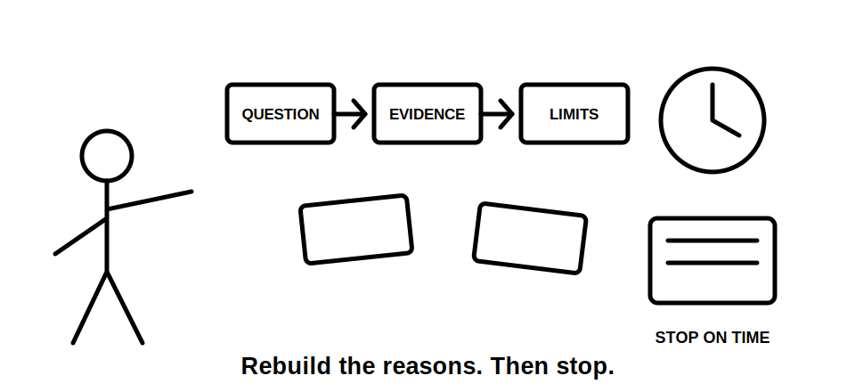
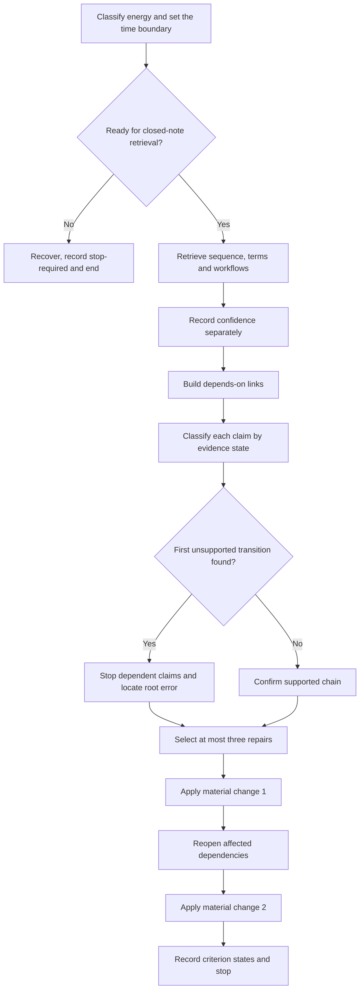
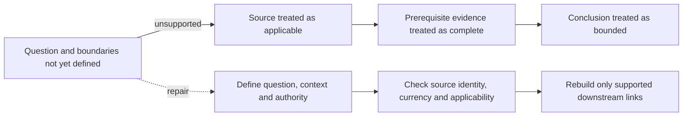

# Day 61 — Rest, Retrieval and Sequence Reconstruction

> **Scope boundary:** This recovery block adds no new electrical theory. It uses fictional, paper-only material to recover verification-planning dependencies, correct a maximum of three root errors and stop before fatigue or practical activity.

## 1. Outcome and entry check

By the end, the learner can:

1. classify energy as **ready**, **limited** or **stop** and apply the matching time boundary;
2. retrieve the Week 9 planning chain, **P-U-R-P-O-S-E** and **M-E-T-E-R-S** without notes;
3. reconstruct each sequence link using an explicit dependency reason rather than memorised order;
4. label each recalled claim as stated fact, derived fact, supported inference, assumption, contradiction or evidence gap;
5. record low, medium or high confidence separately from correctness and evidence quality;
6. identify the first unsupported transition and stop dependent reasoning there;
7. select no more than three root repairs, assign unresolved blockers an evidence owner and recheck trigger, and transfer the repairs across two sequential material changes; and
8. record a criterion-level **secure**, **developing**, **unsupported** or `stop-required` readiness state without making an official competency decision.

### Entry check

Before opening notes, record:

- energy: **ready**, **limited** or **stop**;
- available time: maximum 30 minutes, reduced to 15 minutes when energy is **limited**;
- current frustration or guessing level; and
- whether any practical electrical activity is occurring.

If energy is **stop**, practical activity is present, or attention is already unreliable, complete only a brief recovery action and end the block. Do not convert the recovery day into catch-up theory or practical work.

## 2. Why it matters

Recognition can create false confidence: a familiar sequence may look correct even when the learner cannot explain why one step depends on another. Reconstruction exposes the dependency model. Confidence calibration exposes errors that are both wrong and strongly believed. A bounded repair set prevents a rest block from becoming an exhausting study session.

The recovery pattern is:

**recover → retrieve → classify → reconstruct → locate the first unsupported transition → repair roots → transfer twice → stop**

*Instructional caption: Rebuild the reasons between cards, not merely the familiar order, and stop when evidence or energy no longer supports the next step.*

## 3. Core concepts and terminology

- **Closed-note retrieval:** recalling information before consulting the source.
- **Recognition:** identifying familiar information after it is shown; this is weaker evidence of learning than independent retrieval.
- **Sequence reconstruction:** rebuilding an order by explaining the dependency between each pair of steps.
- **Dependency:** a fact, decision or evidence item that must be established before a later claim can be supported.
- **Root error:** the earliest misconception or missing dependency that causes one or more downstream errors.
- **Symptom error:** a later incorrect answer produced by an earlier root error.
- **Blocking error:** an error that prevents coherent or safety-bounded progression.
- **Confidence calibration:** recording low, medium or high confidence separately from whether an answer is correct.
- **Evidence state:** one of six labels applied to a claim: **stated fact**, **derived fact**, **supported inference**, **assumption**, **contradiction** or **evidence gap**.
- **First unsupported transition:** the earliest arrow in a reasoning chain for which the preceding evidence does not support the next claim.
- **Repair set:** no more than three root or high-confidence errors selected for correction in this block.
- **Evidence owner:** the authorised source or qualified person responsible for resolving an evidence gap or contradiction.
- **Recheck trigger:** new evidence or a material scenario change that requires dependent reasoning to be reopened.
- **Material change:** a change capable of altering a dependency, such as changed circuit identity, source state, equipment identity, record date or authority boundary.
- **Changed-context transfer:** applying a corrected idea after a material change rather than repeating the original wording.
- **Fatigue stop:** an explicit end point triggered by reduced attention, repeated guessing, frustration, practical drift or the time limit.
- **Educational readiness state:** **secure**, **developing**, **unsupported** or `stop-required`; these are planning labels, not official grades or competency decisions.

## 4. Rule-finding workflow

Use **R-E-B-U-I-L-D**:

1. **R — Recover and bound:** classify energy, remove distractions and set the maximum time.
2. **E — Elicit before checking:** retrieve workflows, terms and the sequence without notes; record confidence beside each response.
3. **B — Build dependencies:** connect question, boundaries, prerequisites, sources, evidence, limitations and conclusion using “depends on because” statements.
4. **U — Uncover evidence states:** compare with the source, classify each claim and preserve contradictions instead of smoothing them away.
5. **I — Identify the first unsupported transition:** stop every dependent claim at that point and distinguish the root error from its symptoms.
6. **L — Limit and link repairs:** select no more than three root or high-confidence errors; assign an evidence owner and recheck trigger to anything unresolved.
7. **D — Double-transfer, decide and stop:** apply the repaired model after two sequential material changes, record criterion-level readiness and end the block.

The diagram shows two independent controls. Energy can stop the block before retrieval starts, while an unsupported transition can stop the reasoning chain after retrieval. Neither stop condition is a failure to be averaged away.

## 5. Visual model or worked example

A learner receives six shuffled fictional cards:

1. bounded conclusion;
2. evidence question;
3. authorised information source;
4. context and authority boundary;
5. prerequisite evidence;
6. limitation register.

The learner confidently places “authorised information source” first. After comparison, the learner records:

- “This source is current” — **assumption**, high confidence;
- “The evidence question is defined” — **evidence gap**, medium confidence;
- “The source applies to this context” — **unsupported inference**, high confidence.

The first unsupported transition is:

**unnamed question and context → source selected as applicable**

Every dependent conclusion about evidence completeness is paused. The root repair is not “memorise a different card order.” It is “define the question and boundaries before judging source applicability.”

The solid upper chain shows how one root assumption produces several symptom errors. The lower chain shows the repair: reopen the dependency at its first unsupported transition rather than editing only the final conclusion.

### Worked-example fading and two-change transfer

Reconstruct a second chain with only the evidence question supplied. Explain every arrow using “depends on because.” Then apply these changes in sequence:

1. the available record is discovered to describe an earlier equipment configuration; and
2. a separately supplied control circuit is disclosed.

After each change, identify every dependency that must reopen. Do not merely add the new fact to the end of the chain.

## 6. Practical application

Complete the following within the applicable 15–30 minute limit:

1. energy, time and stop check;
2. closed-note expansion of **P-U-R-P-O-S-E**, **M-E-T-E-R-S** and **R-E-B-U-I-L-D**;
3. six term definitions from Days 57–60;
4. one shuffled dependency-chain reconstruction using “depends on because” links;
5. confidence ratings recorded before checking;
6. evidence-state labels applied after checking;
7. the first unsupported transition and root error identified;
8. no more than three repairs selected;
9. evidence owner and recheck trigger recorded for each unresolved blocker;
10. two sequential material changes applied with affected dependencies reopened; and
11. criterion-level readiness recorded before stopping.

### Criterion-level readiness record

Assess each criterion independently:

| Criterion | Secure | Developing | Unsupported | `stop-required` |
|---|---|---|---|---|
| Recovery control | Energy, time and stop rules applied without drift | One prompt needed to maintain the boundary | Boundary recorded but not followed | Fatigue, guessing, frustration or practical drift makes continuation unreliable |
| Closed-note retrieval | Workflows and terms recalled before checking | Partial independent recall with bounded support | Notes copied or recognition substituted for retrieval | Continued attempts are producing guesses rather than evidence of recall |
| Dependency reconstruction | Every arrow has a coherent “depends on because” reason | Most links reasoned; one non-blocking gap remains | Sequence is memorised or contains an unresolved blocking dependency | A safety or authority dependency is bypassed |
| Evidence and confidence control | Evidence state and confidence are recorded separately and accurately | Minor classification correction required | Assumptions or contradictions are hidden | Reasoning continues beyond the first unsupported transition |
| Root-error repair | Maximum three root or high-confidence repairs; symptoms traced to roots | Repair set is bounded but one root/symptom distinction needs support | Many minor errors chased or root error missed | A blocking misconception remains untreated while progression is claimed |
| Ownership and transfer | Owners and triggers are explicit; two changes reopen all affected dependencies | One owner, trigger or reopened dependency needs support | Changes are appended without reopening the chain | An unresolved blocker is treated as approved or complete |
| Readiness communication | Criterion states and named supports are recorded without official claims | Decision is bounded but one support is vague | Feeling-based or aggregate score used | Competency, compliance or technical approval is claimed without authority |

There is no aggregate score. A stronger criterion cannot offset a blocking `stop-required` or unsupported safety, authority, source, operating-state or evidence-limit criterion.

### Blocking conditions

The block cannot be marked ready when any of the following remains:

- practical electrical direction or activity enters the exercise;
- fatigue or repeated guessing makes the evidence unreliable;
- a memorised order is accepted without dependency reasons;
- a high-confidence root error remains unidentified;
- contradictions or evidence gaps are converted into facts;
- reasoning continues beyond the first unsupported transition;
- an unresolved blocker lacks an evidence owner or recheck trigger; or
- an official competency, verification, compliance or technical-approval claim is made.

## 7. Common errors and safety checkpoint

### Common errors

- extending a recovery block into a full study session;
- opening notes before attempting retrieval;
- rewarding recognition as mastery;
- memorising a sequence without dependency reasons;
- confusing confidence with correctness;
- repairing downstream symptoms while leaving the root error intact;
- hiding contradictions to make the chain look complete;
- correcting every minor wording difference;
- repeating the same scenario as transfer;
- appending changed facts without reopening dependencies; and
- using an aggregate score to mask a blocking condition.

### Safety checkpoint and stop conditions

Stop immediately when:

- energy is **stop**;
- the applicable time limit is reached;
- attention falls, frustration rises or guesses repeat;
- practical electrical activity, equipment handling or procedural rehearsal begins;
- the learner cannot distinguish source evidence from memory;
- a safety, authority, source, operating-state or evidence-limit misconception remains blocking; or
- the exercise drifts toward an official verification or competency conclusion.

This module authorises no site access, opening, switching, isolation, proving de-energised, testing, measurement, instrument use, alteration, repair, energisation, commissioning, acceptance, certification or field verification.

Exact verification duties, sequences, test methods, values, acceptance criteria, documentation requirements, role permissions and official assessment expectations require current authorised sources and qualified review.

## 8. Retrieval and next links

1. Expand **R-E-B-U-I-L-D**.
2. Why is recognition weaker evidence than closed-note retrieval?
3. What distinguishes a root error from a symptom error?
4. Name the six evidence states.
5. Why must confidence be recorded separately from correctness?
6. What is the first unsupported transition?
7. What is the maximum repair set?
8. What must be assigned to an unresolved blocker?
9. Why are two sequential changes used?
10. State four stop conditions.

### Changed-scenario transfer

Rebuild the sequence after learning, in order, that the available records refer to an earlier configuration and that an additional source condition was omitted. After each disclosure, mark which earlier claims become unsupported, which dependencies reopen, and who owns the missing evidence.

- **Plan:** [Twelve-Week Capstone Learning Plan](../MASTER_PLAN.md)
- **Knowledge note:** [[12-Week Day 61 - Rest, Retrieval and Sequence Reconstruction]]
- **Previous:** [Day 60 — Instrument Suitability, Limitations and Pre-Use Evidence](day-60-instrument-suitability-limitations-and-pre-use-evidence.md)
- **Next:** [Day 62 — Result Plausibility and Evidence-Quality Reasoning](day-62-result-plausibility-and-evidence-quality-reasoning.md)

This module remains `review-required`, `reference_check_required`, safety-critical and not `technically-reviewed`.
