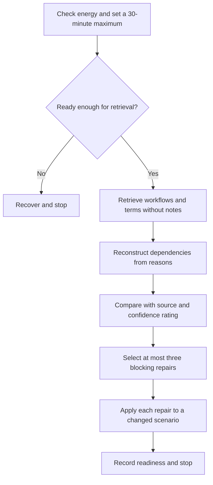

# Day 61 — Rest, Retrieval and Sequence Reconstruction

> **Scope boundary:** This recovery block adds no new electrical theory. It reconstructs paper-based verification reasoning from memory, corrects a small number of errors and stops before fatigue or practical activity.

## 1. Outcome and entry check

By the end, the learner can:

1. retrieve the Week 9 planning chain without notes;
2. reconstruct a dependency sequence from reasons rather than memorised order;
3. retrieve the **P-U-R-P-O-S-E** and **M-E-T-E-R-S** workflows;
4. identify high-confidence errors and missing prerequisites;
5. correct no more than three blocking weaknesses;
6. transfer each correction to a changed fictional context;
7. stop when the time or fatigue limit is reached; and
8. make an evidence-based readiness decision for Day 62.

### Entry check

Before opening notes, rate energy as **ready**, **limited** or **stop**. If **stop**, complete only the recovery action and reschedule retrieval. If **limited**, use the minimum retrieval set and do not extend the session.

## 2. Why it matters

Rest protects learning quality. Reconstruction exposes whether the learner understands why evidence activities depend on one another or merely recognises a familiar list. The goal is not volume. It is to recover the smallest blocking errors while preserving attention for the next learning block.

**recover → retrieve → reconstruct → compare → repair → transfer → stop**

## 3. Core concepts and terminology

- **Closed-note retrieval:** recalling information before consulting the source.
- **Sequence reconstruction:** rebuilding an order from dependencies and prerequisites.
- **Recognition:** identifying a familiar answer when it is shown; weaker than independent retrieval.
- **Blocking error:** a misconception that prevents safe or coherent progress.
- **High-confidence error:** an incorrect answer given with strong confidence and therefore prioritised for repair.
- **Repair set:** no more than three selected weaknesses addressed in this session.
- **Changed-context transfer:** applying a corrected idea to a materially different fictional scenario.
- **Fatigue stop:** an explicit end point triggered by reduced attention, repeated guessing, frustration or the time limit.
- **Readiness decision:** proceed, proceed with a named support, or repeat a bounded repair later.

## 4. Rule-finding workflow

Use **R-E-B-U-I-L-D**:

1. **R — Recover first:** check energy, distractions and the maximum 30-minute limit.
2. **E — Elicit from memory:** retrieve key terms and workflows before opening notes.
3. **B — Build the dependency chain:** place question, scope, prerequisites, sources, records, limitations and conclusion in a reasoned order.
4. **U — Uncover confidence errors:** compare with source material and mark errors by confidence.
5. **I — Isolate up to three repairs:** select only blocking or high-confidence weaknesses.
6. **L — Link each repair to a changed scenario:** answer a fresh prompt rather than copying wording.
7. **D — Decide readiness and stop:** record the next action and end the session.

The fixed endpoint prevents catch-up work from becoming an unbounded study session.

## 5. Visual model or worked example

A learner reconstructs this chain from shuffled cards:

- bounded conclusion;
- evidence question;
- authorised information source;
- context and authority;
- prerequisite evidence;
- limitation register.

The learner initially places “authorised information source” first. Comparison shows that a source cannot be selected intelligently until the question and context are defined. This is recorded as a dependency error, not a wording error.

### Worked-example fading

Reconstruct a second chain with only the first card supplied. Explain every arrow using “depends on” language. Then change one operating condition and identify which cards must be reopened.

## 6. Practical application

Complete the following within 20–30 minutes:

1. a two-minute energy and readiness check;
2. closed-note expansion of **P-U-R-P-O-S-E** and **M-E-T-E-R-S**;
3. six term definitions from Days 57–60;
4. one shuffled dependency-chain reconstruction;
5. confidence ratings before checking answers;
6. selection of no more than three repairs;
7. one changed-context question per repair; and
8. a proceed, proceed-with-support or repeat-later decision.

### Assessment rubric

Score each category from **0 to 2**:

| Category | 0 | 1 | 2 |
|---|---|---|---|
| Recovery control | Fatigue ignored | General limit | Energy check, time limit and stop applied |
| Retrieval | Notes copied | Partial recall | Independent recall before checking |
| Sequence reasoning | Memorised list | Some reasons | Every link explained by dependency |
| Error triage | All errors chased | Some priority | Maximum three blocking or high-confidence repairs |
| Transfer | Same wording repeated | Minor variation | Materially changed context solved |
| Readiness | Feeling-based | General judgement | Evidence-based decision with named support |

A score of **10/12 or higher** with no critical error indicates readiness for Day 62. This is an educational threshold only.

## 7. Common errors and safety checkpoint

### Common errors

- extending a rest block into a full study session;
- opening notes before attempting retrieval;
- rewarding recognition as mastery;
- memorising a sequence without dependency reasons;
- correcting every minor wording difference;
- ignoring high-confidence errors;
- repeating the same scenario as transfer; and
- proceeding despite a blocking safety misconception.

### Critical errors and stop conditions

Stop if fatigue rises, guessing replaces reasoning, the time limit is reached, frustration prevents useful retrieval or the learner starts converting the exercise into practical instructions. A blocking misconception about authority, sources, operating state or evidence limits requires targeted remediation before progression.

This module authorises no access, switching, isolation, testing, measurement, equipment operation, alteration, repair, energisation, commissioning, certification or verification.

## 8. Retrieval and next links

1. Expand **R-E-B-U-I-L-D**.
2. Why reconstruct dependencies rather than memorise a list?
3. What makes an error blocking?
4. Why prioritise high-confidence errors?
5. What is the maximum repair set?
6. State three fatigue stop signals.

### Changed-scenario transfer

Rebuild the sequence after learning that the available records refer to an earlier configuration and an additional source condition was omitted from the first attempt.

- **Plan:** [Twelve-Week Capstone Learning Plan](../MASTER_PLAN.md)
- **Knowledge note:** [[12-Week Day 61 - Rest, Retrieval and Sequence Reconstruction]]
- **Previous:** [Day 60 — Instrument Suitability, Limitations and Pre-Use Evidence](day-60-instrument-suitability-limitations-and-pre-use-evidence.md)
- **Next:** Day 62 — Result Plausibility and Evidence-Quality Reasoning

This module remains `review-required`, `reference_check_required`, safety-critical and not `technically-reviewed`.