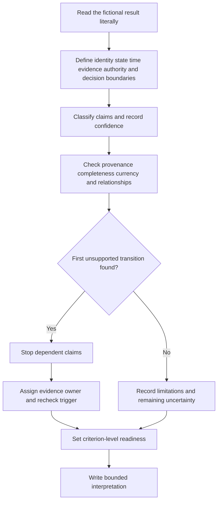
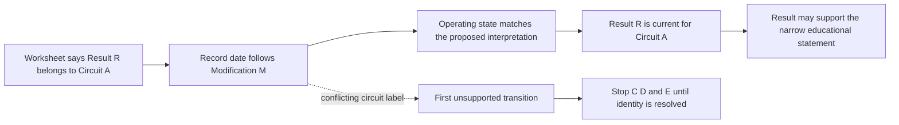

# Day 62 — Result Plausibility and Evidence-Quality Reasoning

> **Scope boundary:** This original module teaches paper-based review of fictional result records. It does not provide test methods, instrument instructions, official values, acceptance criteria or compliance decisions. Exact interpretation requirements require current authorised sources and qualified review.

## 1. Outcome and entry check

By the end, the learner can:

1. define the result, installation, circuit, source, operating-state, evidence, authority and decision boundaries for a fictional record;
2. separate a literal result from context, interpretation and conclusion without adding meaning;
3. classify each supporting claim as a stated fact, derived fact, supported inference, assumption, contradiction or evidence gap;
4. calibrate confidence separately from correctness and evidence quality;
5. test plausibility through identity, provenance, completeness, currency, consistency and relationship checks;
6. locate the first unsupported transition in a result-to-conclusion claim chain;
7. assign an evidence owner and recheck trigger to every unresolved blocker;
8. reopen affected reasoning after two sequential material changes; and
9. communicate criterion-level readiness without claiming technical acceptance or compliance.

### Entry check

Classify each statement as **literal result**, **context**, **interpretation** or **conclusion**:

- a value is written on a worksheet;
- the worksheet identifies the circuit and operating state;
- the value appears inconsistent with the surrounding fictional evidence; and
- the installation satisfies an applicable requirement.

Then record confidence as **low**, **medium** or **high**. Confidence is a self-monitoring signal, not proof.

## 2. Why it matters

A recorded value is not self-validating. Its usefulness depends on whether the record identifies what was considered, when, under which state, by whom, using what authorised evidence process, and whether later changes affect applicability. Plausibility review checks whether the result and surrounding evidence can coexist without contradiction. It does not decide compliance.

A common reasoning failure is to notice a familiar-looking number and jump directly to acceptance. This skips identity, provenance, operating state, currency and authority. The safer educational habit is:

**literal result → identity and state → provenance → related evidence → contradiction check → first unsupported transition → bounded statement**

*Instructional caption: Check the evidence story around the result; stop where an identity, state or provenance link is unsupported.*

## 3. Core concepts and terminology

- **Result:** a recorded observation or value from an authorised evidence activity.
- **Literal result:** the record reproduced without interpretation, correction or added meaning.
- **Result boundary:** the exact item, circuit, location, state and time to which a result is claimed to apply.
- **Provenance:** traceable information about origin, including record identity, date, responsible person and source.
- **Plausibility:** whether a result is reasonably compatible with its stated context and related evidence. Plausibility is not compliance.
- **Completeness:** whether the record contains enough information for the proposed bounded use.
- **Currency:** whether the evidence remains applicable after time, modification or changed conditions.
- **Consistency:** agreement between evidence items that should describe the same boundary and state.
- **Contradiction:** evidence items that cannot all be true within the same stated boundary.
- **False precision:** detail or certainty exceeding what the evidence supports.
- **Transcription risk:** the possibility that identity, units, signs, decimals or values were recorded incorrectly.
- **Relationship check:** a comparison between evidence items expected to have a logical relationship, without inventing an official numerical limit.
- **Evidence state:** one of stated fact, derived fact, supported inference, assumption, contradiction or evidence gap.
- **Confidence calibration:** recording low, medium or high confidence separately from correctness and evidence quality.
- **First unsupported transition:** the earliest arrow in a claim chain whose evidence or reasoning is insufficient.
- **Evidence owner:** the authorised source or qualified person responsible for resolving a blocker.
- **Recheck trigger:** new evidence or a material change requiring affected reasoning to reopen.
- **Bounded interpretation:** a statement of what the evidence may support, what it cannot support and what would require reconsideration.
- **Educational readiness state:** secure, developing, unsupported or `stop-required`; these are not official assessment grades or technical decisions.

### Boundary register

Before reviewing a result, record:

| Boundary | Question |
|---|---|
| Installation | Which fictional installation or subsystem is in scope? |
| Circuit or item | What exact identity is claimed? |
| Source | Which supply or energy source is relevant? |
| Operating state | What state is recorded, and is it evidenced? |
| Time | When was the result recorded relative to modifications? |
| Evidence | Which records are available, missing or conflicting? |
| Authority | Who may interpret, accept or certify in the real context? |
| Decision | What narrow educational statement is being considered? |

## 4. Rule-finding workflow

Use **R-E-S-U-L-T-S**:

1. **R — Read literally:** transcribe the result without correcting, rounding or interpreting it.
2. **E — Establish boundaries:** identify installation, circuit or item, source, operating state, date, evidence scope, authority and proposed decision.
3. **S — Sort evidence states:** label every material claim as stated fact, derived fact, supported inference, assumption, contradiction or evidence gap; record confidence separately.
4. **U — Use provenance and relationships:** check identity, traceability, completeness, currency and logical relationships with drawings, inspection records, earlier records and change history.
5. **L — Locate the first unsupported transition:** stop dependent reasoning at the earliest unsupported arrow; do not allow later evidence to conceal it.
6. **T — Track ownership and triggers:** name the authorised source or qualified person needed and the evidence or change that will reopen the claim chain.
7. **S — State criterion-level readiness:** communicate secure, developing, unsupported or `stop-required` for each criterion and write a bounded interpretation.

The diagram shows an evidence-control loop, not a test or acceptance sequence. A claim cannot become stronger merely because later steps appear complete.

### Claim-chain rule

Write each proposed conclusion as linked claims:

Here the circuit-label conflict breaks the chain before operating-state or current-applicability conclusions. Strong evidence later in the chain cannot repair the missing identity transition.

## 5. Visual model or worked example

### Fictional dossier

A workshop dossier contains:

- a result worksheet dated 12 May for **Circuit A**, signed by a named person;
- a drawing revised 10 May that renames the same area **Circuit A2**;
- a modification note dated 11 May describing a protective-device replacement but not the final circuit label;
- an undated photograph showing a label that may read **A** or **A2**;
- a worksheet field for operating state left blank; and
- a later email claiming “all results are still valid” without identifying the author’s authority or evidence basis.

### Worked review

| Review element | Evidence-controlled response |
|---|---|
| Literal result | Record exactly what the worksheet states; do not change it to match another document. |
| Identity boundary | Circuit A is stated, but Circuit A2 appears in a newer drawing. Identity is contradictory. |
| Time and currency | The worksheet follows the drawing and modification note, but applicability remains unresolved because identity and final configuration are unclear. |
| Operating state | Evidence gap; the worksheet field is blank. |
| Email claim | Unsupported inference unless authority and evidence basis are established. |
| First unsupported transition | “Worksheet Circuit A is the post-modification circuit described by the current drawing.” |
| Evidence owner | Current authorised circuit schedule or qualified reviewer responsible for the installation record. |
| Recheck trigger | Verified identity and configuration evidence, plus the recorded operating state. |
| Bounded interpretation | The literal result exists, but it cannot support the proposed current-circuit interpretation until identity, state and applicability are resolved. |

### Competing interpretations

Record at least two explanations when evidence conflicts:

1. the worksheet used an outdated label for the current circuit; or
2. the worksheet relates to a different circuit or pre-final configuration.

Neither explanation becomes a fact without evidence.

### Worked-example fading

For a second fictional record, provenance is complete but one inspection observation conflicts and a later configuration change is discovered. Complete only:

- the boundary register;
- claim classifications and confidence;
- the first unsupported transition;
- evidence owner and recheck trigger; and
- bounded interpretation.

## 6. Practical application

Review three fictional result records. For each, produce:

1. a literal transcription;
2. a complete boundary register;
3. a claim-and-confidence table;
4. a provenance, completeness and currency check;
5. a relationship and contradiction log;
6. a claim chain identifying the first unsupported transition;
7. an evidence-owner and recheck-trigger register;
8. a bounded interpretation; and
9. a criterion-level readiness record.

### Criterion-level readiness

Assess each criterion independently:

| Criterion | Secure | Developing | Unsupported | `stop-required` |
|---|---|---|---|---|
| Literal separation | Result, context, interpretation and conclusion remain distinct | Minor prompting needed | Meaning is added to the result | Result is altered to fit expectation |
| Boundary control | Identity, state, time, evidence, authority and decision boundaries are explicit | One non-blocking boundary is incomplete | A material boundary is assumed | Practical authority or acceptance is claimed |
| Evidence classification | Material claims and confidence are separately recorded | Some claims need reclassification | Assumptions are presented as facts | A contradiction is concealed or overridden |
| Plausibility review | Provenance, completeness, currency, consistency and relationships are checked | Review is partial but bounded | Familiarity substitutes for evidence | An official value or test procedure is invented |
| Unsupported-transition control | Earliest unsupported arrow is found and downstream claims stop | Correct gap found after prompting | Reasoning continues beyond the gap | The result is changed, discarded or practically retested without authority |
| Ownership and transfer | Owners and triggers are explicit; two changes reopen affected dependencies | One transfer needs prompting | Blockers have no owner or trigger | Material changes are ignored while acceptance is asserted |
| Communication | Bounded statement distinguishes plausibility from compliance | Boundary is present but imprecise | A pass/fail implication remains | Compliance, certification or technical approval is claimed |

Readiness for Day 63 requires no `stop-required` criterion and no unsupported blocking criterion. Strong performance elsewhere cannot offset a blocking identity, state, provenance, contradiction, authority or safety defect. These are educational planning states only.

### Two-change transfer

Apply two sequential changes to one fictional dossier:

1. evidence confirms that the modification occurred before the result date; then
2. a current drawing changes the circuit identity again while the operating state remains absent.

After each change, reopen every affected dependency rather than editing only the final sentence.

## 7. Common errors and safety checkpoint

### Common errors

- treating a result as an interpretation or conclusion;
- checking apparent magnitude while ignoring identity, state or time;
- assuming an unusual result must be wrong;
- assuming a familiar result must be right;
- forcing evidence to match expectation;
- ignoring modifications or source changes;
- accepting displayed detail as accuracy or certainty;
- overlooking sign, decimal, unit or identity transcription risks;
- using one result to support unrelated requirements;
- averaging criterion scores so a blocking defect disappears;
- continuing beyond the first unsupported transition; and
- converting plausibility into acceptance, compliance or certification.

### Critical errors and stop conditions

Set `stop-required` and remediate if the learner:

- invents an official value, test method, acceptance criterion or procedure;
- changes a fictional result to make it fit;
- ignores or hides a material contradiction;
- treats missing identity, operating state or provenance as complete;
- directs practical retesting, switching, isolation, measurement or equipment operation;
- continues dependent conclusions beyond the first unsupported transition; or
- claims competency, compliance, verification, certification or technical approval.

This module authorises no site access, opening, switching, isolation, proving de-energised, testing, measurement, instrument use, alteration, repair, energisation, commissioning, acceptance, certification or field verification.

## 8. Retrieval and next links

1. Expand **R-E-S-U-L-T-S**.
2. Why is plausibility not compliance?
3. Name the six evidence states.
4. Why is confidence recorded separately?
5. What is the first unsupported transition?
6. Name six boundary fields that must be explicit.
7. What is an evidence owner?
8. What two changes force affected reasoning to reopen?
9. Why can a strong criterion not offset a blocking unsupported criterion?

### Changed-scenario transfer

Regrade the fictional dossier after learning that the signed worksheet was copied from a prior job. Reopen provenance, identity, currency, authority and every dependent claim before writing a new bounded statement.

- **Plan:** [Twelve-Week Capstone Learning Plan](../MASTER_PLAN.md)
- **Knowledge note:** [[12-Week Day 62 - Result Plausibility and Evidence-Quality Reasoning]]
- **Previous:** [Day 61 — Rest, Retrieval and Sequence Reconstruction](day-61-rest-retrieval-and-sequence-reconstruction.md)
- **Next:** [Day 63 — Week 9 Verification Planning Checkpoint](day-63-week-9-verification-planning-checkpoint.md)

This module remains `review-required`, `reference_check_required`, safety-critical and not `technically-reviewed`.