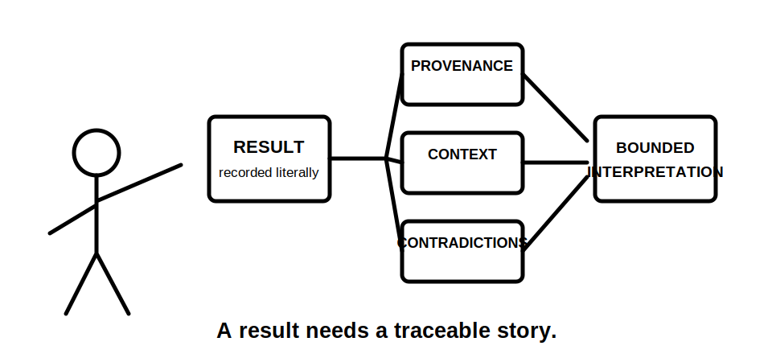
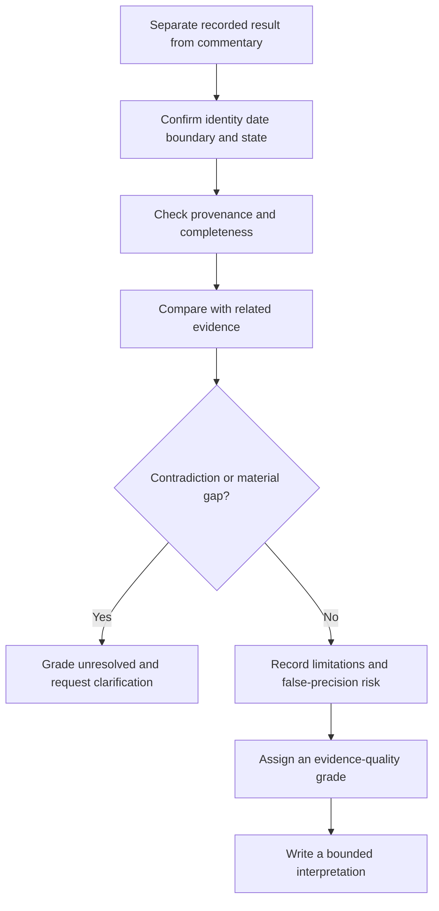

# Day 62 — Result Plausibility and Evidence-Quality Reasoning

> **Scope boundary:** This original module teaches paper-based review of fictional results. It does not provide test methods, operating instructions, official values or acceptance decisions. Exact interpretation requirements require current authorised sources and qualified review.

## 1. Outcome and entry check

By the end, the learner can:

1. distinguish a recorded result from an interpretation and conclusion;
2. assess whether a result is plausible in the stated context;
3. compare result provenance, completeness, currency and consistency;
4. identify contradictions between documents, inspection evidence and fictional results;
5. recognise false precision, transcription risk and unsupported extrapolation;
6. assign an evidence-quality grade without claiming compliance;
7. identify when a result or plan must be reopened; and
8. write a bounded evidence-review statement.

### Entry check

Classify each statement as **result**, **context**, **interpretation** or **conclusion**:

- a value is recorded on a worksheet;
- the record identifies the circuit and operating state;
- the value appears inconsistent with the surrounding evidence; and
- the installation satisfies an applicable requirement.

## 2. Why it matters

A recorded value is not self-validating. Plausibility review asks whether the result fits its identity, conditions, provenance, expected relationships and surrounding evidence. An unusual result may indicate a real condition, a recording problem, an incorrect boundary or incomplete context. The correct response is to reopen the evidence chain, not to force the result to match expectation.

**result record → provenance → context → comparison → contradiction check → quality grade → bounded interpretation**

## 3. Core concepts and terminology

- **Result:** a recorded observation or value from an authorised evidence activity.
- **Provenance:** where the result came from, including identity, date, source record and responsible person.
- **Plausibility:** whether a result is reasonably consistent with the stated context and related evidence; it is not the same as compliance.
- **Consistency:** agreement between evidence items that should describe the same boundary and state.
- **Contradiction:** material evidence that cannot all be true within the stated context.
- **Completeness:** whether the record contains the information needed for interpretation.
- **Currency:** whether the result still applies after time, modification or changed conditions.
- **False precision:** more detail or certainty than the evidence justifies.
- **Transcription risk:** the possibility that identity, units, signs, decimals or values were recorded incorrectly.
- **Evidence-quality grade:** a transparent rating of how strongly a result can support a bounded claim.
- **Reopening trigger:** a contradiction, missing field, changed condition or new evidence that invalidates the current interpretation.

## 4. Rule-finding workflow

Use **R-E-S-U-L-T-S**:

1. **R — Read the record literally:** separate the recorded result from commentary.
2. **E — Establish identity and context:** confirm boundary, date, state, source and responsible record.
3. **S — Scan provenance and completeness:** check whether the record can be traced and interpreted.
4. **U — Use related evidence:** compare drawings, inspection records, prior results and stated expectations without treating them as proof.
5. **L — Locate contradictions and limitations:** identify mismatch, missing context, false precision and transcription risk.
6. **T — Tier the evidence quality:** grade it as strong, usable-with-limits, weak or unresolved.
7. **S — State the bounded interpretation:** explain what the evidence may support, what it cannot support and what reopens it.

The model reviews evidence quality only. It does not decide official acceptance.

## 5. Visual model or worked example

A fictional worksheet contains a result for Circuit A. The date and responsible person are recorded, but the drawing uses a different circuit identifier and a later modification note exists.

| Review field | Bounded response |
|---|---|
| Literal result | Recorded without adding meaning. |
| Provenance | Date and author present; circuit identity conflicts. |
| Context | Operating state not recorded. |
| Related evidence | Drawing and modification note may describe a different configuration. |
| Contradiction | Circuit identity and currency are unresolved. |
| Quality grade | Unresolved. |
| Interpretation | The result cannot support the proposed current-circuit conclusion until identity and applicability are established. |

### Worked-example fading

For a second fictional record, provenance is complete but one related inspection observation appears inconsistent. Complete the contradiction analysis, quality grade, bounded interpretation and reopening triggers.

## 6. Practical application

Review three fictional result records and produce:

1. a literal result transcription;
2. an identity and context register;
3. a provenance and completeness check;
4. a comparison with related evidence;
5. a contradiction and limitation log;
6. a false-precision or transcription-risk check;
7. an evidence-quality grade; and
8. a bounded interpretation with reopening triggers.

### Assessment rubric

Score each category from **0 to 2**:

| Category | 0 | 1 | 2 |
|---|---|---|---|
| Result separation | Conclusion substituted | Partial separation | Result, interpretation and conclusion distinct |
| Identity and provenance | Omitted | Some fields | Boundary, date, state and source traceable |
| Comparison | Result accepted alone | Some cross-checking | Relevant evidence compared without circular proof |
| Contradiction control | Conflict ignored | Conflict named | Material conflicts connected to reopening action |
| Quality grading | Pass/fail invented | General caution | Transparent grade with specific limitations |
| Safety communication | Acceptance claimed | Partial boundary | Bounded interpretation and no practical authority |

A score of **10/12 or higher** with no critical error indicates readiness for Day 63. This is an educational threshold only.

## 7. Common errors and safety checkpoint

### Common errors

- treating a result as a conclusion;
- checking magnitude while ignoring identity or state;
- assuming an unusual result must be wrong;
- forcing evidence to match expectation;
- ignoring later modifications;
- accepting excessive displayed detail as certainty;
- overlooking transcription and unit risks;
- using one result to prove unrelated requirements; and
- converting plausibility into an official acceptance decision.

### Critical errors and stop conditions

Stop and remediate if the response invents an acceptance value, changes a fictional result to make it fit, ignores a material contradiction, treats missing provenance as complete, or directs practical retesting or equipment operation.

This module authorises no access, switching, isolation, testing, measurement, equipment operation, alteration, repair, energisation, commissioning, certification or verification.

## 8. Retrieval and next links

1. Expand **R-E-S-U-L-T-S**.
2. Why is plausibility not compliance?
3. What is provenance?
4. Name four contradiction or reopening triggers.
5. What causes false precision?
6. State the four evidence-quality grades.

### Changed-scenario transfer

Regrade the fictional record after discovering that the modification occurred before the result date but the operating state and circuit label remain unresolved.

- **Plan:** [Twelve-Week Capstone Learning Plan](../MASTER_PLAN.md)
- **Knowledge note:** [[12-Week Day 62 - Result Plausibility and Evidence-Quality Reasoning]]
- **Previous:** [Day 61 — Rest, Retrieval and Sequence Reconstruction](day-61-rest-retrieval-and-sequence-reconstruction.md)
- **Next:** [Day 63 — Week 9 Verification Planning Checkpoint](day-63-week-9-verification-planning-checkpoint.md)

This module remains `review-required`, `reference_check_required`, safety-critical and not `technically-reviewed`.