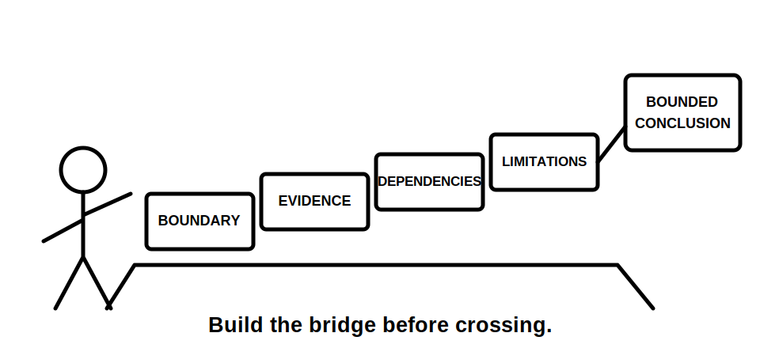
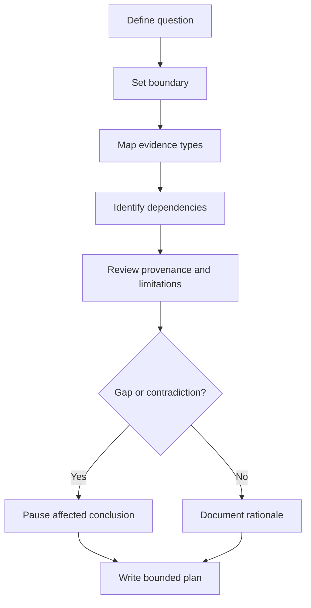

# Day 63 — Week 9 Verification Planning Checkpoint

> **Scope boundary:** This original module assesses document-based planning only. It provides no field procedure, operating instruction, official sequence, acceptance value or practical authority. Exact requirements require authorised sources and qualified review.

## 1. Outcome and entry check

By the end, the learner can:

1. define a verification question and evidence boundary;
2. separate design, inspection, result and documentary evidence;
3. identify responsibilities and limitations;
4. map prerequisites and dependencies;
5. assess equipment records at document level;
6. distinguish results, interpretations and conclusions;
7. identify contradictions and reopening triggers; and
8. produce a bounded evidence plan.

### Entry check

For a fictional altered circuit, list one example each of design, inspection, result and documentary evidence. State why none proves the others automatically.

## 2. Why it matters

A defensible plan connects the question, boundary, evidence type, dependency, provenance, limitation and conclusion. Missing links remain visible rather than being replaced by confidence or habit.

**question → boundary → evidence map → dependencies → provenance → contradiction check → bounded conclusion**

## 3. Core concepts and terminology

- **Verification question:** the specific matter the evidence is intended to address.
- **Boundary:** the circuit, equipment, state, date and scope covered by the plan.
- **Evidence map:** a record of evidence types and the limited claims each may support.
- **Dependency:** information needed before another item can be interpreted.
- **Prerequisite:** a dependency that must be established before the next planned evidence step is valid.
- **Evidence gap:** required information that is unavailable.
- **Contradiction:** evidence items that cannot all describe the same boundary and state accurately.
- **Reopening trigger:** new information or changed conditions that invalidate part of the plan.
- **Bounded conclusion:** a statement limited to the available evidence, scope and authority.

## 4. Rule-finding workflow

Use **P-L-A-N-N-E-R**:

1. **P — Pin down the question.**
2. **L — Locate the boundary.**
3. **A — Allocate evidence types.**
4. **N — Name prerequisites and dependencies.**
5. **N — Note provenance and limitations.**
6. **E — Examine contradictions and gaps.**
7. **R — Record a bounded plan and reopening triggers.**

The diagram is a reasoning model, not an official sequence.

## 5. Visual model or worked example

A fictional record includes a drawing, inspection note, equipment record and two result records. The drawing predates an alteration, one result lacks circuit identity and the equipment record does not identify the complete accessory set.

| Planning field | Bounded response |
|---|---|
| Question | What evidence supports the current altered-circuit record? |
| Boundary | Current circuit, stated condition and date. |
| Evidence map | Evidence types remain separate. |
| Dependencies | Current identity and drawing applicability must be established. |
| Limitations | Complete equipment-system record is unresolved. |
| Contradictions | Drawing currency and result identity conflict with the proposed conclusion. |
| Plan status | Partially blocked pending clarified evidence. |

### Worked-example fading

For a second fictional record, complete the evidence map, dependency chain, reopening triggers and bounded conclusion.

## 6. Practical application

Produce a one-page planning pack containing:

1. question and scope statement;
2. boundary register;
3. evidence-type matrix;
4. dependency map;
5. provenance and limitation review;
6. contradiction log;
7. rationale; and
8. bounded conclusion with reopening triggers.

### Assessment rubric

Score each category from **0 to 2**:

| Category | 0 | 1 | 2 |
|---|---|---|---|
| Question and boundary | Unclear | Partly defined | Specific and bounded |
| Evidence separation | Collapsed | Partial | Evidence types distinct |
| Dependencies | Memorised order | Some reasons | Dependencies linked to purpose |
| Provenance | Assumed | Partial | Identity, currency and limits recorded |
| Contradictions | Ignored | Named | Connected to pause or reopening action |
| Safety communication | Authority implied | General caution | Explicit boundary and no practical authority |

A score of **10/12 or higher** with no critical error indicates readiness for Day 64. This is an educational threshold only.

## 7. Common errors and safety checkpoint

### Common errors

- using a memorised order without purpose;
- treating one evidence type as proof of all requirements;
- accepting outdated or unidentified records;
- assuming availability proves suitability;
- choosing a preferred record instead of resolving conflict; and
- presenting a plan as authority to perform work.

### Critical errors and stop conditions

Stop and remediate if the response invents a procedure or value, ignores a material contradiction, treats missing identity as complete, or claims practical authority.

This module authorises no practical electrical work or formal verification.

## 8. Retrieval and next links

1. Expand **P-L-A-N-N-E-R**.
2. Why must evidence types remain separate?
3. What distinguishes a prerequisite from a reopening trigger?
4. Name four boundary fields.
5. What makes a conclusion bounded?

### Changed-scenario transfer

Revise the plan after a later document confirms the drawing is current but reveals an alternate supply affecting the stated boundary.

- **Plan:** [Twelve-Week Capstone Learning Plan](../MASTER_PLAN.md)
- **Knowledge note:** [[12-Week Day 63 - Week 9 Verification Planning Checkpoint]]
- **Previous:** [Day 62 — Result Plausibility and Evidence-Quality Reasoning](day-62-result-plausibility-and-evidence-quality-reasoning.md)
- **Next:** [Day 64 — Continuity Evidence and Common Interpretation Errors](day-64-continuity-evidence-and-common-interpretation-errors.md)

This module remains `review-required`, `reference_check_required`, safety-critical and not `technically-reviewed`.