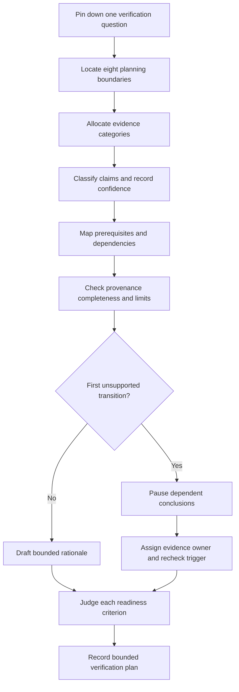
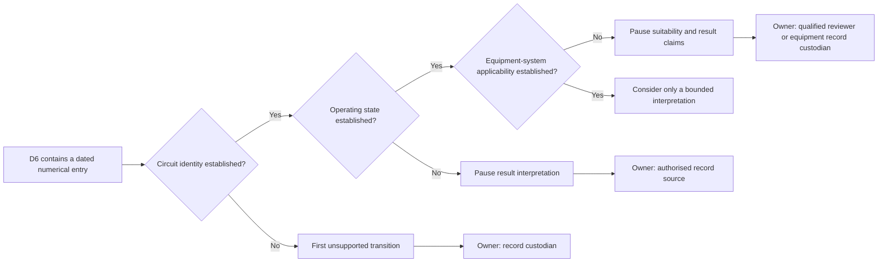

# Day 63 — Week 9 Verification Planning Checkpoint

> **Scope boundary:** This original module assesses document-based verification planning only. It provides no field procedure, test sequence, instrument instruction, acceptance value, switching direction, isolation method or practical authority. Exact verification requirements require current authorised sources, approved procedures and qualified review.

## 1. Outcome and entry check

By the end, the learner can independently:

1. define the verification question in one sentence and state the installation, circuit, source, operating-state, time, evidence, authority and decision boundaries;
2. classify each material claim as a stated fact, derived fact, supported inference, assumption, contradiction or evidence gap;
3. record low, medium or high confidence separately from correctness and evidence quality;
4. separate design, inspection, result, equipment and documentary evidence without allowing one category to prove another automatically;
5. build a dependency map that explains why each prerequisite must be resolved before a later interpretation is attempted;
6. identify the first unsupported transition in every material claim chain and stop all dependent conclusions there;
7. record competing interpretations without promoting either interpretation to fact;
8. assign an evidence owner and recheck trigger to every unresolved blocker;
9. reopen affected dependencies after two sequential material changes; and
10. communicate criterion-level readiness using **secure**, **developing**, **unsupported** or `stop-required` without making an official assessment, verification, competency or compliance claim.

### Entry check

Without notes, consider a fictional altered final subcircuit and write one example each of:

- design evidence;
- inspection evidence;
- result evidence;
- equipment-system evidence; and
- documentary evidence.

For each example, state one limited claim it may support and one claim it cannot establish by itself. Mark confidence as low, medium or high. If any item is treated as automatic proof of another evidence category, return to Days 57–62 before attempting the checkpoint.

## 2. Why it matters

A verification plan is not a list of remembered tests. It is a controlled argument connecting a defined question to evidence that is applicable, traceable, sufficiently complete and interpreted within the learner's authority. A plan becomes unsafe when it hides uncertain identity, ignores an alternate source, assumes an instrument record applies, collapses inspection and result evidence, or continues reasoning after an unsupported transition.

The checkpoint therefore examines the integrity of the reasoning chain rather than whether the learner can reproduce an unofficial sequence:

**question → boundaries → claims → evidence states → dependencies → provenance → contradictions → bounded plan**

*The bridge is instructional rather than decorative: each labelled block represents evidence that must be present and connected before the learner can cross from a question to a bounded conclusion.*

## 3. Core concepts and terminology

### Planning boundaries

- **Installation boundary:** the physical installation or defined part of it covered by the plan.
- **Circuit boundary:** the identified circuit, conductors, connected equipment and relevant interfaces covered by the plan.
- **Source boundary:** every known or possible source that may affect the stated circuit or evidence interpretation.
- **Operating-state boundary:** the documented configuration or condition in which an observation or result was obtained.
- **Time boundary:** the date or period to which a drawing, photograph, record or result applies.
- **Evidence boundary:** the records included in the planning pack and the records expressly excluded or unavailable.
- **Authority boundary:** what the learner may analyse on paper versus what requires a qualified person, approved procedure or authorised source.
- **Decision boundary:** the limited decision the evidence plan is intended to support; not a general declaration that the installation is safe or compliant.

### Evidence categories

- **Design evidence:** records of intended arrangement, such as an identified drawing or schedule. It describes intent only when identity and currency are established.
- **Inspection evidence:** documented observations of visible or accessible conditions. It does not prove hidden conditions or test outcomes.
- **Result evidence:** recorded observations or readings from a stated activity. It does not prove identity, method suitability, acceptance or compliance unless those dependencies are separately established.
- **Equipment-system evidence:** records identifying the complete measurement system, configuration, accessories, limitations and relevant pre-use evidence. Availability or familiarity is not proof of suitability.
- **Documentary evidence:** labels, certificates, alteration records, photographs, correspondence and other records. Its value depends on provenance, identity, date, completeness and consistency.

### Evidence states

- **Stated fact:** information explicitly present in a supplied record.
- **Derived fact:** information obtained transparently from stated facts without adding an assumption.
- **Supported inference:** a provisional interpretation supported by evidence but still weaker than a directly stated fact.
- **Assumption:** an unverified proposition introduced to continue reasoning.
- **Contradiction:** two or more evidence items that cannot all describe the same boundary and state accurately.
- **Evidence gap:** information needed for a claim or dependency that is absent, unreadable, unidentified or outside the evidence pack.

### Dependency control

- **Dependency:** information required before another item can be interpreted reliably.
- **Prerequisite:** a dependency that must be established before a planned evidence step or interpretation is valid.
- **Claim chain:** a sequence linking evidence to an interpretation and then to a conclusion.
- **First unsupported transition:** the earliest arrow in a claim chain that lacks adequate support. Every dependent claim after that arrow remains unsupported.
- **Competing interpretations:** two or more plausible explanations retained while the available evidence cannot distinguish between them.
- **Evidence owner:** the authorised source, record custodian or qualified person responsible for resolving a blocker.
- **Recheck trigger:** a defined event—such as a corrected drawing, confirmed source, identified circuit, changed equipment record or new observation—that requires affected reasoning to reopen.
- **Bounded plan:** a paper-based plan that states what is supported, what remains unresolved, who must resolve it and what must be reconsidered after change.

### Confidence and readiness

- **Confidence:** the learner's self-rating of certainty: low, medium or high. It is not evidence and does not change correctness.
- **Secure:** the criterion is satisfied with traceable reasoning and no unresolved blocker.
- **Developing:** the reasoning direction is useful but incomplete, weakly explained or insufficiently transferred.
- **Unsupported:** the criterion lacks the evidence or reasoning needed to support it.
- **`stop-required`:** the response crosses a safety, authority or evidence boundary and must stop before progression.

These readiness states are educational planning labels only. They are not official grades, competency decisions, verification outcomes, technical approvals or legal conclusions.

## 4. Rule-finding workflow

Use **P-L-A-N-N-E-R** as an evidence-control workflow:

1. **P — Pin down the question.** Write one specific question. Reject broad questions such as “Is this installation compliant?” because they exceed the evidence and decision boundary.
2. **L — Locate every boundary.** Record installation, circuit, source, operating-state, time, evidence, authority and decision boundaries. Treat an omitted source or unidentified circuit as unresolved, not harmless.
3. **A — Allocate evidence and classify claims.** Place each record into its evidence category. Classify every material claim using the six evidence states and record confidence separately.
4. **N — Name prerequisites and dependencies.** For each proposed interpretation, explain what must already be established and why. Do not substitute a memorised order for a dependency reason.
5. **N — Note provenance, completeness and limitations.** Record origin, author or custodian where known, date, version, identity, scope, missing fields, configuration limits and conflicts.
6. **E — Examine claim chains.** Locate the first unsupported transition, retain competing interpretations, and pause every dependent conclusion beyond that point.
7. **R — Record ownership, triggers and readiness.** Assign an evidence owner and recheck trigger to each blocker. Judge each criterion independently as secure, developing, unsupported or `stop-required`.

The diagram shows the complete paper-based reasoning loop. It is not an official verification or test sequence. Its key control is the branch at the first unsupported transition: unresolved reasoning is owned and reopened rather than hidden inside a confident conclusion.

### Rule-source register

For each exact requirement that the scenario would eventually need, record:

| Register field | Required entry |
|---|---|
| Topic | The narrow requirement being sought |
| Authorised source | Current standard, legislation, regulator guidance, approved procedure or manufacturer information |
| Applicability question | Why the source may apply to this boundary and state |
| Exactness status | `reference_check_required` until verified |
| Evidence owner | Person or source responsible for confirming it |
| Recheck trigger | New information or changed condition that reopens the item |

Do not copy standards tables, figures, systematic clause wording or unofficial values into the planning pack.

## 5. Visual model or worked example

### Fictional dossier: altered amenities distribution circuit

The learner receives an original fictional evidence pack:

- **D1 — Drawing:** a labelled circuit drawing dated before a refurbishment. A handwritten note says “updated”, but no author or revision identifier is shown.
- **D2 — Distribution schedule:** identifies circuit `A-7` as “amenities”, while two result sheets use `A7-R` and `DB-A/7`.
- **D3 — Inspection note:** records a replacement protective device and a new local enclosure but does not identify whether the enclosure was open, energised or supplied from another source.
- **D4 — Photograph:** shows an enclosure and label, but the image date and relationship to the current installation are unknown.
- **D5 — Equipment record:** identifies a measurement instrument body but not the lead set, configuration, accessory identity or pre-use evidence.
- **D6 — Result sheet 1:** contains a numerical entry and date but no operating state, circuit identifier or person responsible.
- **D7 — Result sheet 2:** identifies `A7-R`, states that work followed the refurbishment and includes a reviewer initial, but the initial cannot be linked to a named role.
- **D8 — Email:** states that “everything was checked after the upgrade” without identifying scope, evidence or authority.
- **D9 — Source note:** indicates that a small control circuit may be separately supplied, but the relationship to the altered enclosure is unresolved.

### Boundary register

| Boundary | Bounded record |
|---|---|
| Installation | Amenities distribution area only; exact altered extent unresolved |
| Circuit | Proposed `A-7` boundary; identity conflict with `A7-R` and `DB-A/7` |
| Source | Normal source identified; possible separately supplied control path unresolved |
| Operating state | Missing from result sheet 1 and inspection note |
| Time | Refurbishment occurred after D1; photograph date unknown |
| Evidence | D1–D9 only; no assumption that absent records do not exist |
| Authority | Paper-based learner analysis only |
| Decision | Whether the supplied dossier supports a verification plan, not whether the circuit is safe or compliant |

### Evidence-state examples

| Claim | State | Confidence | Reason |
|---|---|---|---|
| D1 predates the refurbishment | Stated fact | High | Dates are explicit in the dossier |
| `A-7`, `A7-R` and `DB-A/7` identify the same current circuit | Assumption | Low | No cross-reference establishes equivalence |
| D6 applies to the altered circuit | Evidence gap | Low | Circuit identity and operating state are absent |
| The control circuit could affect the source boundary | Supported inference | Medium | D9 identifies a possible separate supply, but connection is unresolved |
| D7 and D2 describe the same boundary | Competing interpretations | Medium | Naming similarity supports one interpretation; absent revision linkage supports another |
| The email proves complete verification | Unsupported conclusion | High-confidence error | Scope, provenance, method and authority are absent |

### Worked claim chain

The literal fact that D6 contains a dated entry is supported. The first unsupported transition occurs when the learner tries to attach that entry to the altered circuit. Consequently, later claims about operating state, equipment suitability, interpretation or acceptance cannot proceed until identity is resolved.

### Competing interpretations

- **Interpretation A:** `A-7`, `A7-R` and `DB-A/7` are informal variations for the same circuit after refurbishment.
- **Interpretation B:** one identifier refers to the original circuit and another to a replacement or split circuit.

Both remain provisional. The learner must not select the more convenient interpretation. The evidence owner is the drawing or schedule custodian, and the recheck trigger is a current controlled cross-reference or qualified confirmation of circuit identity.

### Worked-example fading

For a second fictional dossier, the facilitator supplies only the question, seven mixed records and one later change. The learner must independently create:

1. the eight-boundary register;
2. the evidence-category matrix;
3. the six-state claim register with confidence;
4. the dependency map;
5. two competing interpretations;
6. the first unsupported transition;
7. evidence owners and recheck triggers; and
8. criterion-level readiness decisions.

No model answer is revealed until the learner has committed to the full paper-based plan.

## 6. Practical application

Produce a one-page verification-planning pack for the fictional dossier. It must contain:

1. a one-sentence verification question;
2. an eight-field boundary register;
3. an evidence-category matrix;
4. a claim register using all applicable evidence states;
5. confidence recorded separately for each material claim;
6. a dependency map explaining why each prerequisite matters;
7. a provenance, completeness, currency and limitation review;
8. a contradiction and competing-interpretation log;
9. the first unsupported transition for each material claim chain;
10. an evidence owner and recheck trigger for every blocker;
11. a bounded rationale stating what the dossier can and cannot support; and
12. criterion-level readiness states.

### Criterion-level readiness record

Judge each criterion independently:

| Criterion | Secure | Developing | Unsupported | `stop-required` |
|---|---|---|---|---|
| Question and boundaries | Specific question; all eight boundaries explicit | Useful scope with one non-blocking omission | Material boundary missing or assumed | Broad compliance/safety claim exceeds authority |
| Evidence separation | Categories remain distinct and limited | Mostly distinct with one weak linkage | One category is used as automatic proof of another | Evidence is altered, invented or concealed |
| Claim classification and confidence | Material claims correctly classified; confidence separate | Minor classification or calibration weakness | Assumptions or contradictions are hidden | High-confidence unsupported claim is used to authorise action |
| Dependencies | Reasons and prerequisites are explicit | Sequence mostly sound but reasons incomplete | Memorised order replaces dependency logic | Planning continues through an unresolved safety-critical dependency |
| Provenance and equipment-system review | Identity, date, version, configuration and limits are recorded | Review is useful but incomplete | Availability or familiarity is treated as suitability | Unidentified or unsuitable evidence is represented as verified |
| Unsupported-transition control | First unsupported transition located and downstream claims paused | Correct blocker found after some overreach | Dependent claims continue without support | Unsupported reasoning is used for practical direction or acceptance |
| Ownership and reopening | Every blocker has an owner and trigger | One non-critical owner or trigger is vague | Blockers are merely listed | Unresolved blockers are declared closed without evidence |
| Transfer after change | All affected dependencies reopen after both changes | Most affected items reopen | Original conclusion is retained without re-analysis | Change affecting source, identity or state is ignored |
| Safety and authority communication | Paper-only limit and prohibited claims are explicit | General caution but incomplete boundary wording | Role or authority is ambiguous | Field work, testing, energisation, acceptance or certification is directed or claimed |

There is no aggregate score and no compensatory total. A blocking **unsupported** criterion prevents progression until repaired. Any `stop-required` criterion requires immediate remediation and cannot be offset by stronger performance elsewhere.

### Two-change transfer

After the first planning pack is complete, apply these changes sequentially:

1. **Change 1:** a controlled drawing confirms that `A-7` and `A7-R` refer to the same altered final subcircuit, but does not mention `DB-A/7`.
2. **Change 2:** a later source record confirms that the local enclosure contains a control component supplied independently from the final subcircuit.

After each change, the learner must:

- identify which stated facts and supported inferences changed;
- reopen every affected boundary, dependency and conclusion;
- preserve unaffected evidence rather than restarting indiscriminately;
- update competing interpretations;
- assign or revise evidence owners and recheck triggers; and
- restate criterion-level readiness.

The second change must reopen source, operating-state, inspection-scope and result-applicability reasoning even if the first change improved circuit identity.

## 7. Common errors and safety checkpoint

### Common errors

- writing a broad compliance question instead of a bounded verification question;
- treating a drawing as proof of installed condition;
- treating an inspection note as proof of hidden conditions or result acceptance;
- treating a numerical entry as self-identifying or self-validating;
- assuming similarly named circuits are identical;
- treating instrument availability or familiarity as evidence of suitability;
- using confidence as a substitute for provenance;
- selecting a preferred interpretation instead of retaining a live contradiction;
- listing gaps without assigning evidence owners or recheck triggers;
- continuing beyond the first unsupported transition;
- keeping a conclusion unchanged after a material source, identity, state or time change; and
- presenting an educational plan as authority to perform or certify work.

### Blocking conditions

The checkpoint is blocked when the response:

- invents, alters or silently corrects a result, value, procedure, sequence or source requirement;
- hides a contradiction, assumption or evidence gap;
- treats missing identity, date, operating state, equipment-system evidence or source information as complete;
- provides field instructions for opening, switching, isolation, testing, measurement, energisation, repair or commissioning;
- continues dependent reasoning after the first unsupported transition;
- leaves a material blocker without an evidence owner and recheck trigger;
- ignores a material change affecting identity, source, state, time, equipment or evidence applicability; or
- claims official readiness, competency, verification, compliance, technical approval, acceptance or certification.

### Safety checkpoint

This module authorises no site access, opening, switching, isolation, proving de-energised, testing, measurement, instrument use, alteration, repair, energisation, commissioning, acceptance, certification or field verification.

Exact verification duties, test sequencing, methods, instrument requirements, acceptance criteria, documentation requirements, role permissions and official assessment expectations require current authorised standards, legislation, regulator guidance, approved procedures, manufacturer information and qualified technical review.

No official clause, test value, acceptance criterion, test sequence, instrument instruction, standards table, copied figure, systematic clause wording or compliance conclusion is supplied here.

## 8. Retrieval and next links

### Closed-note retrieval

1. Expand **P-L-A-N-N-E-R** and explain the evidence-control purpose of each letter.
2. Name the eight planning boundaries.
3. Distinguish the five evidence categories.
4. Define the six evidence states.
5. Explain why confidence must be recorded separately from correctness and evidence quality.
6. Define the first unsupported transition and state what happens to downstream claims.
7. Distinguish an evidence owner from a recheck trigger.
8. Explain why there is no aggregate readiness score.
9. Name three changes that must reopen a verification plan.
10. State the module's authority boundary in one sentence.

### Retrieval variation

Draw a three-link claim chain from a fictional result record to a proposed conclusion. Mark the earliest unsupported arrow, identify the affected dependent claims, and write one evidence owner and one recheck trigger.

### Changed-scenario transfer

Repeat the planning pack with both sequential changes from Section 6. Do not merely append the new facts. Reopen and rebuild every affected dependency, then state what remains supported, developing, unsupported or `stop-required`.

- **Plan:** [Twelve-Week Capstone Learning Plan](../MASTER_PLAN.md)
- **Knowledge note:** [[12-Week Day 63 - Week 9 Verification Planning Checkpoint]]
- **Previous:** [Day 62 — Result Plausibility and Evidence-Quality Reasoning](day-62-result-plausibility-and-evidence-quality-reasoning.md)
- **Next:** [Day 64 — Continuity Evidence and Common Interpretation Errors](day-64-continuity-evidence-and-common-interpretation-errors.md)

This module remains `review-required`, `reference_check_required`, safety-critical and not `technically-reviewed`.