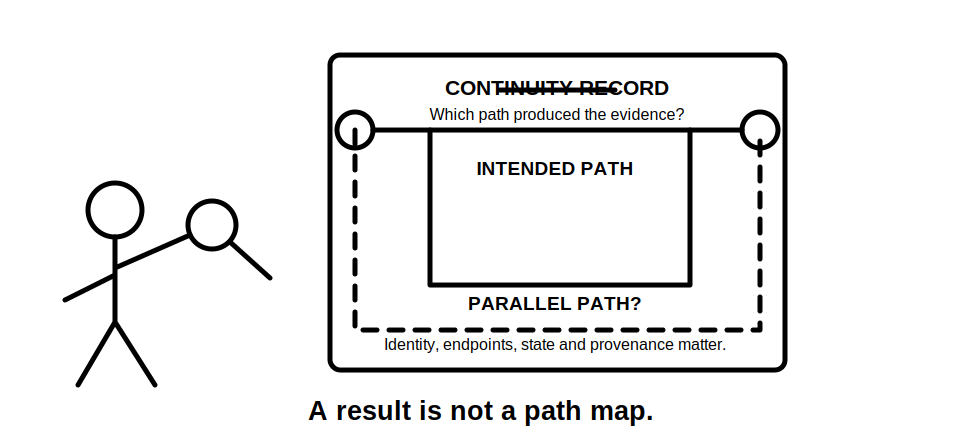
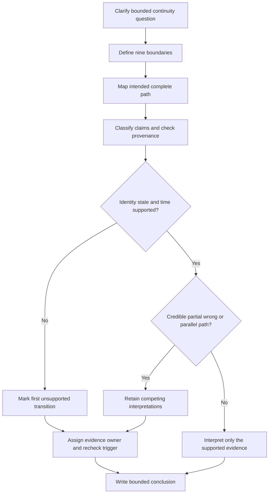
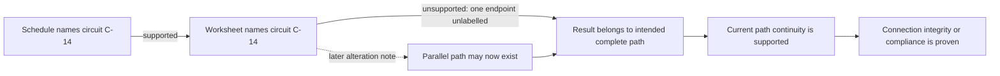

# Day 64 — Continuity Evidence and Common Interpretation Errors

> **Scope boundary:** This original module teaches document-based interpretation of continuity evidence. It provides no field test procedure, instrument connection method, official sequence, acceptance value or authority to perform electrical work. Exact requirements require current authorised sources and qualified review.

## 1. Outcome and entry check

By the end, the learner can:

1. define continuity, path identity, evidence boundary and connection integrity without treating them as interchangeable;
2. define the installation, circuit, conductor, endpoint, state, time, evidence, authority and decision boundaries for a continuity question;
3. classify material claims as a stated fact, derived fact, supported inference, assumption, contradiction or evidence gap;
4. record confidence separately from correctness and evidence quality;
5. distinguish the intended complete path from partial, wrong and parallel paths;
6. trace a claim chain and stop at its first unsupported transition;
7. retain competing interpretations without promoting either to fact;
8. assign an evidence owner and recheck trigger to every unresolved blocker;
9. revise dependent conclusions after two sequential material changes; and
10. communicate criterion-level readiness without inventing an official pass mark, acceptance value or compliance conclusion.

### Entry check

A record says only **“continuity satisfactory.”** Before reading further, write:

- the exact question the statement appears to answer;
- four missing boundary facts;
- one credible alternate explanation; and
- the first conclusion that must remain paused.

Also record confidence as **low**, **medium** or **high**. Confidence is a self-estimate, not evidence and not proof of correctness.

## 2. Why it matters

A continuity result is meaningful only when the intended path, actual conductive route, endpoints, circuit identity, installation state, time and provenance are known. A numerical or pass/fail record can look persuasive while describing the wrong conductor, only part of a route, a historical configuration or an unintended parallel path.

The safe reasoning chain is:

**bounded question → identified complete path → traceable evidence → known state → supported interpretation → limited conclusion**

The first unsupported arrow stops every dependent claim beyond it. A later strong-looking result cannot repair an earlier identity or boundary gap.

*Instructional caption: compare the claimed route with every credible alternate route before interpreting the record; a result is not a map of the path that produced it.*

## 3. Core concepts and terminology

### Boundaries

- **Installation boundary:** the installation or subsystem included in the question.
- **Circuit boundary:** the identified circuit or portion of a circuit to which the evidence is claimed to apply.
- **Conductor boundary:** the specific conductor, bonding route or connection chain being considered.
- **Endpoint boundary:** the defined start and finish points that identify the claimed path.
- **State boundary:** the connection condition and configuration when the evidence was produced.
- **Time boundary:** the date or period for which the evidence can reasonably apply.
- **Evidence boundary:** the records and observations available, including their exclusions and limitations.
- **Authority boundary:** what the learner, record author, reviewer or qualified person is permitted to decide.
- **Decision boundary:** the narrow decision being considered, not every possible compliance question.

### Path and evidence terms

- **Continuity:** evidence that an electrically conductive path exists between defined points under stated conditions.
- **Intended complete path:** the entire conductor, connection chain or bonding route required by the evidence question.
- **Partial path:** only one segment of the complete route.
- **Wrong path:** a conductive route that is not the route named in the evidence question.
- **Parallel path:** an additional conductive route that may influence or imitate evidence from the intended path.
- **Path identity:** evidence that the observed route is the intended complete path rather than another available route.
- **Connection integrity:** the condition and reliability of joins, terminations and interfaces. Continuity alone does not prove every aspect of integrity.
- **Provenance:** who produced a record, when, for which boundary, from which source and under which identified conditions.
- **Competing interpretations:** two or more plausible explanations retained while decisive evidence is missing.
- **First unsupported transition:** the earliest arrow in a reasoning chain that lacks adequate support.
- **Evidence owner:** the authorised source, custodian or qualified person responsible for resolving a named gap.
- **Recheck trigger:** a new record or material change that requires affected reasoning to be reopened.
- **Bounded conclusion:** a statement limited to the named path, endpoints, state, time, evidence quality, authority and decision.

### Six evidence states

Classify every material claim as one of the following:

1. **Stated fact:** directly recorded in an identified source.
2. **Derived fact:** calculated or transcribed from identified facts using a visible method.
3. **Supported inference:** a reasoned interpretation supported by evidence but not directly stated.
4. **Assumption:** an unverified proposition used provisionally.
5. **Contradiction:** evidence sources cannot both be accepted as describing the same boundary and state.
6. **Evidence gap:** information needed for the decision is absent or unusable.

An assumption, contradiction or evidence gap cannot silently become a fact because the downstream conclusion seems plausible.

### Confidence calibration

Record **low**, **medium** or **high** confidence beside important interpretations. Confidence must remain separate from:

- **correctness:** whether the interpretation is actually right; and
- **evidence quality:** whether the available evidence is traceable, current, complete and applicable.

A high-confidence error is a priority remediation item because it can produce decisive but unsafe overclaiming.

## 4. Rule-finding workflow

Use **C-O-N-T-I-N-U-E**:

1. **C — Clarify the evidence question.** Name the exact path, boundary and decision being considered.
2. **O — Outline every boundary.** Record installation, circuit, conductor, endpoints, state, time, evidence, authority and decision.
3. **N — Name the intended complete path.** Distinguish the full route from partial, wrong and parallel paths.
4. **T — Test identity, provenance and applicability.** Check labels, dates, versions, authorship, equipment records, state and traceability.
5. **I — Identify alternate explanations and paths.** Retain credible competing interpretations until decisive evidence resolves them.
6. **N — Note claim states and dependencies.** Classify each claim and mark the first unsupported transition.
7. **U — Understand the limited meaning.** Keep path existence separate from connection integrity, suitability, protection, polarity, insulation and compliance.
8. **E — Express ownership, triggers and a bounded conclusion.** Assign unresolved evidence and state what would reopen the reasoning.

This is an original evidence-reasoning model, not an official continuity-testing sequence. The two decision points prevent a result from bypassing unresolved path identity or alternate-route questions.

### Dependency rule

A conclusion may advance only when every claim it depends on is adequately supported. Stop at the first unsupported transition and mark all downstream claims as unsupported, even when later records appear strong.

The chain fails between the worksheet identity and the intended complete path. Claims C, D and E remain unsupported. Claim E would still exceed continuity evidence even if path identity were later resolved.

## 5. Visual model or worked example

### Fictional dossier: altered workshop bonding route

The evidence pack contains:

- a current schedule naming circuit **C-14**;
- an older result sheet naming **C-14** but identifying only one endpoint;
- a pre-alteration drawing that shows one bonding route;
- a later alteration note describing an added metallic service connection;
- an undated photograph showing two green/yellow conductors near the destination; and
- an email saying “the old result should still be fine,” with no supporting inspection or current evidence.

No item is an official form or a real installation record.

### Claim review

| Claim | Classification | Confidence | Dependency effect |
|---|---|---|---|
| The current schedule names C-14 | Stated fact | High | Establishes a current label only |
| The old result belongs to the current intended complete path | Assumption | Low | First unsupported transition because one endpoint and post-alteration identity are unresolved |
| The added metallic service creates a parallel path | Supported inference | Medium | Credible competing interpretation; not yet proven |
| A conductive route existed between the recorded points in the older state | Supported inference | Medium | Historical and limited to the older evidence boundary |
| Every current termination has sound connection integrity | Evidence gap | Low | Not supported by continuity evidence alone |
| The current installation is compliant | Evidence gap | Low | Outside this evidence and authority boundary |

### Competing interpretations

- **Interpretation A:** the historical result relates to the intended route, but its applicability ended when the alteration changed the path network.
- **Interpretation B:** the historical result may have included another route even before the alteration because the second endpoint and connection state were not identified.

Neither interpretation becomes fact. The review pauses at the unresolved endpoint and current path identity.

### Bounded conclusion

> Historical evidence indicates that a conductive route was recorded for C-14 in an earlier, incompletely identified state. The record does not establish the current intended complete path because one endpoint, the post-alteration configuration and the influence of a credible parallel route remain unresolved. Current path identity evidence is owned by the authorised installation-record custodian or qualified reviewer. Receipt of a traceable current drawing or other authorised evidence identifying both endpoints and the post-alteration path is the recheck trigger.

### Worked-example fading

For a second fictional dossier, complete only:

1. the nine boundaries;
2. the intended complete path;
3. claim classifications and confidence;
4. the first unsupported transition;
5. two competing interpretations;
6. evidence owner and recheck trigger; and
7. the bounded conclusion.

Do not use a generic caution where a specific blocker can be named.

## 6. Practical application

Prepare a one-page **continuity evidence review** containing:

1. the bounded evidence question;
2. all nine boundaries;
3. a learner-created sketch of the intended complete path;
4. a separate map of credible partial, wrong and parallel paths;
5. an evidence register with identity, date, source, version, state and limitation;
6. claim classifications and confidence labels;
7. a dependency chain with the first unsupported transition marked;
8. competing interpretations;
9. contradiction and limitation log;
10. evidence owners and recheck triggers; and
11. a bounded conclusion.

### Criterion-level readiness review

Assess each criterion independently. Do not calculate an aggregate score.

| Criterion | Secure | Developing | Unsupported | `stop-required` |
|---|---|---|---|---|
| Question and boundaries | Exact path, endpoints, state, time, authority and decision named | Some boundaries incomplete but visible | Decision depends on missing boundaries | Practical authority or an official requirement is invented |
| Path identity | Intended complete path distinguished from partial, wrong and parallel paths | Alternate paths identified but not fully related to the claim | Intended path is assumed | A credible alternate path is ignored or concealed |
| Evidence control | Claims classified; provenance and applicability checked | Classification or provenance is incomplete | Material claim rests on an assumption or gap | Evidence is invented, altered or represented as more current than it is |
| Dependency reasoning | First unsupported transition and downstream effects are explicit | Dependency chain is partly complete | Reasoning continues beyond an unsupported transition | Unsupported claims are presented as verified facts or compliance conclusions |
| Interpretation limits | Continuity, connection integrity and compliance remain distinct | Limits are general rather than claim-specific | Evidence is overextended | Continuity alone is used to prove overall compliance, protection or safe condition |
| Ownership and change control | Every blocker has an owner and trigger; two changes reopen dependencies | Owners or triggers are partly specified | Blockers remain ownerless or changes are not propagated | A material change is ignored to preserve an earlier conclusion |
| Safety communication | Explicitly document-only and non-procedural | Boundary stated but inconsistently applied | Wording implies practical direction | Site access, switching, isolation, testing, measurement or energisation is directed |

- **Secure:** the criterion is complete for this educational document exercise.
- **Developing:** reasoning is visible but requires targeted correction.
- **Unsupported:** a material evidence or dependency gap prevents the criterion from advancing.
- **`stop-required`:** a safety, integrity, authority or evidence-control breach requires immediate remediation.

These are educational planning states, not official grades, competency decisions, verification outcomes, acceptance decisions or technical approvals. Strong performance in one criterion cannot offset an unsupported blocking criterion or any `stop-required` state.

### Two-change transfer

Apply these changes sequentially and reopen every affected dependency after each one:

1. a current drawing identifies both endpoints but does not show whether the added metallic service remains connected; then
2. a dated photograph confirms the service is present but its conductive relationship to the claimed route remains unverified.

After each change, state:

- which claims advance;
- which claims remain paused;
- whether the first unsupported transition moves;
- which competing interpretations remain; and
- whether the evidence owner or recheck trigger changes.

## 7. Common errors and safety checkpoint

### Common errors

- accepting “continuity satisfactory” without endpoints, path identity, state or date;
- treating any conductive route as proof of the intended complete path;
- ignoring partial, wrong or parallel paths;
- treating a historical record as automatically current after alteration;
- assuming continuity proves every termination has sound connection integrity;
- confusing path evidence with polarity, insulation, protection, safe isolation or overall compliance;
- allowing confidence to substitute for evidence quality;
- resolving a contradiction by choosing the preferred source without justification;
- continuing beyond the first unsupported transition;
- leaving a blocker without an evidence owner or recheck trigger; and
- inventing a method, value, acceptance rule or official assessment threshold from memory.

### Critical errors and stop conditions

Stop and remediate if the learner:

- claims practical authority;
- invents or alters evidence, an official procedure, value or acceptance criterion;
- ignores or conceals a credible alternate path or contradiction;
- treats unidentified endpoints as traceable evidence;
- continues dependent reasoning beyond the first unsupported transition;
- fails to reopen reasoning after a material change;
- concludes connection integrity, safe condition, protection performance or overall compliance from continuity evidence alone; or
- directs site access, opening, switching, isolation, proving de-energised, testing, measurement, instrument use, alteration, repair, energisation, commissioning, acceptance or certification.

This module authorises none of those activities.

Exact continuity duties, test sequencing, methods, instrument requirements, values, acceptance criteria, documentation requirements, role permissions and official assessment expectations require current authorised sources and qualified review.

## 8. Retrieval and next links

1. Expand **C-O-N-T-I-N-U-E**.
2. Name the nine boundaries for a continuity-evidence question.
3. Distinguish continuity, path identity and connection integrity.
4. List the six evidence states.
5. Explain why a parallel path can create a misleading interpretation.
6. Define the first unsupported transition.
7. Explain why confidence must remain separate from correctness and evidence quality.
8. Give two claims continuity evidence does not prove automatically.
9. State what an evidence owner and recheck trigger do.
10. Explain why a second material change can reopen a conclusion that advanced after the first.

### Next-link readiness

Proceed to Day 65 only when no criterion is `stop-required`, all blocking criteria are secure, and any developing non-blocking criterion has a specific remediation action. This is an educational transition rule only.

- **Plan:** [Twelve-Week Capstone Learning Plan](../MASTER_PLAN.md)
- **Knowledge note:** [[12-Week Day 64 - Continuity Evidence and Common Interpretation Errors]]
- **Previous:** [Day 63 — Week 9 Verification Planning Checkpoint](day-63-week-9-verification-planning-checkpoint.md)
- **Next:** [Day 65 — Insulation, Polarity and Connection-Integrity Concepts](day-65-insulation-polarity-and-connection-integrity-concepts.md)

This module remains `review-required`, `reference_check_required`, safety-critical and not `technically-reviewed`.