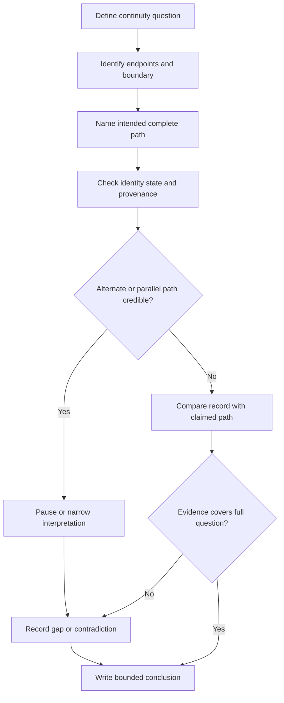

# Day 64 — Continuity Evidence and Common Interpretation Errors

> **Scope boundary:** This original module teaches document-based interpretation of continuity evidence. It does not provide a field test procedure, instrument connection method, official sequence, acceptance value or authority to perform electrical work. Exact requirements require current authorised sources and qualified review.

## 1. Outcome and entry check

By the end, the learner can:

1. define continuity, path and evidence boundary;
2. identify the conductor or connection path a record claims to cover;
3. separate an observed result from its interpretation;
4. test whether identity, endpoints, state and provenance are adequate;
5. recognise parallel-path, wrong-path and incomplete-path risks;
6. identify common overclaims made from a single continuity record;
7. document contradictions and limitations; and
8. state a bounded conclusion without inventing acceptance criteria.

### Entry check

A record says only “continuity satisfactory.” List four missing facts needed before that statement can support a specific conclusion.

## 2. Why it matters

A continuity result is meaningful only when the intended path, actual path, endpoints, circuit identity, installation state and evidence provenance are known. A numerical or pass/fail record can appear convincing while describing the wrong conductor, a partial route or an unintended parallel path.

**claimed path → identified endpoints → known state → credible evidence → limited interpretation**

## 3. Core concepts and terminology

- **Continuity:** evidence that an electrically conductive path exists between defined points under the stated conditions.
- **Intended path:** the conductor, connection chain or bonding route the evidence question concerns.
- **Endpoint:** a defined start or finish point used to identify the path.
- **Path identity:** evidence that the observed path is the intended one rather than another available route.
- **Parallel path:** an additional conductive route that may influence or imitate evidence from the intended path.
- **Incomplete path:** a record covering only part of the route required by the evidence question.
- **Connection integrity:** the condition and reliability of joins, terminations and interfaces; continuity alone does not prove every aspect of integrity.
- **Installation state:** the configuration, connection condition and operating context when the evidence was obtained.
- **Provenance:** who produced the record, when, for what boundary and using what identified evidence system.
- **Interpretation error:** a conclusion that exceeds what the identified evidence can support.
- **Bounded conclusion:** a statement limited to the named path, endpoints, state, date, evidence quality and authority.

## 4. Rule-finding workflow

Use **C-O-N-T-I-N-U-E**:

1. **C — Clarify the evidence question.** Name the exact path and claim being considered.
2. **O — Outline endpoints and boundaries.** Record circuit, conductor, locations and installation state.
3. **N — Name the intended path.** Distinguish the full required route from a partial segment.
4. **T — Test identity and provenance.** Check labels, record source, date, equipment record and traceability.
5. **I — Identify alternate or parallel paths.** Ask what else could produce the observation.
6. **N — Note contradictions and missing evidence.** Do not repair gaps with assumptions.
7. **U — Understand the limited meaning.** Separate existence of a path from condition, suitability and compliance.
8. **E — Express a bounded conclusion.** State what remains unresolved and what would reopen the interpretation.

The diagram is an evidence-reasoning model, not an official continuity-testing sequence.

## 5. Visual model or worked example

A fictional record contains a labelled circuit schedule, a result sheet and a later alteration note. The result sheet names two endpoints but predates the alteration. The alteration note introduces an additional bonding connection that may provide another conductive route.

| Interpretation field | Bounded response |
|---|---|
| Evidence question | Does the current record support continuity of the identified intended path? |
| Intended path | Must be defined from the current circuit boundary and endpoints. |
| Provenance | Result predates a documented alteration. |
| Parallel-path risk | Later bonding connection may affect path identity. |
| Supported claim | Historical evidence exists for a path between the named points in the earlier state. |
| Unsupported claim | The record does not by itself prove the current intended path, every connection’s integrity or overall compliance. |
| Reopening trigger | Current traceable evidence resolving path identity and post-alteration state. |

### Worked-example fading

For a second fictional record, complete only the intended-path, alternate-path, provenance, supported-claim and unsupported-claim fields. Then explain which missing fact is most decision-critical.

## 6. Practical application

Prepare a one-page **continuity evidence review** containing:

1. evidence question;
2. circuit and path boundary;
3. named endpoints;
4. intended complete path sketch;
5. record provenance and installation state;
6. alternate-path checklist;
7. contradiction and limitation log; and
8. bounded conclusion with reopening triggers.

### Assessment rubric

Score each category from **0 to 2**:

| Category | 0 | 1 | 2 |
|---|---|---|---|
| Question and boundary | Vague | Partly defined | Exact path, endpoints and state named |
| Path identity | Assumed | Partial | Intended and alternate paths distinguished |
| Evidence separation | Result treated as conclusion | Some separation | Observation, interpretation and conclusion distinct |
| Provenance | Ignored | Incomplete | Identity, date, source and state checked |
| Limitations | Overclaim | General caution | Specific unsupported claims and reopening triggers |
| Safety communication | Practical authority implied | Generic warning | Explicitly document-only and non-procedural |

A score of **10/12 or higher** with no critical error indicates readiness for Day 65. This is an educational threshold only, not an official assessment rule.

## 7. Common errors and safety checkpoint

### Common errors

- accepting “continuity satisfactory” without endpoints or path identity;
- treating any conductive route as proof of the intended route;
- ignoring parallel paths or changed installation state;
- assuming continuity proves every termination is sound;
- treating a historical record as automatically current;
- confusing path evidence with polarity, insulation, protection or overall compliance; and
- inventing a limit, method or acceptance decision from memory.

### Critical errors and stop conditions

Stop and remediate if the learner:

- claims practical authority;
- invents an official procedure or value;
- ignores a credible alternate path;
- treats unidentified endpoints as traceable evidence; or
- concludes overall compliance from continuity evidence alone.

This module authorises no access, switching, isolation, proving de-energised, testing, measurement, instrument use, alteration, energisation, certification or verification.

## 8. Retrieval and next links

1. Expand **C-O-N-T-I-N-U-E**.
2. Why can a parallel path create a misleading interpretation?
3. What is the difference between continuity and connection integrity?
4. Name four fields required to bound a continuity record.
5. Give two claims continuity evidence does not prove automatically.

### Changed-scenario transfer

Revise the worked example after a current drawing confirms the alteration but the result record still lacks one endpoint identity. State which conclusion can advance and which must remain paused.

- **Plan:** [Twelve-Week Capstone Learning Plan](../MASTER_PLAN.md)
- **Knowledge note:** [[12-Week Day 64 - Continuity Evidence and Common Interpretation Errors]]
- **Previous:** [Day 63 — Week 9 Verification Planning Checkpoint](day-63-week-9-verification-planning-checkpoint.md)
- **Next:** Day 65 — Insulation, Polarity and Connection-Integrity Concepts

This module remains `review-required`, `reference_check_required`, safety-critical and not `technically-reviewed`.