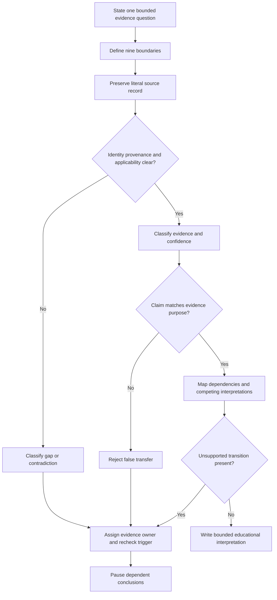
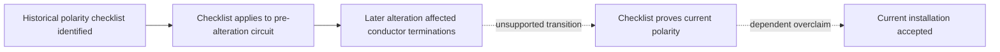

# Day 65 — Insulation, Polarity and Connection-Integrity Concepts

> **Scope boundary:** This module teaches document-based interpretation of insulation, polarity and connection-integrity evidence. It does not provide field procedures, instrument connections, test settings, test voltages, acceptance values, pass/fail decisions or authority to perform electrical work.

## 1. Outcome and entry check

By the end, the learner can:

1. define insulation integrity, polarity and connection integrity without treating them as interchangeable;
2. state the distinct evidence question answered by each concept;
3. control nine boundaries: installation, circuit, conductor, endpoint, state, time, evidence, authority and decision;
4. classify each claim as a stated fact, derived fact, supported inference, assumption, contradiction or evidence gap;
5. record confidence separately from correctness and evidence quality;
6. trace a claim chain and stop at its first unsupported transition;
7. preserve competing interpretations where the evidence does not resolve them;
8. assign an evidence owner and recheck trigger to every blocking gap;
9. reopen affected conclusions after two sequential material changes; and
10. produce a bounded educational interpretation without inventing a procedure, value, compliance finding or technical approval.

### Entry check

A record says that continuity was observed between two named points before a later alteration. Explain why that statement does **not**, by itself, establish current insulation integrity, current polarity or the condition of every termination.

A satisfactory response distinguishes path existence, insulation separation, conductor relationship, connection condition and historical evidence from current evidence.

## 2. Why it matters

Verification packs often compress several different questions into one word such as “passed.” That compression hides the evidence purpose, circuit state, exclusions, later changes and who is authorised to interpret or accept the result.

Keep this chain visible:

**question → boundary → state → source record → evidence classification → interpretation → limited conclusion**

A break in that chain is not repaired by confidence, familiarity or a result that merely looks plausible.

*Instructional caption: Keep each evidence question separate until identity, state, provenance and dependencies are established; only then state a bounded combined interpretation.*

## 3. Core concepts and terminology

### Three distinct evidence questions

- **Insulation integrity:** the condition of insulating separation between defined conductive parts under stated conditions. Interpretation depends on the covered boundary, exclusions, state, provenance and current applicability.
- **Polarity:** the correct relationship and identification of active, neutral and switching connections for the intended circuit function. Polarity evidence does not automatically prove insulation condition or mechanical security.
- **Connection integrity:** the condition, security and reliability of joints, terminations and interfaces. A photograph or continuity record may contribute evidence, but neither automatically establishes concealed condition or current reliability.

### Nine boundaries

1. **Installation boundary:** the installation or subsystem to which the record applies.
2. **Circuit boundary:** the named circuit or circuit portion covered.
3. **Conductor boundary:** conductors included, omitted or uncertain.
4. **Endpoint boundary:** precise points, equipment or interfaces represented.
5. **State boundary:** configuration and connection condition when evidence was obtained.
6. **Time boundary:** date, sequence and relationship to alterations or repairs.
7. **Evidence boundary:** source records, observations and limitations available.
8. **Authority boundary:** who may collect, interpret, review, accept or certify evidence.
9. **Decision boundary:** the exact educational conclusion being considered and what remains outside it.

### Evidence and reasoning terms

- **Recorded result:** literal information preserved in a source record.
- **Interpretation:** a reasoned statement about what a result may support within its boundaries.
- **Conclusion:** the final bounded statement reached for the stated question.
- **Provenance:** where evidence came from, who produced it, when and under what version or conditions.
- **Applicability:** whether evidence still relates to the present installation, circuit, state and decision.
- **Exclusion:** equipment, conductors, paths or conditions outside the evidence boundary.
- **False transfer:** using evidence from one question to answer a different question.
- **Contradiction:** records that cannot support the same interpretation without explanation.
- **First unsupported transition:** the earliest arrow in a claim chain lacking adequate support; dependent claims after it remain unsupported.
- **Competing interpretations:** plausible explanations retained without promoting either to fact.
- **Evidence owner:** authorised source, custodian or qualified person responsible for resolving a blocker.
- **Recheck trigger:** a new record, clarification or material change that reopens affected reasoning.
- **Material change:** a change capable of altering identity, boundary, state, applicability or a dependent conclusion.
- **Confidence calibration:** recording confidence separately from correctness and evidence quality.

### Six evidence classifications

| Classification | Meaning |
|---|---|
| **Stated fact** | Directly recorded in a source whose identity is preserved. |
| **Derived fact** | Produced transparently from stated facts without an unsupported premise. |
| **Supported inference** | A reasoned interpretation supported by evidence but not directly stated. |
| **Assumption** | A proposition used without adequate evidence. |
| **Contradiction** | Evidence that conflicts materially with another record or claim. |
| **Evidence gap** | Information required for the next reasoning step is absent, unclear or inapplicable. |

These classifications describe reasoning status, not technical acceptance categories.

## 4. Rule-finding workflow

Use **S-E-P-A-R-A-T-E**:

1. **S — State the bounded question.** Name insulation, polarity or connection integrity and the exact decision considered.
2. **E — Establish all nine boundaries.** Record installation, circuit, conductors, endpoints, state, time, evidence, authority and decision.
3. **P — Preserve the source record.** Keep the literal result separate from interpretation.
4. **A — Assess provenance and applicability.** Check identity, date, version, alterations, exclusions and current relevance.
5. **R — Review dependencies and contradictions.** Build the claim chain, retain competing interpretations and locate the first unsupported transition.
6. **A — Avoid false transfer.** Do not use continuity, insulation, polarity or visual evidence to answer another question automatically.
7. **T — Track ownership and triggers.** Assign each blocker an evidence owner and specific recheck trigger.
8. **E — Express a bounded conclusion.** State support, limitations, confidence and what would reopen the review.

This is a document-review workflow, not an official testing sequence. Unclear provenance, false transfer or an unsupported dependency pauses downstream conclusions rather than being averaged away.

Write each reasoning step as an arrow:

**identified record → applicable boundary and state → evidence purpose matched → supported interpretation → bounded conclusion**

The checklist is a historical stated fact. The move to current polarity is unsupported because a material change intervened; the acceptance claim is therefore unsupported too.

## 5. Visual model or worked example

### Fictional altered-training-room dossier

The pack contains:

- a continuity worksheet naming endpoints `TR-DB/C7` and `Outlet A`, dated before refurbishment;
- an insulation worksheet labelled only `Training room circuits`, with an unclear handwritten exclusion;
- a polarity checklist for `C7`, completed before refurbishment;
- a post-refurbishment drawing labelling the corresponding circuit `C7A`;
- an undated exterior photograph of Outlet A that does not show conductor terminations;
- an email saying “all tests were redone,” without attached records or an identified authorising role; and
- a maintenance note stating that Outlet A was moved and an intermediate joint introduced.

| Question | Literal evidence | Classification | Supported interpretation | First unsupported transition |
|---|---|---|---|---|
| Continuity | Historical path recorded between named endpoints. | Stated fact | Historical continuity evidence exists for the named pre-refurbishment points. | Treating `C7` and `C7A` as the same current circuit without identity evidence. |
| Insulation | Worksheet exists for a broad label with unclear exclusion. | Stated fact plus evidence gap | Historical insulation-related evidence exists, but conductor and exclusion boundaries are unresolved. | Concluding that the moved outlet, new joint and all current conductors were included. |
| Polarity | Checklist exists before refurbishment. | Stated fact | Pre-refurbishment polarity evidence exists for the recorded identity. | Transferring it across the alteration without current traceable evidence. |
| Connection integrity | Exterior photograph and maintenance note identify a moved outlet and added joint. | Stated facts | The installation changed and at least one new interface exists. | Claiming concealed termination security or reliability from exterior appearance. |
| “All tests redone” | Unsupported email assertion. | Assumption until traceable records are supplied | It identifies a possible evidence lead. | Treating the assertion as a result, interpretation or acceptance record. |

Retain competing interpretations:

- **Interpretation A:** `C7A` is the renamed continuation of `C7`.
- **Interpretation B:** `C7A` is a new or materially altered circuit whose earlier records are not directly applicable.

Neither becomes fact from label similarity alone.

### Bounded conclusion

> The pack contains historical continuity, insulation-related and polarity records, but current identity, conductor coverage, exclusions and post-refurbishment applicability are not established. The moved outlet and added joint create new connection-integrity questions. Current insulation, polarity, connection integrity, overall compliance, acceptance and certification remain unsupported. The drawing custodian owns circuit-identity clarification; the authorised verification-record custodian owns the current evidence gap. Traceable post-refurbishment records are the recheck trigger.

### Two-change transfer

Apply sequentially:

1. a signed post-refurbishment schedule confirms that `C7A` replaced `C7`; then
2. a later maintenance record shows Outlet A was moved again after that schedule.

After change 1, circuit identity advances but does not resolve conductor coverage, exclusions or connection integrity. After change 2, reopen conclusions dependent on outlet position, endpoints, state, time and post-change applicability.

## 6. Practical application

Prepare a **separated evidence and dependency matrix** with columns for:

1. bounded evidence question;
2. nine boundaries;
3. literal source record;
4. evidence classification;
5. confidence;
6. provenance and applicability;
7. supported interpretation;
8. first unsupported transition;
9. competing interpretation;
10. evidence owner;
11. recheck trigger; and
12. bounded conclusion.

### Assessment-focused performance criteria

Assess each criterion independently.

| Criterion | Secure | Developing | Unsupported | `stop-required` |
|---|---|---|---|---|
| Evidence-question separation | Three questions remain distinct throughout. | One corrected overlap. | Claims mixed or transferred without support. | Mixed claim implies safety, compliance or authority. |
| Boundary control | All nine boundaries explicit and consistent. | One non-blocking clarification needed. | A material boundary missing or assumed. | Work continues despite unknown circuit, conductor, endpoint, state or authority. |
| Evidence classification | Every material claim classified and traceable. | Minor correction needed. | Assumptions or contradictions hidden. | Evidence invented, altered or presented as verified. |
| Dependency control | First unsupported transition identified and downstream claims paused. | Mostly correct after prompting. | Reasoning continues beyond unsupported step. | Unsupported reasoning produces practical, acceptance or compliance claim. |
| Provenance and applicability | Identity, date, version, alteration and exclusions checked. | One non-blocking field open. | Historical or ambiguous evidence treated as current. | Known material change ignored. |
| Confidence calibration | Confidence separate from correctness and evidence quality. | Present but weakly justified. | Confidence substitutes for evidence. | High confidence overrides a blocker. |
| Ownership and reopening | Every blocker has owner and trigger; two changes reopen dependencies. | Owner or trigger needs refinement. | Gaps lack resolution path. | Blocked conclusion treated as final. |
| Safety communication | Document-only scope and authority limits explicit. | Caution generic. | Wording may imply practical authority. | Procedure, instrument instruction, invented value or technical approval provided. |

There is no aggregate score. A blocking unsupported criterion or any `stop-required` state cannot be offset by stronger performance elsewhere.

- **Secure:** all blocking criteria secure and no `stop-required` condition.
- **Developing:** no blocker, but targeted correction remains.
- **Unsupported:** a material gap prevents independent interpretation; assign remediation and recheck.
- **`stop-required`:** unsafe authority, invented evidence or procedure/value, concealed contradiction or unsupported compliance/acceptance claim.

These are educational planning states, not official grades, competency determinations, verification outcomes or technical approvals.

## 7. Common errors and safety checkpoint

### Common errors

- treating continuity as proof of insulation, polarity or termination condition;
- treating polarity evidence as proof of insulation or mechanical security;
- using a broad circuit label without proving conductor and endpoint coverage;
- treating an email summary as a traceable result record;
- ignoring exclusions, later alterations or version mismatch;
- assuming a photograph proves concealed connection condition;
- using confidence to compensate for weak evidence;
- averaging a blocking gap into an overall score;
- resolving competing interpretations without new evidence; and
- failing to reopen dependencies after sequential changes.

### Critical errors and stop conditions

Stop and remediate if the learner:

- invents or alters evidence;
- invents a clause, value, method, sequence or acceptance criterion;
- treats an assumption as a verified fact;
- conceals a contradiction or known material change;
- continues beyond the first unsupported transition;
- implies authority to access, isolate, test, alter, energise, accept or certify;
- concludes current safety, compliance or acceptance from incomplete historical evidence; or
- leaves a blocking gap without an evidence owner and recheck trigger.

This module authorises no site access, opening, switching, isolation, proving de-energised, testing, measurement, instrument use, alteration, repair, energisation, commissioning, acceptance, certification or field verification.

Exact insulation, polarity and connection-integrity duties, sequencing, methods, instrument requirements, values, acceptance criteria, documentation requirements, role permissions and official assessment expectations require current authorised sources and qualified review.

## 8. Retrieval and next links

### Closed-note retrieval

1. Define insulation integrity, polarity and connection integrity.
2. Name the nine boundaries.
3. List the six evidence classifications.
4. Explain false transfer.
5. Define the first unsupported transition.
6. Explain why confidence cannot repair weak evidence.
7. State what an evidence owner and recheck trigger do.
8. Explain why an alteration can reopen a historical polarity conclusion.
9. Give one claim an exterior photograph cannot support automatically.
10. Explain why educational readiness states are not technical approvals.

### Changed-scenario transfer

Revise the dossier after a traceable record resolves the insulation worksheet’s conductor coverage and exclusion, then a later equipment replacement changes one endpoint. State which classifications change, which claims advance, which dependencies reopen, which competing interpretations remain, who owns each unresolved gap and the new bounded conclusion.

### Spaced retrieval links

- Revisit Day 58 for observation-versus-finding control.
- Revisit Day 59 for evidence-purpose and sequencing dependencies.
- Revisit Day 62 for plausibility and evidence-quality reasoning.
- Revisit Day 64 for continuity and path-identity limits.

### Navigation

- **Plan:** [Twelve-Week Capstone Learning Plan](../MASTER_PLAN.md)
- **Knowledge note:** [[12-Week Day 65 - Insulation, Polarity and Connection-Integrity Concepts]]
- **Previous:** [Day 64 — Continuity Evidence and Common Interpretation Errors](day-64-continuity-evidence-and-common-interpretation-errors.md)
- **Next:** [Day 66 — Fault-Loop and RCD Result Interpretation at Concept Level](day-66-fault-loop-and-rcd-result-interpretation-at-concept-level.md)

This module remains `review-required`, `reference_check_required`, safety-critical and not `technically-reviewed`.
