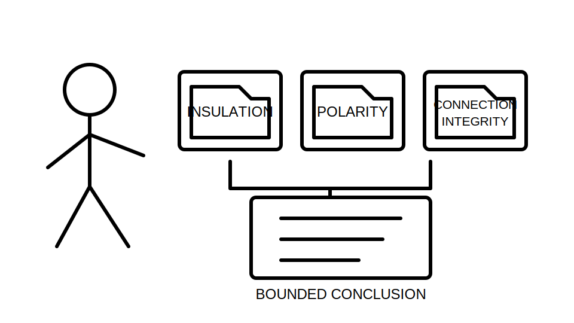
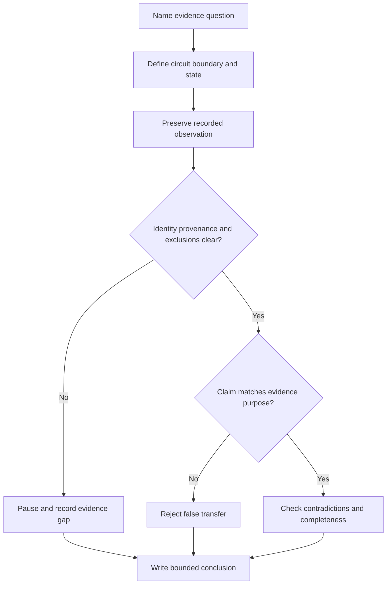

# Day 65 — Insulation, Polarity and Connection-Integrity Concepts

> **Scope boundary:** This module teaches document-based interpretation of insulation, polarity and connection-integrity evidence. It does not provide field procedures, instrument connections, test voltages, acceptance values or authority to perform electrical work.

## 1. Outcome and entry check

By the end, the learner can:

1. define insulation integrity, polarity and connection integrity;
2. distinguish the evidence question answered by each concept;
3. identify circuit boundary, state, exclusions and provenance;
4. separate a recorded result from an interpretation and conclusion;
5. recognise false transfer between continuity, insulation, polarity and integrity claims;
6. identify contradictions or incomplete evidence;
7. write bounded conclusions without inventing limits; and
8. state when qualified review is required.

### Entry check

Explain why a continuity record cannot, by itself, prove insulation integrity or correct polarity.

## 2. Why it matters

Verification evidence is often over-compressed into a single word such as “passed.” That hides which hazard question was examined, what circuit state applied and what was excluded. Safe reasoning keeps each evidence claim attached to its own purpose.

**question → boundary → state → evidence → interpretation → limited conclusion**

## 3. Core concepts and terminology

- **Insulation integrity:** the condition of insulating separation between defined conductive parts under stated conditions.
- **Polarity:** the correct relationship and identification of active, neutral and switching connections for the intended circuit function.
- **Connection integrity:** the condition, security and reliability of joints, terminations and interfaces.
- **Evidence boundary:** the exact circuit, conductors, equipment and endpoints covered by a record.
- **Exclusion:** equipment, components or paths intentionally outside the evidence boundary.
- **Circuit state:** the configuration and connection condition when evidence was obtained.
- **False transfer:** using evidence from one question to claim an answer to a different question.
- **Contradiction:** two records or observations that cannot both support the same conclusion without explanation.
- **Bounded conclusion:** a statement limited by identity, boundary, state, date, provenance and authority.

## 4. Rule-finding workflow

Use **S-E-P-A-R-A-T-E**:

1. **S — State the evidence question.** Name insulation, polarity or connection integrity.
2. **E — Establish the boundary.** Identify circuit, conductors, endpoints and exclusions.
3. **P — Preserve the recorded result.** Do not rewrite observation as conclusion.
4. **A — Attach state and provenance.** Record date, source, configuration and evidence owner.
5. **R — Review contradictions.** Compare drawings, schedules, alterations and visual records.
6. **A — Avoid false transfer.** Do not use one evidence type to prove another.
7. **T — Test completeness.** Identify missing conductors, endpoints, states or exclusions.
8. **E — Express a bounded conclusion.** State unresolved questions and reopening triggers.

The diagram is an interpretation workflow, not an official testing sequence.

## 5. Visual model or worked example

A fictional verification pack contains:

- a continuity record with clear endpoints;
- an insulation record with an unclear exclusion note;
- a polarity checklist completed before a later alteration; and
- a photograph showing one accessible termination but not its internal condition.

| Evidence question | Supported interpretation | Unsupported overclaim |
|---|---|---|
| Continuity | A conductive path was recorded between named endpoints in the stated condition. | Every connection is mechanically sound. |
| Insulation | A historical insulation record exists for an incompletely defined boundary. | All current equipment and conductors are adequately insulated. |
| Polarity | Polarity evidence existed before the alteration. | Current polarity is proven after the change. |
| Connection integrity | One visible termination appears present in the image. | All concealed terminations are secure and reliable. |

### Worked-example fading

For a second fictional pack, complete the boundary, state, supported claim, unsupported claim and reopening trigger for each evidence type.

## 6. Practical application

Prepare a one-page **separated evidence matrix** with columns for:

1. evidence question;
2. circuit and conductor boundary;
3. recorded state and exclusions;
4. observation or source record;
5. supported interpretation;
6. unsupported transfer;
7. contradiction or gap; and
8. reopening trigger.

### Assessment rubric

Score each category from **0 to 2**:

| Category | 0 | 1 | 2 |
|---|---|---|---|
| Evidence questions | Mixed together | Partly separated | Clearly separated by purpose |
| Boundary and state | Missing | Partial | Circuit, conductors, state and exclusions explicit |
| Observation separation | Result treated as conclusion | Inconsistent | Observation, interpretation and conclusion distinct |
| False-transfer control | Overclaims | Some cautions | Each claim matched to evidence purpose |
| Contradictions | Ignored | Mentioned | Logged with reopening trigger |
| Safety communication | Practical authority implied | Generic caution | Explicitly document-only and non-procedural |

A score of **10/12 or higher** with no critical error indicates readiness for Day 66. This is an educational threshold only.

## 7. Common errors and safety checkpoint

### Common errors

- treating continuity as proof of insulation or polarity;
- treating polarity evidence as proof of connection integrity;
- ignoring exclusions or changed circuit state;
- assuming a visual image proves concealed termination condition;
- converting a historical result into a current conclusion; and
- inventing a limit, test method or acceptance decision.

### Critical errors and stop conditions

Stop and remediate if the learner:

- claims practical authority;
- invents official values or procedures;
- merges distinct evidence questions;
- ignores a documented alteration; or
- concludes overall compliance from one evidence type.

This module authorises no access, switching, isolation, proving de-energised, testing, measurement, instrument use, alteration, repair, energisation, certification or verification.

## 8. Retrieval and next links

1. Define insulation integrity, polarity and connection integrity.
2. What is false transfer?
3. Name four fields needed to bound an evidence record.
4. Why can an alteration reopen a previous polarity conclusion?
5. Give one claim a continuity record cannot support automatically.

### Changed-scenario transfer

Revise the worked example after a current drawing resolves the insulation boundary but the exclusion note remains unclear. State what advances and what remains paused.

- **Plan:** [Twelve-Week Capstone Learning Plan](../MASTER_PLAN.md)
- **Knowledge note:** [[12-Week Day 65 - Insulation, Polarity and Connection-Integrity Concepts]]
- **Previous:** [Day 64 — Continuity Evidence and Common Interpretation Errors](day-64-continuity-evidence-and-common-interpretation-errors.md)
- **Next:** [Day 66 — Fault-Loop and RCD Result Interpretation at Concept Level](day-66-fault-loop-and-rcd-result-interpretation-at-concept-level.md)

This module remains `review-required`, `reference_check_required`, safety-critical and not `technically-reviewed`.