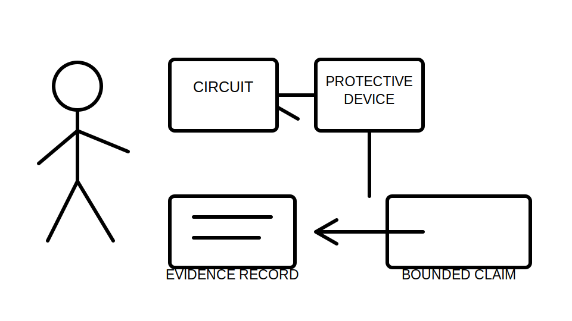
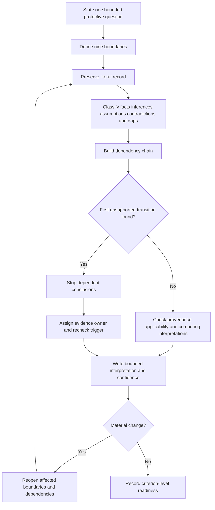
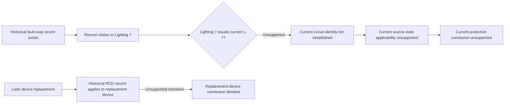

# Day 66 — Fault-Loop and RCD Result Interpretation at Concept Level

> **Scope boundary:** This module teaches document-only, concept-level interpretation of existing fault-loop and RCD evidence. It gives no field method, instrument setup, connection sequence, test current, timing limit, acceptance value, switching instruction or practical authority.

## 1. Outcome and entry check

By the end, the learner can:

1. state separately the protective question addressed by fault-loop evidence and by RCD evidence;
2. define the installation, circuit, protective-device, source, operating-state, time, evidence, authority and decision boundaries for a record;
3. classify each claim as a stated fact, derived fact, supported inference, assumption, contradiction or evidence gap;
4. record confidence separately from correctness and evidence quality;
5. distinguish a literal result, a plausibility judgement, a technical interpretation and an authorised acceptance decision;
6. identify the first unsupported transition in a protective claim chain and stop dependent conclusions there;
7. retain competing interpretations without promoting either to fact;
8. assign an evidence owner and recheck trigger to each unresolved safety-critical dependency;
9. reopen affected reasoning after two sequential material changes; and
10. communicate criterion-level readiness without an aggregate score or compliance claim.

### Entry check

A worksheet says only **“RCD passed”**. List five missing identity or context fields before explaining what the record might support.

A strong entry response names the circuit, exact device, source arrangement, operating state, date or time state, and record provenance. It does not invent a value, procedure or acceptance conclusion.

## 2. Why it matters

Fault-loop and RCD records concern related protective outcomes, but they are not interchangeable and do not answer every protection question. A number or pass label becomes meaningful only when its purpose, identity, state, provenance, dependencies and decision authority are traceable.

A record may be genuine yet unusable for the present decision because the circuit changed, the source state is unknown, the protective device was replaced, the record predates an alteration, or the recorded test purpose is unclear. The safe reasoning task is therefore not “Does this number look good?” but “What exact claim can this identified record support, under what conditions, and where does support stop?”

*Instructional caption: Link every result to one identified circuit, device, source state and protective question before interpreting it.*

## 3. Core concepts and terminology

### Two distinct evidence questions

- **Fault-loop evidence:** information about an identified fault-current return path and the dependencies relevant to a defined protective objective.
- **RCD evidence:** information about an identified residual-current device and a stated aspect of its operation or characteristics under recorded conditions.
- **Protective objective:** the safety outcome a protective arrangement is intended to support. The exact authorised requirement remains `reference_check_required`.
- **Disconnection objective:** an intended protective outcome involving interruption of supply under defined fault conditions. This module does not state an official limit or method.
- **Protective dependency:** a condition that must be supported before a protective conclusion can be sustained, such as identity, source state, path applicability, device identity or evidence currency.

### Nine boundaries

1. **Installation boundary:** the installation or subsystem to which the record applies.
2. **Circuit boundary:** the exact circuit, origin and endpoint covered.
3. **Protective-device boundary:** the exact device identity, role and location associated with the record.
4. **Source boundary:** the source arrangement that applied when the evidence was obtained.
5. **Operating-state boundary:** switching, transfer, connection and equipment state recorded at that time.
6. **Time boundary:** when the evidence was obtained and which installation version it represents.
7. **Evidence boundary:** what was directly recorded, derived or inferred.
8. **Authority boundary:** who may interpret, accept, certify or direct further work.
9. **Decision boundary:** the precise question being answered and claims explicitly excluded.

### Six evidence classifications

- **Stated fact:** information directly present in the source record.
- **Derived fact:** information obtained transparently from stated facts without adding an unsupported premise.
- **Supported inference:** a reasoned interpretation supported by identified evidence, but not directly stated.
- **Assumption:** an unverified proposition used temporarily and labelled as such.
- **Contradiction:** two records or observations that cannot both describe the same boundary and state without further explanation.
- **Evidence gap:** information required for the decision but not available or not traceable.

### Interpretation controls

- **Literal result:** the record exactly as documented, preserved before interpretation.
- **Result plausibility:** whether the record is internally coherent and compatible with known context. Plausibility is not acceptance.
- **Technical interpretation:** a qualified explanation of what evidence may indicate within its boundaries.
- **Acceptance decision:** an authorised determination against verified requirements. This module does not make one.
- **Confidence calibration:** a separate statement of confidence in a claim. High confidence does not repair weak evidence.
- **First unsupported transition:** the earliest step in a claim chain that lacks adequate support. Every dependent step remains unsupported until that transition is resolved.
- **Competing interpretations:** two or more plausible explanations retained explicitly while evidence is incomplete.
- **Evidence owner:** the authorised source, custodian or qualified person responsible for resolving a blocker.
- **Recheck trigger:** a new record, clarification or material change that requires affected reasoning to be reviewed again.

## 4. Rule-finding workflow

Use **P-R-O-T-E-C-T**:

1. **P — Pin down the protective question.** State one bounded question for fault-loop evidence or one bounded question for RCD evidence. Do not merge them.
2. **R — Record all identities and boundaries.** Identify installation, circuit, device, source, state, time, evidence, authority and decision.
3. **O — Observe the literal record.** Preserve wording, units, labels, date, author, instrument reference and attachments without silently correcting them.
4. **T — Trace dependencies and claim chains.** Show which evidence supports each transition and mark the first unsupported transition.
5. **E — Examine provenance, applicability and contradictions.** Check source, version, date, completeness, alterations, alternate supplies and conflicting identifiers.
6. **C — Constrain interpretation and confidence.** Classify each claim, record confidence separately and retain competing interpretations where needed.
7. **T — Track ownership, triggers and transfer.** Assign unresolved evidence, specify what reopens the question and propagate material changes through dependent claims.

The diagram shows an evidence-review loop, not an official test or verification sequence. A material change returns the learner to the literal records and affected boundaries rather than allowing the previous conclusion to remain by default.

### Rule-finding record

For every external requirement consulted later under qualified supervision, record:

- the precise question;
- authorised source title, edition or version and jurisdiction;
- topic location rather than copied systematic clause wording;
- applicability conditions and exclusions;
- unresolved ambiguity;
- reviewer or evidence owner; and
- recheck trigger.

Exact clauses, values, timing requirements, methods and acceptance criteria remain `reference_check_required`.

## 5. Visual model or worked example

### Fictional evidence dossier

A training facility evidence pack contains:

- a current schedule naming final subcircuit **L-7**;
- a fault-loop worksheet naming **Lighting 7**, dated before a switchboard alteration;
- an RCD worksheet naming device **R7**, but the current board label reads **RCBO-7B**;
- an undated photograph showing a device marked **7** with no legible model details;
- an email stating that “all results stayed valid after the works,” with no attached verification record;
- a source diagram showing normal supply and an alternate source;
- no record of which source was active for either worksheet; and
- a later maintenance note stating that the protective device was replaced after nuisance operation.

### Evidence table

| Item | Classification | What it supports | What it does not support |
|---|---|---|---|
| Current schedule names L-7 | Stated fact | Current documentary circuit name | Identity equivalence with historical “Lighting 7” |
| Historical worksheet names Lighting 7 | Stated fact | A historical record exists | Current applicability after alteration |
| RCD worksheet names R7 | Stated fact | Historical device label on that record | Identity with current RCBO-7B |
| Undated photograph shows “7” | Stated fact with provenance gap | A photographed label existed at an unknown time | Device model, present identity or acceptance |
| Email says results stayed valid | Unsupported assertion | Someone made the assertion | Technical validity, current applicability or compliance |
| Alternate source shown | Stated fact | More than one source state may exist | Which source state applied to either record |
| Device replacement noted | Stated fact | Material device change occurred | Transfer of earlier device evidence to the replacement |

### Competing interpretations

- **Interpretation A:** “Lighting 7,” “L-7,” “R7” and “RCBO-7B” refer to the same circuit and successive labels.
- **Interpretation B:** one or more records refer to a different circuit or former device.

Both are plausible from the dossier. Neither becomes fact until traceable identity evidence resolves the conflict.

### Worked claim chain

The first chain fails at circuit identity before source-state or current protective conclusions can be considered. The second chain fails when historical device evidence is transferred to a replacement device without traceable applicability evidence. Downstream confidence cannot repair either gap.

### Bounded interpretation

> Historical fault-loop and RCD records exist, but current applicability is not established because circuit identity, device identity, source state and post-alteration evidence are incomplete or contradictory. No current acceptance, compliance or certification conclusion is supported. The document custodian owns identity reconciliation; the qualified technical reviewer owns interpretation against authorised requirements. Recheck when traceable circuit mapping, replacement-device records and source-specific current evidence are available.

## 6. Practical application

Prepare a **protective-evidence dependency map** for the fictional dossier. It must contain:

1. separate fault-loop and RCD protective questions;
2. all nine boundaries;
3. literal records and provenance;
4. claim classifications and confidence statements;
5. dependency chains and first unsupported transitions;
6. competing interpretations;
7. supported and unsupported claims;
8. evidence owners and recheck triggers; and
9. a bounded communication statement.

### Worked-example fading

Repeat the map after two sequential material changes:

- **Change 1:** a signed circuit map confirms that historical “Lighting 7” is current **L-7**.
- **Change 2:** a commissioning record shows that **RCBO-7B** replaced **R7**, but still does not identify the active source state.

After Change 1, reopen circuit-identity dependencies only; do not silently resolve device or source-state gaps. After Change 2, reopen device-applicability dependencies and all conclusions that depend on them. The remaining source-state gap still blocks any claim that requires source-specific applicability.

### Criterion-level readiness

Assess each criterion independently:

| Criterion | Secure | Developing | Unsupported | `stop-required` |
|---|---|---|---|---|
| Protective-question separation | Two distinct bounded questions | Questions partly separated | Questions merged or vague | One result declared proof of all protection |
| Boundary control | All nine boundaries explicit | One or two non-critical boundaries incomplete | Safety-critical identity or state absent | Known ambiguity concealed or ignored |
| Evidence classification | Claims consistently classified | Minor classification errors | Assumptions presented as facts | Evidence altered, invented or misrepresented |
| Confidence calibration | Confidence separate from evidence quality | Confidence recorded inconsistently | Confidence used as support | High confidence used to override a blocker |
| Dependency control | First unsupported transition stops downstream claims | Chain mostly clear | Dependent claims continue past a gap | Unsupported compliance or acceptance declared |
| Provenance and applicability | Date, source, version and changes traced | Some provenance incomplete | Historical evidence treated as current | Known material change ignored |
| Competing interpretations | Plausible alternatives retained and tested | Alternatives named incompletely | One explanation selected prematurely | Contradictory evidence suppressed |
| Ownership and triggers | Every blocker has owner and trigger | Minor ownership gap | Blockers unassigned | Learner directs unauthorised practical action |
| Change propagation | Both material changes reopen all affected claims | One dependency missed | Prior conclusion retained without review | Changed evidence deliberately ignored |
| Safety communication | Clear bounded statement and escalation | Minor wording weakness | Scope or authority unclear | Procedure, value, approval or practical authority invented |

There is no aggregate score. A blocking `unsupported` criterion or any `stop-required` state cannot be offset by stronger performance elsewhere. These are educational planning states, not official grades, competency decisions, verification outcomes or technical approvals.

## 7. Common errors and safety checkpoint

### Common errors

- treating a generic pass label as traceable evidence;
- merging fault-loop and RCD evidence into one undifferentiated protection claim;
- assuming similar circuit labels establish identity;
- transferring historical device evidence to a replacement device;
- assuming one source state represents every source arrangement;
- treating plausibility as acceptance;
- treating confidence as evidence quality;
- continuing beyond the first unsupported transition;
- resolving contradictions by preference rather than evidence;
- leaving blockers without owners or triggers; and
- inventing official limits, timing values, methods or procedures.

### Blocking conditions

Stop the educational reasoning task if the learner:

- invents, alters or conceals evidence;
- presents an assumption as a fact in a safety-critical chain;
- ignores a known alternate source, alteration or device replacement;
- declares compliance, acceptance, certification or technical approval;
- gives practical testing, switching, isolation or instrument directions;
- invents an official criterion, sequence, value or pass mark; or
- continues dependent conclusions after an unresolved critical transition.

### Safety checkpoint

This module authorises no site access, opening, switching, isolation, proving de-energised, testing, measurement, instrument use, alteration, repair, energisation, commissioning, acceptance, certification or field verification.

Exact fault-loop and RCD duties, test sequencing, methods, instrument requirements, values, timing requirements, acceptance criteria, documentation requirements, role permissions and official assessment expectations require current authorised sources and qualified technical review.

No official clause, test value, timing criterion, test sequence, instrument instruction, practical procedure, pass mark, standards table, copied figure, systematic clause wording or compliance conclusion is provided.

## 8. Retrieval and next links

### Closed-note retrieval

1. Why must fault-loop and RCD questions be stated separately?
2. Name all nine boundaries.
3. Define the six evidence classifications.
4. What is the difference between plausibility, interpretation and acceptance?
5. What is the first unsupported transition?
6. Why can high confidence not repair weak provenance?
7. What must an evidence owner and recheck trigger contain?
8. Which dependencies reopen after a protective device is replaced?

### Retrieval correction

For every missed item, record:

- the error type;
- the root misconception rather than only the visible symptom;
- the corrected definition;
- one new example; and
- the next spaced-retrieval date.

### Changed-scenario transfer

Revise the dossier after a third change: the alternate source is removed, but the record proving removal is unsigned and the source diagram has not been updated. Reopen the source boundary, classify the conflict and state what remains unsupported.

- **Plan:** [Twelve-Week Capstone Learning Plan](../MASTER_PLAN.md)
- **Knowledge note:** [[12-Week Day 66 - Fault-Loop and RCD Result Interpretation at Concept Level]]
- **Previous:** [Day 65 — Insulation, Polarity and Connection-Integrity Concepts](day-65-insulation-polarity-and-connection-integrity-concepts.md)
- **Next:** [Day 67 — Systematic Fault-Finding Workflow and Hypothesis Control](day-67-systematic-fault-finding-workflow-and-hypothesis-control.md)

This module remains `review-required`, `reference_check_required`, safety-critical and not `technically-reviewed`.
