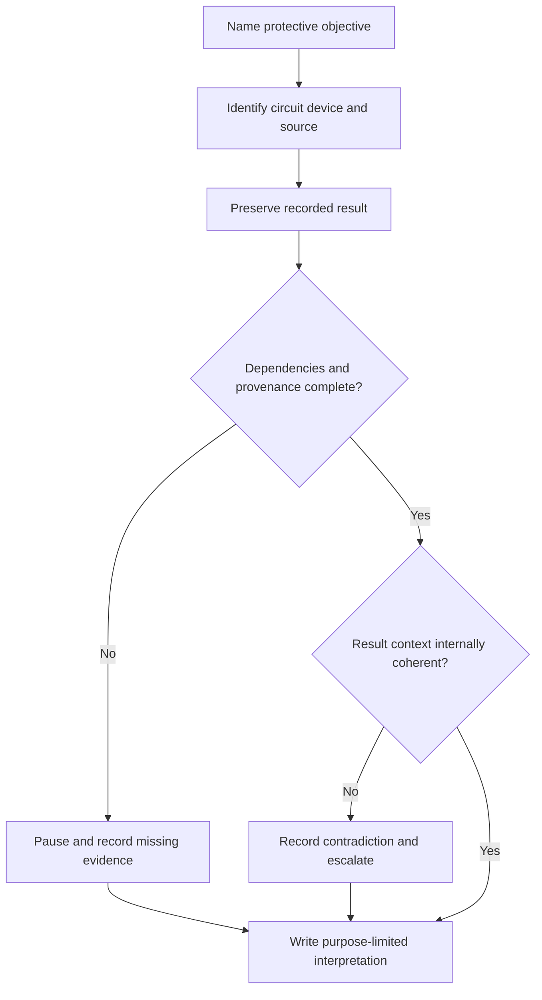

# Day 66 — Fault-Loop and RCD Result Interpretation at Concept Level

> **Scope boundary:** This module teaches concept-level interpretation of existing fault-loop and RCD evidence. It provides no field method, instrument setup, test current, timing limit, acceptance value or practical authority.

## 1. Outcome and entry check

By the end, the learner can:

1. define fault loop, disconnection objective, RCD evidence and protective dependency;
2. distinguish a recorded result from a compliance conclusion;
3. identify circuit, device, source, state and provenance;
4. map which protection claim the evidence is intended to support;
5. recognise contradictions, implausible context and changed-source risks;
6. avoid treating one result as proof of all protection functions;
7. write a bounded interpretation; and
8. escalate missing safety-critical evidence.

### Entry check

Why is a result labelled only “RCD passed” insufficient for a traceable conclusion?

## 2. Why it matters

Fault-loop and RCD records are meaningful only when the protective objective, circuit boundary, device identity, supply condition and evidence method are traceable. Similar-looking numbers can relate to different questions and cannot be interpreted safely without context.

## 3. Core concepts and terminology

- **Fault loop:** the complete conductive path associated with a fault-current return route.
- **Protective dependency:** a condition that must be true for a protective objective to be supported.
- **Disconnection objective:** the intended protective outcome associated with interruption of supply under defined fault conditions.
- **RCD evidence:** a record relating to the operation or characteristics of an identified residual-current device under stated conditions.
- **Device identity:** traceable link between a record and the exact protective device.
- **Supply state:** the source arrangement and operating condition applying when evidence was obtained.
- **Result plausibility:** whether a record is internally coherent and compatible with known context; plausibility is not acceptance.
- **Bounded interpretation:** a conclusion limited to the named evidence purpose and unresolved dependencies.

## 4. Rule-finding workflow

Use **P-R-O-T-E-C-T**:

1. **P — Pin down the protection question.**
2. **R — Record circuit, device and source identity.**
3. **O — Observe the result without converting it into a conclusion.**
4. **T — Trace dependencies and required context.**
5. **E — Examine provenance, currency and contradictions.**
6. **C — Constrain the interpretation to the evidence purpose.**
7. **T — Trigger review where evidence is incomplete or changed.**

This is an evidence-review model, not an official verification sequence.

## 5. Visual model or worked example

A fictional pack includes a circuit schedule, one fault-loop result, one RCD record and a later note that the site can operate from an alternate source. The records do not state which source was active.

| Review field | Bounded response |
|---|---|
| Protection question | Must be stated separately for the fault-loop and RCD evidence. |
| Identity | Circuit is named; device identity is incomplete. |
| Supply state | Ambiguous because the active source is not recorded. |
| Supported claim | Historical evidence exists for the named records. |
| Unsupported claim | Current protection performance under every source arrangement is not established. |
| Reopening trigger | Traceable device identity and source-specific current evidence. |

### Worked-example fading

Complete the same fields for a second record in which the source is known but the circuit schedule and device label conflict.

## 6. Practical application

Prepare a **protective-evidence dependency map** containing the protection question, circuit, device, source, state, result provenance, dependencies, contradictions, supported claim, unsupported claim and reopening trigger.

### Assessment rubric

Score six categories from **0 to 2**: protection question; identity; dependencies; provenance; bounded interpretation; safety communication. A score of **10/12 or higher** with no critical error indicates readiness for Day 67. This is educational only.

## 7. Common errors and safety checkpoint

### Common errors

- treating a generic pass label as traceable evidence;
- assuming the same interpretation applies to every source state;
- confusing plausibility with acceptance;
- treating RCD evidence as proof of all protective measures;
- ignoring device or circuit identity conflicts; and
- inventing official limits, timing values or procedures.

### Critical errors and stop conditions

Stop if the learner claims practical authority, invents an official criterion, ignores source-state ambiguity, merges separate protection questions or declares overall compliance from one result.

This module authorises no access, switching, isolation, proving de-energised, testing, measurement, instrument use, alteration, repair, energisation, certification or verification.

## 8. Retrieval and next links

1. Define protective dependency.
2. Why must supply state be recorded?
3. What is the difference between plausibility and acceptance?
4. Name four identity fields required for a bounded interpretation.
5. Why can one RCD record not prove every protective function?

### Changed-scenario transfer

Revise the example after the source is confirmed but the protective-device label remains inconsistent with the schedule.

- **Plan:** [Twelve-Week Capstone Learning Plan](../MASTER_PLAN.md)
- **Knowledge note:** [[12-Week Day 66 - Fault-Loop and RCD Result Interpretation at Concept Level]]
- **Previous:** [Day 65 — Insulation, Polarity and Connection-Integrity Concepts](day-65-insulation-polarity-and-connection-integrity-concepts.md)
- **Next:** [Day 67 — Systematic Fault-Finding Workflow and Hypothesis Control](day-67-systematic-fault-finding-workflow-and-hypothesis-control.md)

This module remains `review-required`, `reference_check_required`, safety-critical and not `technically-reviewed`.