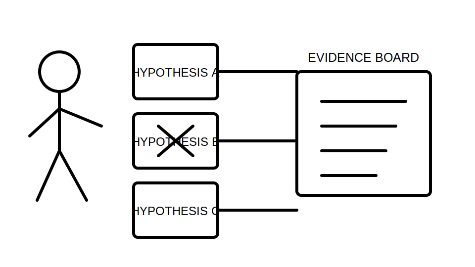
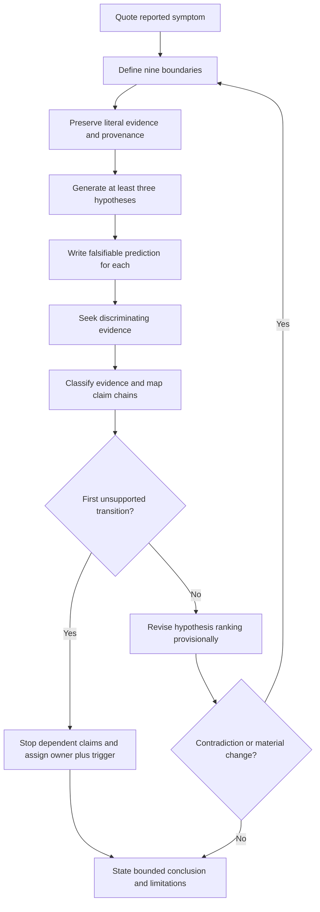
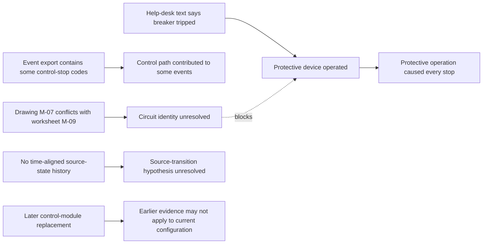

# Day 67 — Systematic Fault-Finding Workflow and Hypothesis Control

> **Scope boundary:** This module teaches document- and scenario-based diagnostic reasoning. It authorises no site access, opening, switching, isolation, proving de-energised, testing, measurement, instrument use, alteration, repair, energisation, commissioning, acceptance, certification or field fault finding.

## 1. Outcome and entry check

By the end, the learner can:

1. separate a reported symptom from a verified observation and identify the source of each;
2. define installation, circuit, equipment, source, operating-state, time, evidence, authority and decision boundaries for a diagnostic scenario;
3. classify each claim as a stated fact, derived fact, supported inference, assumption, contradiction or evidence gap;
4. generate at least three credible hypotheses, including one high-consequence alternative where the scenario supports it;
5. state a falsifiable prediction for each hypothesis rather than a vague expectation;
6. select evidence that discriminates between hypotheses instead of merely confirming a preferred explanation;
7. stop dependent reasoning at the first unsupported transition in a claim chain;
8. revise hypothesis ranking when contradictory or changed evidence appears;
9. assign an evidence owner and recheck trigger to each unresolved blocker; and
10. communicate criterion-level readiness without claiming root cause, compliance, acceptance or technical approval.

### Entry check

A fictional circuit is reported as “intermittent.” Without proposing field actions:

1. write the report exactly as a symptom;
2. list three materially different hypotheses;
3. state one prediction for each;
4. identify one evidence item that could weaken each hypothesis; and
5. mark any conclusion that cannot yet be supported.

A single first guess, an untraceable “likely cause,” or a proposed practical test indicates prerequisite repair before the main task.

## 2. Why it matters

Fault diagnosis becomes unsafe and unreliable when the first plausible explanation is treated as the cause. The central discipline is not producing more guesses; it is controlling the transition from evidence to explanation.

A robust diagnostic record preserves what was reported, what is verified, what is inferred, what conflicts and what remains unknown. It also makes clear when a conclusion depends on an unresolved identity, operating-state or provenance question.

*Instructional caption: compare every hypothesis against the same traceable evidence set; reject or downgrade explanations that conflict, and retain uncertainty where evidence does not discriminate.*

## 3. Core concepts and terminology

### Diagnostic terms

- **Symptom:** a reported or observed abnormal effect. A symptom does not identify its cause.
- **Observation:** a traceable fact from an authorised record or provided scenario.
- **Hypothesis:** a provisional explanation capable of being supported, weakened or rejected by evidence.
- **Prediction:** a specific observation expected if a hypothesis is correct.
- **Falsifiable prediction:** a prediction that could be contradicted by obtainable authorised evidence.
- **Discriminating evidence:** evidence that changes the relative credibility of competing hypotheses.
- **Root cause:** an underlying condition that adequately explains the relevant evidence and causal chain. This module does not permit an automated root-cause declaration.
- **Premature closure:** accepting one explanation before credible alternatives and contradictions have been examined.
- **Confirmation bias:** seeking or favouring evidence that supports an existing belief while discounting conflicting evidence.
- **Correlation:** two events occurring together or in sequence; correlation alone does not establish causation.
- **Diagnostic log:** a time-ordered record of symptoms, observations, hypotheses, predictions, evidence, decisions and reopened questions.

### Nine boundaries

1. **Installation boundary:** the exact installation or documented subsystem under consideration.
2. **Circuit boundary:** the identified circuit path and endpoints addressed by the evidence.
3. **Equipment boundary:** the specific load, control, protective or associated equipment included.
4. **Source boundary:** the supply source or sources relevant to the scenario.
5. **Operating-state boundary:** the mode, control state, source state and relevant conditions at the recorded time.
6. **Time boundary:** the period for which a record can reasonably apply.
7. **Evidence boundary:** what each item directly records and what it does not establish.
8. **Authority boundary:** what the learner may analyse versus what requires an authorised source, supervisor or qualified person.
9. **Decision boundary:** the limited educational conclusion the evidence can support.

### Six evidence states

- **Stated fact:** directly recorded in the supplied evidence.
- **Derived fact:** calculated or logically obtained from stated facts with the derivation shown.
- **Supported inference:** an interpretation supported by evidence but still dependent on stated assumptions.
- **Assumption:** an unverified proposition temporarily used to frame a question, never silently promoted to fact.
- **Contradiction:** evidence items that cannot both describe the same bounded condition without further explanation.
- **Evidence gap:** information required to support or reject a claim but not currently available.

### Confidence and correctness

**Confidence** is the learner’s degree of belief. **Correctness** is whether the claim is actually right. **Evidence quality** concerns provenance, identity, currency, completeness and applicability. Record these separately: high confidence does not repair weak evidence.

### Dependency control

- **Claim chain:** linked steps from evidence to interpretation to conclusion.
- **First unsupported transition:** the earliest step not supported by the bounded evidence. Every dependent step remains unsupported until that transition is repaired.
- **Competing interpretations:** plausible explanations retained without promoting one to fact.
- **Evidence owner:** the authorised record custodian, source or qualified person responsible for resolving a blocker.
- **Recheck trigger:** a specified new record, clarification or material change that requires the reasoning to be reopened.
- **Material change:** a change capable of altering identity, state, applicability, ranking or conclusion.

## 4. Rule-finding workflow

Use **H-Y-P-O-T-H-E-S-I-S**:

1. **H — Hold symptom apart from observation.** Quote the report, then list only verified observations with provenance.
2. **Y — Yield nine explicit boundaries.** Define installation, circuit, equipment, source, operating state, time, evidence, authority and decision.
3. **P — Preserve evidence literally.** Record identifiers, dates, versions, states and wording before interpretation.
4. **O — Offer competing hypotheses.** Generate at least three materially different explanations where the dossier permits.
5. **T — Tell a falsifiable prediction for each.** State what evidence should be present or absent if the hypothesis is correct.
6. **H — Hunt for discriminating evidence.** Prefer evidence that separates alternatives over evidence that merely repeats the symptom.
7. **E — Evaluate provenance, fit and contradiction.** Classify each claim and locate the first unsupported transition.
8. **S — Shift ranking provisionally.** Strengthen, weaken, retain or reject a hypothesis without converting ranking into fact.
9. **I — Identify ownership and triggers.** Assign each blocker an evidence owner and a specific recheck trigger.
10. **S — State the bounded conclusion.** Communicate supported findings, unresolved alternatives, limitations and stop conditions.

The diagram is a reasoning-control loop, not a practical troubleshooting sequence. A contradiction or material change returns the learner to the boundaries because earlier evidence may no longer apply.

### Hypothesis ledger fields

For each hypothesis, record:

| Field | Required content |
|---|---|
| Hypothesis ID | Stable label such as H1, H2 or H3 |
| Explanation | One bounded causal proposition |
| Supporting evidence | Exact records that increase credibility |
| Conflicting evidence | Exact records that weaken credibility |
| Prediction | Specific expected evidence |
| Discriminator | Evidence that separates this hypothesis from alternatives |
| Claim state | One of the six evidence states |
| Confidence | Low, medium or high, recorded separately from evidence quality |
| Owner | Authorised source for unresolved evidence |
| Recheck trigger | Event that reopens ranking |
| Current disposition | Retain, strengthen, weaken or reject provisionally |

## 5. Visual model or worked example

### Fictional evidence dossier

A motor-driven load is reported to stop unpredictably. The supplied dossier contains:

- a help-desk entry saying “breaker tripped again,” without device identity;
- an event export showing a control-stop code for some, but not all, reported times;
- a drawing naming the circuit `M-07`;
- a maintenance worksheet naming the same load `M-09`;
- a control modification record dated before the first reported event;
- a witness statement that the fault occurs only in automatic mode;
- no source-state history for the event period;
- an undated photograph of a protective device;
- an email saying “the supply is normal,” without source data; and
- a later asset note showing that a control module was replaced.

### Boundary table

| Boundary | Current statement | Status |
|---|---|---|
| Installation | Training workshop, motor-driven load area | Stated fact |
| Circuit | `M-07` on drawing versus `M-09` on worksheet | Contradiction |
| Equipment | Motor-driven load; control-module identity partly recorded | Evidence gap |
| Source | Normal or alternate source not time-aligned | Evidence gap |
| Operating state | Automatic mode reported; not independently recorded for every event | Supported inference |
| Time | Records span before and after a control-module replacement | Stated fact |
| Evidence | Mixed event export, drawing, worksheet, statements, email and photograph | Stated fact |
| Authority | Document-only educational analysis | Stated fact |
| Decision | Rank hypotheses and request evidence; no root-cause claim | Stated fact |

### Competing hypothesis ledger

| Hypothesis | Falsifiable prediction | Discriminating evidence | Current disposition |
|---|---|---|---|
| H1 — protective-device operation | A device-specific, time-aligned operation record should exist for each relevant stop. | Identified event record tied to circuit, device and time. | Retain weakly; witness wording alone is insufficient. |
| H2 — control-state interruption | Stops should align with automatic mode, control-stop codes or the modified control path. | Current control documentation and time-aligned state/event records. | Retain; some evidence fits, but identity and completeness remain unresolved. |
| H3 — source-state transition | Stops should correlate with a source transfer or source condition. | Source-state history aligned with event times. | Retain unresolved; required evidence is absent. |
| H4 — post-replacement incompatibility or configuration issue | Events should begin or change after the recorded control-module replacement. | Current module identity, configuration provenance and dated event comparison. | Retain unresolved; replacement applicability is not established. |

### Claim-chain inspection

The first chain fails at the transition from unverified help-desk wording to an identified protective-device operation. The circuit-identity contradiction blocks dependent claims. The control-stop export supports only a limited inference for the events it actually covers. Missing source-state evidence does not disprove a source hypothesis. The replacement record is a material change that reopens equipment identity, time applicability and earlier rankings.

### Two-change transfer

Apply two changes in sequence:

1. a traceable device event record shows no operation at one reported stop; then
2. a dated source-state log shows that the same event occurred during an alternate-source transition.

After each change, reopen affected boundaries and claim chains. Do not merely edit the preferred hypothesis. Record which hypotheses strengthen, weaken, remain unresolved or require a new discriminator.

## 6. Practical application

Prepare a one-page **diagnostic hypothesis ledger** for a new fictional dossier. It must contain:

1. the exact symptom statement;
2. all nine boundaries;
3. a provenance table for every evidence item;
4. six-state classification for each material claim;
5. at least three credible hypotheses;
6. one falsifiable prediction and discriminator per hypothesis;
7. supporting and conflicting evidence;
8. the first unsupported transition in each claim chain;
9. confidence recorded separately from evidence quality;
10. evidence owners and recheck triggers;
11. a two-change transfer record; and
12. a bounded conclusion with explicit stop conditions.

### Criterion-level readiness

Assess each criterion independently:

| Criterion | Secure | Developing | Unsupported | `stop-required` |
|---|---|---|---|---|
| Symptom and observation separation | Every item is separated and sourced. | Minor source or wording weakness. | Reports are treated as facts. | Evidence is invented or altered. |
| Boundary control | All nine boundaries are explicit and maintained. | One non-blocking boundary is incomplete. | A blocking identity, state or time boundary is missing. | Reasoning proceeds despite unresolved safety-critical boundaries. |
| Hypothesis breadth | Three or more materially different hypotheses are credible. | Alternatives exist but overlap or omit a plausible lower-consequence option. | One preferred guess dominates. | A credible high-consequence alternative is concealed or dismissed without evidence. |
| Predictions and discriminators | Predictions are falsifiable and evidence separates alternatives. | Some predictions are general. | Evidence merely confirms the preferred explanation. | Practical testing or unsafe action is prescribed. |
| Evidence and provenance | Claims are classified; provenance, currency and applicability are controlled. | One non-blocking classification needs repair. | Historical or unidentified evidence is treated as current. | Contradictions are hidden or records are fabricated. |
| Dependency control | Reasoning stops at the first unsupported transition. | Dependency map is incomplete but bounded. | Dependent conclusions continue beyond a gap. | Unsupported safety, root-cause, acceptance or compliance claims are made. |
| Updating and change propagation | Ranking changes after contradictions and both material changes. | One affected dependency is not reopened. | Preferred ranking remains fixed. | Material change is ignored while a definitive conclusion is asserted. |
| Ownership and communication | Every blocker has an owner, trigger, limitation and stop boundary. | One owner or trigger is vague. | Blockers are listed without resolution control. | Unauthorised field action or technical approval is implied. |

There is no aggregate score or compensatory pass mark. Any blocking **unsupported** criterion prevents readiness. Any `stop-required` state requires remediation and qualified escalation. These are educational planning states, not official grades, competency decisions or technical conclusions.

## 7. Common errors and safety checkpoint

### Common errors

- translating a witness description into a verified technical event;
- generating several labels for essentially the same hypothesis;
- selecting evidence because it is easy to obtain rather than discriminating;
- treating absence of evidence as evidence of absence;
- treating sequence or correlation as proof of causation;
- ignoring alternate sources, control states, replacements or date boundaries;
- raising confidence without improving evidence quality;
- retaining a preferred hypothesis after contradictory evidence;
- changing a conclusion without reopening its dependencies; and
- writing “root cause confirmed” where the evidence supports only provisional ranking.

### Critical errors and stop conditions

Stop and remediate if the learner:

- invents, alters or silently fills evidence;
- hides a contradiction;
- merges symptom, observation, hypothesis and conclusion;
- ignores a credible high-consequence hypothesis;
- continues beyond the first unsupported transition;
- treats historical evidence as current without applicability evidence;
- leaves a blocking gap without an evidence owner and recheck trigger;
- proposes site access, switching, isolation, testing, measurement, repair or energisation;
- supplies unverified clause numbers, values, sequences or acceptance criteria; or
- claims root cause, compliance, acceptance, certification or technical approval.

Exact fault-finding duties, methods, verification sequences, instrument requirements, values, acceptance criteria, documentation requirements, role permissions and official assessment expectations require current authorised sources and qualified technical review.

## 8. Retrieval and next links

### Closed-note retrieval

1. Distinguish symptom, observation, hypothesis and root cause.
2. Name the nine diagnostic boundaries.
3. List the six evidence states.
4. Explain why a falsifiable prediction is stronger than a general expectation.
5. Define discriminating evidence.
6. What is the first unsupported transition?
7. Why are confidence, correctness and evidence quality recorded separately?
8. What must happen after a material change?
9. Why can no aggregate score offset a blocking criterion?
10. State the authority boundary for this module.

### Changed-scenario transfer

Without reopening the worked example, explain how the ranking should change after:

1. a device-specific record contradicts the help-desk report; and
2. a current control record shows that the replacement module uses a different configuration from the earlier dossier.

Name every boundary and dependency that must reopen.

- **Plan:** [Twelve-Week Capstone Learning Plan](../MASTER_PLAN.md)
- **Knowledge note:** [[12-Week Day 67 - Systematic Fault-Finding Workflow and Hypothesis Control]]
- **Previous:** [Day 66 — Fault-Loop and RCD Result Interpretation at Concept Level](day-66-fault-loop-and-rcd-result-interpretation-at-concept-level.md)
- **Next:** [Day 68 — Rest, Retrieval and High-Confidence-Error Repair](day-68-rest-retrieval-and-high-confidence-error-repair.md)

This module remains `review-required`, `reference_check_required`, safety-critical and not `technically-reviewed`.