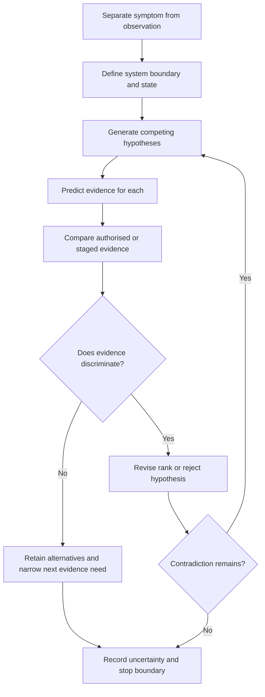

# Day 67 — Systematic Fault-Finding Workflow and Hypothesis Control

> **Scope boundary:** This module teaches document- and scenario-based diagnostic reasoning. It does not authorise access, live work, isolation, testing, repair, energisation or any field fault-finding procedure.

## 1. Outcome and entry check

By the end, the learner can:

1. define symptom, observation, hypothesis, prediction, discriminating evidence and root cause;
2. separate reported symptoms from verified observations;
3. generate multiple plausible hypotheses without premature closure;
4. rank hypotheses by fit, consequence and evidence cost;
5. identify evidence that would discriminate between competing explanations;
6. update or reject hypotheses when new evidence conflicts;
7. maintain a traceable diagnostic log; and
8. apply authority and stop boundaries.

### Entry check

A circuit is reported as “intermittent.” List three different hypotheses and one piece of evidence that would distinguish each from the others.

## 2. Why it matters

Fault finding fails when the first plausible explanation becomes the assumed cause. A disciplined process keeps observations, hypotheses and conclusions separate, predicts what each hypothesis would imply and changes direction when evidence disagrees.

## 3. Core concepts and terminology

- **Symptom:** a reported or observed effect that indicates abnormal behaviour but does not identify cause.
- **Observation:** a traceable fact recorded from an authorised source or provided scenario.
- **Hypothesis:** a provisional explanation that could account for the observations.
- **Prediction:** an expected observation if a hypothesis is correct.
- **Discriminating evidence:** evidence that changes the relative credibility of competing hypotheses.
- **Premature closure:** accepting one explanation before credible alternatives are examined.
- **Confirmation bias:** favouring evidence that supports an existing belief while discounting conflicting evidence.
- **Root cause:** the underlying condition that adequately explains the relevant evidence and causal chain.
- **Diagnostic log:** a time-ordered record of observations, hypotheses, predictions, evidence and decisions.
- **Stop boundary:** a condition requiring pause, escalation or qualified supervision.

## 4. Rule-finding workflow

Use **H-Y-P-O-T-H-E-S-I-S**:

1. **H — Hold the reported symptom apart from fact.**
2. **Y — Yield a clear system boundary and state.**
3. **P — Preserve verified observations.**
4. **O — Offer at least two credible hypotheses.**
5. **T — Tell what each hypothesis predicts.**
6. **H — Hunt for discriminating evidence in authorised records or staged scenarios.**
7. **E — Evaluate fit, contradictions, consequence and uncertainty.**
8. **S — Select, revise or reject provisionally.**
9. **I — Identify the next bounded evidence need.**
10. **S — State conclusion, limitations and stop boundary.**

The model structures reasoning only; it is not a field troubleshooting sequence.

## 5. Visual model or worked example

A fictional scenario reports that a motor-driven load stops unpredictably. Provided records show:

- the event occurs only in one operating mode;
- a recent control change was documented;
- no source-state record accompanies the event log; and
- one witness describes a protective-device operation, while another describes a control stop.

| Hypothesis | Prediction | Discriminating evidence | Current status |
|---|---|---|---|
| Protective operation | Traceable device/event evidence should align with each stop. | Identified event record tied to time and device. | Possible, not established. |
| Control-state issue | Stops should correlate with the changed operating mode or control logic. | Current control documentation and time-aligned state record. | Plausible. |
| Supply-state change | Stops should correlate with source transfer or operating state. | Source-state history aligned with event times. | Unresolved because evidence is missing. |

The evidence supports no final root-cause claim. The correct output is a ranked hypothesis set and bounded evidence request.

### Worked-example fading

For a second scenario, create three hypotheses, predictions and one discriminating evidence request each. Then revise the ranking after one contradictory record is released.

## 6. Practical application

Prepare a one-page **diagnostic hypothesis ledger** containing:

1. symptom statement;
2. verified observations and sources;
3. system boundary and operating state;
4. at least two hypotheses;
5. prediction for each;
6. discriminating evidence;
7. contradiction and confidence record;
8. next bounded evidence need; and
9. authority and stop boundary.

### Assessment rubric

Score each category from **0 to 2**:

| Category | 0 | 1 | 2 |
|---|---|---|---|
| Symptom and observation | Merged | Partly separated | Clearly separated and sourced |
| Hypothesis breadth | Single guess | Two weak alternatives | Multiple credible alternatives |
| Predictions | Absent | General | Specific and discriminating |
| Evidence updating | Confirmation bias | Partial revision | Contradictions change ranking |
| Diagnostic log | Untraceable | Incomplete | Boundary, state, evidence and decisions traceable |
| Safety boundary | Practical authority implied | Generic caution | Explicit stop and escalation conditions |

A score of **10/12 or higher** with no critical error indicates readiness for Day 68. This is educational only.

## 7. Common errors and safety checkpoint

### Common errors

- converting a reported symptom into a verified fact;
- generating only one hypothesis;
- selecting evidence that merely confirms the preferred explanation;
- ignoring operating-state changes;
- confusing correlation with cause;
- treating absence of evidence as evidence of absence; and
- proposing unauthorised practical actions.

### Critical errors and stop conditions

Stop and remediate if the learner:

- claims a root cause without discriminating evidence;
- ignores a credible high-consequence hypothesis;
- invents field procedures or safety-critical values;
- recommends access, live work or unauthorised testing; or
- fails to record uncertainty and escalation needs.

This module authorises no access, switching, isolation, proving de-energised, testing, measurement, instrument use, alteration, repair, energisation, certification or verification.

## 8. Retrieval and next links

1. Define hypothesis and prediction.
2. What makes evidence discriminating?
3. Explain premature closure.
4. Why should operating state be recorded?
5. What must a diagnostic log preserve?

### Changed-scenario transfer

Revise the worked example after a source-state log shows every event occurred during normal supply. Explain which hypothesis weakens, which remains plausible and what evidence is still needed.

- **Plan:** [Twelve-Week Capstone Learning Plan](../MASTER_PLAN.md)
- **Knowledge note:** [[12-Week Day 67 - Systematic Fault-Finding Workflow and Hypothesis Control]]
- **Previous:** [Day 66 — Fault-Loop and RCD Result Interpretation at Concept Level](day-66-fault-loop-and-rcd-result-interpretation-at-concept-level.md)
- **Next:** Day 68 — Rest, Retrieval and High-Confidence-Error Repair

This module remains `review-required`, `reference_check_required`, safety-critical and not `technically-reviewed`.