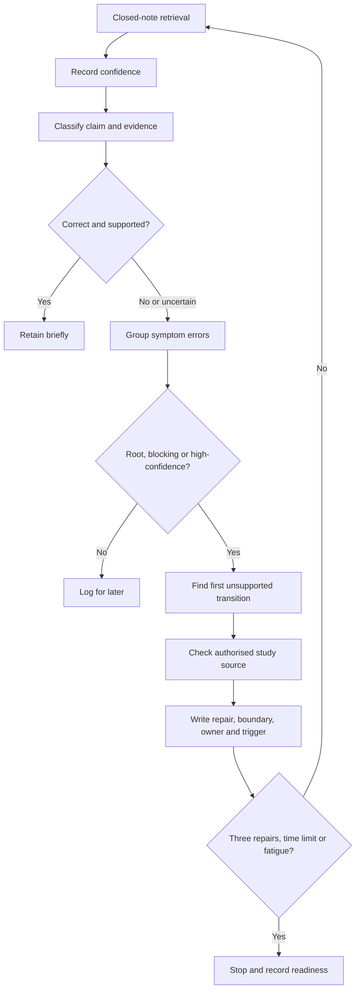
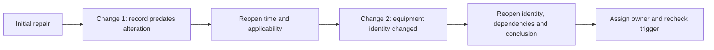

# Day 68 — Rest, Retrieval and High-Confidence-Error Repair

> **Scope boundary:** This is a recovery-only, document-based learning block. It introduces no new electrical theory and authorises no practical electrical work, testing, diagnosis or technical decision.

## 1. Outcome and entry check

By the end, the learner can:

1. complete a bounded recovery session of no more than 30 minutes, reduced to 15 minutes when fatigue is already present;
2. retrieve six Week 10 distinctions before reopening notes;
3. record confidence separately from correctness and evidence quality;
4. classify each response as a stated fact, derived fact, supported inference, assumption, contradiction or evidence gap;
5. distinguish a root misconception from its downstream symptom errors;
6. identify the first unsupported transition in a reasoning chain;
7. repair no more than three blocking or high-confidence root errors using authorised study sources;
8. assign an evidence owner and recheck trigger to any unresolved blocker;
9. reopen affected reasoning after two sequential material changes; and
10. state criterion-level readiness for Day 69 without converting an educational judgement into technical approval.

### Entry check

Without notes, write one sentence for each distinction below and mark confidence as **high**, **medium** or **low**:

- literal result versus interpretation;
- plausible result versus accepted result;
- symptom versus observation;
- hypothesis versus root cause;
- confirming evidence versus discriminating evidence; and
- current evidence versus historical evidence.

Then classify each sentence as a stated fact, derived fact, supported inference, assumption, contradiction or evidence gap. Do not correct answers until all six are recorded.

## 2. Why it matters

A recovery block is not a smaller version of a normal study session. Its purpose is to reduce cognitive load while repairing the few errors most likely to distort later reasoning. High-confidence errors deserve priority because the learner is likely to reuse them automatically. Root errors deserve priority because one mistaken distinction can generate several downstream mistakes.

The block therefore controls four risks:

- **recognition replacing retrieval:** rereading can feel fluent without proving recall;
- **confidence replacing evidence:** certainty does not make a claim correct;
- **symptom repair replacing root repair:** correcting wording alone leaves the misconception active; and
- **fatigue replacing judgement:** continuing after attention declines can reinforce new errors.

*Instructional caption: Retrieve first, repair no more than three root errors, and stop when the time, repair or fatigue limit is reached.*

## 3. Core concepts and terminology

- **Closed-note retrieval:** producing an answer before consulting notes or references.
- **Recognition:** identifying information when it is visible; recognition is easier than retrieval and is not equivalent evidence of recall.
- **Confidence:** the learner’s estimate of how likely an answer is correct.
- **Correctness:** whether the answer is accurate within the stated boundary.
- **Evidence quality:** how well the answer is supported by current, applicable and traceable material.
- **High-confidence error:** an incorrect or unsupported answer given with high confidence.
- **Root misconception:** the underlying mistaken distinction or reasoning rule that generates multiple errors.
- **Symptom error:** a visible wrong answer produced by a deeper root misconception.
- **Blocking error:** an error that prevents safe or coherent progress in dependent reasoning.
- **First unsupported transition:** the earliest step in a claim chain that lacks sufficient support; every dependent claim after that point remains unsupported.
- **Stated fact:** information explicitly present in the supplied record.
- **Derived fact:** information obtained directly from stated facts through a transparent, valid transformation.
- **Supported inference:** a provisional conclusion reasonably supported by the evidence and stated boundaries.
- **Assumption:** an unverified proposition used temporarily and labelled as such.
- **Contradiction:** two claims or records that cannot both be accepted as describing the same bounded condition.
- **Evidence gap:** information required for a conclusion but not yet available.
- **Evidence owner:** the authorised source, custodian or qualified person responsible for resolving a gap.
- **Recheck trigger:** a specified new record, clarification or material change that requires the reasoning to be reopened.
- **Material change:** new information that can alter a boundary, dependency, evidence classification or conclusion.
- **Fatigue signal:** evidence that attention is declining, such as repeated rereading, rushed answers, omitted qualifiers, increasing confusion or inability to explain a distinction.
- **Stop condition:** a defined reason to end, defer or escalate the block.
- **Educational readiness state:** one of **secure**, **developing**, **unsupported** or `stop-required`; these are planning labels, not official grades or technical decisions.

## 4. Rule-finding workflow

Use **R-E-P-A-I-R**:

1. **R — Retrieve before reopening notes.** Record the answer exactly as recalled.
2. **E — Estimate confidence and classify the claim.** Keep confidence separate from correctness and evidence quality.
3. **P — Prioritise root, blocking and high-confidence errors.** Group symptom errors under the misconception that produced them.
4. **A — Analyse the first unsupported transition.** Stop dependent reasoning at that point.
5. **I — Inspect an authorised study source.** Record the source, applicability boundary, evidence owner and any unresolved contradiction.
6. **R — Rewrite, recheck once and record the trigger.** Repair no more than three root errors, then stop.

The diagram prevents open-ended correction. A low-value wording error can be logged, while a root or blocking misconception receives one bounded repair. The session ends at the first reached limit: three repairs, 30 minutes, the reduced 15-minute fatigue limit, or an earlier stop condition.

### Dependency reopening

A repair is provisional when later evidence can change it. Apply two sequential changes:

1. a previously trusted record is shown to pre-date an alteration; and
2. a later note reveals that the equipment identity was also changed.

After each change, reopen every affected claim rather than editing only the final sentence.

This diagram shows change propagation. A material change can invalidate several dependencies; preserving the old conclusion while changing only one detail is not a valid repair.

## 5. Visual model or worked example

A learner writes with high confidence:

> “A plausible protective-device result proves the installation is compliant, so the first hypothesis that fits the symptom is the root cause.”

This sentence contains two symptom errors generated by one root misconception: **evidence, interpretation, acceptance and diagnosis have been collapsed into a single conclusion**.

| Repair element | Corrected record |
|---|---|
| Literal claim | The supplied result appears plausible in the stated context. |
| Confidence | High confidence was recorded, but confidence does not establish correctness. |
| Evidence classification | “Plausible” may be a supported inference; “compliant” and “root cause” are unsupported. |
| Root misconception | Plausibility, acceptance, compliance and diagnosis were treated as equivalent. |
| First unsupported transition | The move from plausible result to accepted/compliant outcome. |
| Corrected distinction | Plausibility concerns credibility in context; acceptance requires applicable authorised criteria and qualified judgement; a hypothesis remains provisional until discriminating evidence supports it. |
| Boundary | The record alone does not prove compliance or root cause. |
| Evidence owner | Qualified reviewer with access to the applicable current sources and complete bounded record. |
| Recheck trigger | Verified current equipment identity, operating state, applicable criteria and discriminating evidence. |
| Retrieval cue | “Plausible is not accepted; fitting is not proven.” |

### Worked-example fading

Repair this statement using the same elements:

> “The result matches the old worksheet, so the circuit identity and present operating state are confirmed.”

Do not merely replace the sentence. Identify the root misconception, the first unsupported transition, the affected boundaries, the evidence owner and the recheck trigger.

## 6. Practical application

Complete one **three-card root-repair sheet**.

### Card fields

For each selected root error, record:

1. original closed-note answer;
2. confidence rating;
3. correctness status after checking;
4. evidence classification;
5. linked symptom errors;
6. root misconception;
7. first unsupported transition;
8. authorised source consulted;
9. corrected distinction;
10. explicit boundary;
11. evidence owner;
12. recheck trigger; and
13. one retrieval cue of no more than twelve words.

### Selection rule

Choose no more than three items in this order:

1. `stop-required` safety or authority error;
2. blocking root misconception;
3. high-confidence root error;
4. lower-confidence error with several downstream effects.

Do not spend the block polishing already secure wording.

### Readiness criteria

Assess each criterion independently:

| Criterion | Secure | Developing | Unsupported | `stop-required` |
|---|---|---|---|---|
| Retrieval | Six distinctions retrieved before notes | Four or five retrieved | Fewer than four or notes opened first | Retrieval abandoned because fatigue or confusion makes the record unreliable |
| Confidence calibration | Confidence is separate from correctness and evidence quality | Separation is inconsistent but recoverable | Confidence is treated as evidence | Certainty supports a safety-critical or authority claim |
| Root-error control | Symptom errors are grouped under a defensible root misconception | Root identified with some prompting | Wording is corrected without cause analysis | A blocking misconception remains hidden or is promoted as correct |
| Evidence control | Claims are classified and provenance is recorded | Minor classification gaps remain | Assumptions or contradictions are unlabelled | Evidence is invented, altered or represented as current when known not to be |
| Dependency control | First unsupported transition is found and dependent claims stop | Transition found after prompting | Reasoning continues past unsupported steps | Unsupported reasoning produces a safety, compliance, acceptance or diagnostic conclusion |
| Recovery control | Time, three-repair cap and fatigue stop are followed | One limit needed prompting | Session overruns or expands into new theory | Learner continues despite unreliable judgement |
| Ownership and transfer | Each unresolved blocker has an owner and trigger; two changes reopen dependencies | One owner or trigger needs refinement | Blockers are merely listed | A blocker is concealed or bypassed to claim readiness |

There is no aggregate score. A stronger criterion cannot offset an unsupported blocking criterion or any `stop-required` state.

### Readiness decision

Record exactly one:

- **Ready:** all blocking criteria are secure and no unresolved safety-critical item remains.
- **Ready with carry-forward:** no `stop-required` state exists, but one clearly owned and triggered non-blocking item remains visible for Day 69.
- **Not ready:** a blocking criterion is unsupported, fatigue prevents a reliable record, or supervised review is required.

These are educational planning decisions only.

## 7. Common errors and safety checkpoint

### Common errors

- opening notes before attempting retrieval;
- treating high confidence as proof of correctness;
- treating low confidence as proof of error;
- repairing visible wording while leaving the root misconception unchanged;
- correcting more than three items;
- continuing dependent reasoning after the first unsupported transition;
- using a historical record without checking current applicability;
- leaving contradictions, evidence owners or recheck triggers unstated;
- copying source wording without explaining the distinction;
- changing only the final conclusion after a material change; and
- extending a recovery block into new theory, calculations or practical troubleshooting.

### Blocking conditions

Progress is blocked when the learner:

- invents or alters evidence;
- hides a contradiction or evidence gap;
- promotes an assumption, hypothesis or plausible result to fact, acceptance, compliance or root cause;
- treats a historical source as current without applicability evidence;
- continues reasoning beyond the first unsupported transition;
- leaves a safety-critical blocker without an evidence owner and recheck trigger;
- fails to reopen affected dependencies after either of two material changes;
- exceeds the time or repair cap;
- continues after fatigue makes the record unreliable; or
- gives practical instructions for site access, switching, isolation, proving de-energised, testing, measurement, repair or energisation.

### Safety checkpoint

Stop immediately and defer to authorised sources, supervision or qualified review if any answer depends on an exact clause, value, test method, sequence, acceptance criterion, equipment instruction, role permission or safety-critical procedure that is not verified.

This module authorises no site access, opening, switching, isolation, proving de-energised, testing, measurement, instrument use, alteration, repair, energisation, commissioning, acceptance, certification, verification or field fault finding.

## 8. Retrieval and next links

1. Why is a high-confidence error different from ordinary uncertainty?
2. What is the difference between a root misconception and a symptom error?
3. Name the six evidence classifications used in this block.
4. What is the first unsupported transition?
5. Why can confidence not offset weak evidence quality?
6. What must be recorded for an unresolved blocker?
7. What happens after each of two sequential material changes?
8. Which limit ends the session first?
9. Why is there no aggregate readiness score?
10. What makes a readiness state `stop-required`?

### Readiness transfer

Before Day 69, record:

- one distinction now retrieved reliably;
- one repaired root misconception;
- one unresolved item with its evidence owner and recheck trigger; and
- one sentence explaining why the staged-evidence scenario must reopen conclusions when new evidence changes a boundary.

- **Plan:** [Twelve-Week Capstone Learning Plan](../MASTER_PLAN.md)
- **Knowledge note:** [[12-Week Day 68 - Rest, Retrieval and High-Confidence-Error Repair]]
- **Previous:** [Day 67 — Systematic Fault-Finding Workflow and Hypothesis Control](day-67-systematic-fault-finding-workflow-and-hypothesis-control.md)
- **Next:** [Day 69 — Fault Scenario with Staged Evidence Release](day-69-fault-scenario-with-staged-evidence-release.md)

This module remains `review-required`, `reference_check_required`, safety-critical and not `technically-reviewed`.
