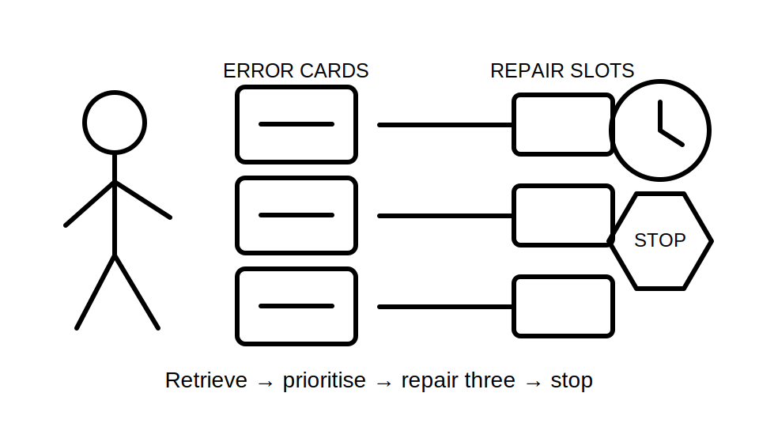
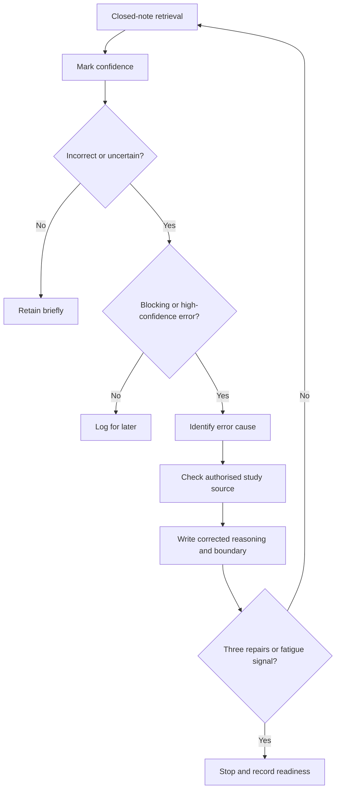

# Day 68 — Rest, Retrieval and High-Confidence-Error Repair

> **Scope boundary:** This recovery block uses closed-note recall and document-based correction only. It adds no new electrical theory and authorises no practical electrical work.

## 1. Outcome and entry check

By the end, the learner can:

1. complete a bounded 20–30 minute recovery session;
2. retrieve key Week 10 distinctions without notes;
3. classify errors by confidence and consequence;
4. repair no more than three high-value errors using authorised study sources;
5. explain why each corrected answer is stronger;
6. stop when fatigue or unresolved safety-critical uncertainty appears; and
7. state readiness for Day 69 with an evidence-based reason.

### Entry check

Without notes, write one sentence each defining: continuity evidence, polarity evidence, protective-purpose evidence, hypothesis and discriminating evidence. Mark confidence as high, medium or low.

## 2. Why it matters

Recovery prevents weak distinctions from becoming automatic. The purpose is not to maximise study volume; it is to identify a small number of consequential errors, correct their causes and preserve enough attention for the next staged scenario.

## 3. Core concepts and terminology

- **Closed-note retrieval:** recalling knowledge before checking a source.
- **Confidence rating:** the learner’s estimate of how likely an answer is correct.
- **High-confidence error:** an incorrect answer given with high confidence; it indicates a durable misconception and receives priority.
- **Blocking error:** an error that prevents safe or coherent progress in later reasoning.
- **Error cause:** the reason an error occurred, such as merged concepts, missed boundary, weak source use or premature conclusion.
- **Repair statement:** a concise corrected explanation that includes the reason and boundary.
- **Fatigue signal:** reduced attention, repeated rereading, rushed answers or increasing confusion.
- **Stop condition:** a defined reason to end, defer or escalate the session.

## 4. Rule-finding workflow

Use **R-E-P-A-I-R**:

1. **R — Retrieve before reopening notes.**
2. **E — Estimate confidence for each response.**
3. **P — Prioritise blocking and high-confidence errors.**
4. **A — Analyse the cause, not only the wrong wording.**
5. **I — Inspect an authorised study source and rewrite the reasoning.**
6. **R — Recheck once, record the repair and stop at three.**

The diagram deliberately limits repair volume. A recovery block fails when it becomes an open-ended cram session.

## 5. Visual model or worked example

A learner writes, with high confidence, “a plausible result proves the circuit complies.” The error is classified as high-confidence and blocking because it merges plausibility with acceptance.

| Repair element | Corrected record |
|---|---|
| Error cause | Evidence categories were merged. |
| Corrected distinction | Plausibility asks whether a record is credible in context; acceptance requires applicable authorised criteria and qualified judgement. |
| Boundary | A plausible record alone does not prove compliance. |
| Retrieval cue | “Plausible is not accepted.” |

### Worked-example fading

Repair this statement using the same four elements: “the first hypothesis that fits the symptom is the root cause.”

## 6. Practical application

Complete one **three-card repair sheet**:

1. retrieve five Week 10 distinctions;
2. rate confidence;
3. select no more than three blocking or high-confidence errors;
4. identify the cause of each;
5. check the relevant module or authorised source;
6. write a corrected distinction and boundary; and
7. record one readiness decision: ready, ready with one carry-forward item, or not ready and requiring supervised review.

### Assessment rubric

Score each category from **0 to 2**:

| Category | 0 | 1 | 2 |
|---|---|---|---|
| Retrieval | Notes opened first | Partial recall | Closed-note recall completed |
| Confidence calibration | Absent | Inconsistent | Explicit and useful |
| Error priority | Random | Some prioritisation | Blocking/high-confidence errors first |
| Cause analysis | Wording only | Partial cause | Underlying reasoning cause identified |
| Repair quality | Replacement answer only | Some explanation | Correct distinction, reason and boundary |
| Recovery control | Overruns or ignores fatigue | Generic limit | Time, repair cap and stop conditions followed |

A score of **10/12 or higher** with no critical error indicates readiness for Day 69. This is educational only.

## 7. Common errors and safety checkpoint

### Common errors

- rereading instead of retrieving;
- correcting low-value wording while leaving a blocking misconception;
- treating low confidence as proof an answer is wrong;
- repairing more than three items;
- copying source wording without explaining the distinction; and
- continuing after fatigue reduces judgement.

### Critical errors and stop conditions

Stop and defer or escalate if the learner:

- invents a safety-critical value, test method or acceptance rule;
- turns the block into practical troubleshooting;
- cannot distinguish evidence from conclusion after one repair attempt;
- reaches 30 minutes or three repairs; or
- shows fatigue signals that make further work unreliable.

This module authorises no access, switching, isolation, proving de-energised, testing, measurement, instrument use, alteration, repair, energisation, certification or verification.

## 8. Retrieval and next links

1. What is a high-confidence error?
2. Why are blocking errors prioritised?
3. What must a repair statement contain?
4. Why is the repair cap three?
5. Name two fatigue signals and the required response.

### Readiness transfer

Before Day 69, state one distinction you can now retrieve reliably and one unresolved item that must remain visible in the staged-evidence scenario.

- **Plan:** [Twelve-Week Capstone Learning Plan](../MASTER_PLAN.md)
- **Knowledge note:** [[12-Week Day 68 - Rest, Retrieval and High-Confidence-Error Repair]]
- **Previous:** [Day 67 — Systematic Fault-Finding Workflow and Hypothesis Control](day-67-systematic-fault-finding-workflow-and-hypothesis-control.md)
- **Next:** Day 69 — Fault Scenario with Staged Evidence Release

This module remains `review-required`, `reference_check_required`, safety-critical and not `technically-reviewed`.