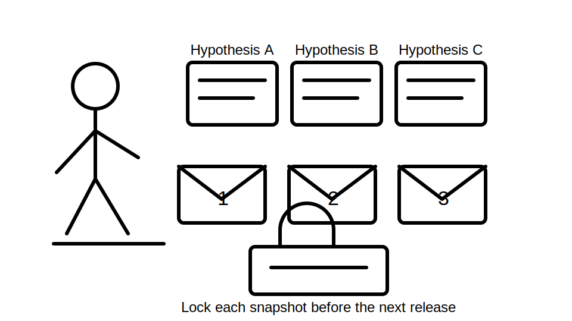
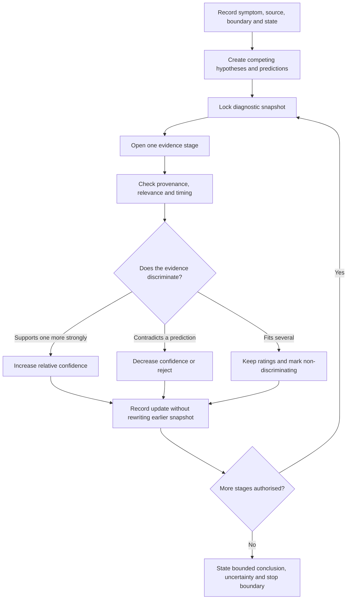

# Day 69 — Fault Scenario with Staged Evidence Release

> **Scope boundary:** This module is a document-based diagnostic simulation. All evidence is fictional and supplied within the exercise. It does not authorise access, switching, isolation, testing, measurement, repair, energisation or field fault finding.

## 1. Outcome and entry check

By the end, the learner can:

1. establish a system boundary, reported symptom and known operating state before interpreting evidence;
2. create at least three plausible hypotheses without treating any as the root cause;
3. record predictions that would strengthen or weaken each hypothesis;
4. process staged evidence without using information from later stages early;
5. revise confidence when evidence supports, contradicts or fails to discriminate;
6. distinguish correlation, contributing condition and evidenced causal explanation;
7. maintain a time-ordered diagnostic ledger with unresolved questions and stop boundaries; and
8. produce a bounded conclusion that states what is known, what remains uncertain and what qualified evidence is still required.

### Entry check

A reported fault disappears before any traceable evidence is reviewed. Write three reasons why “no fault found” is not yet a justified conclusion, then name one evidence item that could discriminate between two credible hypotheses.

## 2. Why it matters

Real diagnostic reasoning rarely receives a complete evidence package at once. New records may strengthen one explanation, expose a contradiction or show that the original symptom description was inaccurate. Staged release forces the learner to preserve uncertainty, resist hindsight bias and update the diagnostic record rather than rewriting history.

## 3. Core concepts and terminology

- **Evidence stage:** one controlled release of scenario information that must be assessed before the next stage is opened.
- **Evidence embargo:** the rule that later-stage information cannot be used to improve an earlier response retrospectively.
- **Diagnostic snapshot:** the hypotheses, confidence ratings, predictions and unresolved questions recorded at a particular stage.
- **Confidence update:** an explicit increase, decrease or unchanged rating supported by the newly released evidence.
- **Supporting evidence:** evidence consistent with a hypothesis but not necessarily unique to it.
- **Contradictory evidence:** evidence inconsistent with a prediction made by a hypothesis.
- **Non-discriminating evidence:** evidence that fits multiple hypotheses and therefore does not separate them.
- **Correlation:** two events occurring together without sufficient evidence that one caused the other.
- **Contributing condition:** a condition that may influence the event but does not alone establish the complete causal chain.
- **Causal explanation:** an explanation supported by a coherent chain of discriminating evidence and without unresolved material contradiction.
- **Hindsight bias:** treating an outcome as obvious after later evidence becomes known.
- **Bounded conclusion:** a conclusion limited to the evidence, system boundary, operating state, authority and unresolved uncertainty.

## 4. Rule-finding workflow

Use **R-E-L-E-A-S-E**:

1. **R — Record the symptom, source, system boundary and operating state.**
2. **E — Establish at least three plausible hypotheses and their predictions.**
3. **L — Lock the diagnostic snapshot before opening the next evidence stage.**
4. **E — Examine only the newly released evidence for provenance and relevance.**
5. **A — Adjust confidence: strengthen, weaken, reject or leave unchanged.**
6. **S — State contradictions, missing evidence and the next discriminating question.**
7. **E — End with a bounded conclusion and explicit stop or escalation boundary.**

The diagram is an evidence-control model, not a practical troubleshooting sequence. The locked snapshots make changes in reasoning visible and assessable.

## 5. Visual model or worked example

### Fictional scenario

A packaged ventilation unit is reported to stop intermittently during an automatic operating period. No physical access or testing is permitted. The learner receives records in four stages.

#### Stage 0 — Initial brief

Known information:

- the stop is described as intermittent;
- the unit later resumes operation;
- the report does not identify whether the stop was commanded, protective or supply-related; and
- the operating state at the event time is incomplete.

Create three hypotheses:

| Hypothesis | Prediction | Initial confidence |
|---|---|---|
| A — control-state command | A traceable control or schedule event should align with the stop. | Medium |
| B — protective operation | An identified protective event or reset record should align with the stop. | Medium |
| C — source-state interruption | A supply or transfer-state record should align with the stop. | Low–medium |

Lock the snapshot before Stage 1.

#### Stage 1 — Event history

Released evidence: all three recorded stops occurred within five minutes of a programmed mode change. No identified protective-device event appears in the supplied event history.

Required update:

- strengthen A because timing matches its prediction;
- weaken, but do not eliminate, B because the supplied record may be incomplete;
- leave C unresolved because no source-state record has been supplied; and
- request time-aligned control, protective-event and source-state records.

#### Stage 2 — Control record

Released evidence: the current control schedule contains a stop command at the relevant mode transition, but its revision date is after two of the three reported events.

Required update:

- treat the record as supporting only the latest event unless version history proves earlier applicability;
- do not project the current schedule backwards;
- retain alternative hypotheses for the earlier events; and
- add document currency as an unresolved dependency.

#### Stage 3 — Source and witness records

Released evidence: source-state history shows normal supply during all three events. A witness statement describing a “trip” was recorded several days later and does not identify a device.

Required update:

- weaken C because the supplied source record contradicts its prediction;
- do not convert the vague witness word “trip” into a verified protective operation;
- retain A as the leading explanation for the latest event; and
- state that the earlier events remain unresolved without applicable historical control records.

#### Stage 4 — Version history

Released evidence: archived control records show the same mode-transition stop command existed for all three event dates.

Bounded conclusion: the document package supports a control-command explanation for the recorded stops. It does not establish equipment condition, overall compliance or the absence of other faults. Any practical confirmation remains outside this exercise and requires authorised, qualified processes.

### Worked-example fading

Repeat the exercise with a second fictional scenario. This time Stage 2 contains evidence that supports two hypotheses equally. Explain why confidence should not change merely because more documents were released.

## 6. Practical application

Complete a **four-stage diagnostic release pack**:

1. write a Stage 0 snapshot with symptom, source, boundary, state, three hypotheses and predictions;
2. lock each snapshot before opening the next stage;
3. classify every new item as supporting, contradictory, non-discriminating or irrelevant;
4. record confidence before and after each stage with a reason;
5. preserve document dates, source identity and applicability;
6. identify the next discriminating evidence need after each release; and
7. finish with a bounded conclusion, unresolved questions and stop boundary.

### Assessment rubric

Score each category from **0 to 2**:

| Category | 0 | 1 | 2 |
|---|---|---|---|
| Initial framing | Boundary or state omitted | Partly framed | Symptom, source, boundary and state explicit |
| Hypothesis control | One assumed cause | Alternatives listed | Credible alternatives with predictions |
| Stage discipline | Later evidence used early | Minor leakage | Snapshots locked and evidence embargo preserved |
| Evidence updating | Confidence unchanged without reason | Some revision | Support, contradiction and non-discrimination handled correctly |
| Traceability | Dates and sources lost | Partly traceable | Each item tied to provenance, timing and applicability |
| Conclusion and safety | Root cause or practical authority overstated | General caveat | Bounded conclusion, uncertainty and stop boundary explicit |

A score of **10/12 or higher** with no critical error indicates readiness for Day 70. This is an educational readiness indicator only.

## 7. Common errors and safety checkpoint

### Common errors

- rewriting an earlier snapshot after seeing later evidence;
- increasing confidence merely because evidence volume increased;
- treating timing correlation as proof of cause;
- applying a current document to an earlier event without version evidence;
- interpreting witness terminology as identified technical evidence;
- eliminating a hypothesis because a supplied record is incomplete; and
- allowing the scenario to drift into unauthorised practical troubleshooting.

### Critical errors and stop conditions

Stop and remediate if the learner:

- claims a root cause before discriminating evidence supports the causal chain;
- uses later-stage evidence in an earlier response;
- ignores provenance, document currency or operating state;
- invents a test method, acceptance value or safety-critical procedure;
- recommends access, switching, isolation, measurement or repair; or
- fails to preserve a credible high-consequence alternative or escalation need.

This module authorises no access, switching, isolation, proving de-energised, testing, measurement, instrument use, alteration, repair, energisation, certification or verification.

## 8. Retrieval and next links

1. What is an evidence embargo?
2. Why must a diagnostic snapshot be locked?
3. How does contradictory evidence differ from missing evidence?
4. Why can a current document be inapplicable to an earlier event?
5. What must a bounded conclusion include?

### Changed-scenario transfer

Revise the worked example after learning that the source-state record covered only two of the three event windows. Identify which confidence update must be reversed, what remains supported and which evidence request becomes necessary again.

- **Plan:** [Twelve-Week Capstone Learning Plan](../MASTER_PLAN.md)
- **Knowledge note:** [[12-Week Day 69 - Fault Scenario with Staged Evidence Release]]
- **Previous:** [Day 68 — Rest, Retrieval and High-Confidence-Error Repair](day-68-rest-retrieval-and-high-confidence-error-repair.md)
- **Next:** Day 70 — Week 10 Verification and Fault-Diagnosis Checkpoint

This module remains `review-required`, `reference_check_required`, safety-critical and not `technically-reviewed`.