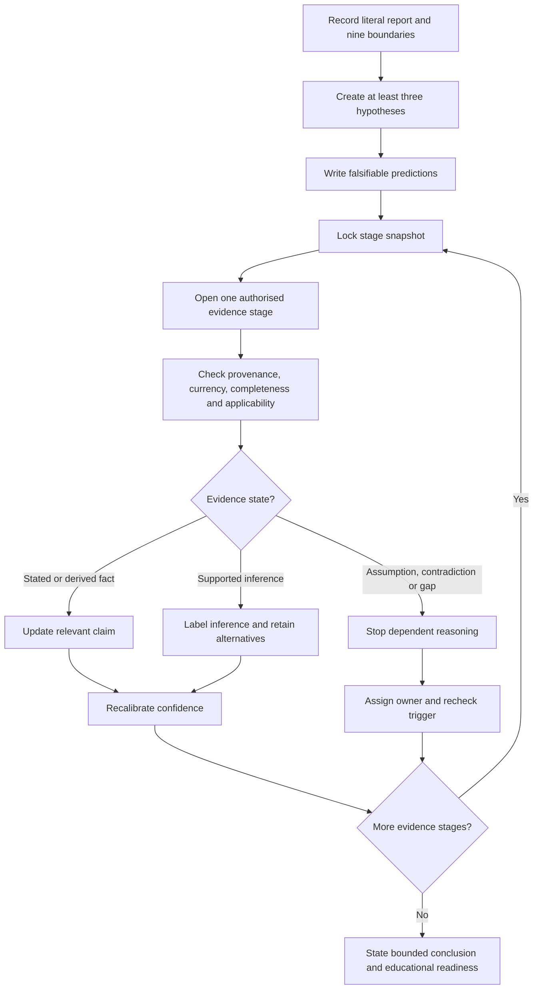
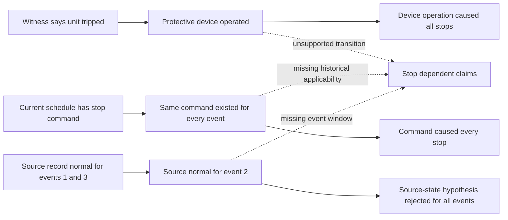

# Day 69 — Fault Scenario with Staged Evidence Release

> **Scope boundary:** This is a fictional, document-only diagnostic simulation. It does not authorise site access, opening equipment, switching, isolation, proving de-energised, testing, measurement, instrument use, alteration, repair, energisation, commissioning, acceptance, certification, verification or field fault finding.

## 1. Outcome and entry check

By the end, the learner can:

1. define the installation, equipment, circuit, source, operating-state, time, evidence, authority and decision boundaries before interpreting a reported event;
2. preserve the reporter's literal wording separately from technical interpretation;
3. generate at least three materially distinct hypotheses with falsifiable predictions;
4. classify each released item as a stated fact, derived fact, supported inference, assumption, contradiction or evidence gap;
5. maintain an immutable stage snapshot containing hypotheses, predictions, confidence, evidence state and unresolved dependencies;
6. identify the first unsupported transition in each claim chain and stop dependent conclusions there;
7. update confidence separately from correctness and evidence quality;
8. assign an evidence owner and recheck trigger to each unresolved blocker;
9. reopen affected boundaries and dependencies after two sequential material changes; and
10. determine independent educational readiness states without allowing strengths in one criterion to offset a safety-critical failure.

### Entry check

A witness says, “the unit tripped again,” but no device, time-aligned record or operating state has been identified. Write:

- the literal observation that may be recorded;
- three interpretations that must remain hypotheses;
- the first evidence item that could discriminate between two of them; and
- the point at which reasoning must stop if that evidence is unavailable.

## 2. Why it matters

Diagnostic evidence often arrives out of order, with unequal quality and after memories or records have changed. A learner who rewrites earlier reasoning after seeing later evidence creates a clean story rather than a traceable diagnostic record. Staged release makes uncertainty, confidence changes, contradictions and hindsight visible.

*Caption: Open one evidence stage at a time, preserve the earlier snapshot and change confidence only when the new evidence genuinely discriminates.*

## 3. Core concepts and terminology

- **Installation boundary:** the part of the installation included in the fictional dossier.
- **Equipment boundary:** the identified item or assembly under discussion; similar nearby equipment is not automatically included.
- **Circuit boundary:** the conductors, controls and protective devices that are evidenced as serving the equipment.
- **Source boundary:** the normal, alternate or control supply evidenced as relevant to the event.
- **Operating-state boundary:** the commanded, running, stopped, transferred, reset or unknown state at the relevant time.
- **Time boundary:** the event window and the period for which each record is demonstrably applicable.
- **Evidence boundary:** the supplied records and observations; absent evidence cannot be invented.
- **Authority boundary:** what the learner may analyse in a document exercise, excluding practical action and formal technical approval.
- **Decision boundary:** the narrow conclusion the evidence can support without becoming a root-cause, compliance, acceptance or certification decision.
- **Stated fact:** information directly contained in an identified evidence item.
- **Derived fact:** a result obtained transparently from stated facts without adding an unsupported premise.
- **Supported inference:** a reasoned interpretation supported by applicable evidence but still labelled as an inference.
- **Assumption:** an unverified proposition used temporarily and visibly.
- **Contradiction:** two evidence items or claims that cannot both be accepted within the same boundary without resolution.
- **Evidence gap:** information required for a claim but not supplied.
- **Diagnostic snapshot:** the stage-specific hypotheses, predictions, confidence ratings, evidence states and unresolved dependencies locked before the next release.
- **Evidence embargo:** the prohibition on using later-stage evidence to rewrite an earlier snapshot.
- **Falsifiable prediction:** an expected observation that could weaken or reject a hypothesis if not found under the stated conditions.
- **Discriminating evidence:** evidence that separates competing hypotheses rather than merely fitting several.
- **First unsupported transition:** the earliest step in a claim chain that lacks sufficient evidence; every dependent conclusion remains unsupported.
- **Evidence owner:** the authorised source, custodian or qualified person responsible for resolving a blocker.
- **Recheck trigger:** a new record, clarified identity or material change that requires affected reasoning to be reopened.
- **Confidence calibration:** recording confidence separately from whether a claim is correct and whether its evidence is adequate.
- **Educational readiness state:** `secure`, `developing`, `unsupported` or `stop-required`; these are learning states, not official grades or technical decisions.

## 4. Rule-finding workflow

Use **R-E-L-E-A-S-E**:

1. **R — Record literal evidence and all nine boundaries.** Preserve the reporter's wording, source identity, event time and known operating state.
2. **E — Establish competing hypotheses and falsifiable predictions.** Use at least three materially distinct explanations.
3. **L — Lock the snapshot.** Record confidence, evidence state, contradictions, dependencies and the next discriminating question before opening another stage.
4. **E — Examine only the newly released evidence.** Check provenance, completeness, currency, applicability and relationship to the event window.
5. **A — Adjust confidence without converting it into proof.** Strengthen, weaken, reject or leave unchanged, and give the evidence-based reason.
6. **S — Stop at the first unsupported transition.** Assign each blocker an evidence owner and recheck trigger.
7. **E — End with a bounded conclusion.** State what is supported, what is unresolved, what changed and what remains outside authority.

The workflow prevents evidence volume from being mistaken for evidence quality. A confidence increase is permitted only when an applicable item supports a prediction more strongly than competing explanations.

## 5. Visual model or worked example

### Fictional dossier: intermittent packaged ventilation stop

A packaged ventilation unit is reported to stop during an automatic operating period and later resume. No physical access or practical testing is permitted.

#### Stage 0 — Initial brief

Supplied evidence:

- help-desk entry: “unit tripped again”;
- equipment label in the entry: `AHU-2`;
- no device identity;
- no confirmed circuit identity;
- no confirmed operating mode; and
- no time-aligned source-state record.

Initial hypotheses:

| Hypothesis | Falsifiable prediction | Initial confidence | Evidence state |
|---|---|---:|---|
| A — scheduled or commanded stop | An applicable control record should show a stop command at the event time. | Medium | Assumption |
| B — protective operation | An identified device event or reset record should align with the event. | Medium | Assumption |
| C — normal-source interruption or transfer | A time-aligned source-state record should show interruption or transfer. | Low–medium | Assumption |
| D — equipment identity mismatch | The help-desk label may not match the unit represented in later records. | Low | Assumption |

The phrase “tripped” is a stated witness description, not a derived fact about protective operation.

#### Stage 1 — Event export

Released evidence:

- three stop entries occur near programmed mode changes;
- the export header says `AHU-02`, not `AHU-2`;
- the export does not show protective-device events; and
- its data dictionary is not supplied.

Reasoning update:

- strengthen A only as a supported inference because timing is consistent with its prediction;
- do not reject B because absence from an undefined export is not proof that no event occurred;
- leave C unresolved because source state remains missing;
- strengthen D slightly because equipment identity is not reconciled; and
- record the first unsupported transition: `AHU-02 export` → `same equipment as AHU-2`.

Evidence owner: current asset register or authorised asset custodian. Recheck trigger: reconciled equipment identifiers.

#### Stage 2 — Current control schedule

Released evidence:

- the current schedule contains a stop command at the relevant mode transition;
- its revision date is after two of the three reported events; and
- the revision history is incomplete.

Reasoning update:

- treat the current schedule as applicable only to the latest event unless historical applicability is established;
- do not project the current command backwards;
- retain B, C and D for the earlier events; and
- mark document currency as the first unsupported transition for any all-events conclusion.

#### Stage 3 — Source and witness records

Released evidence:

- normal-source history covers only the first and third event windows;
- the second event window is absent;
- a witness statement made four days later says a “red light was on”; and
- the statement does not identify the equipment or indicator.

Reasoning update:

- weaken C for events one and three only;
- keep C unresolved for event two;
- do not translate “red light” into a specific device state;
- keep D unresolved; and
- preserve separate conclusions for each event window.

#### Stage 4 — Identity and version records

Released evidence:

- asset history reconciles `AHU-2` and `AHU-02` as the same unit;
- archived schedules show the stop command for events one and three;
- the archive for event two is missing; and
- a maintenance note records a control-module replacement between events two and three without recording configuration transfer.

Bounded conclusion:

- the dossier supports a commanded-stop explanation for events one and three;
- event two remains unresolved because the applicable schedule and complete source state are missing;
- the control-module replacement prevents automatic transfer of later configuration evidence to the earlier event;
- no root cause, equipment condition, compliance, acceptance or absence-of-other-faults conclusion is justified.

### Claim-chain inspection

Each chain fails at its first unsupported transition. Later plausible statements cannot repair an earlier missing identity, applicability or event-window premise.

### Two-change transfer

Apply these changes sequentially:

1. a new record shows `AHU-02` was temporarily reassigned to another controller during event two;
2. a later correction states the source-history timestamps used a different clock basis.

After each change, reopen every affected identity, time, source, applicability, prediction and conclusion dependency. Do not merely edit the final paragraph.

## 6. Practical application

Complete a four-stage release pack containing:

1. a literal evidence ledger with source, date, event window and evidence classification;
2. a nine-boundary statement;
3. at least three materially distinct hypotheses and falsifiable predictions;
4. a locked snapshot after every stage;
5. confidence, correctness and evidence-quality fields kept separate;
6. the first unsupported transition for every major claim chain;
7. an evidence owner and recheck trigger for every blocker;
8. a two-change dependency-reopening record; and
9. a bounded conclusion that separates each event where applicability differs.

### Criterion-level readiness record

Assess each criterion independently:

| Criterion | `secure` | `developing` | `unsupported` | `stop-required` |
|---|---|---|---|---|
| Boundary control | All nine boundaries explicit and maintained | Minor omissions corrected before conclusions | Material boundary remains assumed | Practical or authority boundary crossed |
| Hypothesis control | Three distinct hypotheses with falsifiable predictions | Alternatives present but predictions partly weak | Preferred cause assumed | Root cause declared without discriminating evidence |
| Stage discipline | Snapshots locked; embargo preserved | One traceability lapse corrected | Later evidence contaminates earlier record | Snapshot intentionally rewritten to hide error |
| Evidence control | All claims classified; provenance and applicability checked | Some classifications need correction | Assumptions or gaps presented as facts | Evidence invented, altered or materially omitted |
| Dependency control | First unsupported transitions stop dependent claims | Some dependencies found after prompting | Conclusions continue beyond unsupported premises | Safety-critical contradiction ignored |
| Confidence calibration | Confidence changes only for stated reasons | Ratings broadly reasonable but inconsistent | Confidence treated as correctness | High confidence used to override missing evidence |
| Ownership and transfer | Owners, triggers and two-change reopening complete | Partial ownership or reopening | Blockers lack resolution path | Material change ignored to preserve conclusion |
| Conclusion and safety | Event-specific bounded conclusion and stop boundary | General boundary present but imprecise | Compliance, acceptance or absence-of-fault implied | Practical action or formal technical approval claimed |

There is no aggregate score. A blocking `unsupported` criterion or any `stop-required` state cannot be offset by stronger performance elsewhere. These states are educational planning labels only.

## 7. Common errors and safety checkpoint

### Common errors

- translating witness vocabulary into an identified technical event;
- treating additional documents as automatically stronger evidence;
- applying current configuration to earlier events without version evidence;
- merging separate event windows despite different evidence coverage;
- rejecting a hypothesis because an incomplete record contains no matching event;
- rewriting earlier snapshots after later evidence is known;
- treating timing correlation as a complete causal explanation;
- failing to reconcile equipment, circuit, source or timestamp identity;
- changing only the final conclusion after a material change instead of reopening dependencies; and
- using confidence as a substitute for evidence quality.

### Blocking conditions and stop boundaries

Set `stop-required` and remediate if the learner:

- invents, edits or suppresses evidence;
- declares a root cause without a complete supported causal chain;
- continues dependent reasoning beyond the first unsupported transition;
- ignores a material contradiction, missing event window or unresolved identity;
- uses later-stage evidence in an earlier snapshot;
- invents a clause, value, test, acceptance criterion or practical procedure;
- recommends site access, opening, switching, isolation, proving de-energised, testing, measurement, instrument use, alteration, repair or energisation; or
- presents an educational conclusion as verification, acceptance, certification, compliance or qualified technical approval.

Exact diagnostic duties, verification methods, sequences, instrument requirements, values, acceptance criteria, documentation requirements, role permissions and official assessment expectations require current authorised sources and qualified review.

## 8. Retrieval and next links

1. What is the difference between a stated witness description and a technical event finding?
2. Why does an undefined event export fail to eliminate a protective-operation hypothesis?
3. What is the first unsupported transition in the claim “the current schedule proves all earlier stops were commanded”?
4. Why must event windows remain separate when evidence coverage differs?
5. How do confidence, correctness and evidence quality differ?
6. What must be recorded for an unresolved blocker?
7. Why must two sequential material changes reopen dependencies rather than only the final conclusion?
8. Which readiness states cannot be offset by stronger work elsewhere?

- **Plan:** [Twelve-Week Capstone Learning Plan](../MASTER_PLAN.md)
- **Knowledge note:** [[12-Week Day 69 - Fault Scenario with Staged Evidence Release]]
- **Previous:** [Day 68 — Rest, Retrieval and High-Confidence-Error Repair](day-68-rest-retrieval-and-high-confidence-error-repair.md)
- **Next:** [Day 70 — Week 10 Verification and Fault-Diagnosis Checkpoint](day-70-week-10-verification-and-fault-diagnosis-checkpoint.md)

This module remains `review-required`, `reference_check_required`, safety-critical and not `technically-reviewed`.
