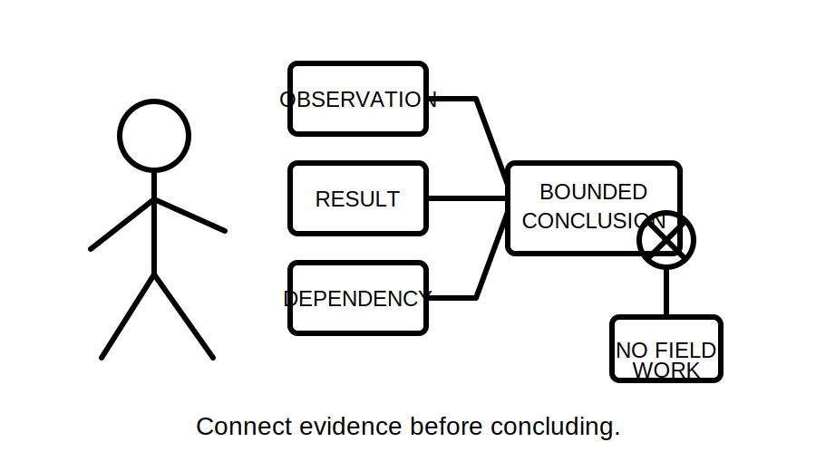
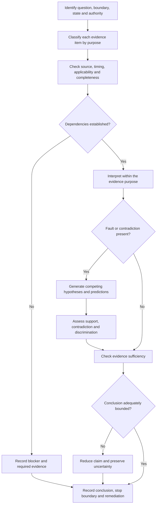

# Day 70 — Week 10 Verification and Fault-Diagnosis Checkpoint

> **Scope boundary:** This is a document-based educational checkpoint. It assesses planning, interpretation and diagnostic reasoning from supplied fictional evidence. It does not authorise access, switching, isolation, testing, measurement, instrument use, repair, energisation, certification or field fault finding.

## 1. Outcome and entry check

By the end, the learner can:

1. frame a verification or fault scenario by system boundary, operating state, evidence source and authority;
2. distinguish observations, recorded results, interpretations, hypotheses and conclusions;
3. identify the purpose and dependency of each supplied evidence item without inventing a test method;
4. evaluate provenance, applicability, completeness, plausibility and contradiction;
5. maintain at least two credible hypotheses until discriminating evidence justifies revision;
6. explain why one evidence type cannot prove an unrelated requirement;
7. produce a traceable evidence ledger and bounded conclusion; and
8. identify targeted remediation before progressing to integrated Capstone scenarios.

### Entry check

Without notes, write one sentence defining each of these terms: **observation**, **result**, **interpretation**, **hypothesis**, **conclusion** and **dependency**. Then identify one dangerous error caused by treating two of them as interchangeable.

## 2. Why it matters

Capstone scenarios combine inspection records, test documentation, operating-state information and reported symptoms. The main risk is not lack of vocabulary; it is collapsing different evidence types into one unsupported compliance or root-cause claim. This checkpoint tests whether the learner can preserve boundaries, uncertainty and traceability while working across the whole Week 10 sequence.

## 3. Core concepts and terminology

- **Evidence ledger:** a structured record linking each evidence item to its source, date, system boundary, operating state, relevance and limitation.
- **Dependency:** a fact or condition that must be established before another interpretation can be relied upon.
- **Discriminating evidence:** evidence that changes the relative credibility of competing hypotheses.
- **Non-discriminating evidence:** evidence consistent with several explanations and therefore unable to separate them.
- **Evidence sufficiency:** whether the available evidence is adequate for the narrow conclusion being proposed.
- **Cross-domain overreach:** using evidence from one verification purpose to claim that a different requirement has been established.
- **Contradiction:** a material conflict between evidence items, predictions or stated conditions that must be resolved or preserved as uncertainty.
- **Remediation trigger:** a defined error or weakness that requires targeted review before progression.
- **Bounded conclusion:** a conclusion limited by the evidence, installation boundary, operating state, authority and unresolved uncertainty.

## 4. Rule-finding workflow

Use **I-N-T-E-G-R-A-T-E**:

1. **I — Identify the question, system boundary, operating state and authority.**
2. **N — Name each evidence type and its intended purpose.**
3. **T — Trace provenance, timing, applicability and completeness.**
4. **E — Establish dependencies and exclusions before interpreting results.**
5. **G — Generate competing explanations where a fault or inconsistency is reported.**
6. **R — Review plausibility, contradiction and whether evidence discriminates.**
7. **A — Avoid cross-domain overreach and unsupported acceptance claims.**
8. **T — Tie every interpretation to evidence and every uncertainty to an evidence need.**
9. **E — End with a bounded conclusion, stop boundary and remediation decision.**

The diagram integrates document review and diagnostic reasoning. It is not a test sequence or field troubleshooting procedure.

## 5. Visual model or worked example

### Fictional checkpoint pack

A distribution circuit is described as having an intermittent equipment shutdown. The supplied pack contains:

- a visual-inspection record noting incomplete identification at one enclosure;
- a continuity record tied to the circuit but missing one endpoint identifier;
- an insulation record with traceable date and circuit identity;
- an RCD record that identifies a protective device but not the operating source state;
- an event log showing shutdowns near a programmed control transition; and
- a later witness statement calling the event a “trip” without identifying a device.

Apply **I-N-T-E-G-R-A-T-E**:

1. The inspection observation supports an identification concern, not a fault cause.
2. The continuity record has an endpoint-identity dependency and cannot support a complete path conclusion until resolved.
3. The insulation record addresses its stated evidence purpose only; it does not establish polarity, continuity or cause of shutdown.
4. The RCD record has an operating-state dependency and cannot automatically be applied to every event condition.
5. The event timing supports a control-command hypothesis but remains correlational until applicable control records are reviewed.
6. The witness statement is low-specificity evidence and does not prove protective operation.

A defensible conclusion is that the supplied pack contains an unresolved identification issue, incomplete continuity traceability and a leading—but not yet proven—control-command explanation for the shutdowns. Practical confirmation and formal acceptance remain outside the exercise.

### Worked-example fading

Repeat the pack with these changes:

- the endpoint identifier is supplied;
- the event log covers only two of four shutdowns; and
- the control record is current but has no version history.

Complete the ledger without prompts. State which conclusion becomes stronger, which remains unresolved and which previously useful evidence becomes inapplicable to part of the scenario.

## 6. Practical application

Complete a **Week 10 checkpoint dossier** containing:

1. a one-paragraph scenario frame;
2. an evidence ledger with at least six items;
3. a dependency and exclusion map;
4. at least two competing hypotheses with predictions;
5. a contradiction register;
6. a bounded conclusion; and
7. a remediation plan limited to the smallest useful review task.

### Assessment rubric

Score each category from **0 to 2**:

| Category | 0 | 1 | 2 |
|---|---|---|---|
| Scenario framing | Boundary or state absent | Partly framed | Question, boundary, state and authority explicit |
| Evidence classification | Evidence types collapsed | Some separation | Purpose and limitation clear for every item |
| Traceability | Sources or dates lost | Partial ledger | Provenance, timing and applicability maintained |
| Dependency control | Dependencies ignored | Some blockers found | Dependencies and exclusions systematically applied |
| Diagnostic reasoning | One assumed cause | Alternatives listed | Competing hypotheses, predictions and updates controlled |
| Conclusion and safety | Compliance or root cause overstated | General caveat | Bounded conclusion, stop boundary and remediation explicit |

A score of **10/12 or higher**, with no critical error, indicates readiness for Day 71. This is an educational progression indicator, not an official competency determination.

## 7. Common errors and safety checkpoint

### Common errors

- treating a recorded result as a complete compliance conclusion;
- assuming continuity proves polarity, insulation or connection quality;
- using an RCD-related record without confirming device, circuit and source state;
- treating event timing or witness wording as proof of cause;
- ignoring missing endpoint identity, document currency or record coverage;
- eliminating alternatives because one evidence item appears persuasive; and
- proposing practical testing or corrective work beyond the supplied authority.

### Critical errors and stop conditions

Stop and remediate if the learner:

- invents an acceptance value, official sequence or practical test method;
- claims compliance or root cause beyond the supplied evidence;
- loses the circuit, device, endpoint, operating-state or source boundary;
- ignores a material contradiction or high-consequence alternative;
- recommends access, switching, isolation, measurement or repair; or
- cannot distinguish evidence purpose from conclusion scope.

This checkpoint grants no authority for access, switching, isolation, proving de-energised, testing, measurement, instrument use, alteration, repair, energisation, certification or verification.

## 8. Retrieval and next links

1. What is the purpose of an evidence ledger?
2. How does a dependency differ from a missing detail?
3. Why can technically plausible evidence still be inapplicable?
4. What makes evidence discriminating?
5. What must be included in a bounded conclusion?
6. Name three examples of cross-domain overreach.

### Readiness decision

- **Ready:** 10/12 or higher, no critical error and all conclusions remain bounded.
- **Targeted remediation:** one or two defined weaknesses; review the smallest prerequisite module and repeat a changed scenario.
- **Not ready:** any critical error, repeated evidence-boundary collapse or practical-authority overreach.

- **Plan:** [Twelve-Week Capstone Learning Plan](../MASTER_PLAN.md)
- **Knowledge note:** [[12-Week Day 70 - Week 10 Verification and Fault-Diagnosis Checkpoint]]
- **Previous:** [Day 69 — Fault Scenario with Staged Evidence Release](day-69-fault-scenario-with-staged-evidence-release.md)
- **Next:** Day 71 — Reading and Decomposing an Integrated Assessment Scenario

This module remains `review-required`, `reference_check_required`, safety-critical and not `technically-reviewed`.