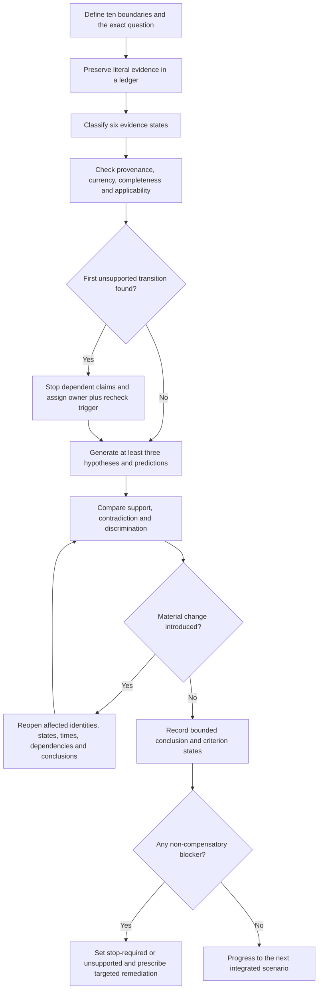
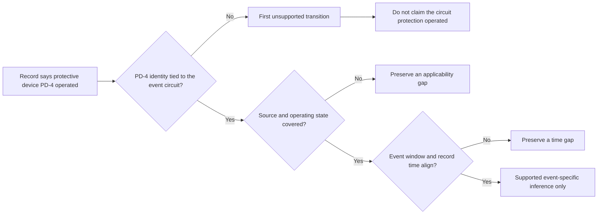

# Day 70 — Week 10 Verification and Fault-Diagnosis Checkpoint

> **Scope boundary:** This is a document-based educational checkpoint using fictional evidence. It assesses planning, interpretation and diagnostic reasoning only. It authorises no site access, opening, switching, isolation, proving de-energised, testing, measurement, instrument use, alteration, repair, energisation, commissioning, acceptance, certification, verification or field fault finding.

## 1. Outcome and entry check

By the end, the learner can:

1. define the installation, equipment, circuit, protective-device, source, operating-state, time, evidence, authority and decision boundaries for a supplied scenario;
2. preserve literal observations, recorded results and witness wording before adding interpretation;
3. classify each claim as a stated fact, derived fact, supported inference, assumption, contradiction or evidence gap;
4. match each evidence item to its narrow purpose, provenance, currency, completeness and applicability;
5. identify the first unsupported transition in a claim chain and stop every dependent conclusion there;
6. maintain at least three materially distinct hypotheses with falsifiable predictions until discriminating evidence justifies revision;
7. distinguish confidence, correctness and evidence quality rather than treating confidence as proof;
8. assign an evidence owner and recheck trigger to every unresolved blocker;
9. reopen affected dependencies after two sequential material changes; and
10. make independent `secure`, `developing`, `unsupported` or `stop-required` readiness decisions without using an aggregate score.

### Entry check

Without notes, define **observation**, **recorded result**, **interpretation**, **hypothesis**, **prediction**, **conclusion**, **dependency** and **first unsupported transition**. Then write one example showing how a plausible interpretation can remain unsupported because identity, operating state or time coverage is missing.

If any definition merges literal evidence with interpretation, mark the relevant criterion `developing` and complete the targeted prerequisite review before the checkpoint dossier.

## 2. Why it matters

Week 10 combines continuity, insulation, polarity, connection-integrity, fault-loop, RCD and fault-diagnosis evidence. These evidence types do not automatically transfer across purposes, circuits, protective devices, source states or event windows. A polished answer can therefore be unsafe or technically misleading even when individual statements sound plausible.

This checkpoint tests disciplined integration rather than memory alone. The learner must show where evidence applies, where it stops, what could disprove a hypothesis and which unanswered dependency prevents a stronger conclusion.

*The learner links evidence only through supported transitions. The stop sign marks the boundary between document reasoning and unauthorised practical work.*

## 3. Core concepts and terminology

### Ten checkpoint boundaries

- **Installation boundary:** the physical installation or defined part covered by the evidence.
- **Equipment boundary:** the specific equipment item, enclosure, control module or load being discussed.
- **Circuit boundary:** the identified circuit and endpoints to which a record applies.
- **Protective-device boundary:** the exact protective device associated with a record or event.
- **Source boundary:** the supply arrangement or source state applicable when evidence was produced.
- **Operating-state boundary:** the configuration, command state, load condition or mode in effect.
- **Time boundary:** the date, event window and configuration period covered.
- **Evidence boundary:** what an item directly records and what it does not establish.
- **Authority boundary:** what the learner is permitted to analyse or recommend.
- **Decision boundary:** the narrow educational conclusion being considered.

### Six evidence states

- **Stated fact:** information explicitly present in the supplied material.
- **Derived fact:** information obtained from stated facts through a transparent, checkable step.
- **Supported inference:** an interpretation supported by applicable evidence but still open to revision.
- **Assumption:** a proposition used without adequate evidence.
- **Contradiction:** a material conflict between evidence items, predictions or stated conditions.
- **Evidence gap:** missing information needed to support, reject or narrow a claim.

### Diagnostic and review controls

- **Evidence ledger:** a structured record of item identity, source, date, boundary, purpose, relevance, limitations and evidence state.
- **Provenance:** where evidence came from, who produced it and how it can be traced.
- **Currency:** whether evidence reflects the relevant configuration and time.
- **Applicability:** whether evidence concerns the same equipment, circuit, source, state and event window as the claim.
- **Dependency:** a fact or condition that must be established before a dependent interpretation can be relied upon.
- **First unsupported transition:** the earliest step in a claim chain that lacks adequate support. Every later claim depending on it remains unsupported.
- **Falsifiable prediction:** an expected observation capable of weakening or rejecting a hypothesis.
- **Discriminating evidence:** evidence that changes the relative credibility of competing hypotheses.
- **Non-discriminating evidence:** evidence consistent with several hypotheses and unable to separate them.
- **Evidence owner:** the authorised source, custodian or qualified person responsible for resolving a blocker.
- **Recheck trigger:** new evidence or a material change that requires affected reasoning to be reopened.
- **Bounded conclusion:** a conclusion limited by evidence, boundaries, authority and unresolved uncertainty.
- **Non-compensatory blocker:** a serious weakness that cannot be offset by stronger performance in another criterion.
- **Material change:** a change to identity, configuration, source, state, time coverage or evidence that could alter a conclusion.

### Confidence calibration

Record confidence separately from:

- **correctness:** whether a claim is actually right; and
- **evidence quality:** whether the support is traceable, current, complete and applicable.

High confidence with weak evidence is a diagnostic warning, not a strength.

## 4. Rule-finding workflow

Use **I-N-T-E-G-R-A-T-E**:

1. **I — Identify all ten boundaries and the exact educational question.**
2. **N — Name each evidence item, its literal content, evidence state and intended purpose.**
3. **T — Trace provenance, currency, completeness, applicability and contradictions.**
4. **E — Establish dependencies, exclusions and the first unsupported transition in each claim chain.**
5. **G — Generate at least three materially distinct hypotheses with falsifiable predictions.**
6. **R — Review which evidence supports, contradicts or discriminates among the hypotheses.**
7. **A — Assign evidence owners and recheck triggers; avoid cross-purpose transfer and authority overreach.**
8. **T — Test transfer through two sequential material changes by reopening every affected dependency.**
9. **E — End with criterion-level readiness states, bounded conclusions, stop conditions and the smallest useful remediation task.**

The diagram is an educational evidence-review loop. It is not a verification sequence, test method or field fault-finding procedure.

### Claim-chain control

This model shows why technically plausible wording is insufficient. Device identity, source state and time coverage must all remain supported before an event-specific inference is available.

## 5. Visual model or worked example

### Fictional Week 10 checkpoint pack

A training-facility ventilation unit is reported to have stopped during three evening sessions. The supplied pack contains:

1. an inspection record naming circuit `EF-2`, while the current schedule names `VF-2`;
2. a continuity worksheet tied to `EF-2`, with one endpoint recorded only as “roof unit”;
3. an insulation worksheet for `VF-2`, dated before a later cable-joint repair;
4. an RCD worksheet naming protective device `R4`, without recording whether the normal or alternate source was active;
5. a controller export covering two of the three reported events;
6. a witness email saying “the breaker tripped”, without identifying any device;
7. a maintenance note stating that a control module was replaced between the second and third events; and
8. a photograph showing a label `VF-2`, but with no date or viewpoint establishing the full equipment identity.

### Evidence-led analysis

| Item | Literal support | Limitation | State |
|---|---|---|---|
| Inspection record | One record uses `EF-2` | Identity conflict with current schedule | Contradiction |
| Continuity worksheet | A path was recorded to “roof unit” | Endpoint identity incomplete | Evidence gap |
| Insulation worksheet | A historical result exists for `VF-2` | Predates the joint repair | Stated fact with applicability gap |
| RCD worksheet | A result is associated with `R4` | Source state and event linkage absent | Evidence gap |
| Controller export | Two events align with a command transition | Third event absent; correlation is not causation | Supported inference for two events only |
| Witness email | A witness perceived a “trip” | Device and technical event unidentified | Stated fact; interpretation unsupported |
| Maintenance note | Control module changed before event three | Earlier evidence may not transfer forward | Material change |
| Photograph | Label `VF-2` appears in an image | Date, viewpoint and full identity absent | Stated fact with provenance gap |

### Competing hypotheses

- **H1 — Control-command interruption:** predicts applicable controller records will show an output-state change before the affected events.
- **H2 — Protective-device operation:** predicts a traceable device-specific event record linked to the same circuit, source state and event window.
- **H3 — Connection or path instability:** predicts applicable evidence will distinguish a connection-related condition from control-command and protective-device explanations.
- **H4 — Different mechanisms across events:** predicts events one and two may share evidence while event three differs after the module replacement.

No hypothesis is a fact. The current evidence supports a control-command explanation for two events more than the others, but does not establish root cause. Event three requires separate treatment because the evidence window and equipment configuration changed.

### First unsupported transitions

1. “The witness said breaker” → “R4 operated.”  
   The unsupported transition is the unverified device identity.

2. “The historical insulation worksheet exists” → “The repaired circuit remained unchanged.”  
   The unsupported transition is transfer across the later joint repair.

3. “Two events align with a controller transition” → “All three events had the same cause.”  
   The unsupported transition is transfer to an uncovered event after a material change.

### Worked-example fading: two sequential changes

Reassess the dossier after both changes:

- **Change 1:** a dated equipment schedule confirms that `EF-2` was renamed `VF-2` before all three events.
- **Change 2:** a source log shows event three occurred while the alternate source was active, but events one and two occurred on the normal source.

Reopen, rather than merely append to:

- circuit and equipment identity;
- worksheet applicability;
- source and operating-state coverage;
- event grouping;
- hypothesis predictions;
- confidence; and
- every dependent conclusion.

The identity conflict may narrow after Change 1, while Change 2 prevents a single source-state conclusion across all three events. A correct response explicitly shows both effects.

## 6. Practical application

Complete a **Week 10 checkpoint dossier** containing:

1. a one-paragraph scenario frame defining all ten boundaries;
2. an evidence ledger with every supplied item classified into one of the six evidence states;
3. a claim-chain map identifying each first unsupported transition;
4. a dependency, exclusion and contradiction register;
5. at least three competing hypotheses with falsifiable predictions;
6. an event-by-event evidence-coverage table;
7. confidence recorded separately from correctness and evidence quality;
8. an evidence owner and recheck trigger for every unresolved blocker;
9. a two-change transfer record showing which dependencies reopen; and
10. bounded conclusions plus exactly one targeted remediation task per non-secure criterion.

### Criterion-level readiness

Assess each criterion independently:

| Criterion | `secure` | `developing` | `unsupported` | `stop-required` |
|---|---|---|---|---|
| Boundary control | All ten boundaries explicit and preserved | One boundary needs clarification without changing the main analysis | Material identity, source, state or time boundary assumed | Authority boundary crossed or practical work directed |
| Evidence control | Literal content, six states, provenance and applicability preserved | Minor ledger weakness is visible and repairable | Evidence is merged, altered, backfilled or transferred without support | Evidence invented, concealed or knowingly misrepresented |
| Dependency control | First unsupported transitions stop all dependent claims | A blocker is found late but conclusions are corrected | Unsupported transitions remain in a material claim | A known blocker is ignored to claim acceptance, compliance or cause |
| Hypothesis control | Three distinct hypotheses and falsifiable predictions remain visible | Alternatives are present but one prediction is weak | One preferred explanation dominates without discrimination | Root cause declared without adequate discriminating evidence |
| Change control | Both material changes reopen all affected dependencies | One affected dependency is initially missed then repaired | Earlier conclusions are retained without full reopening | A material source, identity or configuration change is deliberately ignored |
| Ownership and calibration | Owners, triggers and confidence separation are complete | Minor ownership or calibration gap | Confidence substitutes for evidence or blockers lack resolution paths | Unauthorised person or action is assigned to resolve safety-critical uncertainty |
| Conclusion and safety | Event-specific bounded conclusions and stop limits are explicit | Wording needs narrowing but remains within authority | Conclusion exceeds available evidence | Practical procedure, technical approval, acceptance, certification or compliance is asserted |

There is no aggregate score and no compensatory averaging. A learner progresses only when every criterion is `secure` or `developing`, no criterion is `unsupported`, and no `stop-required` condition exists. These are educational planning states, not official assessment grades or competency decisions.

### Targeted remediation

For each `developing` criterion, assign the smallest prerequisite review and repeat a changed scenario. For each `unsupported` criterion, return to the relevant Week 9 or Week 10 module and rebuild the affected ledger or claim chain. Any `stop-required` state requires explicit correction of the authority or safety-boundary failure before further scenario work.

## 7. Common errors and safety checkpoint

### Common errors

- treating a recorded result as a complete verification or compliance conclusion;
- assuming continuity evidence proves polarity, insulation, connection quality or cause;
- using an RCD-related record without confirming device, circuit, source state and event window;
- converting witness wording into a technical event;
- treating correlation as cause or non-discriminating evidence as confirmation;
- applying pre-change evidence to a post-change configuration without reopening dependencies;
- applying evidence from two covered events to an uncovered third event;
- recording high confidence without checking evidence quality;
- assigning no owner or trigger to unresolved blockers; and
- averaging a serious failure away with stronger work elsewhere.

### Non-compensatory blockers

Set `unsupported` or `stop-required` when the learner:

- invents an exact value, acceptance criterion, official sequence, instrument instruction or practical method;
- alters, hides or silently repairs supplied evidence;
- loses a material circuit, equipment, protective-device, source, operating-state or time boundary;
- reasons beyond a first unsupported transition;
- claims all events share one cause without event-specific coverage;
- ignores a material contradiction, high-consequence alternative or sequential change;
- treats confidence as correctness;
- claims verification, acceptance, certification, compliance, technical approval or root cause beyond the evidence; or
- recommends access, opening, switching, isolation, proving de-energised, testing, measurement, alteration, repair or energisation.

This checkpoint grants no authority for practical work. Exact duties, methods, sequences, instrument requirements, values, acceptance criteria, documentation requirements, role permissions and official assessment expectations require current authorised sources and qualified review.

## 8. Retrieval and next links

1. Name the ten boundaries used in this checkpoint.
2. What are the six evidence states?
3. How does the first unsupported transition control later claims?
4. Why must device, source state and event window align before an event-specific inference?
5. What makes a prediction falsifiable?
6. Why can evidence support two events but remain inapplicable to a third?
7. What must reopen after two sequential material changes?
8. Why are confidence, correctness and evidence quality recorded separately?
9. What makes a blocker non-compensatory?
10. What is the difference between `unsupported` and `stop-required`?

### Readiness decision

- **Progress:** every criterion is `secure` or `developing`; no `unsupported` or `stop-required` state exists; each developing criterion has exactly one targeted remediation task.
- **Rebuild:** one or more criteria are `unsupported`; return to the smallest relevant prerequisite and repeat a changed dossier.
- **Stop and correct:** any `stop-required` state, practical-authority overreach, invented evidence or unsupported technical approval claim.

- **Plan:** [Twelve-Week Capstone Learning Plan](../MASTER_PLAN.md)
- **Knowledge note:** [[12-Week Day 70 - Week 10 Verification and Fault-Diagnosis Checkpoint]]
- **Previous:** [Day 69 — Fault Scenario with Staged Evidence Release](day-69-fault-scenario-with-staged-evidence-release.md)
- **Next:** [Day 71 — Reading and Decomposing an Integrated Assessment Scenario](day-71-reading-and-decomposing-an-integrated-assessment-scenario.md)

This module remains `review-required`, `reference_check_required`, safety-critical and not `technically-reviewed`. It contains no official clause, value, acceptance criterion, standards table, copied figure, systematic clause wording, practical procedure or compliance conclusion.
