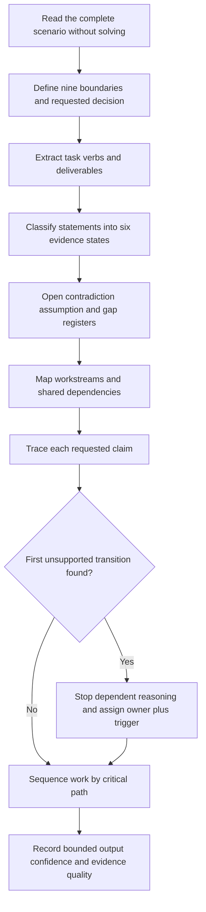
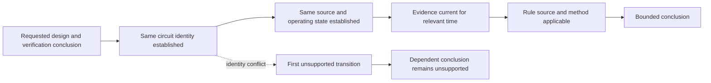

# Day 71 — Reading and Decomposing an Integrated Assessment Scenario

> **Scope boundary:** This module teaches document-based scenario analysis using fictional evidence. It does not reproduce an official assessment, determine formal competency, establish compliance, or authorise practical electrical work.

## 1. Outcome and entry check

By the end, the learner can:

1. define the **scenario boundary** across installation, equipment, circuit, source, operating state, time, evidence, authority and requested decision;
2. extract every explicit task verb, deliverable, constraint and evidence item without adding an unstated requirement;
3. classify each scenario statement as a stated fact, derived fact, supported inference, assumption, contradiction or evidence gap;
4. separate design, inspection, verification, fault-reasoning and documentation workstreams while identifying shared dependencies;
5. trace each requested claim through its evidence chain and stop at the first unsupported transition;
6. identify high-consequence blockers, assign an evidence owner and state a recheck trigger;
7. distinguish confidence from correctness and evidence quality;
8. update the decomposition after two sequential material changes without silently carrying forward invalid assumptions; and
9. make an independent educational readiness decision for each criterion without averaging away a blocker.

### Entry check

Without notes, define **task**, **deliverable**, **constraint**, **fact**, **assumption**, **evidence gap**, **dependency** and **first unsupported transition**. Then explain why a confident answer can still be unsupported.

Record each response as:

- **recalled:** produced without prompting;
- **recognised:** understood only after seeing a cue; or
- **not yet available:** could not be explained accurately.

Recognition is useful, but it is not the same as retrieval readiness.

## 2. Why it matters

Integrated Capstone scenarios compress several smaller problems into one narrative. The main difficulty is often not a single calculation or rule; it is controlling scope, identity, timing, applicability and dependencies across several evidence types. Beginning with the first visible calculation can produce a polished answer to the wrong question.

A controlled decomposition makes the reasoning auditable. It shows what the learner was asked to produce, what evidence supports each step, where uncertainty begins and why a conclusion must remain bounded.

*Instructional caption: Sort the scenario before solving it; every task, fact, constraint, contradiction and evidence gap needs a visible place.*

## 3. Core concepts and terminology

### Scenario controls

- **Assessment scenario:** a bounded fictional or supplied situation containing tasks, conditions and evidence for analysis.
- **Scenario boundary:** the explicit limits of the installation, equipment, circuit, source, operating state, time period, evidence set, learner authority and requested decision.
- **Task:** the action the learner is required to perform, such as compare, justify, calculate, inspect, interpret or plan.
- **Task verb:** the word that defines the required cognitive action. For example, *identify* requires a different output from *justify*.
- **Deliverable:** the observable output expected from a task, such as a marked plan, calculation record, defect schedule or evidence trail.
- **Constraint:** a condition that limits acceptable reasoning or options, including scope, time, authority, source state or supplied data.
- **Context:** background information that may explain the setting but does not automatically create a deliverable.
- **Scope drift:** answering a broader, narrower or different question from the one asked.

### Six evidence states

- **Stated fact:** information explicitly supplied and usable only within its stated boundary.
- **Derived fact:** information obtained transparently from stated facts through a valid, shown transformation. A derived fact is only as reliable as its inputs and method.
- **Supported inference:** a bounded interpretation supported by evidence but not directly stated.
- **Assumption:** information treated as true without adequate supplied evidence.
- **Contradiction:** two or more evidence items that cannot all describe the same identity, state or time without further explanation.
- **Evidence gap:** missing information that prevents or limits a conclusion.

These classifications describe the current reasoning state. They are not technical findings or official assessment labels.

### Structure and dependency

- **Workstream:** a coherent group of related tasks, such as design, inspection, verification planning, fault reasoning or documentation.
- **Dependency:** a fact, identity, state, source, result or rule interpretation that must be established before another step can be relied upon.
- **Claim chain:** the linked sequence from evidence to interpretation to conclusion.
- **First unsupported transition:** the earliest step in a claim chain that lacks adequate support. Every dependent step after it remains unsupported until the transition is repaired.
- **Critical path:** the dependency sequence that controls whether the requested response can progress.
- **Blocker:** an unresolved issue that prevents safe or valid progression on one or more dependent tasks.
- **Non-compensatory blocker:** a serious weakness that cannot be offset by stronger performance elsewhere.
- **Traceability:** the ability to show where a claim, value or decision came from.
- **Provenance:** the origin, author, date, version, identity and custody of an evidence item.
- **Applicability:** whether an evidence item actually applies to the same installation, equipment, circuit, source, operating state and time as the requested claim.

### Ownership and change control

- **Evidence owner:** the authorised source, document custodian or qualified person responsible for resolving a specific gap or contradiction.
- **Recheck trigger:** the new evidence or material change that requires a dependency or conclusion to be reviewed again.
- **Material change:** a change capable of altering identity, applicability, assumptions, dependencies or conclusions.
- **Change propagation:** reopening every dependent claim affected by a material change rather than editing only the final sentence.
- **Confidence:** the learner's subjective certainty.
- **Correctness:** whether the reasoning is accurate.
- **Evidence quality:** how well the conclusion is supported by relevant, current, complete and traceable evidence.

Confidence, correctness and evidence quality must be recorded separately.

## 4. Rule-finding workflow

Use **D-E-C-O-M-P-O-S-E**:

1. **D — Define nine boundaries and the requested decision.** Record installation, equipment, circuit, source, operating state, time, evidence, authority and decision limits.
2. **E — Extract task verbs and deliverables.** Use one row per task; do not merge distinct outputs merely because they concern the same equipment.
3. **C — Classify every supplied statement.** Assign one of the six evidence states and preserve literal wording before interpretation.
4. **O — Open contradiction, assumption and gap registers.** Do not convert missing or conflicting information into a convenient fact.
5. **M — Map workstreams and shared dependencies.** Separate design, inspection, verification, fault and documentation tasks, then show where they depend on the same identity or state evidence.
6. **P — Place claim chains in dependency order.** Find the first unsupported transition and stop dependent reasoning there.
7. **O — Outline authorised source types and evidence owners.** State what source could support each rule-dependent decision and who can resolve each blocker.
8. **S — Sequence the response by critical path.** Use dependencies, not narrative order, to decide what comes first.
9. **E — End with bounded outputs, confidence and recheck triggers.** Preserve unresolved questions and state what would reopen the reasoning.

The diagram is a document-analysis workflow, not an electrical work procedure. It prevents the learner from solving beyond the evidence boundary.

### Claim-chain check

For every requested conclusion, write:

`requested claim -> required identity/state -> supplied evidence -> interpretation -> bounded conclusion`

This model shows that a later rule citation cannot repair an earlier identity conflict. The earliest unsupported link controls all dependent reasoning.

## 5. Visual model or worked example

### Fictional integrated scenario: workshop extension and intermittent machine stop

A fictional dossier contains:

- load list `WL-03`, marked “extension”, with no issue date;
- single-line sketch `SL-02`, dated before the extension and labelled “Workshop A”;
- route note describing two environments but not identifying the final section;
- switchboard photograph labelled “Workshop DB”, with no date or photographer;
- inspection note referring to “DB-W” and one unidentified final subcircuit;
- three verification records: one before the extension, one after it with no source-state field, and one referring to circuit `W-12`;
- maintenance email stating that “the machine trips when production is busy”;
- event export containing two stops under normal supply and one after an alternate-source exercise; and
- later note stating that the machine control module and one protective device were replaced between the second and third events.

The learner is asked to recommend a design response, identify inspection concerns, interpret the records and propose a document-based fault-investigation plan.

### Step 1 — Preserve literal tasks

The scenario contains four deliverables:

1. a design response;
2. an inspection-concern schedule;
3. a verification-record interpretation; and
4. a fault-investigation plan.

“Recommend”, “identify”, “interpret” and “propose” are not interchangeable verbs. Each requires a distinct output.

### Step 2 — Classify evidence

| Item | Initial state | Boundary or concern |
|---|---|---|
| Load list `WL-03` | stated fact | Issue date and completeness are unknown |
| Sketch `SL-02` | stated fact | Predates extension; current applicability unsupported |
| Photograph | stated fact | Supports visible observations only; date and exact identity unknown |
| Email phrase “trips” | stated fact as witness wording | Does not establish a protective-device operation or cause |
| “All stops have one cause” | assumption | Event states and configuration differ |
| `Workshop A`, `Workshop DB`, `DB-W`, `W-12` describe one circuit | contradiction/evidence gap | Identity mapping is absent |
| Current records prove current configuration | unsupported inference | Device and control-module changes interrupt transfer |

### Step 3 — Map workstreams and dependencies

- **Design workstream:** depends on current load, route, environment, source and protection evidence.
- **Inspection workstream:** depends on exact board/circuit identity and image applicability.
- **Verification workstream:** depends on circuit identity, source state, operating state, date, configuration and record provenance.
- **Fault workstream:** depends on literal event definitions, event windows and configuration at each event.
- **Documentation workstream:** tracks all sources, assumptions, contradictions, owners and triggers.

The same identity conflict blocks several workstreams. Solving each workstream independently would repeat the same unsupported transition.

### Step 4 — Bound competing interpretations

At least three interpretations remain open:

1. the records concern different identifiers for the same circuit;
2. one or more records concern a different circuit or pre-extension arrangement; or
3. the identifiers changed after alteration without a controlled cross-reference.

None can be promoted to fact from the dossier alone.

### Step 5 — Assign owners and triggers

| Blocker | Evidence owner | Recheck trigger |
|---|---|---|
| Circuit identifier conflict | controlled drawing/register custodian or qualified reviewer | authenticated cross-reference or current marked drawing received |
| Missing source-state field | verification record owner | source and operating state confirmed for each record |
| Configuration changes | maintenance record custodian | dated replacement and commissioning records linked to event windows |
| Vague witness term “trips” | scenario author or authorised evidence provider | literal event definition and device/event evidence supplied |

### Two-change transfer

Apply two sequential changes:

1. a current drawing maps `DB-W` to `W-12`; then
2. a dated change notice shows the alternate-source arrangement was modified after that drawing.

The first change may repair circuit identity, but the second reopens source-state, applicability, event-window and dependent design/verification reasoning. A repaired dependency does not remain repaired after a later material change unless rechecked.

## 6. Practical application

Produce a **scenario decomposition pack** containing:

1. a one-sentence scenario and authority boundary;
2. a nine-boundary table;
3. a task-verb and deliverable register;
4. a six-state evidence inventory preserving literal wording;
5. separate contradiction, assumption and evidence-gap registers;
6. a workstream and shared-dependency map;
7. one claim chain for every requested conclusion;
8. the first unsupported transition for each blocked chain;
9. a source-finding plan, evidence owner and recheck trigger for each blocker;
10. confidence, correctness and evidence-quality fields kept separate;
11. a critical-path response sequence; and
12. a two-change transfer note showing which dependencies reopen.

### Independent educational readiness criteria

Assess each criterion independently:

| Criterion | `secure` | `developing` | `unsupported` | `stop-required` |
|---|---|---|---|---|
| Boundary control | All nine boundaries and requested decision are explicit | Minor boundary needs clarification | Material boundary is missing | Authority or safety boundary is ignored |
| Task and deliverable control | Every verb and output is distinct and traceable | Minor ambiguity remains | Material task or deliverable is missed | Learner answers a materially different task |
| Evidence control | Literal wording and six states are applied consistently | Isolated classification error | Facts, assumptions or contradictions are materially mixed | Evidence is invented, altered or concealed |
| Dependency control | Claim chains and first unsupported transitions are explicit | Some links need refinement | Dependent reasoning continues beyond a gap | Safety-critical unsupported reasoning is treated as complete |
| Workstream integration | Shared dependencies and critical path are coherent | Some overlap is unclear | Workstreams are isolated or narrative-driven | Blocked work is presented as accepted or compliant |
| Ownership and change control | Owners, triggers and two-change propagation are complete | Minor trigger detail missing | Material changes do not reopen all affected claims | Change evidence is knowingly ignored |
| Calibration and conclusion | Confidence, correctness and evidence quality are separate; conclusions are bounded | Minor overstatement requires correction | Confidence substitutes for evidence | Formal competency, compliance, verification, acceptance or root cause is claimed without authority |

There is no aggregate score. A criterion marked `unsupported` requires targeted remediation. Any `stop-required` state, or an `unsupported` non-compensatory blocker affecting authority, safety, identity, source state or evidence integrity, blocks progression regardless of stronger performance elsewhere. These are educational planning states, not official grades or competency decisions.

## 7. Common errors and safety checkpoint

### Common errors

- solving the first visible calculation before reading the complete scenario;
- treating background narrative as an assessed deliverable;
- changing witness wording into a technical event description;
- treating repeated identifiers as proof that items are identical;
- converting missing information into an unstated assumption;
- using a photograph to infer concealed construction, current condition or test outcomes;
- transferring historical evidence across an alteration without reopening applicability;
- following narrative order instead of dependency order;
- combining design, inspection, verification and fault claims into one unsupported conclusion;
- citing a rule before establishing that it applies to the same identity, state and time; and
- treating confidence as proof.

### Critical errors and stop conditions

Stop and remediate if the learner:

- misses a safety-critical source, operating-state, identity, authority or time boundary;
- invents, changes or suppresses a value, clause, result, observation or evidence item;
- treats an assumption, contradiction or witness interpretation as a supplied fact;
- reasons beyond the first unsupported transition;
- makes a compliance, acceptance, certification, verification, competency or root-cause claim without adequate evidence and authority;
- proposes site access, opening, switching, isolation, proving de-energised, testing, measurement, instrument use, alteration, repair, energisation or commissioning; or
- cannot identify what the scenario requires the learner to submit.

Exact clause numbers, limits, methods, procedures, values, acceptance criteria and official assessment expectations require current authorised sources and qualified review. This module grants no authority for practical electrical work, formal verification, certification, technical approval or assessment decisions.

## 8. Retrieval and next links

### Closed-note retrieval

1. Name the nine scenario boundaries.
2. Distinguish all six evidence states.
3. What is the difference between a task verb and a deliverable?
4. Why is the first unsupported transition more important than a later well-supported rule citation?
5. Why can a photograph be relevant but insufficient?
6. What is a non-compensatory blocker?
7. How do evidence owner and recheck trigger differ?
8. Why must two sequential material changes be propagated separately?
9. How can confidence be high while evidence quality is low?
10. Why should response order follow dependencies rather than narrative order?

### Next-link preparation

Before Day 72, bring forward only:

- supported boundary and identity statements;
- the task/deliverable register;
- the evidence and contradiction registers;
- the dependency map;
- the source-finding plan; and
- explicitly bounded unresolved items.

Do not carry an assumption forward as though Day 71 resolved it.

- **Plan:** [Twelve-Week Capstone Learning Plan](../MASTER_PLAN.md)
- **Knowledge note:** [[12-Week Day 71 - Reading and Decomposing an Integrated Assessment Scenario]]
- **Previous:** [Day 70 — Week 10 Verification and Fault-Diagnosis Checkpoint](day-70-week-10-verification-and-fault-diagnosis-checkpoint.md)
- **Next:** [Day 72 — Planning a Compliant Design Response and Evidence Trail](day-72-planning-a-compliant-design-response-and-evidence-trail.md)

This module remains `review-required`, `reference_check_required`, safety-critical and not `technically-reviewed`.