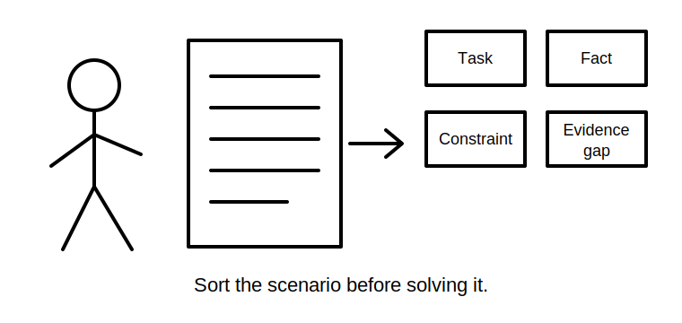
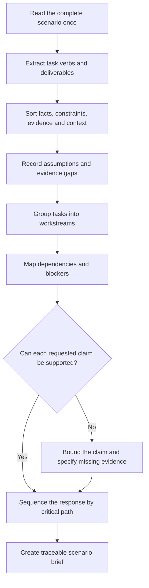

# Day 71 — Reading and Decomposing an Integrated Assessment Scenario

> **Scope boundary:** This module teaches document-based scenario analysis. It does not reproduce an official assessment, determine formal competency or authorise practical electrical work.

## 1. Outcome and entry check

By the end, the learner can:

1. identify every explicit task, deliverable, constraint and supplied evidence item in an integrated scenario;
2. separate stated facts from assumptions, interpretations and unresolved questions;
3. divide a multi-domain problem into linked design, inspection, verification, fault-reasoning and documentation workstreams;
4. identify prerequisite relationships and high-consequence blockers;
5. map each requested claim to the evidence needed to support it;
6. build a traceable scenario brief without beginning calculations or proposing field actions prematurely; and
7. explain which uncertainties must remain open.

### Entry check

Without notes, explain the difference between a **task**, a **deliverable**, a **constraint**, a **fact**, an **assumption** and an **evidence gap**. Give one example of how confusing any two could invalidate an assessment response.

## 2. Why it matters

Integrated Capstone questions often appear difficult because several smaller problems are compressed into one narrative. Starting immediately with a calculation or remembered rule can cause the learner to miss a condition, answer the wrong question or use evidence outside its boundary. Decomposition converts the narrative into a controlled work plan before technical reasoning begins.

## 3. Core concepts and terminology

- **Assessment scenario:** a bounded fictional or supplied situation containing tasks, conditions and evidence for the learner to analyse.
- **Task:** the action the learner is required to perform, such as compare, justify, calculate, inspect or plan.
- **Deliverable:** the observable output expected from the task, such as a marked plan, calculation record, defect schedule or evidence trail.
- **Constraint:** a condition that limits acceptable reasoning or options, including scope, time, authority, source state or supplied data.
- **Fact:** information explicitly supplied and usable within its stated boundary.
- **Assumption:** information treated as true without adequate supplied evidence.
- **Evidence gap:** missing information that prevents or limits a conclusion.
- **Workstream:** a coherent group of related tasks, such as design, inspection or verification planning.
- **Dependency:** a fact or result that must be established before another step can be relied upon.
- **Traceability:** the ability to show where a claim, value or decision came from.
- **Critical path:** the sequence of dependencies that controls whether the response can progress.
- **Scope drift:** answering a broader, narrower or different question from the one asked.

## 4. Rule-finding workflow

Use **D-E-C-O-M-P-O-S-E**:

1. **D — Define the scenario boundary, authority and requested outcome.**
2. **E — Extract every task verb and required deliverable.**
3. **C — Classify supplied information as fact, constraint, evidence or context.**
4. **O — Open an assumption register; do not hide missing information.**
5. **M — Map tasks into workstreams and identify overlaps.**
6. **P — Place dependencies and blockers before dependent work.**
7. **O — Outline the authorised source types needed for each rule-dependent decision.**
8. **S — Sequence the response by critical path rather than narrative order.**
9. **E — End with a scenario brief that preserves unresolved questions.**

The diagram shows a reading and planning sequence, not an electrical work procedure.

## 5. Visual model or worked example

### Fictional integrated scenario

A small workshop extension is described using:

- a one-page load list;
- an incomplete single-line sketch;
- a proposed cable route through two environments;
- a switchboard photograph;
- a prior inspection note;
- three verification records with different dates; and
- a report that one machine stops intermittently.

The learner is asked to recommend a design approach, identify inspection concerns, interpret the supplied records and propose a fault-investigation plan.

Apply **D-E-C-O-M-P-O-S-E**:

1. The design recommendation, inspection concerns, record interpretation and fault plan are four separate deliverables.
2. The load list and route description are design evidence, but their completeness must be checked.
3. The photograph supports visible observations only; it cannot prove concealed construction or test outcomes.
4. The verification records require identity, date, operating-state and applicability checks.
5. The reported machine symptom is not a root cause.
6. The missing single-line detail is an evidence gap that may block source, protection or isolation conclusions.
7. The response should begin with boundary and evidence checks, not with a cable selection.

### Worked-example fading

Repeat the exercise after adding a second supply source and removing the date from one verification record. Independently update the workstreams, dependency map, assumption register, critical path and claims that must be narrowed.

## 6. Practical application

Produce a **scenario decomposition pack** containing:

1. a one-sentence scenario boundary;
2. a table of task verbs and deliverables;
3. a fact, constraint and evidence inventory;
4. an assumption and evidence-gap register;
5. a workstream map;
6. a dependency and blocker map;
7. a source-finding plan; and
8. a sequenced response outline.

### Assessment rubric

| Category | 0 | 1 | 2 |
|---|---|---|---|
| Task extraction | Major task missed | Most tasks found | Every task and deliverable explicit |
| Information control | Facts and assumptions mixed | Partial separation | Facts, constraints, evidence and gaps separated |
| Workstream structure | Narrative copied | Some grouping | Coherent linked workstreams |
| Dependency control | Starts with unsupported work | Some blockers found | Critical path and blockers explicit |
| Traceability | Claims have no source path | Partial source plan | Every rule-dependent claim has a source path |
| Scope and safety | Overclaims or proposes field action | General caveat | Bounded scope, authority and stop conditions explicit |

A score of **10/12 or higher**, with no critical error, indicates readiness for Day 72. This is an educational progression indicator, not an official competency determination.

## 7. Common errors and safety checkpoint

### Common errors

- solving the first visible calculation before reading the full scenario;
- treating background narrative as an assessed deliverable;
- converting missing information into an unstated assumption;
- relying on a photograph or isolated record for conclusions it cannot support;
- following the order of the narrative instead of the order of dependencies;
- combining design, inspection and fault claims into one unsupported conclusion; and
- reproducing remembered standard wording instead of directing the response to authorised sources.

### Critical errors and stop conditions

Stop and remediate if the learner:

- misses a safety-critical source, operating-state or authority condition;
- invents a value, clause, result or field observation;
- treats an assumption as a supplied fact;
- makes a compliance, acceptance or root-cause claim without adequate evidence;
- proposes access, switching, isolation, measurement or repair; or
- cannot identify what the scenario is actually asking them to submit.

This module grants no authority for practical electrical work, formal verification, certification or assessment decisions.

## 8. Retrieval and next links

1. What is the difference between a task and a deliverable?
2. Why should assumptions be recorded rather than silently filled?
3. What makes a dependency part of the critical path?
4. Why can narrative order be a poor response order?
5. How does a workstream differ from a topic label?
6. What evidence limits apply to photographs and historical records?

- **Plan:** [Twelve-Week Capstone Learning Plan](../MASTER_PLAN.md)
- **Knowledge note:** [[12-Week Day 71 - Reading and Decomposing an Integrated Assessment Scenario]]
- **Previous:** [Day 70 — Week 10 Verification and Fault-Diagnosis Checkpoint](day-70-week-10-verification-and-fault-diagnosis-checkpoint.md)
- **Next:** [Day 72 — Planning a Compliant Design Response and Evidence Trail](day-72-planning-a-compliant-design-response-and-evidence-trail.md)

This module remains `review-required`, `reference_check_required`, safety-critical and not `technically-reviewed`.