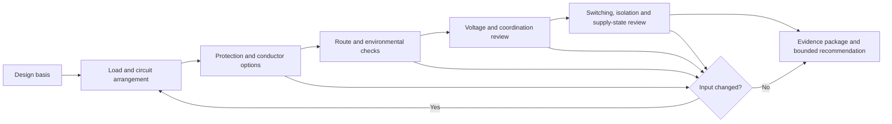

# Day 72 — Planning a Compliant Design Response and Evidence Trail

> **Scope boundary:** This module teaches how to structure an evidence-led design response from supplied fictional information. Exact requirements, values and acceptance decisions must be checked against current authorised sources.

## 1. Outcome and entry check

By the end, the learner can:

1. convert a decomposed scenario into an ordered design-response plan;
2. distinguish design inputs, derived values, decisions, checks and unresolved dependencies;
3. maintain a source trail for every rule-dependent decision;
4. show interaction between load, circuit arrangement, conductor, protection, voltage conditions, route, environment, switching and supply state;
5. identify when a changed input reopens earlier decisions;
6. produce a bounded recommendation rather than a false final design; and
7. define the evidence package needed for later inspection and verification.

### Entry check

From memory, list five design decisions that can affect one another. For each, name one input that must be known before the decision is defensible.

## 2. Why it matters

A correct-looking final answer is weak if the path to it cannot be reconstructed. Integrated assessment work must show how source facts became calculations, how calculations informed decisions and how each decision was checked. A visible evidence trail also exposes assumptions and makes changed conditions easier to manage.

## 3. Core concepts and terminology

- **Design basis:** the documented facts, assumptions, source conditions and constraints on which a design response depends.
- **Derived value:** a value produced from supplied inputs by a stated calculation or transformation.
- **Decision record:** a concise statement of the option selected, reasons, evidence and unresolved limitations.
- **Source trail:** the link from a rule-dependent decision to the current authorised source consulted.
- **Design interaction:** a relationship in which changing one decision can affect another.
- **Reopening trigger:** a changed fact or discovered gap that requires an earlier decision to be reviewed.
- **Design hold point:** a point at which progression stops until a specified dependency is resolved.
- **Evidence package:** the drawings, schedules, calculations, decisions and assumptions needed for another person to review the response.
- **Bounded recommendation:** a recommendation limited to the supplied facts and clearly separated from qualified approval.

## 4. Rule-finding workflow

Use **D-E-S-I-G-N-E-R**:

1. **D — Define the design basis and the exact requested recommendation.**
2. **E — Extract inputs, constraints, assumptions and missing evidence.**
3. **S — Sequence dependent decisions from source and load toward final equipment and documentation.**
4. **I — Identify authorised sources for each rule-dependent check.**
5. **G — Generate calculations and options with traceable inputs.**
6. **N — Note interactions, alternatives and reasons for rejection.**
7. **E — Evaluate the whole response against route, environment, protection, voltage, switching and supply conditions.**
8. **R — Record hold points, reopening triggers and a bounded recommendation.**

The feedback loop shows that integrated design is iterative. It does not provide official selection values or a field installation method.

## 5. Visual model or worked example

### Fictional response plan

Using the workshop-extension scenario from Day 71, the learner identifies:

- a load schedule with one uncertain duty pattern;
- two route segments with different environmental conditions;
- a proposed protective device without a recorded selection basis;
- an alternate source shown only on a later sketch; and
- a request for a justified design recommendation.

A defensible plan is:

1. freeze the design basis and record the uncertain duty pattern as a hold point;
2. define the circuit boundaries and source states;
3. identify the authorised methods and data required for demand, conductor, protection and voltage checks;
4. record calculations using only traceable inputs;
5. compare options without presenting unverified values as accepted;
6. reopen protection, switching, isolation and identification decisions when the alternate source is introduced; and
7. finish with a reviewable evidence package and explicit limitations.

### Worked-example fading

Change the scenario so the route length increases and part of the route moves to a different environment. Without prompts, identify which inputs changed, which decisions must reopen, which evidence remains applicable, which source checks must be repeated and how the recommendation should be narrowed pending review.

## 6. Practical application

Create a **design response dossier** containing:

1. a design-basis statement;
2. an input and assumption register;
3. a dependency-ordered decision map;
4. calculation records with input provenance;
5. an authorised-source trail;
6. an options and rejection-reasons record;
7. a reopening-trigger register;
8. an inspection and verification evidence handover list; and
9. a bounded recommendation.

### Assessment rubric

| Category | 0 | 1 | 2 |
|---|---|---|---|
| Design basis | Missing or invented | Partly documented | Facts, constraints, states and assumptions explicit |
| Decision sequence | Independent guesses | Some dependencies | Dependency-ordered and iterative |
| Calculation traceability | Final values only | Some workings | Inputs, method, units and source path visible |
| Interaction control | Domains treated separately | Some cross-checks | Material interactions and reopening triggers controlled |
| Evidence trail | Unsupported rule claims | Partial references | Every rule-dependent decision has authorised-source path |
| Conclusion and safety | Claims approval | General caveat | Bounded recommendation, hold points and review boundary explicit |

A score of **10/12 or higher**, with no critical error, indicates readiness for Day 73. This is not an official design approval or competency result.

## 7. Common errors and safety checkpoint

### Common errors

- beginning with a preferred cable or protective device rather than the design basis;
- recording only final numbers and losing input provenance;
- treating each calculation as independent;
- failing to reopen decisions when route, source or load conditions change;
- citing a source without showing how it applies;
- presenting an option comparison as qualified approval; and
- omitting the information needed by inspection and verification reviewers.

### Critical errors and stop conditions

Stop and remediate if the learner:

- invents an official value, clause, test result or installation fact;
- uses an outdated or unauthorised source as final authority;
- ignores an alternate source, environmental condition or safety-critical dependency;
- selects an option before a blocking input is resolved;
- claims compliance or approval beyond the evidence; or
- proposes practical installation, switching, testing or energisation.

This module does not authorise design certification, electrical installation work or practical verification.

## 8. Retrieval and next links

1. What belongs in a design basis?
2. How does a derived value differ from a design decision?
3. What is a reopening trigger?
4. Why must source applicability be shown rather than merely cited?
5. What should an evidence package allow another reviewer to reconstruct?
6. Why is a bounded recommendation stronger than an unsupported final answer?

- **Plan:** [Twelve-Week Capstone Learning Plan](../MASTER_PLAN.md)
- **Knowledge note:** [[12-Week Day 72 - Planning a Compliant Design Response and Evidence Trail]]
- **Previous:** [Day 71 — Reading and Decomposing an Integrated Assessment Scenario](day-71-reading-and-decomposing-an-integrated-assessment-scenario.md)
- **Next:** [Day 73 — Inspection, Testing and Documentation Integration](day-73-inspection-testing-and-documentation-integration.md)

This module remains `review-required`, `reference_check_required`, safety-critical and not `technically-reviewed`.