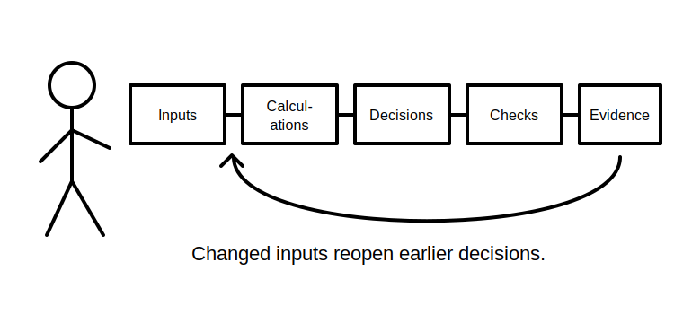
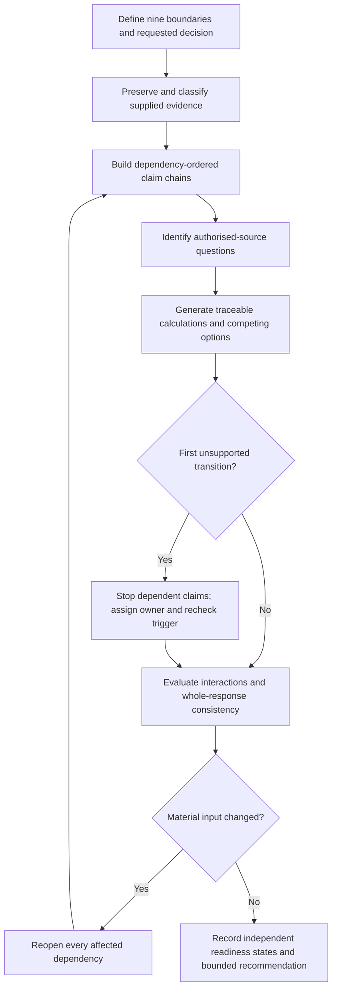
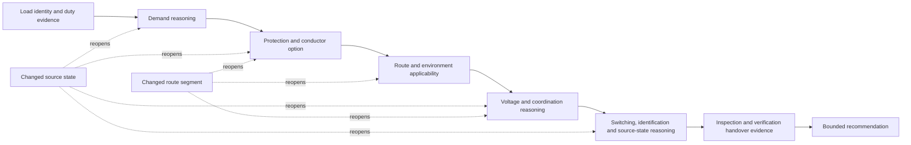

# Day 72 — Planning a Compliant Design Response and Evidence Trail

> **Scope boundary:** This module teaches evidence-controlled planning from a supplied fictional scenario. It does not provide an installable design, official selection values, compliance approval, certification or practical electrical instructions. Exact requirements, values, methods and acceptance decisions require current authorised sources and qualified review.

## 1. Outcome and entry check

By the end, the learner can:

1. define nine design-response boundaries: installation, circuit, load, source, operating state, route and environment, time, evidence and authority;
2. classify each planning item as a stated fact, derived fact, supported inference, assumption, contradiction or evidence gap;
3. build a dependency-ordered claim chain from design basis to bounded recommendation;
4. distinguish a calculation result, design option, design decision, rule-dependent check and qualified approval;
5. identify the first unsupported transition in each material claim chain and stop dependent conclusions there;
6. assign an evidence owner and recheck trigger to every unresolved hold point;
7. propagate two sequential material changes through all affected decisions without carrying forward stale evidence;
8. keep confidence separate from correctness and evidence quality; and
9. make independent `secure`, `developing`, `unsupported` or `stop-required` readiness decisions without using an aggregate score.

### Entry check

Without notes, write a five-link chain from a fictional load statement to a bounded design recommendation. Mark which links are facts, calculations, decisions, source checks or unresolved dependencies. Circle the first link that could not be defended from supplied evidence alone.

## 2. Why it matters

A polished final answer can conceal an unstable design basis. Integrated work is defensible only when another reviewer can reconstruct what was known, what was calculated, what was assumed, which source was checked, why an option was retained or rejected and which later change reopened earlier reasoning.

A design response therefore needs two products at the same time:

- a **technical reasoning path**, showing dependencies and interactions; and
- an **evidence trail**, showing provenance, applicability, ownership, currency and limitations.

*The learner does not jump from a scenario to a preferred answer; each link is recorded, checked and reopened when its supporting evidence changes.*

## 3. Core concepts and terminology

### Nine design-response boundaries

- **Installation boundary:** the physical installation or fictional project included in the response.
- **Circuit boundary:** the circuit, subcircuit or distribution segment to which a claim applies.
- **Load boundary:** the equipment, demand assumption, duty pattern and diversity context covered by the response.
- **Source boundary:** each normal, alternative, multiple or embedded source state that may affect the response.
- **Operating-state boundary:** the configuration or condition under which evidence was obtained or a decision is intended to apply.
- **Route-and-environment boundary:** the route segments and environmental influences relevant to the fictional design.
- **Time boundary:** the date, event window or configuration period to which evidence applies.
- **Evidence boundary:** the documents, observations, calculations and supplied records permitted for the exercise.
- **Authority boundary:** what the learner may recommend and what remains reserved for authorised or qualified review.

### Six evidence states

- **Stated fact:** information explicitly supplied by the scenario or an identified source.
- **Derived fact:** a result produced from traceable inputs by a stated calculation or transformation.
- **Supported inference:** an interpretation supported by evidence but not directly stated.
- **Assumption:** a provisional proposition used because evidence is missing; it must remain visible and cannot silently become fact.
- **Contradiction:** two or more evidence items that cannot all describe the same boundary and state without explanation.
- **Evidence gap:** missing information needed to support a decision or conclusion.

### Planning and control terms

- **Design basis:** the controlled set of facts, assumptions, states, constraints and source conditions on which the response depends.
- **Claim chain:** the ordered links connecting evidence to calculations, interpretations, decisions and conclusions.
- **First unsupported transition:** the earliest link in a claim chain that is not adequately supported; all dependent links remain unsupported until it is repaired.
- **Design option:** one candidate response retained for comparison; it is not yet an accepted design decision.
- **Design decision:** a recorded selection made within the exercise after dependencies and limitations are visible.
- **Rule-dependent check:** a question whose answer requires a current authorised source rather than memory or inference alone.
- **Provenance:** where an input, result or statement came from and who or what produced it.
- **Applicability:** whether evidence actually matches the relevant installation, circuit, source, state, time and decision.
- **Design hold point:** a point where dependent reasoning stops until a named gap or contradiction is resolved.
- **Evidence owner:** the authorised source, custodian or qualified person responsible for resolving a hold point.
- **Recheck trigger:** the evidence or material change that requires an earlier decision to be reviewed.
- **Change propagation:** reopening all dependent calculations, checks and decisions after a material input changes.
- **Bounded recommendation:** a recommendation limited to demonstrated evidence and explicitly separated from approval, certification or compliance acceptance.
- **Non-compensatory blocker:** a material weakness that cannot be averaged away by stronger work elsewhere.

## 4. Rule-finding workflow

Use **D-E-S-I-G-N-E-R**:

1. **D — Define boundaries and the requested decision.** Record all nine boundaries and the exact output requested.
2. **E — Extract and classify evidence.** Preserve literal wording, record provenance and classify each item into one of the six evidence states.
3. **S — Sequence claim chains.** Order facts, calculations, options, rule checks, decisions and conclusions by dependency rather than by document order.
4. **I — Identify source checks and applicability conditions.** Name the authorised source type required, the question it must answer and the boundaries it must match.
5. **G — Generate traceable calculations and competing options.** Show inputs, units, transformations, assumptions and limitations without inventing official values.
6. **N — Note contradictions, hold points and the first unsupported transition.** Stop dependent claims, assign an evidence owner and define a recheck trigger.
7. **E — Evaluate interactions and propagate changes.** Reopen affected load, conductor, protection, voltage, route, environment, switching, identification and source-state reasoning after each material change.
8. **R — Record independent readiness states and a bounded recommendation.** Keep confidence, correctness and evidence quality separate; do not use an aggregate score.

The diagram shows that source navigation and calculation do not automatically produce approval. A hold point can remain unresolved while the rest of the dossier is organised, but no dependent conclusion may pass through it.

The second diagram models change propagation. A later source-state or route change can invalidate several downstream links even when their calculations were internally correct under the earlier basis.

## 5. Visual model or worked example

### Fictional workshop-extension dossier

The Day 71 workshop scenario supplies the following fictional evidence:

| Item | Literal evidence | Initial state | Control required |
|---|---|---|---|
| Load schedule | Lists three machines; one duty pattern is marked “typical” without a time basis | evidence gap | Obtain the authorised owner and time basis before treating it as a design input |
| Drawing A | Labels the proposed circuit `W-7` | stated fact for Drawing A | Check identity against other records before transfer |
| Equipment list | Labels the same area `WS-07` | contradiction | Resolve whether these identifiers refer to the same circuit and configuration |
| Route sketch | Shows two route segments but omits the transition location | evidence gap | Record a route hold point and the evidence needed |
| Protective-device note | Names a candidate device but gives no selection basis | stated fact about a proposal only | Do not treat it as an accepted design decision |
| Source sketch | Adds an alternative source after the initial design note | stated fact for a later configuration | Reopen source, switching, identification, protection and verification dependencies |
| Email | States “the old figures should still be fine” | unsupported assertion | Preserve wording; do not promote it to technical evidence |

### Controlled reasoning

1. **Freeze version 1 of the design basis.** Record the conflicting identifiers, uncertain duty pattern, incomplete route and later alternative-source sketch.
2. **Create competing interpretations.** Interpretation A: `W-7` and `WS-07` identify the same circuit under different naming conventions. Interpretation B: they identify different circuits or different configuration periods.
3. **Find the first unsupported transition.** Any calculation using the “typical” duty pattern becomes unsupported when the time basis is required but absent.
4. **Build options without premature selection.** The learner may compare conceptual options, but each remains conditional on the unresolved load, route and source-state evidence.
5. **Assign owners and triggers.** For example, the equipment schedule custodian resolves identity; the scenario’s authorised design-data owner resolves duty pattern; an approved current drawing resolves route and source state.
6. **Record a bounded recommendation.** State what can be supported, what remains conditional and what must be reviewed by a qualified person.

### Two-change transfer

Apply these changes in sequence:

- **Change 1:** a revised drawing confirms `W-7` and `WS-07` are the same circuit but shows an additional route segment.
- **Change 2:** a later equipment schedule changes one machine’s duty pattern and confirms operation under the alternative source.

The learner must reopen all affected route, environment, demand, option, protection, conductor, voltage, switching, identification, source-state, inspection-handover and verification-handover dependencies. Evidence that remains applicable should be identified explicitly rather than discarded automatically.

### Worked-example fading

Repeat the exercise with only the evidence table and the two changes. Produce the boundary register, evidence-state register, dependency map, hold-point register and bounded recommendation without using the numbered prompts.

## 6. Practical application

Create a **design response dossier** containing:

1. a nine-boundary design-basis statement;
2. a literal-evidence register with provenance, date or state and all six evidence classifications available;
3. an assumption, contradiction and evidence-gap register;
4. a dependency-ordered claim map showing the first unsupported transition in each material chain;
5. a calculation record that preserves inputs, units, transformations, source questions and limitations;
6. at least two materially distinct design options with evidence-based retention or rejection reasons;
7. an authorised-source question log showing the exact question and applicability boundary for each check;
8. a hold-point register with evidence owner and recheck trigger;
9. a change-propagation record for the two sequential changes;
10. an inspection, verification and documentation handover list; and
11. a bounded recommendation that separates supported statements from unresolved dependencies and qualified approval.

### Independent educational readiness criteria

Assess each criterion independently:

| Criterion | `secure` | `developing` | `unsupported` | `stop-required` |
|---|---|---|---|---|
| Boundary control | All nine boundaries are explicit and consistently applied | Minor boundary ambiguity does not affect a material claim | A material claim crosses an undefined boundary | The response directs work outside the learner’s authority boundary |
| Evidence control | Literal evidence, provenance and six states are used consistently | Small classification errors are visible and repairable | Assumptions, contradictions or gaps are hidden or promoted to fact | Evidence is invented, altered or knowingly misrepresented |
| Dependency control | Claim chains and first unsupported transitions are explicit | Some dependencies need clearer ordering | Dependent conclusions continue beyond an unsupported link | A safety-critical decision is presented as settled despite a blocking gap |
| Source and applicability control | Each rule-dependent check names its question and applicability boundaries | Source questions are sound but some applicability fields are incomplete | A citation is treated as sufficient without showing applicability | An unauthorised or obsolete source is presented as final authority |
| Interaction and change control | Material interactions and both change waves are propagated correctly | One affected dependency is missed but identified during review | Stale evidence or decisions are silently carried forward | Alternate-source, route, environment or protective dependencies are ignored |
| Decision and conclusion control | Options, decisions, confidence and bounded recommendation remain distinct | Recommendation is bounded but reasons need strengthening | Option comparison is presented as approval | Compliance, certification, competency or technical approval is claimed |

There is no aggregate score. Progression requires every non-blocking criterion to be at least `developing`, no criterion to be `stop-required`, and no non-compensatory blocker to remain `unsupported`. These are educational planning states, not official assessment grades or competency decisions.

### Non-compensatory blockers

The learner cannot progress by compensating elsewhere when any of the following remains:

- unresolved installation, circuit, load, source, state, time or authority identity affecting a material decision;
- an unsupported transition beneath a safety-critical or rule-dependent conclusion;
- an assumption presented as fact;
- a contradiction hidden rather than controlled;
- applicability not demonstrated for a decisive source or record;
- a material change not propagated through dependent reasoning; or
- an approval, compliance, certification or practical-work claim beyond the exercise boundary.

## 7. Common errors and safety checkpoint

### Common errors

- starting with a preferred conductor or protective device instead of the controlled design basis;
- treating a calculation as correct because the arithmetic is correct while an input is unsupported;
- citing an authorised source without recording the question, version, boundary or applicability;
- collapsing a design option, design decision and qualified approval into one statement;
- carrying historical evidence into a changed route, load or source state without rechecking applicability;
- averaging a critical blocker into a total score;
- using confidence as evidence of correctness;
- resolving a contradiction by choosing the most convenient record; and
- preparing calculations but omitting the evidence needed for later inspection and verification review.

### Critical errors and stop conditions

Stop and remediate if the learner:

- invents or alters an installation fact, official value, clause, test result, acceptance criterion or source statement;
- continues a dependent conclusion beyond the first unsupported transition;
- ignores an alternative source, changed operating state, changed environment or other material dependency;
- uses an outdated or unauthorised source as final authority;
- claims that an automated or learner-produced response is compliant, certified, accepted, competent or technically approved;
- gives practical directions for site access, opening, switching, isolation, proving de-energised, testing, measurement, instrument use, alteration, repair, energisation, commissioning, acceptance, certification, verification or field fault finding; or
- conceals a contradiction, evidence gap or authority boundary to reach a preferred answer.

This module authorises no electrical design certification, installation work, switching, isolation, testing, verification, energisation, commissioning, acceptance or field fault finding.

## 8. Retrieval and next links

1. Name the nine design-response boundaries.
2. Distinguish a stated fact, derived fact, supported inference, assumption, contradiction and evidence gap.
3. What is the first unsupported transition, and what happens to dependent claims?
4. Why is a correct calculation still weak when an input lacks provenance or applicability?
5. How do a design option, design decision and qualified approval differ?
6. What must an authorised-source question log record besides a citation?
7. What are an evidence owner and recheck trigger?
8. Which dependencies reopen after a source-state change?
9. Why are confidence, correctness and evidence quality recorded separately?
10. Why can a non-compensatory blocker not be averaged away?

- **Plan:** [Twelve-Week Capstone Learning Plan](../MASTER_PLAN.md)
- **Knowledge note:** [[12-Week Day 72 - Planning a Compliant Design Response and Evidence Trail]]
- **Previous:** [Day 71 — Reading and Decomposing an Integrated Assessment Scenario](day-71-reading-and-decomposing-an-integrated-assessment-scenario.md)
- **Next:** [Day 73 — Inspection, Testing and Documentation Integration](day-73-inspection-testing-and-documentation-integration.md)

This module remains `review-required`, `reference_check_required`, safety-critical and not `technically-reviewed`.
