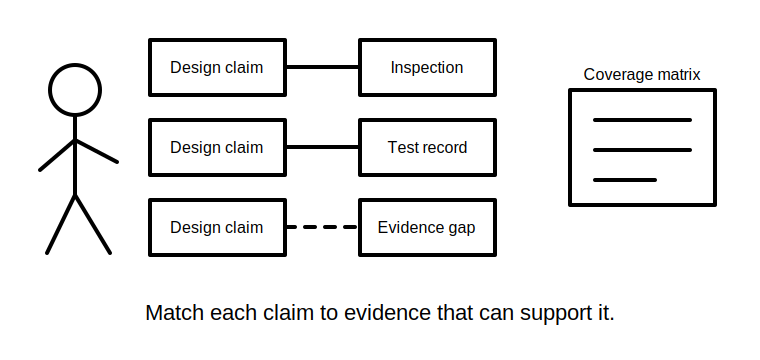
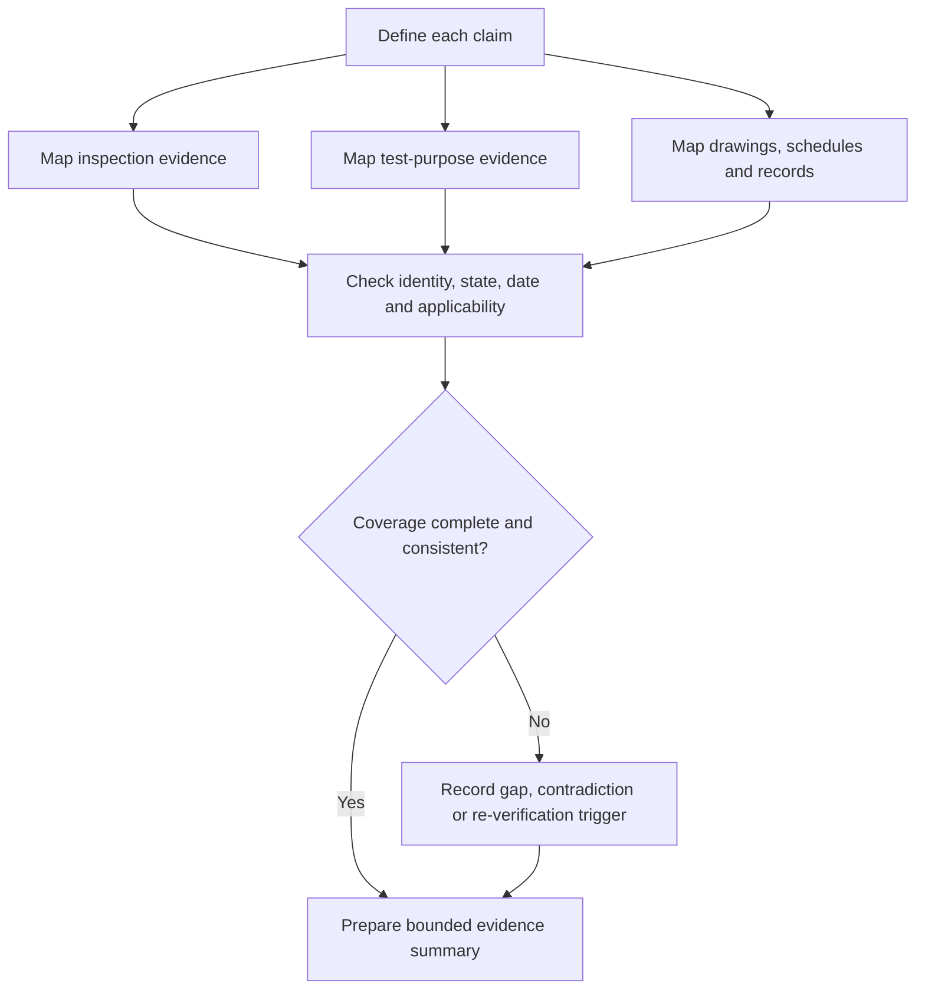

# Day 73 — Inspection, Testing and Documentation Integration

> **Scope boundary:** This module integrates supplied inspection and test documentation at a planning and interpretation level. It does not teach or authorise field inspection, testing, instrument use, acceptance, certification or energisation.

## 1. Outcome and entry check

By the end, the learner can:

1. map design claims to inspection evidence, test-purpose evidence and required records;
2. preserve the distinction between visual observations, recorded results, interpretations and formal conclusions;
3. identify prerequisites and dependencies between supplied verification records;
4. check identity, provenance, date, operating state, completeness and applicability;
5. reconcile contradictions without averaging, discarding or hiding them;
6. build a coverage matrix that exposes unverified claims and duplicated evidence;
7. define bounded rework and re-verification planning needs without prescribing field procedures; and
8. produce a traceable verification-documentation summary.

### Entry check

Explain why a complete-looking test record may still fail to support a design claim. Include identity, purpose, state and applicability in the answer.

## 2. Why it matters

Design intent is not established merely because drawings exist, and installation acceptability is not established merely because results are recorded. Integrated performance requires the learner to connect each claim to the correct evidence purpose while preserving sequence, limitations and responsibility boundaries.

## 3. Core concepts and terminology

- **Verification coverage:** the extent to which the required claims are addressed by applicable evidence.
- **Coverage matrix:** a table linking each claim to inspection evidence, test-purpose evidence, documents, gaps and limitations.
- **Design intent:** the documented function and conditions the proposed installation is intended to satisfy.
- **As-documented condition:** the installation condition represented by the available records; it may differ from the current physical condition.
- **Observation:** a directly recorded visible fact within the inspection boundary.
- **Recorded result:** a documented output attributed to a stated test purpose and context.
- **Interpretation:** a reasoned meaning assigned to an observation or result.
- **Acceptance conclusion:** a formal determination that requirements are satisfied; this remains outside this automated module.
- **Contradiction register:** a record of material conflicts that require resolution or bounded uncertainty.
- **Re-verification trigger:** a change, correction or evidence failure that requires affected claims to be checked again.
- **Document control:** management of identity, revision, date, author, status and relationship between records.

## 4. Rule-finding workflow

Use **C-O-V-E-R-A-G-E**:

1. **C — Clarify each design or compliance claim to be evidenced.**
2. **O — Organise supplied observations, results and documents by purpose.**
3. **V — Verify identity, provenance, date, operating state and completeness.**
4. **E — Establish prerequisites and dependencies before interpretation.**
5. **R — Relate each evidence item only to claims it can support.**
6. **A — Audit gaps, overlaps, contradictions and stale records.**
7. **G — Generate bounded correction and re-verification planning needs.**
8. **E — End with a traceable summary and unresolved review flags.**

The diagram is an evidence-integration model. It is not an official verification sequence or practical test instruction.

## 5. Visual model or worked example

### Fictional evidence pack

The workshop scenario now includes:

- a revised drawing showing the alternate source;
- an earlier inspection record made before the revision;
- a continuity record with complete circuit identity;
- an insulation record with no stated revision relationship;
- an RCD-related record tied to the original source state; and
- a defect note stating that identification was corrected, without follow-up evidence.

Apply **C-O-V-E-R-A-G-E**:

1. The revised drawing changes the design-intent baseline.
2. The earlier inspection record remains evidence of the earlier observed condition, not the revised condition.
3. The continuity record is traceable but supports only its stated purpose.
4. The insulation record has a document-relationship gap.
5. The RCD-related record cannot automatically transfer to the alternate source state.
6. The correction note is not by itself evidence that affected claims were re-verified.
7. The coverage matrix must show which claims remain unsupported and which evidence is historical only.

### Worked-example fading

Add a later inspection photograph with no location label and a revised test record with a valid date but no author. Independently classify what each item can support, what remains blocked, which contradiction or provenance issue must be recorded and which re-verification triggers remain open.

## 6. Practical application

Build an **inspection, testing and documentation integration pack** containing:

1. a claim register derived from the design response;
2. a coverage matrix;
3. an evidence identity and provenance check;
4. a dependency map;
5. a contradiction register;
6. a document-revision map;
7. a gap and re-verification-trigger list; and
8. a bounded summary for qualified review.

### Assessment rubric

| Category | 0 | 1 | 2 |
|---|---|---|---|
| Claim definition | Claims vague or missing | Some claims defined | Every claim bounded and identifiable |
| Evidence-purpose control | Evidence types collapsed | Partial separation | Observation, result, interpretation and conclusion distinct |
| Traceability | Identity or revisions lost | Some metadata checked | Provenance, state, date and revision controlled |
| Coverage analysis | Assumes completeness | Some gaps found | Matrix exposes gaps, overlap and limitations |
| Contradiction handling | Conflict ignored or averaged | Conflict noted | Material conflicts preserved and routed |
| Safety and conclusion | Claims acceptance or prescribes tests | General caveat | Bounded summary, re-verification triggers and authority boundary explicit |

A score of **10/12 or higher**, with no critical error, indicates readiness for Day 74. This is not an official verification or competency determination.

## 7. Common errors and safety checkpoint

### Common errors

- treating a record as applicable because it is recent;
- assuming one test purpose establishes unrelated requirements;
- using evidence created before a design revision without checking transfer;
- treating a correction note as proof of successful re-verification;
- ignoring missing author, location, circuit or operating-state identity;
- resolving contradictory records by choosing the preferred one; and
- presenting a coverage matrix as formal acceptance.

### Critical errors and stop conditions

Stop and remediate if the learner:

- invents a test method, acceptance value or official sequence;
- treats historical evidence as proof of current condition without support;
- loses the relationship between design revision and verification evidence;
- ignores a material contradiction or alternate source state;
- claims compliance, certification or successful correction; or
- recommends practical access, switching, testing, repair or energisation.

This module grants no authority for field inspection, testing, instrument use, correction, certification or verification.

## 8. Retrieval and next links

1. What is verification coverage?
2. Why must design revision and evidence date be considered together?
3. What does a coverage matrix expose?
4. Why is a correction note not necessarily re-verification evidence?
5. How should contradictory records be handled?
6. What is a re-verification trigger?

- **Plan:** [Twelve-Week Capstone Learning Plan](../MASTER_PLAN.md)
- **Knowledge note:** [[12-Week Day 73 - Inspection, Testing and Documentation Integration]]
- **Previous:** [Day 72 — Planning a Compliant Design Response and Evidence Trail](day-72-planning-a-compliant-design-response-and-evidence-trail.md)
- **Next:** Day 74 — Fault Diagnosis, Correction Reasoning and Re-Verification Planning

This module remains `review-required`, `reference_check_required`, safety-critical and not `technically-reviewed`.