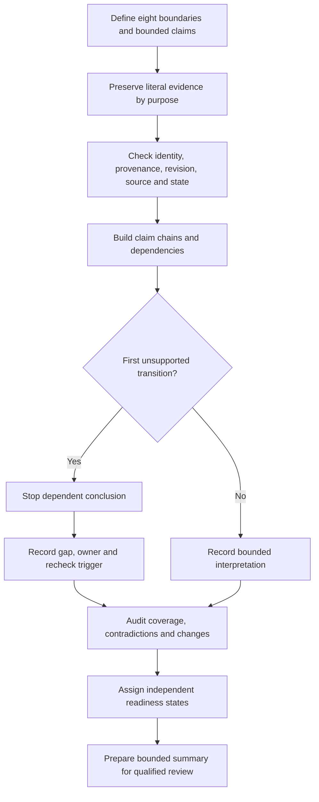
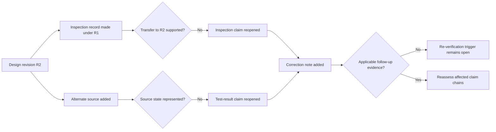

# Day 73 — Inspection, Testing and Documentation Integration

> **Scope boundary:** This module integrates supplied inspection, test-purpose and document evidence at a planning and interpretation level. It does not teach or authorise field inspection, testing, instrument use, correction, acceptance, certification, verification or energisation.

## 1. Outcome and entry check

By the end, the learner can:

1. define the installation, circuit, source, operating-state, time, evidence, document and authority boundaries for an integrated verification dossier;
2. classify each claim or evidence item as a stated fact, derived fact, supported inference, assumption, contradiction or evidence gap;
3. keep observation, recorded result, interpretation, design decision, correction claim and formal acceptance conclusion distinct;
4. map each bounded claim to applicable inspection evidence, test-purpose evidence and controlled records without transferring evidence beyond its scope;
5. identify the first unsupported transition in each claim chain and stop dependent conclusions there;
6. record provenance, revision, identity, applicability, competing interpretations, evidence owners and recheck triggers;
7. propagate two sequential material changes through every affected claim, record and readiness decision;
8. assess coverage, traceability, contradiction control, change control and conclusion control independently; and
9. produce a bounded integration summary for qualified review without claiming compliance or successful verification.

### Entry check

A test record is recent, signed and internally complete, but names an earlier circuit identifier and does not state whether the alternate source was available. Explain why recency and completeness do not establish applicability. Identify the first unsupported transition and the evidence needed before dependent claims can proceed.

## 2. Why it matters

A polished dossier can still be unsafe or misleading when its records describe different assets, revisions, source states or times. Design intent, visual observation, recorded test output and document control answer different questions. Integration means preserving those differences while showing exactly which claims are supported, blocked, contradicted or awaiting qualified review.

*The visible gap is instructional: a claim remains unsupported until applicable evidence closes the exact missing link.*

## 3. Core concepts and terminology

### Eight integration boundaries

- **Installation boundary:** the physical installation or defined portion represented by the dossier.
- **Circuit boundary:** the specific circuit, conductor path, equipment item and endpoints to which a claim applies.
- **Source boundary:** the normal, alternate, embedded or separately supplied source condition represented by the evidence.
- **Operating-state boundary:** the switching, connection, configuration and load state that existed when evidence was created.
- **Time boundary:** the period, alteration state and revision window for which the evidence remains applicable.
- **Evidence boundary:** what an observation, result or document can directly support and what it cannot establish.
- **Document boundary:** the identity, author, revision, status and relationship of each controlled record.
- **Authority boundary:** who may inspect, test, interpret, correct, accept, certify or approve; this module grants none of those permissions.

### Six evidence states

- **Stated fact:** information explicitly present in the supplied dossier.
- **Derived fact:** information produced transparently from stated facts without adding an unsupported premise.
- **Supported inference:** a bounded interpretation backed by applicable evidence, with its limits stated.
- **Assumption:** an unverified proposition retained visibly and never treated as fact.
- **Contradiction:** two or more material items that cannot all describe the same boundary and state without further explanation.
- **Evidence gap:** missing information required to support a transition or decision.

### Integration controls

- **Claim chain:** the ordered path from bounded claim through evidence identity, applicability, interpretation and authorised conclusion.
- **First unsupported transition:** the earliest link in a claim chain that lacks applicable evidence. Every dependent conclusion remains unsupported until this link is repaired.
- **Verification coverage:** the extent to which bounded claims are addressed by applicable evidence; quantity of records is not coverage.
- **Coverage matrix:** an original table linking claims to evidence purpose, boundary, state, limitations, contradictions and unresolved gaps.
- **Evidence transfer:** using evidence created for one identity, state, time or purpose to support another. Transfer requires explicit justification.
- **Correction claim:** a statement that something changed; it is not evidence that the affected claims were subsequently rechecked.
- **Re-verification trigger:** a material change, correction, contradiction or evidence failure that reopens affected claims.
- **Evidence owner:** the authorised source custodian or qualified person responsible for resolving a named gap.
- **Recheck trigger:** the specific evidence or event that permits a blocked claim to be reconsidered.
- **Confidence:** the learner's belief in an interpretation. Confidence is recorded separately from correctness and evidence quality.
- **Non-compensatory blocker:** a material weakness that cannot be averaged away by stronger work elsewhere.

## 4. Rule-finding workflow

Use **C-O-V-E-R-A-G-E**:

1. **C — Clarify boundaries and claims.** Define all eight boundaries and rewrite broad statements as identifiable claims.
2. **O — Organise literal evidence by purpose.** Preserve exact observations, recorded results, drawings, schedules, revisions, correction notes and witness statements before interpretation.
3. **V — Verify provenance and applicability.** Check identity, author, date, revision, source, operating state, completeness and custody.
4. **E — Establish claim chains and dependencies.** Map prerequisites and mark the first unsupported transition in each chain.
5. **R — Relate evidence only within its boundary.** Record supported and competing interpretations without transferring evidence automatically.
6. **A — Audit coverage, contradictions and changes.** Expose gaps, overlaps, stale records, duplicated evidence and re-verification triggers.
7. **G — Give every blocker an owner and trigger.** Name who or what authorised source can resolve it and what must be rechecked.
8. **E — End with independent readiness states and a bounded summary.** Do not claim acceptance, compliance, certification or qualified approval.

The diagram shows the integration loop. Evidence is not promoted directly to a conclusion: boundary and applicability checks occur first, and a missing link stops dependent reasoning.

This dependency model demonstrates change propagation. A correction note changes the dossier but does not close reopened claims unless applicable follow-up evidence supports them.

## 5. Visual model or worked example

### Fictional integrated dossier

The fictional workshop dossier contains:

- drawing `WS-R2`, showing circuit `L-17` and an alternate source;
- an earlier visual-inspection sheet naming circuit `LP-7`, created before `WS-R2`;
- a continuity record naming `L-17`, with a date and author but no explicit drawing revision;
- an insulation record naming `LP-7`, with no author and no stated exclusions;
- an RCD-related record naming `L-17`, but stating only the normal-source condition;
- a dated photograph showing a corrected label but no visible location marker;
- a contractor email stating, “all tests were repeated after the change,” without attached records; and
- a correction note stating that identification was changed, without naming affected evidence or the person who checked it.

Apply **C-O-V-E-R-A-G-E**:

1. **Clarify:** the dossier must not assume `LP-7` and `L-17` are the same circuit.
2. **Organise:** preserve the email assertion, photograph, correction note and recorded results as separate evidence items.
3. **Verify:** the inspection sheet is historical; the insulation record has identity and provenance gaps; the RCD-related record covers only one source state.
4. **Establish:** the identity relationship is the first unsupported transition for claims relying on transfer from `LP-7` to `L-17`.
5. **Relate:** the continuity record supports only its stated purpose and represented state; it does not establish insulation, polarity, RCD performance or formal acceptance.
6. **Audit:** the alternate-source addition reopens claims whose earlier evidence represented only the normal-source state.
7. **Give ownership:** assign the document custodian or qualified reviewer to resolve circuit identity and revision relationships; assign applicable follow-up evidence as the recheck trigger.
8. **End:** classify the dossier as bounded and incomplete rather than averaging strong and weak areas into a pass.

### Competing interpretations

Retain at least two interpretations until evidence resolves them:

- **Interpretation A:** `LP-7` was renamed `L-17`, and some earlier evidence may transfer after identity and configuration are verified.
- **Interpretation B:** `L-17` is a new or materially altered circuit, so earlier `LP-7` records are historical only.

Neither interpretation is a fact. The dossier must show what evidence would distinguish them.

### Two-change propagation

Apply two sequential changes:

1. **Change 1 — alternate source added:** reopen source-state-dependent inspection, test-purpose and documentation claims.
2. **Change 2 — protective device replaced after the first change:** reopen every dependent claim again, including records created after Change 1 if they no longer represent the final configuration.

A later date alone does not preserve applicability. The learner must trace both changes through every affected chain.

### Worked-example fading

A later photograph shows the circuit label clearly, but its metadata is missing. A revised test record has a valid date and author but identifies only “workshop lighting.” Independently:

1. classify each item using the six evidence states;
2. identify the first unsupported transition;
3. record at least two competing interpretations;
4. name the evidence owner and recheck trigger;
5. propagate both sequential changes; and
6. assign independent readiness states without producing an aggregate score.

## 6. Practical application

Build an **inspection, testing and documentation integration pack** containing:

1. an eight-boundary register;
2. a claim register derived from the design response;
3. a literal-evidence inventory with six-state classification;
4. a coverage matrix;
5. an evidence identity, provenance and applicability check;
6. a claim-chain and dependency map;
7. a contradiction and competing-interpretation register;
8. a document-revision map;
9. a change-propagation record for two sequential material changes;
10. a gap, evidence-owner and recheck-trigger list; and
11. a bounded summary for qualified review.

### Independent readiness criteria

Assess each criterion separately. Do not calculate an aggregate score.

| Criterion | `secure` | `developing` | `unsupported` | `stop-required` |
|---|---|---|---|---|
| Boundary control | All eight boundaries are explicit and consistently applied | Minor boundary ambiguity remains but is visible | A material boundary is missing or assumed | Identity, source or authority is invented or silently transferred |
| Evidence-state control | Facts, derivations, inferences, assumptions, contradictions and gaps remain distinct | Occasional classification weakness does not alter conclusions | Material evidence is misclassified or provenance is incomplete | Evidence is altered, fabricated or presented as stronger than supplied |
| Claim-chain control | Every claim has applicable evidence and unsupported transitions stop dependants | Most chains are controlled; a non-critical dependency needs repair | A material conclusion extends beyond the first unsupported transition | Compliance, acceptance or successful verification is claimed without authority |
| Coverage and contradiction control | Coverage, overlaps, contradictions and competing interpretations are explicit | Some limitations need clearer routing | A material conflict or gap is hidden, averaged or discarded | A preferred record is selected by convenience while contrary evidence is suppressed |
| Change and re-verification control | Both sequential changes reopen and propagate through all affected claims | One dependent relationship needs repair | Stale evidence remains attached after a material change | A correction note is treated as proof of successful re-verification |
| Safety and conclusion control | Summary is bounded, review flags are explicit and no practical authority is implied | Wording needs minor tightening | Scope or authority limits are incomplete | Practical testing, access, correction, energisation, certification or approval is directed or claimed |

### Progression decision

Progress to Day 74 only when:

- no criterion is `stop-required`;
- no non-compensatory blocker is `unsupported`;
- all material contradictions and first unsupported transitions are visible;
- every open blocker has an evidence owner and recheck trigger; and
- confidence has been compared with correctness and evidence quality.

`secure`, `developing`, `unsupported` and `stop-required` are educational planning states, not official grades, competency outcomes, inspection findings, verification outcomes or technical approvals.

## 7. Common errors and safety checkpoint

### Common errors

- treating a record as applicable because it is recent, signed or complete-looking;
- assuming circuit labels refer to the same asset without evidence;
- collapsing observation, recorded result, interpretation, correction and acceptance into one statement;
- using one test purpose to support unrelated claims;
- carrying evidence across a design revision or source-state change without a transfer argument;
- treating an email, correction note or photograph as proof of completed re-verification;
- resolving contradictions by averaging records or selecting the preferred item;
- continuing beyond the first unsupported transition;
- failing to reopen dependencies after the second material change;
- treating confidence as proof; and
- presenting a coverage matrix as a formal acceptance decision.

### Non-compensatory blockers

Stronger work elsewhere cannot offset:

- invented or altered evidence;
- hidden assumptions or contradictions;
- unsupported circuit, source, state or revision transfer;
- reasoning beyond a first unsupported transition;
- stale conclusions after a material change;
- missing authority boundaries; or
- unsupported compliance, acceptance, certification, competency or technical-approval claims.

### Critical errors and stop conditions

Stop and remediate if the learner:

- invents a test method, official sequence, acceptance value or practical control;
- treats historical evidence as proof of current condition without support;
- loses the relationship between design revision, source state and verification evidence;
- suppresses a material contradiction or evidence gap;
- claims that correction, re-verification, compliance, certification or acceptance has occurred; or
- recommends site access, opening, switching, isolation, proving de-energised, testing, measurement, instrument use, alteration, repair, energisation or commissioning.

This module grants no authority for field inspection, testing, instrument use, correction, certification, verification or technical approval.

## 8. Retrieval and next links

1. Name the eight integration boundaries.
2. What are the six evidence states?
3. Why can a recent and signed record still be inapplicable?
4. What is the first unsupported transition, and what happens to dependent conclusions?
5. Why is a correction claim not re-verification evidence?
6. How do two sequential material changes affect dependent records?
7. What distinguishes confidence, correctness and evidence quality?
8. Which blockers cannot be compensated by stronger performance elsewhere?

- **Plan:** [Twelve-Week Capstone Learning Plan](../MASTER_PLAN.md)
- **Knowledge note:** [[12-Week Day 73 - Inspection, Testing and Documentation Integration]]
- **Previous:** [Day 72 — Planning a Compliant Design Response and Evidence Trail](day-72-planning-a-compliant-design-response-and-evidence-trail.md)
- **Next:** [Day 74 — Fault Diagnosis, Correction Reasoning and Re-Verification Planning](day-74-fault-diagnosis-correction-reasoning-and-re-verification-planning.md)

This module remains `review-required`, `reference_check_required`, safety-critical and not `technically-reviewed`. Exact inspection, testing, documentation, correction and acceptance duties, methods, sequences, instrument requirements, values, criteria, role permissions and official assessment expectations require current authorised sources and qualified review.